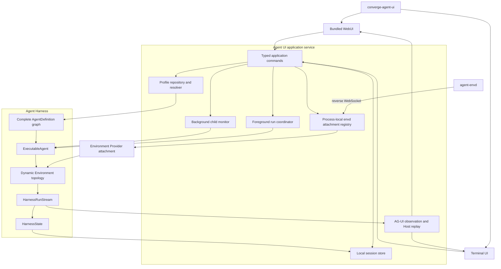
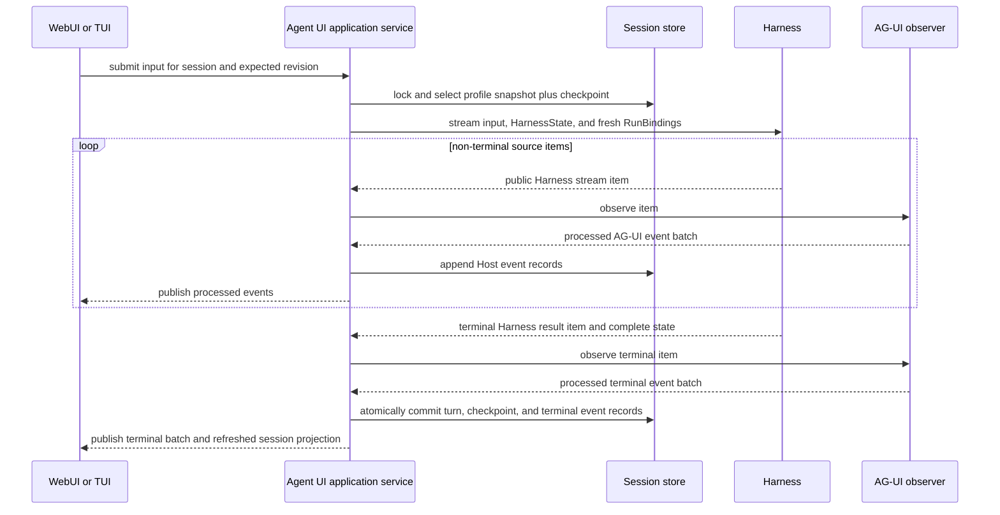
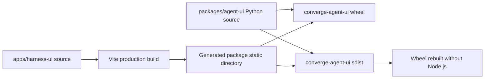

# Agent UI Overview

## Design Position

Agent UI is the local single-user Host for interactive use of `agent-harness`. The Python distribution `converge-agent-ui` owns Agent composition, local sessions, foreground run orchestration, process-local background child jobs, and application services. The private browser source application `apps/harness-ui` is compiled into that distribution and is never published or versioned as an independent npm package.

The executable has two presentation modes:

```text
converge-agent-ui          # equivalent to `converge-agent-ui webui`
converge-agent-ui webui
converge-agent-ui tui
```

WebUI is the default. Both modes create the same application service, open the same profile and session stores, execute the same built Agents through the same Harness path, and consume the same [post-processor AG-UI event sequence](../agent-stream-protocol/00-overview.md). A mode changes only the presentation adapter and its transport lifecycle.

Agent UI does not expose a multi-tenant service, durable distributed worker protocol, or alternative Agent loop. It can optionally act as a process-local EIP control service: `agent-envd` dials its reverse-WebSocket ingress, and an explicit local Host command can claim the accepted carrier through a provider-package `EIPEnvironmentAttachment` for a current or later run. Work requiring service-owned acceptance, leases, retries, durable asynchronous children, or remote product authorization remains outside this local Host.

## Boundaries

| Concern                                       | Owner                             | Agent UI relationship                                                                                  |
| --------------------------------------------- | --------------------------------- | ------------------------------------------------------------------------------------------------------ |
| Agent loop, run stream, final result, state   | Harness and Pydantic AI           | Calls the public Harness API with fresh bindings                                                       |
| Local profile documents and resolved snapshot | Agent UI                          | Reconstructs one complete process-local `AgentDefinition` graph                                        |
| Local session and selected checkpoint         | Agent UI                          | Persists Host records and a complete `HarnessState`                                                    |
| Harness-to-AG-UI observation                  | `converge-agent-stream-protocol`  | Uses one observer instance and one Agent UI processor per foreground or child Run                      |
| Web and terminal rendering                    | Surface adapters                  | Consume AG-UI and submit typed application commands                                                    |
| Local background child scheduling             | Agent UI                          | Reuses built child executables through the Harness Host boundary                                       |
| Dynamic envd attachment routing               | Agent UI application service      | Authenticates optional reverse-WebSocket carriers and issues selected provider-package EIP attachments |
| EIP carrier, session, and Environment methods | agent-envd client and agent-envd  | Uses the existing requester/responder contract; Agent UI does not create another Environment protocol  |
| Durable distributed execution                 | Foundation Service                | Not emulated by local session files                                                                    |
| Identity, model, Environment, and credentials | Fresh Host bindings and providers | Reauthorized for every root and child invocation; never restored from a profile, session, or UI event  |

## Architecture



The application service exposes one typed in-process command/query boundary for profile selection, session creation and selection, input submission, cancellation, background-child control, optional envd invitation and attachment selection, and replay subscription. The WebUI transport adapts that boundary to loopback HTTP and an AG-UI event stream. The TUI calls it in process. Neither surface reads profile files, mutates session files, calls `ExecutableAgent.stream()` directly, applies Environment topology directly, or applies a private Harness-event projection.

## Main Flow



Input acceptance, Harness start, Harness terminal result, local checkpoint commit, background result routing, and surface delivery are distinct facts. A disconnected surface does not cancel work. The current mode can submit an explicit cancellation command; the run coordinator then invokes the ordinary Harness cancellation contract and records the resulting local turn outcome.

## Application-Service Lifetime

One process owns one application-service instance and its supervised async lifetime. It acquires profile and session repositories before accepting commands, retains entered foreground run and background-job tasks as children of that lifetime, and closes surfaces before releasing repositories. Shutdown requests cancellation, drains run and child cleanup, and then records any job or turn whose terminal outcome remains unknown as interrupted rather than successful.

Only one foreground Turn advances a given Thread at a time. Independent sessions can run concurrently subject to Host policy and configured limits. A stale expected session revision conflicts before dispatch rather than selecting a newer checkpoint implicitly.

The optional envd attachment registry is another child of the application-service lifetime. It owns pending invitations, accepted reverse-WebSocket carriers, and unclaimed carrier candidates only in memory. Explicit selection creates a single-use provider-package attachment; the Harness adapts it before an active run receives a controller request or a later turn receives fresh `RunBindings`. Process restart invalidates invitations and closes attachments rather than restoring network authority from session files.

## Surface and CLI Contract

The root command is equivalent to selecting `webui`; it is not a third execution mode. The explicit subcommands are stable presentation selectors:

- `webui` starts the application service and a loopback browser transport, serves the bundled immutable assets, and opens or reports the local URL according to CLI options; when explicitly configured, the same service lifetime also exposes the EIP reverse-WebSocket ingress;
- `tui` starts the same application service and attaches the terminal renderer directly;
- surface-neutral configuration selects the profile store, session store, model/provider settings, logging, and Host policy before either adapter starts.

Web transport binds to loopback by default because the Host assumes one local user and carries no multi-tenant authorization model. Loopback location alone is not request authority: each application-service lifetime creates an unguessable process-local browser capability, and every browser command and stream attachment presents it. The transport accepts only its exact served `Host` and `Origin`, exposes no wildcard credentialed CORS policy, and rejects missing or mismatched capability, Host, or Origin values before an application command. The capability is never persisted in a profile or session, sent to model context, or written to ordinary logs, and restart invalidates it.

Binding another interface is an explicit operator action and requires an adopting wrapper to replace the built-in local-browser capability with authentication, authorization, TLS, Host, and origin policy appropriate to its exposure. The built-in loopback mechanism is not a remote multi-user authentication contract. These constraints preserve the authority of the local application boundary without treating every local browser origin or process as trusted.

The browser route, AG-UI transport, and EIP attachment ingress remain separate. Unknown API, AG-UI, or EIP paths never receive the browser shell through history fallback. A browser capability never authenticates envd, and an envd attachment credential never authorizes a browser command. The EIP ingress follows the existing explicit `ws` or certificate/hostname-validated `wss`, subprotocol, attachment-authentication, and first-message initialization contract. Plain `ws` is limited to an explicitly trusted loopback, private tunnel, or equivalent outer confidentiality boundary; cross-host and production deployments should use `wss`. The default plain loopback browser listener alone is not an EIP trust profile. The TUI and WebUI expose the same semantic commands even when controls, shortcuts, and layout differ.

## Distribution and Static Assets

`apps/harness-ui` is private source input to the `converge-agent-ui` Python distribution:



Compiled browser files and the generated package static directory are build artifacts and are not committed to Git. A source-checkout build first installs the locked frontend dependencies, produces the frontend distribution, and copies it with a cross-platform build step into the Python package. A Python package build from a checkout fails explicitly when the prepared asset manifest and application shell are absent; it never publishes a wheel that starts successfully but lacks its default surface.

The sdist contains the prepared immutable browser files. Building a wheel from that sdist requires Python build tooling but not Node.js or the frontend source tree. Wheel and sdist verification checks that the application shell and referenced hashed assets are present.

Agent UI has an independent `release/agent-ui-v<version>` release channel. Its reviewed source metadata selects one published Harness release version; release automation pins `converge-agent-harness`, `converge-agent-environment-provider`, and `converge-agent-stream-protocol` to that exact normalized Python version before building the sdist and wheel. The UI version is independent from the selected library version. Source manifests leave these workspace dependencies unversioned so repository development resolves workspace sources, but those unbounded requirements never enter publishable artifacts. The private frontend has no independent version, artifact, npm publication, release tag, or release workflow.

## Completion Boundaries

| Fact                         | Meaning                                                                                        |
| ---------------------------- | ---------------------------------------------------------------------------------------------- |
| Command accepted             | The application service validated a request; model work may not have started                   |
| Harness result delivered     | One process-local run reached a terminal Harness result                                        |
| Session checkpoint committed | The local store atomically selected the new complete `HarnessState` and turn projection        |
| Background spawn accepted    | The process-local job monitor owns a job; the child may not have started                       |
| Background result routed     | A retained child outcome became eligible input for an active or later parent turn              |
| AG-UI envelope delivered     | One presentation subscriber observed an event; no execution or checkpoint fact is strengthened |
| Surface rendered             | Ephemeral UI state changed                                                                     |

## Trade-offs

### One service with two surfaces

Sharing orchestration and AG-UI observation prevents terminal and browser modes from developing different resume, tool, child, or event semantics. A surface cannot optimize by interpreting private Harness events directly; surface-specific behavior is expressed as presentation filtering over the same protocol stream.

### Bundled browser assets

Bundling creates one installable local application and removes Node.js from end-user execution and sdist consumption. Release builds must prepare assets before Python packaging and carry deterministic frontend lock state, but users cannot install an incompatible frontend independently.

### Local Host rather than small hosted service

Local atomic files and process-owned jobs keep interactive startup and operation simple. They do not provide durable acceptance, failover, or remote multi-user policy, and Agent UI does not blur that limitation by reusing Foundation lifecycle names.

## Invariants

01. `converge-agent-ui` with no subcommand selects the same WebUI path as the explicit `webui` subcommand.
02. WebUI and TUI use one application-service contract, one session authority, one Harness execution path, and one AG-UI observation contract.
03. No surface directly converts private Harness events into a second presentation truth.
04. Agent UI persists only complete selected Harness checkpoints; UI replay data cannot restore execution authority or continuation.
05. Every root and child invocation receives fresh bindings regardless of retained local state.
06. An envd connection or displayed attachment status grants no Agent authority; only explicit Host selection can transfer a validated candidate into fresh bindings or an active run topology.
07. Attachment invitations, credentials, carriers, and live bindings are process-local and never enter a profile, session, checkpoint, replay log, or browser state.
08. The browser source application is private and ships only as immutable files inside the Python sdist and wheel.
09. Generated browser assets are absent from Git and mandatory in publishable Python artifacts.
10. Process-local job acceptance, envd attachment, Harness completion, local commit, AG-UI delivery, and rendering remain independent facts.
