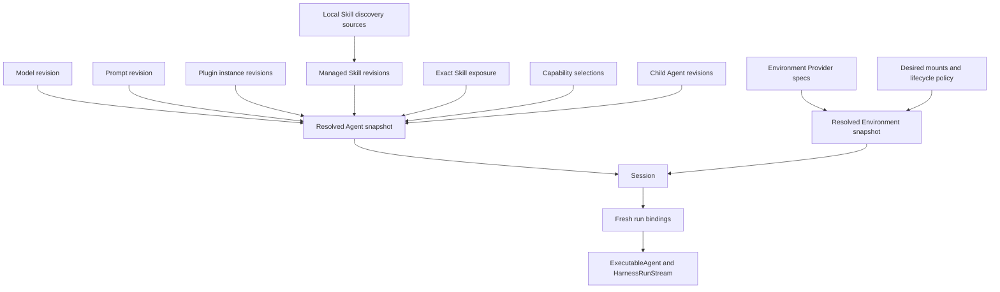
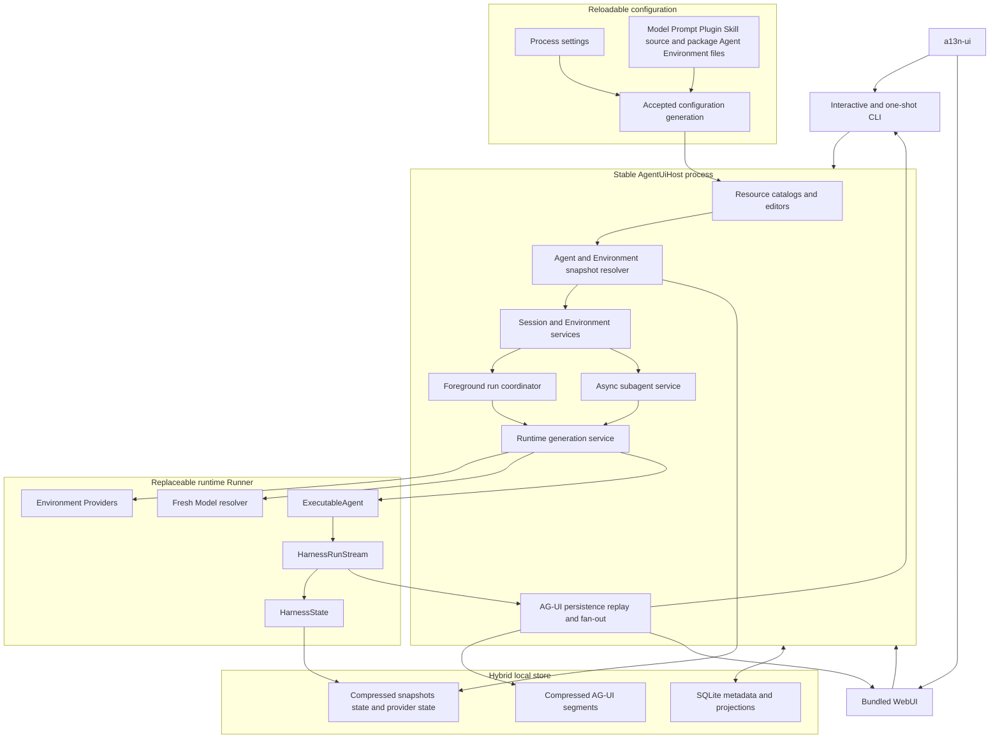
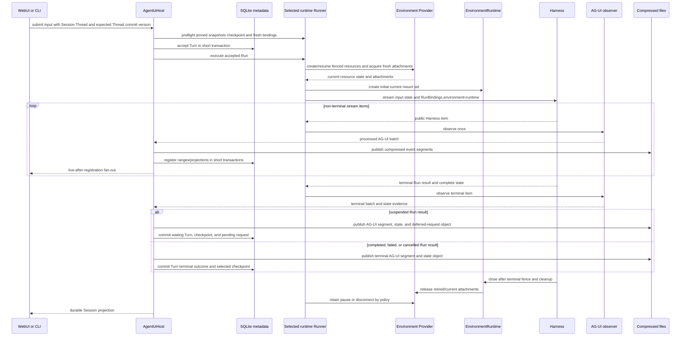

# Agent UI Overview

## Design Position

Agent UI is the complete local single-user workstation for composing and operating `agent-harness` Agents. The Python distribution `a13n-ui` owns reloadable YAML/JSON product configuration, explicit local Skill discovery and managed package revisions, immutable Agent and Environment snapshots, Codex-style local Sessions, Environment Provider resource orchestration, foreground root execution, async-only subagent jobs, hybrid local persistence, one stable `AgentUiHost`, replaceable runtime Runners, and shared WebUI and CLI semantics.

The executable exposes an interactive CLI and one-shot query commands:

```text
a13n-ui
a13n-ui runtime status
```

The default command enters the interactive CLI. Every CLI command opens the same stable Host boundary and accepted configuration. The bundled WebUI attaches through its loopback transport to the same Host operations rather than defining a second executable core. CLI and WebUI use the same SQLite metadata, compressed-file stores, pinned Session composition, and retained/live [post-processor AG-UI sequence](../agent-stream-protocol/00-overview.md). A frontend changes only presentation and transport lifecycle.

Agent UI does not expose a multi-tenant service, durable distributed worker protocol, arbitrary Python composition language, alternative Agent loop, or second Environment operation protocol. Work requiring service-owned durable acceptance, failover, remote authorization, or distributed retry remains Foundation Service responsibility.

## Product Model

Agent UI separates reusable behavior, runtime resources, and durable interaction:



An Agent is the exact composition of Model, Prompt, Plugin, available Skill, default Skill exposure, Capability, output, async-subagent policy, and child-Agent revisions. An Environment is an independent exact composition of desired mount definitions, provider specifications, permissions, and lifecycle policy. A Session pins one of each plus validated root/child exact Skill exposure, owns assignments to Host-managed provider resources and one interaction tree, and supplies fresh current authority for every Harness invocation. Local discovery sources populate managed Skill revisions but are never ambient runtime authority.

## Boundaries

| Concern                                                            | Owner                              | Agent UI relationship                                                                                       |
| ------------------------------------------------------------------ | ---------------------------------- | ----------------------------------------------------------------------------------------------------------- |
| Desired product definitions                                        | Reloadable Agent UI files          | Models, Prompts, Plugins, local Skill sources/packages, Agents, and Environments accepted as one generation |
| Immutable resolved composition                                     | Agent UI snapshot resolver         | Publishes content-addressed Agent and Environment snapshots                                                 |
| Native Agent construction and loop                                 | Harness and Pydantic AI            | Calls public build/stream APIs with fresh bindings                                                          |
| Provider specification and lifecycle implementation                | Environment Provider package       | Uses selected factory, Provider, Resource state, and fresh attachment contracts                             |
| Local Sandbox envd artifact selection                              | Agent UI Host                      | Exact release/target manifest, lazy verified cache, override validation, and availability diagnostics       |
| Session/Turn/resource control state                                | Agent UI SQLite metadata           | Owns revisions, selections, lifecycle, queues, jobs, and indexes                                            |
| Harness/provider/snapshot/Skill payloads                           | Agent UI compressed object store   | Stores verified immutable files referenced by SQLite                                                        |
| Presentation event history                                         | Agent UI compressed AG-UI segments | Stores processed events and rebuilds query projections                                                      |
| Harness-to-AG-UI conversion                                        | Agent Stream Protocol              | One observer and Agent UI processor per exposed Run                                                         |
| Web and terminal rendering                                         | Surface adapters                   | Consume Host queries/events and submit typed commands                                                       |
| Identity, credentials, Model, provider attachments, current policy | Fresh Host collaborators           | Reauthorized for every root and child invocation                                                            |
| OpenTelemetry                                                      | Repository observability boundary  | Exported independently; absent from SQLite and Session files                                                |
| Stable lifetime, routing, and durable execution authority          | `AgentUiHost`                      | Owns the data-root lease, accepted work, runtime selection, persistence, and commit semantics               |
| Process-local Agent execution                                      | Runtime Runner                     | Uses exact Harness-built Agents and children; active streams never migrate between Runner generations       |
| Distributed durable execution                                      | Foundation Service                 | Not emulated by local Sessions or process tasks                                                             |

## Architecture



`AgentUiHost` is the only product boundary. Neither surface reads configuration or storage directly, controls the runtime-generation service, constructs a Model/Agent, operates an `EnvironmentProvider`, calls `ExecutableAgent.stream()`, or translates Harness events. A runtime Runner never opens Agent UI SQLite, acquires the data-root lease, edits desired configuration, accepts a Turn, selects a checkpoint, or commits durable state.

## Configuration and Reload

Process settings and product definitions are file-backed so users and Agents can inspect, edit, diff, and version them. Agent UI validates all source layers and their complete dependency graph before atomically publishing one accepted configuration generation.

A failed reload leaves the previous generation active. A successful reload updates resource catalogs for new selections and explicit forks. Existing Sessions, active Runs, async-subagent jobs, and executables remain pinned to immutable resolved snapshots. Settings that own open infrastructure are restart-bound and are never partially applied.

The schemas, precedence, credential boundary, and reload lifecycle are owned by [Configuration and Resource Catalog](01-configuration-and-resource-catalog.md).

## Local Persistence

Agent UI uses SQLite for mutable metadata, control state, references, query projection, search, queueing, and version conflicts. Complete managed Skill packages, `HarnessState`, pending `DeferredToolRequests`, provider resource state, resolved Agent/Environment snapshots, and retained AG-UI events are stored as immutable Zstandard-compressed JSON/JSONL files.

Files publish before SQLite references. No cross-store ACID transaction is claimed. Published unreferenced files are cleanup-safe and startup removes them after the configured orphan-retention period; a missing referenced state fails closed. AG-UI projection can lag event files and rebuild, while SQLite-owned control facts are not guessed from presentation history.

OpenTelemetry and ordinary logs are separate diagnostic outputs and never determine local completion or recovery. The complete ownership, consistency, integrity, and recovery contract is in [Local Storage and Recovery](03-local-storage-and-recovery.md).

## Session and Environment Model

A Session pins one exact Agent snapshot, one exact Environment snapshot, and one validated root/child Skill-exposure map. It owns:

- one root Thread and zero or more async-child Threads;
- Thread commit versions and complete checkpoint selection;
- Environment assignments to Host resource records, whose shared operation fences and selected provider-state objects remain Host-owned;
- foreground Turns and queued submissions;
- async-subagent job, steering, terminal result-retention, and parent-delivery records;
- retained presentation sequence and Item/search projections;
- fork lineage, title, archive, pin, ordering, and other local control metadata.

Environment provider resources can outlive individual Runs and process connections, but every Run receives fresh current credentials, fresh provider collaborators, fresh single-use attachments, one single-use Host-retained `EnvironmentRuntime`, and fresh Host Capabilities. The Session snapshot supplies desired mount definitions; the runtime owns only that Run's current mount set. `HarnessState` restores Agent continuation only, and provider resource state restores provider resources only. Neither restores an `EnvironmentRuntime`, its current mounts, or current authority.

Dynamic configuration never changes a Session. Selecting different Agent or Environment behavior for existing history creates an explicit fork. [Sessions, Environments, and State](04-sessions-environments-and-state.md) owns lifecycle and failure semantics.

The built-in **Local Sandbox** option selects `a13n.local-envd`, not Direct Local. Agent UI resolves one exact envd executable, the provider owns its required-isolation subprocess/private runtime, and the Harness consumes the resulting fresh EIP attachment. Isolation, launch, or EIP failure is explicit and never falls back to Direct Local.

## Main Run Flow



Input acceptance, provider operation, Harness start, Harness result, durable AG-UI registration, live event delivery, checkpoint selection, provider pause, async-child result delivery, OTel export, and rendering are distinct facts. Live delivery follows durable event registration but does not imply a Turn checkpoint or terminal outcome. A disconnected surface does not cancel work. Explicit cancellation follows the ordinary Harness and provider cleanup contracts and preserves unknown external effects.

## Application Lifetime

One stable process owns one `AgentUiHost` instance and one selected data-root lease. Startup opens and recovers storage, accepts a complete configuration generation, validates selected state and root pending-deferred references, rebuilds required projections, marks prior-process active root Runs and async-child jobs interrupted, and preserves only validated waiting root Turns before commands are accepted.

Only one foreground Turn advances one Thread at a time. Independent Sessions execute concurrently under configured limits. Model, plugin, provider, AG-UI processor, and executable caches live in runtime Runners and contain no Session authority. Host-side configuration and snapshot caches remain detached from executable runtime objects.

Shutdown stops command acceptance, closes surface subscriptions, requests cancellation, drains root Harness streams and async-subagent tasks, seals event segments, applies Environment lifecycle policy, records interrupted/unknown outcomes, closes executables/providers, and then releases storage. It never reports success merely because a process object disappeared.

## Surfaces

WebUI and CLI are complete product peers. Both manage configuration resources including Skill sources/packages, Agent composition and exact Skill exposure, Environment definitions/resources, Sessions, foreground Runs, deferred input/approval, async children, runtime restart, replay, and diagnostics through the same Host operations.

WebUI uses a bundled browser application over a thin loopback command/query API and SSE. Interactive and one-shot CLI paths call `AgentUiHost` directly in process, start no Web server, and open no frontend port. Presentation can differ, but execution-affecting behavior cannot be hidden inside one renderer.

The detailed runtime and surface contract is owned by [Runtime, Subagents, and Surfaces](05-runtime-subagents-and-surfaces.md).

## Web Transport Authority

The built-in Web listener binds loopback by default and uses one unguessable process-local browser capability plus exact Host/Origin validation. This is local browser request authority, not remote multi-user authentication. It is distinct from model credentials, Environment credentials/attachments, Session identity, AG-UI cursor, and any provider transport authentication.

Binding outside loopback requires an adopting wrapper with appropriate TLS, authentication, authorization, Host, and origin policy. Unknown API or stream routes never fall back to the browser shell.

## Distribution

The private browser source application under `apps/harness-ui` is built into immutable assets in the `a13n-ui` Python distribution. Generated assets are not committed or independently published. The sdist contains prepared assets so building its wheel requires no Node.js. Agent UI releases independently while published metadata pins one exact compatible Harness release group.

The same Agent UI release pins one exact agent-envd release and per-target asset/executable hashes in a package-owned manifest. Native envd binaries are not bundled together in the wheel; the Host lazily downloads and verifies only the current target when Local Sandbox is selected. The default never searches `PATH`; an advanced user can select only an explicit absolute executable that reports the same pinned release and passes isolation and EIP compatibility checks.

[Runtime, Subagents, and Surfaces](05-runtime-subagents-and-surfaces.md#packaging) owns the detailed package and [Local Sandbox runtime](05-runtime-subagents-and-surfaces.md#local-sandbox-runtime-resolution) contracts.

## Completion Boundaries

| Fact                              | Meaning                                                                           |
| --------------------------------- | --------------------------------------------------------------------------------- |
| Configuration generation accepted | One complete resource graph became selectable; active Sessions did not change     |
| Session command accepted          | SQLite committed the command's control fact; execution may not have started       |
| Environment operation dispatched  | Provider side effects may have occurred; durable terminal lifecycle is separate   |
| Harness result delivered          | One process-local Run reached a terminal Harness result                           |
| AG-UI segment registered          | A verified compressed event range became available for replay                     |
| AG-UI event delivered live        | One subscriber observed an already registered event; Turn completion is separate  |
| Session checkpoint selected       | SQLite atomically advanced the Turn and selected a verified complete state object |
| Async subagent accepted           | SQLite owns a Host job record; the child may not have started                     |
| Async subagent result retained    | A safe child terminal outcome became available independently from parent delivery |
| Surface rendered                  | Ephemeral UI state changed                                                        |
| OTel exported                     | Diagnostic delivery occurred and strengthens no product fact                      |

## Trade-offs

### Complete local product rather than thin Harness demo

First-class resources including managed Skill discovery/import, Environment lifecycle, Sessions, async-only subagent orchestration, hybrid persistence, and two full surfaces make Agent UI a durable workstation rather than an example runner. This adds local schema, migration, recovery, and composition responsibilities while retaining the Harness and Provider packages as runtime authorities.

### File-backed configuration with immutable snapshots

Readable dynamic configuration is friendly to users, Agents, editors, and version control. Snapshot pinning requires explicit forks to apply changes to existing history, which avoids silent behavior mutation.

### SQLite metadata with compressed file payloads

SQLite supplies efficient local control and query behavior while state and event payloads remain inspectable, content-addressed, and independently recoverable. The cost is explicit ordered publication and reconciliation rather than fictitious cross-store atomicity.

### One stable Host with two surfaces

Shared commands, lifecycle, runtime routing, and AG-UI prevent terminal and browser products from drifting. Surface-specific shortcuts cannot bypass typed product boundaries.

## Invariants

01. Agent UI is one complete local workstation, not two surface-specific Hosts or an alternative Agent runtime.
02. An Agent snapshot, an Environment snapshot, and validated root/child Skill exposure are independent immutable Session selections.
03. Dynamic configuration reload publishes complete generations and never mutates active or pinned composition.
04. SQLite owns mutable local metadata/control; compressed immutable files own snapshots, managed Skill packages, state/deferred payloads, provider-state payloads, and AG-UI events.
05. `HarnessState` is the only Agent state authority; a waiting root Turn also requires its exact pending `DeferredToolRequests`, async-child jobs never own deferred requests, and provider state, AG-UI, identifiers, SQLite Items, or telemetry can replace neither.
06. Every root and child invocation receives a fresh Model resolver, current credentials, fresh provider attachments, one single-use Host-retained `EnvironmentRuntime`, fresh Identity, exact Skill selection, policy, and Host collaboration.
07. Agent UI uses only Host-owned async subagent jobs over Harness-built children and never enables Harness blocking inline delegation.
08. CLI runs entirely in the stable Host process; WebUI is a thin transport over the same Host operations.
09. No surface, event subscriber, file path, database row, or local identifier grants runtime authority by possession alone.
10. Process work, file publication, SQLite selection, child outcome/delivery, event delivery, Environment lifecycle, rendering, and OTel export remain independent completion boundaries.
11. Work requiring distributed durable execution or remote multi-user policy remains outside Agent UI.
12. Local Sandbox is an explicit required-isolation EIP provider backed by the Agent UI-selected envd executable; it is never an alias or fallback for Direct Local.
13. Runtime restart starts a fresh Runner, validates it before promotion, routes only later eligible work to it, and drains the previous Runner without restarting the Host or migrating active Runs.
