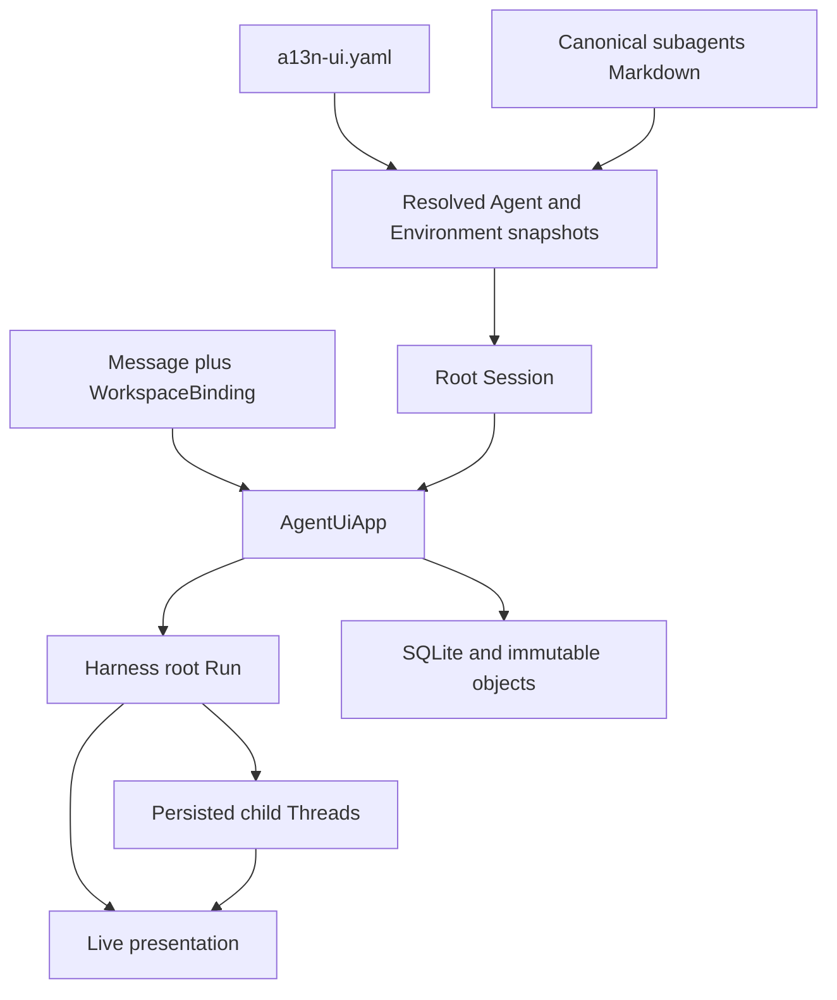
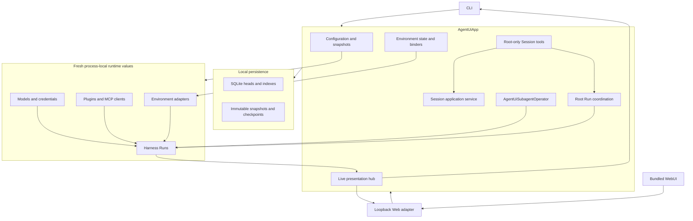
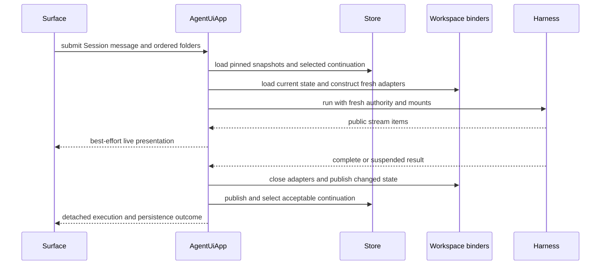
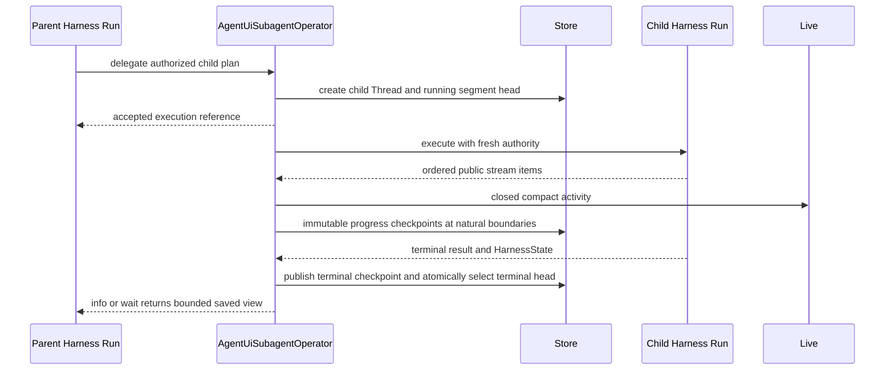

# Agent UI Overview

## Design Position

Agent UI is a local, single-user Harness workstation. One process-local `AgentUiApp` owns configuration, Sessions, root execution, persisted async child Threads, Environment state, and live presentation. CLI and WebUI adapters call that same application boundary.

Agent UI contains no child Runner generation, private runtime protocol, runtime rotation controller, or cross-process execution handoff. External Provider processes such as `agent-envd`, user-started tool processes, and remote sandbox services remain ordinary runtime collaborators rather than Agent UI workers.

Agent UI persists complete continuation boundaries, not accepted-work intent. Process loss can discard a submitted root message, partial root output, an active child segment, live events, and Run-owned shell processes. A later operation resumes only from a previously selected complete checkpoint.

## Product Model



The core concepts are:

| Concept             | Meaning and owner                                                                                                          |
| ------------------- | -------------------------------------------------------------------------------------------------------------------------- |
| Agent definition    | Small Agent UI-authored behavior that resolves to a complete Harness Agent graph                                           |
| Environment profile | Reusable selection of Native, Local EIP, or one trusted extension Provider; contains no workspace path                     |
| Resolved snapshot   | Immutable normalized Agent graph or Environment profile pinned by a Session                                                |
| Session             | One root Thread with pinned snapshots and one selected root continuation                                                   |
| `WorkspaceBinding`  | Ordered local folders captured with one message and converted to fresh Run mounts                                          |
| Child Thread        | Agent UI-owned async-subagent history containing linked execution segments and selected child checkpoints                  |
| Execution segment   | One accepted `delegate` or `resume_subagent` execution; normally one child Run, plus any internal denial continuation Runs |
| Compact display     | Bounded, redacted AG-UI projection used for inspection and rendering, never for resume                                     |

## Boundaries

| Concern                                | Owner                                       | Agent UI relationship                                                                     |
| -------------------------------------- | ------------------------------------------- | ----------------------------------------------------------------------------------------- |
| Native Agent construction and loop     | Harness and Pydantic AI                     | Reconstructs exact native inputs and executes public Run contracts                        |
| Desired local product behavior         | Agent UI configuration                      | Owns the compact configuration and canonical Markdown schema                              |
| Root and child continuation            | Harness `HarnessState` selected by Agent UI | Persists complete immutable checkpoints and current references                            |
| Environment operations and state codec | Environment Provider package                | Supplies fresh adapters and explicit lifecycle operations                                 |
| Workspace selection                    | Submitting surface and `AgentUiApp`         | Captures folders per message; never embeds them in Agent, Session, or profile definitions |
| Current Environment state              | Agent UI                                    | Stores and publishes Host-authoritative state under a complete binding key                |
| Async child admission and persistence  | `AgentUiSubagentOperator`                   | Implements the complete Harness Host-operator boundary                                    |
| AG-UI conversion                       | Agent Stream Protocol                       | Uses one observer per root or child Run                                                   |
| Local persistence                      | Agent UI                                    | Uses SQLite for compact mutable heads and immutable files for checkpoints and snapshots   |
| Presentation                           | CLI and WebUI adapters                      | Consume the same detached App operations and live hub                                     |
| Durable distributed execution          | Foundation Service                          | Not emulated by Agent UI                                                                  |

## Architecture



`AgentUiApp` is an application boundary, not a network protocol. Detached typed commands and queries are intentionally broader than the CLI because the WebUI and model-visible Session tools require richer inspection and management operations.

## Root Message Flow



Environment-state publication and continuation selection are independent completion boundaries. Known changed state is published after adapter cleanup even when execution or continuation publication fails. A valid complete or suspended continuation can be selected even when Environment-state publication reports an independent failure.

The App does not create a durable input row before dispatch. If the process exits before a new continuation is selected, the previous continuation remains current. External effects can be unknown and may repeat after retry.

## Async Child Flow

One `delegate` creates a child Thread and segment zero. `resume_subagent` retains the child Thread identity and creates a new segment with the next index from the exact selected child `HarnessState`.



Compact display contains only closed text, closed thinking, and completed Tool summaries. It excludes open content, running Tool calls, encrypted reasoning, unrelated custom events, and duplicate terminal output. Terminal success becomes visible only after the terminal checkpoint is saved and selected. Checkpoint failure produces explicit execution failure and no false resumability.

## Persistence and Recovery Position

Agent UI stores:

- accepted configuration metadata and immutable snapshots;
- Session metadata and selected root continuation;
- complete root continuation objects;
- child Thread and execution heads;
- immutable child checkpoints containing exact child `HarnessState` and compact display;
- Host-authoritative Environment state references.

It does not store:

- pending root input or active root Run records;
- a child scheduler, process-liveness record, lock file, lease, worker attempt, or takeover protocol;
- Run-owned process handles or output cursors;
- live Model, Provider, adapter, plugin, MCP, credential, task, callback, or stream objects;
- AG-UI as a substitute for continuation state.

## Surfaces and Packaging

The primary console surface is:

```text
a13n-ui
```

It provides interactive Session use plus focused configuration, Agent, subagent migration, Environment, Session, and diagnostic commands. The loopback Web adapter exposes the same App operations and live stream to the bundled WebUI. Neither surface reads storage directly.

`a13n-ui` is both the Python distribution and console script. The private `apps/harness-ui` build output ships in both the wheel and sdist, and rebuilding a wheel from the sdist requires no Node.js. Source browser assets are not published independently.

## Stable Principles

01. One in-process App owns all local application behavior.
02. Configuration is compact and Agent UI-specific; it does not serialize Harness object graphs.
03. Sessions pin behavior snapshots, while each message supplies its own workspace folders.
04. Every independent Run receives fresh runtime authority and Environment adapters.
05. Root input and active work are not durably accepted.
06. Root continuation, Environment state, and child checkpoint publication remain independent facts.
07. Async children are persisted child Threads without becoming a general Job system; saved nonterminal status does not prove runtime liveness.
08. Compact display is inspection authority only; `HarnessState` is resume authority.
09. Shell processes belong to one Harness Run and have no Agent UI persistence or wake path.
10. CLI, WebUI, and model-visible Session tools use the same App commands and queries.
