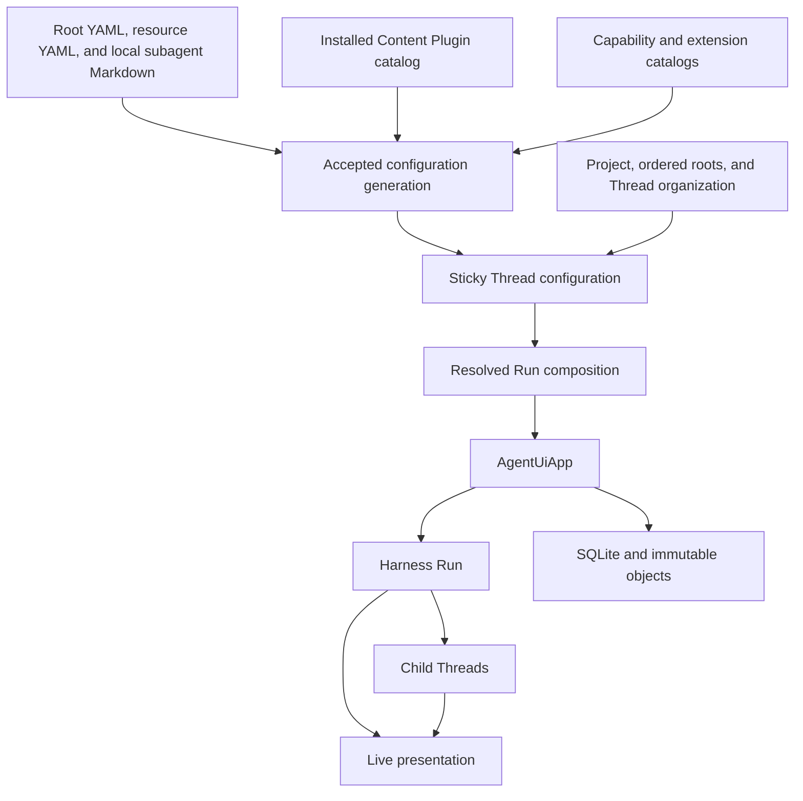
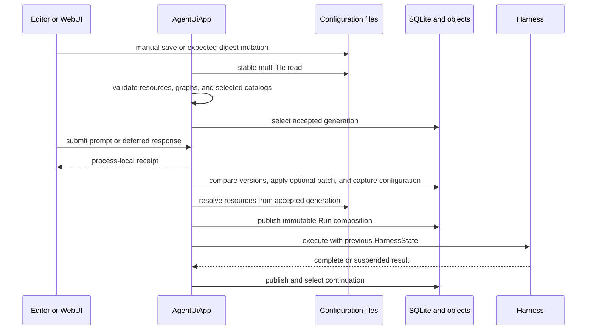
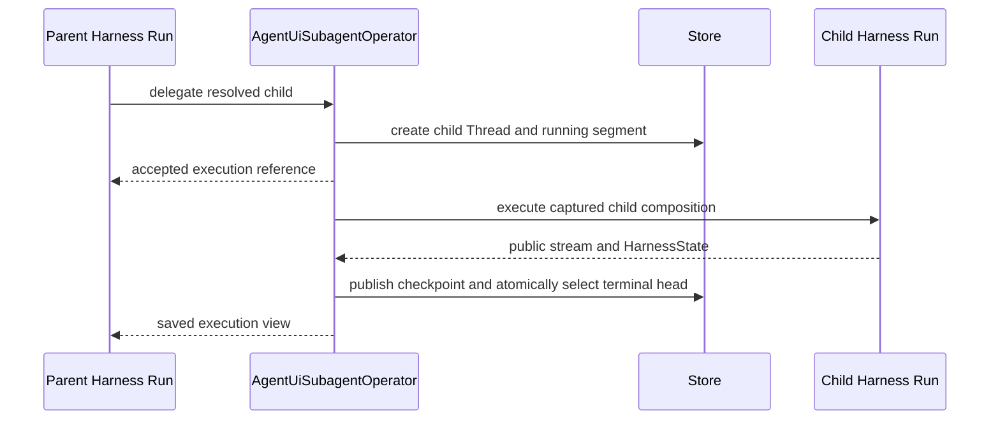

# Agent UI Overview

## Design Position

Agent UI is a local, single-user Harness workstation. One process-local `AgentUiApp` owns configuration generations, trusted catalogs, Projects, Threads, process-local root receipts, persisted async children, Environment state, detached projections, and live presentation. CLI, Textual TUI, and WebUI adapters call that same application boundary.

Human-editable files remain the desired-resource authority so Agent UI can be configured without a browser or a large command surface. Separately, explicit CLI operations install immutable declarative Content Plugins under the data root. SQLite owns mutable Thread and execution heads, while immutable content-addressed objects retain complete Run compositions and continuation checkpoints.

Agent UI persists complete continuation boundaries, not accepted-work intent. Process loss can discard a root receipt, submitted message or deferred response, partial output, an active child segment, live events, and Run-owned shell processes. A later operation resumes only from a previously selected complete checkpoint.

Agent UI owns two built-in local execution modes. **Full Control** uses the Direct Local Provider and runs commands as the Host user. **Sandbox** uses Local Envd over EIP with required native filesystem and process isolation plus denied networking; it never falls back to Direct Local. Both preserve the local machine's canonical Project-root paths in Harness aggregate routing and model context while retaining different execution authority. Other adapters use provider-neutral virtual routes unless they explicitly declare that their path space preserves Host paths.

## Product Model

The core concepts are:

| Concept                  | Meaning and owner                                                                                                        |
| ------------------------ | ------------------------------------------------------------------------------------------------------------------------ |
| Configuration generation | One complete stable and valid capture of the root YAML, resource YAML, and canonical Markdown sources                    |
| Configured resource      | Stable file-defined Model, extension, MCP server, Agent, local or plugin subagent, or Project selected by ID             |
| Content Plugin           | Git-installed immutable declarative Skill and Markdown-subagent bundle; availability alone grants no selection           |
| Installed catalog entry  | Available Capability or runtime-extension implementation; availability alone grants no selection                         |
| Project                  | File-defined mutable named ordered roots and the only Agent UI concept for organizing root Threads and execution context |
| Thread                   | Root or async child conversation with independent metadata and sticky-configuration heads plus one selected continuation |
| Thread configuration     | Versioned Project, Agent, Environment, Plugin, Run Extension, and MCP selections used by default on subsequent Runs      |
| Root operation           | One process-local prompt or deferred-response admission identified by an exact receipt                                   |
| Resolved Run composition | Immutable configuration, resource content, Project roots, and dependency provenance captured for one admitted Run        |
| Execution segment        | One accepted child `delegate` or `resume_subagent` execution; normally one Harness Run plus bounded denial continuation  |
| Surface projection       | Detached, bounded, serializable summary, detail, transcript, operation, child, or live value                             |
| Compact display          | Bounded AG-UI projection used for inspection and rendering, never for resume                                             |

## Boundaries

| Concern                                | Owner                                       | Agent UI relationship                                                                                               |
| -------------------------------------- | ------------------------------------------- | ------------------------------------------------------------------------------------------------------------------- |
| Native Agent construction and loop     | Harness and Pydantic AI                     | Resolves selected Capabilities and extensions into exact native inputs                                              |
| Desired local resource behavior        | Agent UI configuration files                | Accepts one coherent generation and preserves direct text editing                                                   |
| Declarative plugin content             | Installed Content Plugin catalog            | Adds immutable Skill sources and fallback Markdown subagents without runtime code                                   |
| Mutable conversation presentation      | Agent UI Thread metadata                    | Stores versioned title and archive state                                                                            |
| Mutable conversation defaults          | Agent UI Thread configuration               | Stores sticky selections and applies explicit partial changes                                                       |
| Root and child continuation            | Harness `HarnessState` selected by Agent UI | Persists complete immutable checkpoints and current references                                                      |
| Environment operations and state codec | Environment Provider package                | Supplies fresh adapters and explicit lifecycle operations                                                           |
| Local root grouping and path layout    | Agent UI Project and selected profile       | Supplies ordered roots and Host-path-preserving or virtual aggregate paths captured at Run admission                |
| Current Environment state              | Agent UI                                    | Stores and publishes Host-authoritative state under a complete Thread/configuration/root key                        |
| Async child admission and persistence  | `AgentUiSubagentOperator`                   | Creates child Threads and runs the complete Harness Host-operator boundary                                          |
| AG-UI conversion                       | Agent Stream Protocol                       | Uses one observer per root or child Harness Run                                                                     |
| Local persistence                      | Agent UI                                    | Uses SQLite for compact mutable heads and immutable files for compositions and checkpoints                          |
| Presentation                           | CLI, TUI, and WebUI adapters                | Consume detached App projections, exact process-local receipts, root-lineage live events, and summary invalidations |
| Durable distributed execution          | Foundation Service                          | Not emulated by Agent UI                                                                                            |

## Configuration and Run Flow

A Thread configuration patch and root admission form one App operation. Every non-empty patch carries the exact expected Thread configuration version; an admission with no patch performs no configuration-head write. Omitted fields preserve the Thread's previous values. The accepted patch applies to that Run and subsequent Runs. A later Thread, Project, or file change never mutates an already admitted Run.

The receipt returns before preparation completes. It supports exact current-process query, wait, cancel, and, once a Harness stream exists, steer. A suspended continuation can be resumed only by a response naming that exact continuation and completely answering its detached pending request set. Receipts and response input are not durable records.

`HarnessState` preserves the conversation and Capability namespaces across composition changes. An unavailable or incompatible newly selected component fails the new Run explicitly; Agent UI does not silently substitute the previous component or reset state.

Environment-state publication and continuation selection are independent completion boundaries. Known changed state is published after adapter cleanup even when execution or continuation publication fails.

## Async Child Flow

One `delegate` creates a child Thread and segment zero. The child retains its selected Agent-resource or Markdown-subagent source and owns its sticky configuration, while Project and Environment profile defaults are initialized from the admitting parent. `resume_subagent` retains the child Thread identity, applies an optional child configuration patch, and creates the next segment from the selected child `HarnessState`.

An existing child Thread does not follow later parent Project, Environment profile, Plugin, Run Extension, or MCP selection changes; its next segment defaults to its own sticky configuration. A Markdown source still resolves its explicit Model and Capability inheritance against the parent Run that authorizes a linked resume. A parent Agent edit affects a newly delegated child only after a later parent Run captures that edit.

## Persistence and Recovery Position

Agent UI stores:

- accepted configuration-generation metadata and safe diagnostics;
- Project and resource indexes derived from files;
- Thread metadata, sticky configuration, and selected continuation;
- immutable resolved Run compositions;
- child execution heads and immutable checkpoints;
- Host-authoritative Environment state references.

It does not store root receipts, pending root input or deferred responses, active root Run records, a child scheduler, process-liveness records, shell-process handles, native runtime objects, credentials, or live streams.

## Surfaces and Packaging

The `a13n-ui` CLI, [Textual TUI](tui/README.md), and [WebUI](webui/README.md) use the same file configuration and App boundary. The CLI additionally owns Content Plugin install, list, and uninstall; the other surfaces do not manage that catalog. The App projects the release-owned **Full Control** and **Sandbox** modes together with accepted custom Environment profiles, so every surface presents the same identity, execution warning, Provider selection, and path-layout fact. The [Web adapter](05-runtime-subagents-and-surfaces.md#http-startup-and-access) binds to loopback and requires a fresh process-local API key by default; its explicit network and access overrides do not create another application-configuration plane. Direct file editing remains a complete configuration path. The CLI locates, validates, and shows configuration but provides no generic desired-resource CRUD; the WebUI owns expected-digest source mutation and Project management; the TUI resolves one launch Project from the current directory, defaults Workbench to that Project filter with an All Projects fallback, and patches only supported non-Project sticky selections. Surfaces receive strict detached views rather than storage or Harness values. Focused views establish an epoch and sequence cutover before reading their snapshot, then consume root-lineage events after that point; an App-wide best-effort invalidation stream prompts summary refetch. The TUI provides terminal-native Focus and Workbench modes without adding another runtime authority.

Textual ships as part of the Python `a13n-ui` distribution. The private `apps/harness-ui` build output ships in both the `a13n-ui` wheel and sdist. Rebuilding a wheel from the sdist requires no Node.js.

## Stable Principles

01. One in-process App owns all local application behavior.
02. Human-editable files are the desired-resource authority; installed Content Plugin files are immutable catalog inputs, and SQLite does not duplicate either definition source.
03. One accepted generation is coherent across all selected configuration files.
04. Project is the only local-root grouping, root-Thread organization, and execution-context concept; Agent UI defines no Workspace resource.
05. Thread metadata and sticky configuration are independent versioned heads, while each admitted Run captures immutable effective behavior.
06. Continuation history survives supported Agent, Capability, Plugin, MCP, Project, and Environment profile selection changes.
07. Every independent Run receives fresh runtime authority and Environment adapters.
08. Root receipts, input, deferred responses, and active work are not durably accepted.
09. Root continuation, Environment state, and child checkpoint publication remain independent facts.
10. Surface projections and streams are detached from storage and native runtime authority.
11. CLI, TUI, WebUI, and model-visible Thread tools use the same App commands and queries while retaining their explicit Project and configuration-authoring boundaries.
12. Full Control and Sandbox expose canonical Host Project and user Skill paths while preserving Direct Local versus sandboxed EIP execution authority; other adapters retain virtual routes unless they explicitly preserve Host paths.
