# Agent Profiles and Composition

## Design Position

An Agent UI profile is the local Host authoring document for one complete root Agent composition. It selects user-editable instructions and model defaults, a curated set of first-party Capabilities, explicit Harness plugin configuration, and a finite graph of complete named child profiles. Agent UI resolves that document into an immutable profile snapshot and reconstructs one process-local Harness `AgentDefinition` graph before a session begins.

The profile is not a serialized Harness `AgentDefinition`. It contains no Python class, callable, native Model, Capability instance, Toolset, plugin instance, client, credential, Environment binding, or live Agent. Trusted Agent UI adapters map each supported declarative key to installed code under a versioned local schema.

Profiles make interactive composition reproducible without creating an arbitrary Capability import registry or a second plugin system. Third-party process-local extensions enter through the existing [Harness plugin document and trusted Build Context](../agent-harness/05-plugin-system.md). Capabilities remain the Harness feature-behavior plane.

## Boundaries

| Concern                                       | Owner                                 | Profile relationship                                                                         |
| --------------------------------------------- | ------------------------------------- | -------------------------------------------------------------------------------------------- |
| Declarative local authoring document          | Agent UI                              | Validates, revisions, resolves, and snapshots                                                |
| Native Agent definition and build lifecycle   | Harness                               | Receives reconstructed native values through the public build contract                       |
| Capability behavior and namespaced state      | Capability and Harness                | Profile selects only supported declarative forms; state stays in `HarnessState`              |
| Harness plugin factories and configuration    | Harness plugin system                 | Profile embeds or references the supported Harness plugin document under locked local policy |
| Child topology and inline delegation          | Harness subagent contract             | Profile reconstructs complete child definitions and selects a presentation Capability        |
| Local asynchronous child tools                | Agent UI Host Capability              | Profile selects behavior; fresh Agent UI run attachment supplies process-local authority     |
| Model, Environment, credentials, and Identity | Host adapters and fresh `RunBindings` | Profile contains selectors and defaults, never live authority                                |
| Durable hosted definitions and Presets        | Foundation Service                    | Independent schema and revision authority; no implicit profile conversion                    |

## Serialized Profile Document

The following Python-like schema is conceptual but describes the fields of the versioned serialized Agent UI profile document:

```python
class AgentProfileBody(BaseModel):
    display_name: str
    description: str | None
    instructions: str
    model: ModelSelection
    capabilities: tuple[FirstPartyCapabilitySelection, ...]
    plugins: HarnessPluginDocument | None
    subagents: tuple[SubagentProfileEdge, ...]
    delegation: DelegationPresentation


class AgentProfileDocument(AgentProfileBody):
    schema_version: str
    profile_id: str
    revision: int


class SubagentProfileEdge(BaseModel):
    name: str
    description: str
    profile_ref: ProfileRevisionRef | None
    inline_profile: AgentProfileBody | None
    context: DelegationContextPolicy
    usage_limits: UsageLimits | None


class DelegationPresentation(BaseModel):
    inline: Literal["unified", "named", "disabled"]
    background: Literal["agent-ui", "disabled"]
```

Exactly one of `profile_ref` and `inline_profile` is present on an edge. A reference identifies one immutable local profile revision rather than whichever revision is newest at execution time. Inline profiles use the same body contract but do not introduce an independently editable profile identity.

`ModelSelection` is a local Host selector plus bounded defaults that a trusted model adapter resolves. `FirstPartyCapabilitySelection` is a discriminated union owned by the profile schema. Each member has an explicit key, schema version, and typed configuration. Unknown keys or versions fail profile resolution. They never become import strings.

The root document has one stable `profile_id` and monotonically increasing revision. Editing immutable revision content creates the next revision; it does not mutate a snapshot already pinned by a session. Display metadata can be projected separately, but any field that changes reconstructed Agent behavior participates in revision content and digest.

## Supported Composition

Agent UI supports three composition sources:

1. profile-native fields for instructions, model selection, and built-in Host behavior;
2. curated first-party Capability selections whose adapters are shipped and reviewed with Agent UI;
3. the narrow Harness plugin document resolved through an explicitly enabled trusted Build Context.

Package installation alone enables none of them. A profile cannot name a Python module, class, entry point, arbitrary package, shell command, or remote code URL as a Capability. When a third-party package supplies Harness behavior, the operator enables its plugin key through the existing Harness configuration boundary and Agent UI records the exact profile content and dependency lock needed by local policy.

A plugin can contribute concrete Harness plugins and allowed Capabilities through its documented Harness lifecycle. Agent UI does not wrap it in another hook model. Profile validation rejects a plugin selection that is unavailable, not permitted by the Build Context, or incompatible with the selected profile schema.

The curated first-party catalog can select the Harness `DynamicEnvironmentCapability` and its stable File/Shell surfaces. This selection authorizes only authored model behavior; it contains no envd endpoint, invitation, attachment reference, credential, or provider binding. During a run, the Agent UI application service can publish an explicitly selected envd attachment through the existing Environment topology controller, after which the Capability observes the ordinary topology change without rebuilding the profile or Agent.

## Resolution and Snapshot

```mermaid
flowchart LR
    Document[Profile revision] --> Validate[Schema and policy validation]
    Validate --> Resolve[Resolve exact child revisions and local locks]
    Resolve --> Snapshot[Immutable resolved profile snapshot]
    Snapshot --> Reconstruct[Trusted adapters reconstruct native values]
    Reconstruct --> Definition[Complete AgentDefinition graph]
    Definition --> Build[HarnessBuilder]
    Build --> Executable[ExecutableAgent]
```



Resolution occurs before session creation or explicit fork. It:

1. validates the root revision and all referenced child revisions;
2. resolves model selectors and plugin/adapter dependency identities under current local policy;
3. expands the finite child graph and rejects missing revisions, duplicate immediate-child names, and cycles;
4. validates Capability combinations and delegation presentations;
5. canonicalizes authority-neutral content and computes a profile digest;
6. stores an immutable resolved snapshot containing all content needed to repeat trusted reconstruction.

The snapshot contains versioned documents, exact local adapter and dependency locks, and safe resolver metadata. It contains no secret, current credential, live provider object, Environment handle, plugin instance, or run Capability. Reconstructing a snapshot can still fail if a locked artifact is unavailable or current Host policy denies it; the resolver never silently substitutes the latest plugin, model adapter, or child revision.

A session pins the exact resolved snapshot identity and digest at creation. Later profile edits affect only sessions created from the new revision. Continuing an existing session uses its pinned snapshot. Applying another composition to existing history creates an explicit [session fork](02-local-sessions-and-state.md#forking) whose first lineage record identifies both the source checkpoint and new profile snapshot.

## Child Definitions

Each `SubagentProfileEdge` resolves to one complete [Harness `SubagentDefinition`](../agent-harness/11-delegation-and-subagents.md#child-definitions-and-built-collection). A child explicitly owns its instructions, model selection, output contract selected by its trusted adapter, Capabilities, plugins, Environment requirements, and nested children. Agent UI does not implement parent-tool inheritance, parent-Capability inheritance, shallow context copying, or a special subagent Agent builder.

A “self” authoring convenience resolves before Harness build to a finite complete child profile. Its child delegation surface is removed or explicitly narrowed so the graph remains finite. It is not a runtime clone operation and does not pass the parent's live context or authority.

The profile separately selects child topology and presentations:

- inline `unified` exposes the first-party Harness `delegate` selector;
- inline `named` exposes one bounded named tool per child;
- inline `disabled` keeps the built collection available to trusted Host behavior without an inline model tool;
- background `agent-ui` enables the Agent UI Host background Capability for the same exact collection;
- background `disabled` supplies no local asynchronous child tools.

Inline and background presentations can coexist. They use different lifecycle and state owners but never build separate child definitions or execute a separate Agent loop.

## Agent UI Host Capabilities

Agent UI-owned model-visible behavior follows the Harness two-layer Capability pattern:

- a definition-selected declarative behavior Capability contributes stable tools, instructions, configuration, and portable namespaced state;
- a fresh run Capability in `RunBindings` supplies the current Agent UI application-service collaborator and authority.

This applies to background-child tools and the read-only session Capability. The behavior Capability cannot capture the application service, profile repository, session store, or child monitor while building an Agent. An attempted operation fails before side effects when the expected fresh run Capability is missing, duplicated, incompatible, or bound to another Session or Thread.

## Profile Changes and Executable Lifetime

An `ExecutableAgent` corresponds to one resolved profile snapshot and its complete child graph. Agent UI can cache it under the snapshot digest while respecting Harness close and concurrency contracts. A cache entry contains no session state or run authority.

Changing instructions, model defaults, Capability configuration, plugin selection, child topology, delegation presentation, or dependency locks creates another snapshot and requires another executable build. Agent UI never hot-toggles a plugin or Capability inside an active executable or run. Closing the last reference closes the complete built child and plugin graph through the ordinary Harness ownership order.

Run-time values can vary only through contracts designed for fresh binding, such as Identity, current model binding, Environment, credentials, policy, session read collaborator, and background-job collaborator. Fresh binding can narrow configured behavior but cannot add a Capability or child edge absent from the snapshot.

## Failure Semantics

| Failure                                      | Outcome                                                                              |
| -------------------------------------------- | ------------------------------------------------------------------------------------ |
| Invalid schema or unknown Capability key     | Profile revision rejected before snapshot resolution                                 |
| Missing or changed referenced child revision | Resolution fails; no substitution with newest revision                               |
| Child graph cycle or duplicate name          | Resolution fails before Harness build                                                |
| Unavailable locked plugin or adapter         | Reconstruction fails explicitly; existing snapshot is retained                       |
| Current policy denies locked composition     | Executable creation denied; profile state is not rewritten                           |
| Plugin or Capability build failure           | Harness build fails and closes already acquired resources                            |
| Fresh run attachment missing or incompatible | Affected Host operation fails closed before repository, child, or other side effects |
| Profile edited during an active session      | Existing session and executable continue with their pinned snapshot                  |

## Compatibility

Profile document schema, first-party Capability selection schemas, Harness plugin document version, local adapter lock format, and Harness state versions evolve independently. A profile migration creates a new revision or a verifiably equivalent normalized representation; it never changes the content addressed by an existing snapshot digest.

A session can continue only when its pinned snapshot can be reconstructed and its checkpoint is compatible with that exact logical Agent definition. Capability state migration follows the owning Harness Capability contract. Name similarity does not permit a stale child snapshot to bind another child definition.

## Trade-offs

### Curated Capability catalog vs. arbitrary imports

A curated catalog makes local documents inspectable and keeps trusted code selection explicit. Adding another declarative feature requires an Agent UI schema and adapter or an existing Harness plugin integration, but profile loading never becomes arbitrary Python execution by string.

### Snapshot pinning vs. live profile edits

Pinning prevents a resumed conversation from silently changing model behavior, tools, child topology, or state codecs. Users must fork to apply a new composition to existing history, which creates an explicit lineage rather than instant mutation.

### Complete child profiles vs. inheritance

Complete children repeat some authoring values but match the Harness graph and make authority and behavior reviewable. Shared authoring templates can exist in profile tooling, while resolved snapshots contain no runtime inheritance rule.

## Invariants

1. A profile is a versioned local Host document, never a serialized native Harness or Pydantic object.
2. Every session pins one immutable resolved profile snapshot and digest.
3. Profile edits and plugin toggles never mutate an active executable or an existing session's composition.
4. Every child edge resolves to one complete finite child definition; no separate subagent builder or inheritance plane exists.
5. Curated Capability keys and enabled Harness plugin keys are the only declarative code-selection surfaces; arbitrary imports are rejected.
6. Profile content and snapshots restore no Identity, credential, Environment, model provider client, repository, scheduler, or execution authority.
7. Agent UI Host behavior separates definition-selected Capability configuration from fresh run attachments.
8. Dynamic envd arrival can change fresh or active Environment topology but cannot add an unauthored Capability, Toolset, or child edge.
9. Applying another composition to existing history requires an explicit session fork.
