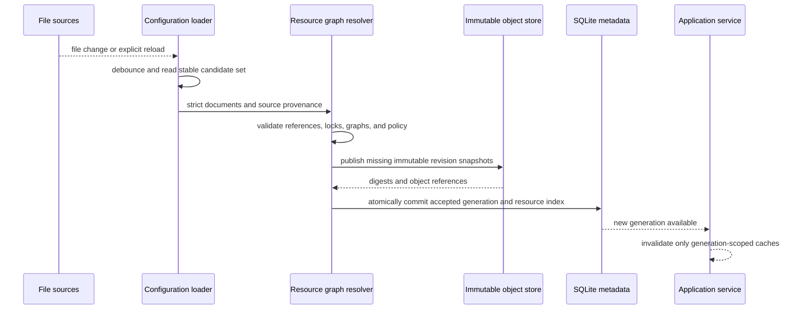

# Configuration and Resource Catalog

## Design Position

Agent UI configuration is a human- and agent-editable file-backed contract. It separates one strict YAML process-settings document from reusable YAML/JSON product definitions and accepts all definition sources as one validated configuration generation. External editors, WebUI, and CLI can change the same definition documents; `AgentUiHost` publishes a new generation only after the complete resource graph validates.

SQLite is not the authority for desired configuration. It records accepted generation metadata, resource indexes, diagnostics, and references from continuation-backed Sessions, while immutable resolved snapshots preserve the exact content selected by existing Sessions. A source edit therefore changes the latest catalog without rewriting earlier revisions or active runtime objects.

## Boundaries

| Concern                                                                       | Owner                                | Contract                                                                            |
| ----------------------------------------------------------------------------- | ------------------------------------ | ----------------------------------------------------------------------------------- |
| Process settings and resource source documents                                | Local configuration files            | Human- and agent-readable desired state                                             |
| Source discovery and layer precedence                                         | Agent UI configuration loader        | Deterministic input set for one candidate generation                                |
| Schema and graph validation                                                   | Agent UI resource catalog            | All-or-nothing accepted generation                                                  |
| Model provider, Harness plugin, and Environment provider package availability | Installed trusted catalogs           | Availability and provenance, not user authority                                     |
| Current credential material                                                   | Credential resolver                  | Fresh process-local lookup; absent from configuration snapshots and Session history |
| Accepted-generation and resource query metadata                               | SQLite metadata store                | Mutable index over accepted file-backed content                                     |
| Exact Session composition                                                     | Content-addressed resolved snapshots | Immutable even after configuration reload                                           |
| Local Sandbox envd release assets and hashes                                  | Package-owned runtime manifest       | Exact default executable selection; never ambient discovery                         |
| Native Model, plugin, Capability, Agent, or Environment resource              | Owning runtime package               | Reconstructed only at explicit runtime boundaries                                   |

## Configuration Sources

Agent UI reads one process-settings YAML document and zero or more ordered definition roots. An explicit CLI `--config` path selects that document; otherwise the Host selects `~/.a13n-ui/settings.yaml`. There is no working-directory search, parent traversal, profile merge, environment overlay, include directive, or remote settings layer. If the default file does not exist, the Host uses the same strict built-in defaults represented by:

```yaml
storage:
  data_root: ~/.a13n-ui/data

configuration:
  schema_version: "1"
  definition_roots:
    - root_id: root-user
      path: ~/.a13n-ui/definitions
      writable: true
  project_root_policy: disabled
```

The default directories are created only when the selected command needs them. An explicit missing settings path is an error rather than a request to create or merge another source.

A definition root contains resources in these namespaces:

- Models;
- Prompts;
- Plugin instances;
- local Skill discovery sources;
- Skills;
- Agents;
- Environments.

Models, Prompts, Plugin instances, Skill sources, Skills, Agents, and Environments remain separate namespace files rather than being embedded in the process-settings document. Structured definitions use strict versioned YAML or its exact JSON equivalent. Prompt bodies and Skill packages can use their native Markdown and directory forms with a strict metadata document. The loader rejects unknown schema fields, duplicate keys, aliases that create non-JSON graphs, non-finite values, traversal outside an authorized source root, and inputs above configured local bounds.

Source layers are ordered from lowest to highest precedence. Built-in resources form the lowest layer, followed by explicitly configured user roots and then an explicitly configured project root. Project-root policy is disabled by default, and Agent UI never discovers a project root from the current working directory. A higher layer can replace one lower-layer resource only by the same stable resource ID and compatible resource kind. Replacement selects different content in the candidate generation; it does not mutate or delete the lower revision. Two definitions of the same identity at the same precedence are an error.

The process-settings YAML document selects the data root, definition roots, project-root policy, process-owned local directory and executable aliases, credential backends, provider/plugin allowlists, logging and telemetry exporters, simple concurrency limits, runtime Runner bounds, Web transport settings, and an optional advanced Local Sandbox envd executable override. Native paths appear only in this Host-controlled document. Product resource documents use bounded alias objects and cannot introduce an absolute POSIX, UNC, or drive path.

Direct Local `root` selects one `directory_id`. Each Direct Local shell profile selects one `executable_id`; the referenced executable alias resolves to one explicit absolute Host path and is unique by both ID and path. Candidate validation resolves these aliases before provider-spec validation, and immutable Environment snapshot construction resolves them again from the accepted process settings. A missing alias, malformed alias object, literal native path, non-absolute process setting, or directory selected as an executable fails explicitly. Alias resolution supplies provider parameters only; an ID or path does not bypass the Environment access ceiling or provider process policy.

The complete process-settings document is activated once for a Host lifetime. Changes to that document take effect only when a later Host lifetime selects it; the running Host does not partially apply a new data root, source topology, listener, credential-store implementation, runtime bound, or logging setup. Runtime Runner restart refreshes process-local execution code and state but does not reload Host process settings. Definition-file reload remains independent and can publish a later accepted configuration generation without restarting the Host.

### Local Sandbox Runtime Selection

The package owns a reviewed runtime manifest that selects one exact agent-envd release and one exact asset and hash set for each supported target. This manifest is release metadata, not editable product configuration. By default, Local Sandbox resolves only the matching managed executable under the Agent UI data root. Configuration reload, Direct Local, Docker, and E2B selection do not download a Host binary, and Agent UI never searches ambient `PATH`.

An advanced process setting can replace the managed default with one explicit absolute executable path. Relative paths, command names, shell expressions, directories, and `PATH` lookup are invalid. Syntax validation occurs with configuration; actual availability remains a runtime fact. Before Local Sandbox provider creation, the selected Runner requires the executable to report the package manifest's exact envd release identity, runs the production-equivalent required-isolation probe, and later requires compatible EIP initialization. The override changes location only, not the selected release. Failure leaves Local Sandbox unavailable and never substitutes Direct Local.

The override affects later Local Sandbox resource operations only. An already entered provider resource or active attachment retains its selected executable/process generation until its ordinary lifecycle closes. [Runtime, Subagents, and Surfaces](05-runtime-subagents-and-surfaces.md#local-sandbox-runtime-resolution) owns download, cache, validation, diagnostics, and provider handoff.

## Resource Identity and Revisions

Every reusable definition has one kind-prefixed stable resource ID. Normalization produces immutable revision content and a digest:

```python
class ResourceRef(BaseModel):
    kind: Literal[
        "model",
        "prompt",
        "plugin",
        "skill_source",
        "skill",
        "agent",
        "environment",
    ]
    resource_id: str


class ResourceRevisionRef(ResourceRef):
    content_digest: str


class ResourceRevision(BaseModel):
    ref: ResourceRevisionRef
    schema_version: str
    normalized_content: JsonValue
    source: SafeSourceRef
    dependency_provenance: tuple[DependencyLock, ...]
```

`content_digest` covers the canonical normalized content and all behavior-affecting dependency references owned by the revision. Source path, modification time, UI display ordering, diagnostics, and accepted generation do not change the digest unless they change normalized behavior.

A revision stores no credential, native provider object, live plugin, imported module object, provider attachment, `EnvironmentRuntime`, `HarnessState`, or process authority. Exact immutable snapshot persistence is owned by [Local Storage and Recovery](03-local-storage-and-recovery.md).

## Resource Documents

### Models

A Model definition selects one trusted adapter and reusable model defaults:

```python
class ModelDefinition(BaseModel):
    schema_version: str
    model_id: str
    display_name: str
    provider_key: str
    model_name: str
    endpoint: str | None
    settings: dict[str, JsonValue]
    credential_ref: str | None
```

`provider_key` selects an Agent UI-supported model adapter that returns a native Pydantic AI Model through a fresh Harness `RunModelResolver`. The built-in `a13n.pydantic-ai` adapter is Agent UI-owned code in the `a13n-ui` distribution. Process settings explicitly allow its key; arbitrary configured strings, import targets, and ambient entry points do not create adapters. Candidate generation records the selected adapter key plus exact distribution name/version in dependency provenance, and reconstruction verifies that lock before Harness build.

`credential_ref` names a resolver entry but contains no secret. `endpoint` is a credential-free network location and rejects URL user information or secret query parameters. A credential value can rotate under the same reference and affect later Runs without changing a pinned Model revision; changing the reference, endpoint, provider, model name, or model settings creates different revision content.

Installed adapter code and model names are validated as far as possible without credential or network I/O. Connectivity, native Model construction, and credential validity remain fresh Run facts.

### Prompts

A Prompt definition owns the complete ordered static Agent system prompt:

```python
class PromptDefinition(BaseModel):
    schema_version: str
    prompt_id: str
    display_name: str
    description: str | None
    system_prompt_blocks: tuple[PromptBlock, ...]
```

A block contains normalized system-prompt content or one source-relative Markdown reference. Reload resolves the complete referenced content before computing the revision digest. A Prompt revision never depends on a mutable path at execution time. Prompt files are inspectable text and do not embed executable templates or arbitrary Python expressions.

### Plugin Instances

A Plugin instance is the local reusable form of one exact entry in the [Harness plugin configuration document](../agent-harness/05-plugin-system.md#configuration-document):

```python
class PluginInstanceDefinition(BaseModel):
    schema_version: str
    plugin_resource_id: str
    display_name: str
    plugin_key: str
    plugin_id: str
    enabled: bool
    configuration: dict[str, JsonValue]
```

The resource catalog discovers metadata without importing targets, verifies the selected distribution provenance under Host policy, and delegates plugin-specific meaning to the selected Harness factory at Agent reconstruction. Several resources can select the same `plugin_key` when their `plugin_id` values differ. Installed metadata is availability, not enablement.

Plugin configuration is credential-free. A plugin that requires current external authority uses an Agent UI-supported credential reference or fresh run collaborator under its package contract; a literal credential, bearer token, or private key is rejected from the resource document and resolved snapshot.

### Local Skill Discovery Sources

A local Skill discovery source authorizes one bounded host directory for management-time scanning. It is distinct from an imported Skill resource and from a Harness run's model-facing catalog:

```python
class LocalSkillSourceDefinition(BaseModel):
    schema_version: str
    skill_source_id: str
    display_name: str
    directory: SafeSourceRef
    roots: tuple[str, ...]
    required: bool
    max_entries_per_root: int


class LocalSkillDiscoverySettings(BaseModel):
    ordered_sources: tuple[ResourceRef, ...]
    conflict: Literal["error", "prefer_earlier", "prefer_later"]
    max_skills: int
```

Every `ordered_sources` entry names a `skill_source` resource exactly once. `directory` is a credential-free local directory selector authorized by current Host policy. Agent UI acquires one fresh Direct Local provider attachment for each configured existing directory, adapts the attachments into a single-use `EnvironmentRuntime`, and gives every source a unique mount name used by `/environment/{source-alias}/...` logical paths. `roots` are normalized beneath that mount. Agent UI then constructs explicit ordered Harness `FileSkillSource` values and calls `SkillManager.scan_environment(environment=...)` against the current mount set. That operation captures every configured root, scans and materializes through exact mount-incarnation-pinned `FileOperator` scopes, and reselects every configured root before returning a `BoundSkillCatalog`. The catalog carries exact bound paths and observed provider generations for its discovered items; Agent UI calls `require_current()` before consuming a bound logical path. It never reads a native path through a second Skill scanner.

`BoundSkillCatalog`, `BoundSkillCatalogItem`, their bound `EnvironmentPath` values, captured mount incarnations, and observed provider generations are process-local evidence about one entered Environment. Agent UI never persists them as package, resource-revision, snapshot, or Session authority. Only the copied package manifest, payloads, and content digest become retained Agent UI authority; safe source provenance kept for refresh remains a non-authoritative hint.

The scan uses the Harness contract exactly: each declared root can itself contain `SKILL.md`, each immediate child directory can contain one `SKILL.md`, and discovery does not recurse further. Source order and `conflict` select the final name catalog before import preview. `required=False` skips each individually missing, unroutable, or unsupported root; permission denial, invalid paths, malformed content, provider failure, catalog overflow, and every failure from a required root remain explicit diagnostics.

No local directory is scanned merely because it exists or because `SkillsCapability` has a default workspace source. Agent UI passes an explicit `SkillManager`, which replaces the Harness default composition. A built-in project `.agents/skills` source can be represented at the lowest precedence, but it participates only when the accepted settings explicitly select it. Enabling, disabling, adding, removing, or reordering a source changes later discovery commands; it does not mutate an already imported Skill revision or a pinned Session.

Source management and discovery are complete Host operations available to both surfaces: list source status, create or edit a source, reorder the enabled set, scan one source or the composed set, inspect conflicts and package metadata, and select packages for import or refresh. A source path or scan result grants no Agent execution authority.

### Skills

A Skill resource owns one imported bounded Skill package:

```python
class SkillDefinition(BaseModel):
    schema_version: str
    skill_id: str
    display_name: str
    skill_name: str
    description: str
    package: SkillPackageSource
    imported_from: SkillImportProvenance | None
    compatibility: SkillCompatibility
```

`skill_name` and `description` are validated from the package's `SKILL.md` by the public Harness scanner. `skill_id` is Agent UI resource identity and need not equal the model-facing `skill_name`. `package` resolves only within an authorized definition root and contains the desired files for this managed resource. `imported_from` records safe source and source-catalog provenance for refresh and diagnostics; it is not a live dependency and does not authorize later reads from the original source.

Import follows one explicit pipeline:

1. acquire fresh Direct Local provider attachments for the selected sources and enter one single-use `EnvironmentRuntime` with the corresponding named mounts;
2. use `SkillManager.scan_environment(environment=...)` to produce a conflict-resolved revision-bound metadata catalog;
3. select one exact `BoundSkillCatalogItem`, call `catalog.require_current(environment)`, and call `environment.select_files(item.path)`;
4. verify that the selection's `resolved_path` and `observed_generation` equal the bound item's directory and generation, enter `environment.open_files(selection)`, and keep that exact mount-incarnation-pinned scope open while enumerating and copying the package's bounded regular files;
5. reject path escape, symlink escape, unsupported file kinds, duplicate normalized paths, and package-limit violations, then prepare ordinary file replacements under the selected writable definition root;
6. apply the replacements, reload the complete configuration graph, and publish the new immutable Skill revision and package object only when validation succeeds.

The internal scopes used by `scan_environment()` are closed before it returns. The import therefore opens its own exact scope from the selected bound item rather than attempting to reuse a scanner-owned `FileOperator`; a stale or mismatched selection fails the import before publication.

Creating or editing a managed Skill uses the same copied-package validation. Refresh rescans the recorded source, shows a manifest/content diff, and creates a new revision only after an explicit accepted edit; it never rewrites a pinned revision in place. Deleting current source content removes it from later catalogs but cannot remove a package object retained by an Agent snapshot or Session.

The immutable package object contains a canonical manifest and digest over every allowed file plus the bounded file payloads needed for later materialization. Reconstruction verifies that object and materializes it through the run Environment's `FileOperator` into an Agent UI-owned logical Skill root. Current Environment placement and writable workspace state remain runtime concerns; a Skill revision grants neither filesystem access nor authority to scan another location.

### Agents and Environments

Agent documents reference exact resource identities in the candidate generation and are owned in detail by [Agent Composition and Snapshots](02-agent-composition-and-snapshots.md). Environment documents wrap one or more provider specifications and an initial provisioning policy and are owned by [Sessions, Environments, and State](04-sessions-environments-and-state.md).

## Accepted Configuration Generation

A generation is the complete immutable view published by one successful reload:

```python
class ConfigurationGeneration(BaseModel):
    generation_id: str
    accepted_at: datetime
    process_settings_digest: str
    resources: tuple[ResourceRevisionRef, ...]
    catalog_digest: str
    restart_required: bool
```

`generation_id` is compact correlation, not authority. `catalog_digest` covers the ordered resource identities, their content digests, active source precedence, and selected trusted adapter/factory provenance.

Reload follows this sequence:



The loader reads a stable point-in-time candidate set after a bounded debounce and verifies each selected file did not change during that read. It retries an unstable read. Direct external edits to several independent files have no implicit author transaction, so a graph-valid intermediate point-in-time set can become an accepted generation. Generation atomicity governs validation and publication, not inferred editor intent.

Application edits use ordinary last-write-wins file replacement. A multi-resource edit replaces files one at a time; the loader publishes a generation only when the resulting complete graph validates. An invalid intermediate graph leaves the prior accepted generation active until later edits make the sources valid. Agent UI does not maintain a source transaction manifest, edit lease, or stale-editor conflict protocol.

The new generation is visible atomically. Queries and commands capture one generation at entry and never mix resources from two accepted generations. Existing Sessions retain their pinned snapshots. Existing `ExecutableAgent` values and active Runs continue unchanged. New Sessions and explicit forks select from the latest accepted generation unless the caller names another retained exact revision.

Package discovery can participate in reload. A newly installed trusted plugin or provider distribution can enter a later generation. Already imported Python modules are not unloaded or replaced in place, existing factory catalogs remain immutable, and existing executables retain their built plugin graph.

## Dynamic and Pinned Values

| Value                                                                | Reload effect                                                              |
| -------------------------------------------------------------------- | -------------------------------------------------------------------------- |
| Agent, Prompt, Plugin, Skill, Model, or Environment behavior content | New revision available; existing Sessions remain pinned                    |
| Local Skill source or discovery ordering                             | Later scans change; imported revisions and Sessions remain pinned          |
| Model credential value behind the same `credential_ref`              | Resolved fresh for later Runs under current credential policy              |
| Provider credential value behind a stable reference                  | Resolved fresh for later management operations                             |
| Concurrency and safe display policy                                  | Applies to later commands; cannot retroactively change completed facts     |
| Plugin/provider installation metadata                                | Available only in a newly accepted catalog; no active module replacement   |
| Data root, SQLite path, listener, TLS, credential backend            | Accepted as desired process setting and reported restart-bound             |
| Explicit absolute Local Sandbox envd override                        | Applies only to later Local Sandbox resolution; active resources unchanged |
| WebUI or CLI presentation preferences                                | Applies to the owning surface without changing Agent or Session semantics  |

## Credential Resolution

Credentials live in configured local credential backends such as environment variables or the system keyring. The resource catalog stores only bounded references. Reads occur only when a trusted model adapter or Environment provider runtime requests a current credential for an authorized operation.

A configuration listing, export, diagnostic, snapshot, Session, AG-UI event, model context, or default telemetry record never includes credential values. Missing, expired, or denied credentials fail the current operation without rewriting the resource revision or substituting another credential reference.

## Failure Semantics

| Failure                                                                    | Outcome                                                                                                       |
| -------------------------------------------------------------------------- | ------------------------------------------------------------------------------------------------------------- |
| Malformed, oversized, or unstable source                                   | Candidate rejected; last accepted generation remains active                                                   |
| Duplicate identity at equal precedence                                     | Entire candidate generation rejected                                                                          |
| Missing or wrong-kind reference                                            | Entire candidate generation rejected with bounded dependency diagnostics                                      |
| Agent cycle, invalid plugin, unavailable adapter, or invalid provider spec | Candidate generation rejected before publication                                                              |
| Immutable snapshot publication failure                                     | No generation metadata points to the incomplete object                                                        |
| SQLite generation commit failure                                           | Published unreferenced objects remain eligible for explicit garbage collection; old generation remains active |
| External edit races a UI edit                                              | Last file replacement wins; the latest complete valid graph can be accepted                                   |
| Multi-file edit leaves an invalid intermediate graph                       | Candidate rejected; previous accepted generation remains active until the graph validates                     |
| Restart-bound setting changes                                              | Desired generation accepted with `restart_required`; active infrastructure is unchanged                       |
| Credential lookup fails                                                    | Current runtime operation fails; configuration remains accepted                                               |
| Local Sandbox executable or isolation validation fails                     | Local Sandbox is unavailable with bounded diagnostics; no Direct Local fallback                               |
| File watcher loses events                                                  | Explicit reload rereads the current source set; watcher delivery is only a convenience                        |

## Compatibility

Process-settings schema, package-owned envd runtime-manifest schema, each resource schema, content normalization, local Skill source schema, managed Skill package codec, model adapter keys, Harness plugin document version, Harness Skill contract, Environment provider schema, and snapshot codec evolve independently. Unknown schema versions fail explicitly. A migration writes a new source representation or immutable revision; it never changes the meaning of content already addressed by a digest.

An Agent UI version can retain and run a pinned Session only when its locked adapters and snapshot codecs remain available and current policy permits reconstruction. The latest file-backed catalog need not contain the original source definition once its immutable snapshot is retained.

## Trade-offs

### File authority and dynamic reload

Readable configuration lets users and Agents inspect, edit, diff, and version-control product definitions without SQLite tooling. Atomic generation acceptance is more expensive than mutating one database row, but prevents a running Host from observing half-updated Agent graphs.

### Immutable Sessions and live configuration

Reload gives immediate availability to new Sessions while preserving deterministic existing histories. Applying changed behavior to old history requires an explicit fork instead of implicit hot mutation.

### Fresh credential references

Separating credential values from revision content allows safe rotation and reauthorization. Reproducing a Session therefore pins the credential selector and behavior, not the historic secret value or provider account state.

## Invariants

01. Desired product configuration is file-backed and accepted only as a complete validated generation.
02. SQLite indexes accepted configuration but never becomes the sole authority for its desired content.
03. A failed reload leaves the previous generation fully active.
04. One command or query observes exactly one configuration generation.
05. Dynamic reload never mutates an active Run, built executable, or existing Session snapshot.
06. Every behavior-affecting resource revision has immutable normalized content and a digest.
07. A source path, package installation, resource ID, local path alias, or credential reference grants no runtime authority.
08. Local Skill discovery uses explicit accepted sources and the Harness Environment-aware `scan_environment()` mount-incarnation-pinned boundary; Agent UI performs no ambient, direct-`scan(files=...)`, or native-path bypass scan.
09. Imported Skill revisions own copied immutable package content and never depend on continued access to their discovery source.
10. Credentials and live provider values never enter resource snapshots, Session continuations, live AG-UI values, or default telemetry.
11. Restart-bound settings are never partially applied to already-open infrastructure.
12. UI edits and external file edits pass through the same validation and generation-publication path and use last-write-wins file replacement.
13. Local Sandbox defaults to the package-pinned managed envd executable; only an explicit absolute override can replace it, and ambient `PATH` is never executable authority.
14. Product definitions contain no native Host path; Direct Local directory and executable paths resolve only through process-owned aliases before trusted provider construction.
