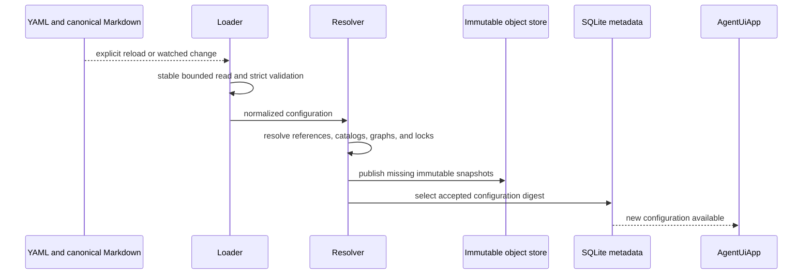

# Configuration and Trusted Catalogs

## Design Position

Agent UI reads one strict `agent-ui.yaml` and its sibling canonical `subagents/*.md` directory. The YAML document owns reusable Models, globally configured Plugins and MCP servers, reusable Agents, Environment profiles, defaults, and local process settings. Markdown supplies portable leaf subagent definitions. Together they form one validated configuration snapshot source.

Agent UI deliberately does not expose the complete Harness Agent, Capability, or Environment Provider object graph. Installed packages contribute trusted catalog entries; package presence alone grants no enablement. Configuration selects only supported keys and credential-free behavior plus explicit local credential sources.

Configuration reload is all-or-nothing. A valid reload publishes a new selectable snapshot set, while existing Sessions retain their pinned snapshots. A failed reload leaves the previous accepted configuration active.

## Source Selection

An explicit `--config <path>` selects the YAML document. Otherwise Agent UI selects its platform user configuration path. It does not search the current directory, walk parent directories, merge profiles, process includes, or discover ambient Claude, Cursor, Codex, YAACLI, or `.agents` subagent directories.

Only immediate non-README `*.md` files under the selected YAML document's sibling `subagents` directory enter live configuration. The loader does not recurse or follow a symlinked directory. Foreign subagent formats enter through the explicit [migration boundary](02-agent-composition-and-snapshots.md#cross-tool-subagent-migration), which writes ordinary canonical Markdown before reload.

A missing default configuration can be created by onboarding. An explicitly selected missing path is an error. File reads are bounded and reject duplicate YAML keys, every YAML anchor or alias, non-finite values, malformed text, and unknown fields.

## Serialized Configuration

The stable serialized shape is intentionally small. The following example is illustrative but uses the normative field names:

```yaml
schema_version: "1"

process:
  storage:
    data_root: ~/.a13n-ui/data
  log_level: INFO
  log_format: pretty

defaults:
  agent: assistant
  environment: native

models:
  primary:
    model: openai:gpt-5
    api_key:
      env: OPENAI_API_KEY
    settings: {}
    model_cfg: {}

plugins:
  memory:
    plugin: vendor.memory
    enabled: true
    configuration: {}

mcp_servers:
  github:
    enabled: true
    transport:
      command: npx
      arguments: ["-y", "@modelcontextprotocol/server-github"]

agents:
  assistant:
    model: primary
    instructions: |
      Work directly and explain material decisions.
    plugins: null
    mcp_servers: null
    subagents:
      - markdown: explorer
      - agent: reviewer

environments:
  native:
    kind: native
  sandbox:
    kind: local_eip

environment_providers: {}
```

Unknown top-level or nested fields fail validation. Empty mappings are valid where shown. Names are bounded stable configuration identities within their namespace; they are not database IDs or security tokens.

`process` contains restart-bound App settings such as the data root, bounded local runtime behavior, shutdown timeout, and logging. It is optional as a whole and has platform-user defaults. Relative paths inside it resolve from the selected YAML file's directory; they are never resolved from the current working directory.

### Models and Credentials

A Model entry selects one Pydantic AI model route plus non-secret settings and model construction configuration:

```python
class ModelConfig(BaseModel):
    model: str
    api_key: ApiKeySource | None = None
    settings: dict[str, JsonValue] = {}
    model_cfg: dict[str, JsonValue] = {}


class ApiKeySource(BaseModel):
    env: str
```

`env` names an environment variable; credential material is not a configuration value. The reference can enter a snapshot, but resolved secret bytes never enter configuration, snapshots, SQLite, immutable objects, model context, diagnostics, or telemetry. A Run resolves current credential material immediately before native Model construction.

Model settings are validated through the selected installed adapter. Unknown or unsupported behavior is rejected rather than forwarded to an arbitrary constructor. Omitting child Model fields means inheritance as defined by [Agent composition](02-agent-composition-and-snapshots.md).

### Plugins and MCP Servers

A configured Plugin entry names one trusted Harness plugin catalog key, normalized configuration, and a global `enabled` flag. An MCP entry contains one supported local command or remote transport definition and its global `enabled` flag. Arbitrary Python import paths, callables, preconstructed clients, and ambient entry points are not configuration values.

Agent selection uses the same three-state rule for Plugins and MCP servers:

| Agent field       | Meaning                                     |
| ----------------- | ------------------------------------------- |
| omitted or `null` | Select every globally enabled entry         |
| empty list        | Select none                                 |
| non-empty list    | Select exactly those globally enabled names |

Selecting an unknown or globally disabled entry is an error. Plugin and MCP order is deterministic. Native objects and clients are fresh process-local values and never enter a resolved snapshot.

### Agents

An Agent entry selects:

- one Model name;
- user `instructions` appended after the package-owned default system prompt;
- Plugin and MCP selections;
- zero or more portable Markdown children or exact reusable Agent references;
- optional default Environment-profile name.

The detailed schema, inheritance, graph validation, and snapshot contract live in [Agent Composition and Snapshots](02-agent-composition-and-snapshots.md).

### Environments and Provider Extensions

An Environment profile chooses how submitted local folders execute:

```python
class EnvironmentProfile(BaseModel):
    kind: Literal["native", "local_eip", "provider"]
    provider: str | None = None
    configuration: dict[str, JsonValue] = {}
```

`native` and `local_eip` are built-in. If neither the Session request, selected Agent, nor `defaults.environment` selects a profile, Agent UI chooses `native`; sandboxing is never implied by omission. `provider` selects one explicitly enabled entry from `environment_providers`; Docker, E2B, and other products use this extension path. A profile contains no workspace path, mount list, current target identity, `EnvironmentState`, credential bytes, or live Provider object.

Provider extension configuration selects a trusted Provider factory and a compatible workspace binder. Installed metadata is availability, not authority. The detailed execution and state contract lives in [Sessions, Environments, and State](04-sessions-environments-and-state.md).

## Accepted Configuration and Snapshot Resolution

Reload follows one coherent path:



One reload captures a stable read of every selected file. If a file changes during the read, the loader retries within a bound. A graph-valid source set becomes one accepted configuration. External multi-file edits have no implicit transaction; an invalid intermediate set leaves the previous configuration active until a later complete set validates.

The accepted configuration retains:

- normalized behavior and source digests;
- exact Agent and Environment-profile snapshots;
- selected trusted adapter, plugin, MCP, Provider, and binder provenance;
- bounded diagnostics and restart-required facts.

It retains no credential value, native runtime object, active Session, workspace folder, Environment state, or Run state.

## Dynamic and Pinned Values

| Value                                                                      | Change effect                                                                         |
| -------------------------------------------------------------------------- | ------------------------------------------------------------------------------------- |
| Agent, Model, Plugin, MCP, Markdown child, or Environment-profile behavior | New snapshots become selectable; existing Sessions remain pinned                      |
| Secret value behind the same source                                        | Later Runs resolve the current value without changing the snapshot                    |
| Newly installed, not-yet-imported trusted catalog entry                    | A later successful reload can select it; active runtime objects are not replaced      |
| Updated package whose Plugin code is already imported                      | Requires a new App process; Agent UI does not reload modules or supervise replacement |
| Data root, listener, logging, or credential backend                        | Applies to a later App lifetime when restart-bound                                    |
| Workspace folders                                                          | Supplied with a message and never participate in configuration reload                 |
| Foreign subagent source files                                              | No effect until an explicit migration writes canonical Markdown and reload succeeds   |

A Session changes Agent or Environment-profile behavior only by an explicit fork that pins new snapshots. Configuration reload never rewrites an active executable or child Thread. Plugin code loaded into one interpreter is immutable for that App lifetime; installing another release does not prove that the new code replaced the object already present in `sys.modules`. Agent UI requires process restart and provides no supervisor, candidate generation, drain, or hot-reload protocol.

## Diagnostics and Failure Semantics

Diagnostics identify the selected file, bounded field location, stable code, and safe explanation. They never include credential values or whole prompt bodies.

| Failure                                                         | Outcome                                                                      |
| --------------------------------------------------------------- | ---------------------------------------------------------------------------- |
| Malformed or unstable source                                    | Candidate rejected; previous accepted configuration remains active           |
| Unknown field or duplicate identity                             | Candidate rejected                                                           |
| Missing Model, child, Plugin, MCP, profile, Provider, or binder | Candidate rejected with reference diagnostics                                |
| Agent cycle or duplicate final child name                       | Candidate rejected before snapshot publication                               |
| Trusted catalog provenance mismatch                             | Candidate rejected; no similarly named fallback is selected                  |
| Secret lookup failure                                           | Current Run fails before model dispatch; configuration remains accepted      |
| Provider runtime unavailability                                 | The selected Run or diagnostic fails; Native is never substituted implicitly |
| Object publication or SQLite selection failure                  | Previous accepted configuration remains selected                             |

## Compatibility

The selected YAML document's `schema_version` governs both its fields and the sibling canonical Markdown field meanings; Markdown does not repeat a version field. Unknown YAML versions fail explicitly. Behavior-affecting changes create new snapshot digests; readers either support an older snapshot codec or reject it. A migration creates inspectable new source content and never changes the meaning of an existing content digest.

## Invariants

1. One YAML document and its canonical sibling Markdown directory own desired Agent UI behavior.
2. Foreign product directories are migration inputs, never live configuration layers.
3. Installed packages grant availability only; configuration must enable and select behavior explicitly.
4. Credentials are resolved fresh and never enter immutable snapshots or Session history.
5. A successful reload is atomic at the accepted-configuration boundary.
6. Existing Sessions remain pinned across reload.
7. Workspace paths are message input, not configuration resources.
8. Imported Plugin code is never hot-replaced inside an App process.
