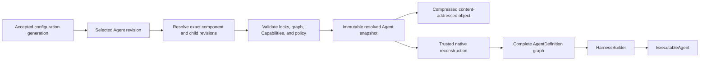

# Agent Composition and Snapshots

## Design Position

An Agent UI Agent is a reloadable local product definition composed from exact Model, Prompt, Plugin instance, Skill, Capability, and child-Agent revisions. Agent UI resolves the complete finite graph into an immutable content-addressed snapshot and reconstructs one process-local Harness `AgentDefinition` graph before a Session can use it.

An Agent definition is not a serialized Harness `AgentDefinition`. It contains no Python class, callable, native Model, Capability instance, Toolset, plugin instance, provider client, credential, Environment adapter, or live Agent. Trusted Agent UI adapters map supported declarative resources to installed code under the accepted configuration generation.

Environment is deliberately outside Agent composition. An Agent declares authored Environment behavior through Capabilities and mount requirements, while a Session selects an independent Environment snapshot. For every independent root or async-child Run, the selected Runner constructs fresh `Environment` adapters from Host-selected current state and supplies them as lightweight Harness mounts. Inline children borrow the active Harness Environment facade.

## Boundaries

| Concern                                                   | Owner                                     | Agent relationship                                                                             |
| --------------------------------------------------------- | ----------------------------------------- | ---------------------------------------------------------------------------------------------- |
| Reloadable Agent source document and component references | Agent UI configuration catalog            | Validates and versions desired composition                                                     |
| Model, Prompt, Plugin, and Skill revision content         | Owning Agent UI resource catalogs         | Referenced exactly during resolution                                                           |
| Native Agent definition and build lifecycle               | Harness                                   | Receives reconstructed native values through its public build contract                         |
| Capability behavior and namespaced state                  | Capability and Harness                    | Agent selects supported declarative forms; state remains in `HarnessState`                     |
| Harness plugin factories and middleware                   | Harness plugin system                     | Agent UI constructs the exact Harness plugin document and trusted Build Context                |
| Child topology and immutable built collection             | Harness subagent contract                 | Snapshot reconstructs complete child definitions and authored edge ceilings                    |
| Model-facing child execution                              | Harness `SubagentCapability`              | Agent UI selects the standard async surface; its Runner-configured operator supplies execution |
| Environment desired state and backing targets             | Agent UI Session and Environment Provider | Independent Session selection; never serialized into Agent composition                         |
| Current Model, Environment, credentials, and Identity     | Fresh Runner bindings                     | Reauthorized for every invocation                                                              |
| Durable hosted definitions and Presets                    | Foundation Service                        | Independent schema and revision authority; no implicit conversion                              |

## Agent Definition Document

The conceptual strict serialized form is:

```python
class AgentDefinitionDocument(BaseModel):
    schema_version: str
    agent_id: str
    display_name: str
    description: str | None
    model: ResourceRef
    prompt: ResourceRef
    plugins: tuple[ResourceRef, ...]
    skills: AgentSkillConfiguration
    capabilities: tuple[FirstPartyCapabilitySelection, ...]
    environment_tools: bool = True
    environment: AgentEnvironmentRequirements
    subagents: tuple[SubagentEdge, ...]
    output: AgentOutputSelection
    model_recovery: ModelRecoverySelection


class AgentSkillConfiguration(BaseModel):
    available: tuple[ResourceRef, ...]
    materialization_mount: str | None
    default_selection: SkillNameSelection


class SkillNameSelection(BaseModel):
    mode: Literal["all", "exact"]
    names: tuple[str, ...] = ()


class SubagentEdge(BaseModel):
    name: str
    description: str
    agent: ResourceRef
    context: DelegationContextPolicy
    identity: SubagentIdentitySelection
    usage_limits: UsageLimits | None
    environment: ChildEnvironmentPolicy


class SubagentIdentitySelection(BaseModel):
    inherit_agent_id: bool = False


class AgentEnvironmentRequirements(BaseModel):
    mounts: tuple[EnvironmentMountRequirement, ...]


class EnvironmentMountRequirement(BaseModel):
    mount_name: str
    required_access: Literal["read_only", "read_write", "full"] | None


class ChildEnvironmentPolicy(BaseModel):
    mode: Literal[
        "none",
        "dedicated",
        "shared_root",
    ]
    mounts: tuple[str, ...] | None
```

`model`, `prompt`, `plugins`, every `skills.available` entry, and child `agent` values reference resources by stable identity in one candidate configuration generation. Resolution replaces every reference with its exact `ResourceRevisionRef`; an immutable resolved snapshot never retains “latest” lookup semantics.

Plugin order is significant. Available Skill revisions form a canonical name-keyed set; source-file ordering is retained for authoring display but does not create different runtime behavior after the same unique final catalog resolves. `default_selection.mode="all"` exposes the complete conflict-resolved available catalog. `mode="exact"` exposes only the unique exact names in `names`; an empty tuple deliberately exposes no Skills. Names select final `SKILL.md` identities rather than resource IDs, source patterns, exclusions, or paths. Resolution rejects an exact name absent from the available imported revisions and rejects ambiguous duplicate final names. `materialization_mount` is absent exactly when `available` is empty; otherwise it names one required desired Environment mount whose FileOperator operations permit the Agent UI materializer to reconcile and scan its reserved subtree.

Immediate child names are unique. A child edge selects one complete child Agent, authored context and usage ceilings, an explicit Identity inheritance policy, and an Environment policy. It does not inherit the parent's tools, Capabilities, plugins, model, Prompt, Skill selection, credentials, or process-local Environment adapters. Child Identity starts from the parent workload `issuer`, `subject`, and immutable claims. `inherit_agent_id=false` replaces the conventional `agent_id` claim with the resolved child Agent's `agent_id`; `true` preserves the parent's claim when present. All other claims, including `user_id`, are preserved. Each invocation still receives fresh child Identity and instance values, and the trusted Host binder remains authoritative over the complete child `RunBindings`.

Subagent authority is selected only by including the curated subagent Capability on an exact Agent node. Agent UI reconstructs that selection as `SubagentCapability(execution="async", operator=...)`; omitting it exposes no child tools even when child definitions exist. Child counts, topology depth, storage location, retention, and Session metadata never enable or disable the Toolset. Ordinary resource limits remain operator policy rather than Agent composition.

`AgentEnvironmentRequirements` declares desired mount names and the minimum user-facing access level required when a Session pairs this Agent with an Environment. `required_access=None` requires only that the mount exist. A node with available Skills requires `read_write` or `full` on its `materialization_mount`; an exact empty exposure still performs full source materialization and validation because Harness exact-name selection occurs after discovery. Agent resolution validates syntax but cannot prove resource availability because Environment selection is independent. Session creation or fork compares the ordered `read_only < read_write < full` levels against the selected Environment's desired mount definitions and model aliases. The Provider can still narrow runtime capabilities, so compatibility never replaces adapter-entry or operation-time validation.

`environment_tools=true` is the default and makes Agent UI reconstruct `DynamicEnvironmentCapability` for the node even when the authored Capability list does not explicitly select it. The resulting model-visible tools are derived at run time from effective mount actions. `environment_tools=false` is the simple opt-out and suppresses that Capability, including an otherwise explicit dynamic-Environment selection; it does not remove the Environment from trusted Agent code or weaken runtime enforcement.

`none` supplies no child Environment and is valid only when the child node has no available Skills or other required Environment mount. `dedicated` asks the Host to create private child associations with authoritative no-state values for the exact async child execution; that execution receives fresh adapters, and the Host explicitly destroys any resulting backing targets after completion. `shared_root` selects the root associations but still constructs fresh adapters for an independent async child, so the child intentionally observes and can mutate the same backing workspace. Inline child execution borrows the already entered parent facade instead of applying either independent-Run construction path. `mounts` selects a subset of the Session Environment's desired mounts or is absent to select all mounts. Unknown names, insufficient operations, or unsupported provider behavior reject the Agent/Environment pairing before execution. Agent UI does not add a durable allocation scheduler or a serialized-root queue.

`AgentOutputSelection` maps through a trusted Agent UI adapter to one native Harness business-output contract. The interactive default is text, but structured first-party output contracts can be selected by schema key and version. Arbitrary Python output classes and import targets are not serialized.

## Composition Formula

One resolved Agent is exactly:

```text
Agent revision
  = Model revision
  + Prompt revision
  + ordered Plugin instance revisions
  + ordered available Skill revisions and exact default exposure
  + curated Capability selections and Environment-tool opt-out
  + Environment requirements
  + complete child Agent revisions and edges
  + output and recovery policy
```

The sources have distinct responsibilities:

- **Model** selects native provider/model behavior and defaults; fresh credentials and native Model resolution remain run-scoped.
- **Prompt** supplies the complete ordered static system prompt.
- **Plugin instances** supply trusted Harness-wide middleware through the Harness-owned plugin contract.
- **Skills** supply inspectable reusable instructions and artifacts through one explicit Harness `SkillManager` composition plus fresh exact-name run selection.
- **Capabilities** own Agent-loop tools, Toolsets, guidance, settings, and hooks; Environment tools are enabled by default and have one node-level opt-out.
- **Environment requirements** declare provider-neutral mount/access needs without selecting backing targets.
- **Child Agents** are complete recursively resolved Agent definitions.

A plugin can contribute Capabilities through the Harness lifecycle, but Agent UI does not add a second plugin hook model. A Skill cannot directly install Python code, a plugin, a provider, or a Capability. A Prompt cannot enable tools by naming them. Every executable code-selection surface is an installed trusted adapter, curated Capability key, Harness plugin factory key, or Environment provider key selected under Host policy.

## Model Reconstruction

The resolved Model revision contributes a logical model ID to `AgentSpec`. Agent UI validates and locks Model adapter provenance. For every root or child Harness Run, the selected runtime Runner receives the exact pinned Agent snapshot, verifies that each requested logical ID belongs to it, and constructs one fresh callable Harness `RunModelResolver`.

Within that invocation scope, the Runner-local adapter:

1. selects the exact pinned Model definition and installed adapter lock;
2. resolves current credential material behind the pinned `credential_ref` through the configured local backend when the Model requires it;
3. constructs the exact native Pydantic AI Model from the pinned provider, model name, endpoint, and non-secret settings;
4. returns the Model only under that Run's fresh authority and closes any client it owns with the Run.

The built-in `a13n.pydantic-ai` adapter requires an explicit model route or the Pydantic AI test model; it never infers an unspecified provider or Model. Missing adapter, credential, endpoint support, or provider package fails before model dispatch. Agent UI never substitutes a fake Model, historic credential, or another provider. The Host neither constructs nor transports native Model collaborators.

The Agent snapshot locks every selected Model adapter by exact key and Agent UI distribution version. Reconstruction verifies every Model lock as well as every Harness plugin lock before building the definition graph; an allowlisted but unregistered string is never treated as an adapter. A Runner-local Model adapter can reuse a documented reentrant native client or Model internally, but that cache is process-local and keyed by non-secret configuration plus credential generation. A Session snapshot never stores the native value or historic secret. Credential rotation behind one reference can affect a later Run without changing Agent behavior content; changing provider, endpoint, model name, settings, or credential reference creates another Model revision.

## Prompt, Skill, and Capability Reconstruction

Prompt resolution produces complete immutable system-prompt content before the Harness build and places its ordered blocks in the Harness `AgentSpec.system_prompt` field. The executable never rereads a mutable Prompt source file. Capability and Toolset instructions remain separate native Pydantic inputs with their own static or dynamic lifecycle.

Each available Skill revision was imported through the public Harness `SkillManager` and Agent UI's Host-owned revision process. Reconstruction verifies its immutable package object, manifest, and digest. For each Agent node, Agent UI constructs one explicit `SkillManager` whose ordered source roots contain only that node's pinned package revisions and whose trusted materializer writes those exact files through the current run Environment's `FileOperator` into a content-addressed Agent UI-owned logical root. The root is unique to the Agent snapshot and node and resolves beneath `materialization_mount`; materialization verifies or replaces that exact managed subtree before scanning, so stale files from another revision cannot enter the catalog. Session compatibility rejects missing or insufficient file operations before provider effects. Passing this manager to `SkillsCapability` replaces the Harness default workspace source; no ambient home, project, package, or sibling directory enters the runtime catalog.

Run preparation uses the Harness dependency boundary directly. `SkillManager.scan_environment()` captures every configured root, opens exact mount-incarnation-pinned `FileOperator` scopes, performs materialization and discovery, validates resolved documents and conflict/catalog bounds, and reselects every configured root before returning a `BoundSkillCatalog`; this scan-time fence includes empty roots and roots whose items lost conflict resolution. `SkillsCapability` then applies the fresh exact-name run selection and uses `BoundSkillCatalog.require_current()` to fence only the selected catalog-bearing logical routes before each model request and before and after each tool execution. A replacement or unmount unrelated to those routes does not invalidate the selected catalog. The Capability also owns `SkillPath` publication, instructions, and access events. The process-local bound catalog is neither persisted nor reused by another logical Run. The manager uses `conflict="error"`, and its catalog bounds are locked in the snapshot. Because Agent UI-managed available revisions must have unique final names, ambiguity fails snapshot resolution rather than being silently hidden by source precedence.

When an Agent node has no available Skills, Agent UI omits `SkillsCapability`; only an empty effective selection is valid. Otherwise, for every root or child Harness Run, Agent UI derives the pinned effective selection and supplies a fresh `SkillSelectionRunCapability(names=frozenset(...))` when the selection is exact. Omitting that run Capability means the complete conflict-resolved available catalog; supplying an empty set means no Skill instructions or paths; an unknown exact name fails preparation before model exposure. The selection is repeated on resumed Runs and is never restored from `HarnessState`. A child derives its own Agent node and Session selection; the parent's allowlist is not inherited.

Skill content is immutable for the executable snapshot. Materialization or selection grants no filesystem operation, credential, plugin, Capability, or package authority. `skills_catalog_resolved` and `skill_accessed` Harness context events remain observations and enter Agent UI's ordinary AG-UI processing path.

`FirstPartyCapabilitySelection` is a discriminated union owned by the Agent UI schema. Each member has an exact key, schema version, and typed configuration. Unknown keys or versions fail resolution. Agent UI adapters construct public Harness/Pydantic Capability values; there is no arbitrary Capability import registry.

The curated catalog includes `a13n.mcp` for URL-based MCP servers:

```python
class MCPSelection(BaseModel):
    key: Literal["a13n.mcp"]
    schema_version: Literal["1"]
    id: str
    url: str
    execution: Literal["auto", "local", "native"] = "auto"
    allowed_tools: tuple[str, ...] | None = None
    description: str | None = None
    defer_loading: bool = False
    context_headers: Mapping[str, MCPContextHeaderSelection]


class MCPContextHeaderSelection(BaseModel):
    source: str
    required: bool = True
```

`context_headers` maps exact outbound header names to Harness selectors. It contains neither callables nor wildcard projections. Agent UI validates and locks this trusted selection, then reconstructs one public Harness `ContextualMCP` with an `MCPContextHeadersConfig`; run binding resolves a fresh upstream MCP value before either local Toolset or provider-native tool construction. `execution="auto"` retains upstream selection, while `local` and `native` select the corresponding upstream execution path. One Agent can select multiple MCP servers; their `id` values are unique within that Agent, while other curated Capability keys remain singleton selections. The URL is explicit persisted configuration: Agent UI requires an HTTP(S) URL but does not guess whether userinfo, query values, parameter names, or fragments carry credentials. Callable factories, preconstructed clients or Toolsets, out-of-band secret resolution, and arbitrary provider extensions remain code-first Host concerns rather than serialized Agent UI values.

The curated catalog also includes the dynamic Environment, Working State, user interaction, document/media/web, Session-read, and Harness subagent behavior supported by the selected Agent UI release. The subagent selection has no Toolset override, maximum-count, depth, task, retention, or storage configuration. Its trusted adapter reconstructs the Harness `SubagentCapability` in async mode with the Runner-configured `SubagentOperator`.

The dynamic Environment selection has no serialized tool-family or process-mode settings. Agent UI reconstructs the standard Harness Capability without a hosted process collaborator. Effective mount actions select file, foreground-shell, and Run-owned background-process tools for each independent Run. Inline children borrow the parent Environment but receive no cross-Run process authority.

The exact child definitions independently select their own Capabilities, so an ordinary async child gains neither Environment nor nested subagent tools unless its resolved node contains those exact Capability selections.

A Capability that requires current collaboration follows the normal two-layer pattern: the definition-selected Capability fixes model-visible behavior, while fresh `RunBindings` supply current Session or repository authority through documented typed collaborators and Environment adapters remain explicit Run inputs. The Runner-generation `AgentUiSubagentOperator` is stable trusted composition for a root async `SubagentCapability`. Agent UI supplies no `HostedProcessRunCapability`; the private default process controller is created by Harness for each Run and is never a snapshot value.

## Plugin Reconstruction

Agent resolution uses the public Harness plugin factory catalog to construct the ordered Plugin instances selected by each resolved Agent node. For every selected Plugin resource, Agent UI supplies its exact `plugin_key`, `plugin_id`, normalized configuration, and Host-owned bounded extensions to `HarnessPluginFactoryCatalog.create_plugin()`, then places the resulting trusted concrete object in that node's `AgentDefinition.plugins` tuple. The ordinary Harness build path owns ordering, Agent binding, run binding, Capability contribution, middleware, result validation, and cleanup.

The resolved snapshot locks:

- plugin resource revision;
- `plugin_key` and `plugin_id`;
- normalized credential-free configuration;
- selected distribution name/version and factory provenance;
- Harness plugin factory/configuration contract version.

At reconstruction, Agent UI verifies current policy and provenance and builds a fresh immutable factory catalog containing only the selected keys. An unavailable or changed locked plugin fails explicitly; it is never replaced with the latest similarly named factory. Root and child Agents can select different Plugin resources because concrete direct Plugin tuples belong to their complete definitions. One recursive `HarnessBuilder` still constructs the finite graph; Agent UI never mutates the builder or an executable after construction.

Agent UI does not use ambient Harness plugin files or environment switches for product Agent composition. A process-wide operator Plugin document, when explicitly supported by process settings, remains a separate builder-wide layer governed by the Harness configuration contract and participates in the executable digest; it cannot replace per-Agent Plugin resources or be changed in an active executable.

## Resolution and Snapshot



Resolution occurs before Session creation, explicit fork, or validation preview. It:

1. captures one accepted configuration generation;
2. resolves the root Agent and every Model, Prompt, Plugin, Skill, Capability, output, and child reference;
3. expands the finite child graph and rejects missing revisions, duplicate immediate-child names, and cycles;
4. validates Capability combinations, Environment requirements, exact Skill names, subagent execution selection, and child edge ceilings;
5. verifies selected adapter and package provenance under current policy;
6. canonicalizes all behavior-affecting content and dependency locks;
7. computes a logical Agent digest;
8. publishes the immutable resolved snapshot before a Session can reference it.

The conceptual snapshot is:

```python
class ResolvedAgentSnapshot(BaseModel):
    snapshot_schema_version: str
    root_agent: ResourceRevisionRef
    logical_agent_digest: str
    resolved_agents: tuple[ResolvedAgentNode, ...]
    models: tuple[ResolvedModelRevision, ...]
    prompts: tuple[ResolvedPromptRevision, ...]
    plugins: tuple[ResolvedPluginRevision, ...]
    skills: tuple[ResolvedSkillRevision, ...]
    skill_packages: tuple[SkillPackageObjectRef, ...]
    skill_selections: tuple[ResolvedAgentSkillSelection, ...]
    capability_schemas: tuple[CapabilitySchemaLock, ...]
    adapter_locks: tuple[DependencyLock, ...]
    harness_release: str
```

The snapshot contains every authority-neutral value needed to repeat trusted reconstruction. It contains no Host-resolved credential, native Model, Environment specification or current state, plugin object, live Skill materialization, repository, task, client, or run Capability. Literal authored content, including an MCP URL, is persisted as supplied and is not classified by Agent UI as secret or non-secret.

## Session Pinning and Executable Lifetime

A Session pins one exact resolved Agent snapshot identity and digest. A dynamic configuration reload can publish another Agent revision and executable, but it does not alter the Session. Applying another Agent composition to existing history requires an explicit [Session fork](04-sessions-environments-and-state.md#forking).

An Agent graph with no managed Skills produces an `ExecutableAgent` that corresponds only to the resolved Agent snapshot and complete child graph. Agent UI caches it by logical Agent digest, Harness release, locked adapter provenance, and activated restart-bound process configuration. Supplying an Environment for compatibility validation does not create another executable identity when no definition-time component depends on that Environment.

A graph with managed Skills produces an executable for one validated immutable Agent/Environment snapshot pair. Agent UI's authored `materialization_mount` selects one desired Environment mount whose resolved `model_alias` is embedded in each explicit `FileSkillSource` root at definition reconstruction, while the current mount incarnation, `FileOperator`, and entered Environment adapter remain fresh Run values. The pair cache key therefore includes both logical digests. This pairing is an Agent UI authoring and materialization-path contract, not a Harness-wide requirement that all definitions select an Environment at build time. A cache entry contains no Session state, credential, Environment adapter, Provider runtime collaborator, or run authority.

Changing any behavior-affecting component creates another logical digest and executable. Changing the Environment digest creates another managed-Skill executable pair, even if the selected alias remains textually equal, so reconstruction never reuses a definition across an unvalidated pair. Agent UI never hot-toggles the system prompt, instructions, plugins, available Skills, default Skill exposure, Capabilities, output, recovery policy, subagent execution mode, or child edges inside an active executable. A Session can pin an exact root/child Skill exposure override at creation or fork, but changing that pinned override also requires a fork. Closing the last cache reference closes the complete built child and plugin graph through the ordinary Harness ownership order.

Run-time values vary only through contracts designed for fresh input: Identity and its explicitly selected MCP header projection, current model resolver, credentials, exact Skill selection, fresh Environment adapters selected from current Host state, policy narrowing, and Session-read collaboration. The stable Runner-owned subagent operator receives fresh child plans and opens independent child scopes; it is reconstructed composition rather than a run binding or snapshot value. Harness creates the default shell process controller inside each Run. Fresh `RunBindings` realize the Session-pinned effective Skill selection and can apply current policy narrowing, but they cannot add a Capability, plugin, available Skill, output type, child edge, or Toolset absent from the snapshot or select a Skill outside that Session policy.

## Child Definitions and Async-Only Presentation

Every child edge resolves to one complete [Harness `SubagentDefinition`](../agent-harness/11-delegation-and-subagents.md#child-definitions-and-built-collection). The child owns its Model, Prompt, Plugins, available Skills and default exposure, output, Capabilities, recovery policy, nested children, and Environment requirement. One recursive Harness build produces the immutable `SubagentCollection` of exact `BuiltSubagent` values.

A `self` authoring convenience can be exposed by the configuration editor, but resolution expands it to a finite complete child revision and narrows recursive child topology before snapshot publication. Runtime cloning of the parent Agent, context, credentials, Skill selection, or authority is not supported.

Agent UI's curated subagent selection reconstructs its Runner-local async-subagent Capability. The Capability exposes the fixed six-tool surface `delegate`, `subagent_info`, `wait_subagent`, `steer_subagent`, `cancel_subagent`, and `resume_subagent`. Omitting the selection retains the built collection for trusted composition but exposes no model-facing child operation.

The Runner supplies one in-memory `AgentUiSubagentOperator` for the generation. Root async reconstruction receives that operator; nested reconstruction uses inline subagents. The operator opens a fresh authority scope for each admitted child. Parent continuation history can retain execution references returned to the model, but it never embeds child `HarnessState`, live activity, tasks, Environment adapters, or storage authority. Child completion can wake an inactive Session only while the source generation remains active. Process references returned by the standard shell are valid only inside their source Harness Run and are not continuation state.

Nested authority follows exact composition recursively. An ordinary async child receives one fresh authority scope for its resolved definition and has no Environment or nested subagent tools unless that exact child node includes the corresponding Capabilities. Authority is reconstructed from the exact child definition rather than inherited from the parent.

## Configuration Reload

A newly accepted configuration generation can add, remove, or change source definitions. Resolution caches are generation-aware, while immutable snapshot and executable caches are digest-aware:

- an unchanged Agent digest can reuse an Agent-only executable when the graph has no managed Skills;
- unchanged Agent and Environment digests can reuse a managed-Skill pair executable;
- a changed required digest creates another snapshot or pair executable;
- removed current source content does not delete a snapshot pinned by a retained Session;
- an active Run and operator-owned async child executions retain the snapshot with which they started;
- package refresh can make a new adapter available but cannot unload or replace code already captured by an executable.

Validation preview can resolve and build a candidate Agent without creating a Session, but it uses ordinary reconstruction and cleanup rather than a second approximate validator.

## Failure Semantics

| Failure                                                                             | Outcome                                                                                                  |
| ----------------------------------------------------------------------------------- | -------------------------------------------------------------------------------------------------------- |
| Missing or wrong-kind component reference                                           | Candidate generation or explicit resolution fails; no latest substitution                                |
| Child graph cycle or duplicate immediate name                                       | Resolution fails before snapshot publication                                                             |
| Invalid Capability combination or output selection                                  | Resolution fails before Harness build                                                                    |
| Unavailable locked plugin, model adapter, Skill package codec, or Capability schema | Reconstruction fails explicitly; retained snapshot remains unchanged                                     |
| Exact Skill selection names an unavailable or ambiguous name                        | Resolution or run preparation fails before model exposure                                                |
| Current Host policy denies locked composition                                       | Executable creation denied; snapshot is not rewritten                                                    |
| Plugin or Capability build failure                                                  | Harness build fails and closes already acquired resources                                                |
| Credential missing during a Run                                                     | Model resolution or affected operation fails; Agent snapshot remains valid                               |
| Environment requirement unsatisfied                                                 | Session creation or Run mount preparation fails before Harness dispatch, according to requirement timing |
| Configuration changes during resolution                                             | Resolver finishes against its captured generation or restarts; it never mixes generations                |
| Configuration changes during an active Session                                      | Existing Session and executable continue with pinned snapshot                                            |

## Compatibility

Agent source schema, component resource schemas, snapshot schema, normalization rules, adapter lock format, Harness release, Plugin document version, Capability schemas, Skill contract, and `HarnessState` versions evolve independently. A migration creates a new revision or a verifiably equivalent normalized representation; it never changes content addressed by an existing digest.

A Session can continue only when Agent UI can decode its snapshot, verify its locks, reconstruct the exact logical Agent definition, and import its `HarnessState` under the owning Harness contracts. Name similarity and readable message history cannot authorize substitution of another child, Plugin, Capability, or state codec.

## Trade-offs

### Explicit component resources

Separate Model, Prompt, Plugin, and Skill resources allow reuse, independent validation, UI management, and agent-readable configuration. Resolution must maintain exact cross-resource revisions, but Agent behavior is reviewable without serializing native Python objects.

### Immutable snapshots and live catalogs

Snapshots keep Session continuation deterministic while the file-backed catalog reloads dynamically. Applying new behavior to old history requires an explicit fork rather than implicit mutation.

### Complete child Agents

Complete children repeat some authoring values but match the Harness graph and keep every behavior and authority edge explicit. Authoring conveniences disappear during resolution rather than becoming runtime inheritance.

## Invariants

01. Agent composition is the exact combination of pinned Model, Prompt, Plugin, available Skill, default Skill exposure, Capability, output, and child-Agent revisions.
02. Environment desired state and backing targets remain outside Agent composition and are selected by a Session.
03. Every Session pins one immutable resolved Agent snapshot and logical digest.
04. Dynamic reload, Plugin toggles, and Prompt/Skill edits never mutate an active executable or existing Session.
05. Every child edge resolves to one complete finite child definition; no separate subagent builder or runtime inheritance plane exists.
06. Agent UI selects the Harness `SubagentCapability` in async mode and never replaces its standard Toolset; omitting that Capability exposes no subagent tools.
07. Every root and child Run receives a fresh exact-name Skill selection derived independently from its pinned Agent node and Session policy.
08. Curated Capability keys, trusted model adapters, enabled Harness plugin keys, and selected Environment providers are the only declarative code-selection surfaces; arbitrary imports are rejected.
09. Snapshots restore no Identity, credential, Environment, provider client, repository, scheduler, plugin object, or execution authority.
10. Every independent root or async-child invocation receives a fresh model resolver, fresh Environment adapters selected from Host state, and fresh policy and Skill selection; inline children borrow the entered facade, and stable operators create any independently managed child or process authority.
11. Applying another Agent composition or pinned Session Skill exposure to existing history requires an explicit Session fork.
12. Reconstruction uses the public Harness build contract and never implements a second Agent loop.
