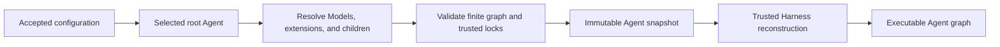

# Agent Composition and Snapshots

## Design Position

An Agent UI Agent is a compact local definition that resolves to a complete finite Harness Agent graph. Agent UI supplies the package-owned default system prompt, appends authored instructions, resolves one Model, selects trusted Plugin and MCP entries, installs the fixed product tool families, and resolves each subagent edge.

The serialized definition is not a Harness `AgentDefinition`. It contains no Python class, native Model, callable, Capability instance, Toolset, Plugin object, MCP client, Environment adapter, credential value, or task. Trusted Agent UI adapters reconstruct those values through public Harness contracts.

Environment behavior is independent from Agent behavior. An Agent can select a default Environment profile, while a Session pins the selected profile and each message supplies its own local folders. Workspace paths never enter the Agent snapshot.

## Agent Definition

The conceptual YAML shape is:

```python
class AgentConfig(BaseModel):
    model: str
    instructions: str = ""
    plugins: tuple[str, ...] | None = None
    mcp_servers: tuple[str, ...] | None = None
    subagents: tuple[SubagentSelection, ...] = ()
    environment: str | None = None


class MarkdownSubagentSelection(BaseModel):
    markdown: str


class AgentSubagentSelection(BaseModel):
    agent: str
```

`plugins` and `mcp_servers` follow the globally enabled selection semantics in [Configuration and Trusted Catalogs](01-configuration-and-resource-catalog.md#plugins-and-mcp-servers). The remaining product tool families are fixed by the Agent UI release:

- web search and web crawl;
- PDF and Office conversion;
- file and shell operations derived from the current Environment;
- async subagent tools when the resolved node has children;
- root-only Agent UI Session tools.

The configuration does not expose arbitrary enable/disable lists for these families. Environment-derived tools appear only when the current entered adapters support the required operations. Session tools appear only on the root invocation. A child cannot obtain them through inheritance or a Markdown tool name.

The effective root prompt is the package-owned default system prompt followed by the Agent's authored `instructions` as a separate ordered block. An empty authored block is valid. Package prompt changes are behavior changes and therefore affect the resolved snapshot digest.

## Subagent Selection

Agent UI supports two child forms.

### Portable Markdown Child

A canonical sibling `subagents/<name>.md` is a leaf definition derived from the parent. It uses YAML frontmatter and an optional Markdown body:

```markdown
---
name: explorer
description: Inspect an unfamiliar codebase.
instruction: Use this child for focused repository exploration.
model: inherit
model_settings: null
model_cfg: null
tools: [search, files]
optional_tools: [shell]
---

Inspect the relevant code and report evidence with file paths.
```

The canonical fields are:

| Field            | Meaning                                                                                                         |
| ---------------- | --------------------------------------------------------------------------------------------------------------- |
| `name`           | Required child identity, unique in the resolved parent's immediate roster                                       |
| `description`    | Required bounded model-facing child description                                                                 |
| `instruction`    | Optional parent-facing routing guidance; not part of the child system prompt                                    |
| Markdown body    | Optional child-specific instruction block appended after inherited instructions; blank means no prompt override |
| `model`          | Optional Model override; omitted, `null`, or `inherit` retains the parent Model                                 |
| `model_settings` | Optional replacement/override for the inherited Model settings                                                  |
| `model_cfg`      | Optional replacement/override for inherited Model construction configuration                                    |
| `tools`          | Optional exact narrowing of the Host-owned portable child tool template                                         |
| `optional_tools` | Optional names added only when available in that template                                                       |

Unknown fields fail canonical loading. Scalar comma-separated and YAML sequence tool forms normalize to ordered unique names. `tools` and `optional_tools` cannot select root Session tools, arbitrary Plugin/MCP tools, unavailable Environment operations, or any tool outside the Host-owned child template.

Omitted fields inherit the parent across three independent axes: Model configuration, effective instructions, and tool selection. A blank body leaves inherited instructions unchanged; a non-blank body appends to them rather than replacing the package-owned prompt. A Markdown child is a leaf and does not discover another nested subagent directory.

### Reusable Agent Reference

An `agent` selection references another complete named Agent. The child keeps that Agent's Model, instructions, Plugin/MCP selection, and nested subagent topology. It does not inherit the parent Agent's three axes. The referenced Agent's Environment-profile default applies only when creating a root Session from that Agent; it grants no child runtime authority. Every child segment uses the Environment profile pinned by its parent segment. Exact graph resolution rejects cycles and duplicate immediate child names.

Every resolved roster uses the standard Harness async subagent surface backed by the App-owned `AgentUiSubagentOperator`. Agent UI exposes no foreground/background execution-mode choice. A child can itself contain a roster through a reusable Agent reference, and the same operator persists those descendants as child Threads.

## Child Deferred Interaction

Agent UI child Threads do not expose deferred tools or human approval to a user. If a child Run suspends with native deferred requests, the operator supplies a complete bounded denial or no-response batch and continues the same child Thread through normal Harness continuation semantics. The continuation remains inside the already accepted execution segment. It receives a fresh child `run_id` and observer but no new public execution ID or segment index; only explicit `resume_subagent` creates the next linked segment. It never suspends the parent Session for user feedback.

If the Harness cannot continue safely from the supplied denial, the child execution fails explicitly. Agent UI never fabricates successful tool results or grants approval by default.

## Cross-tool Subagent Migration

### Boundary

Claude/Cursor Markdown and Codex TOML are import formats, not live runtime configuration. One explicit App operation detects, parses, normalizes, previews, and optionally writes canonical Agent UI Markdown. It never modifies source files, adds source directories to configuration, or creates a synchronization relationship.

The supported conventional sources are:

| Adapter | User scope                                                                           | Explicit workspace scope                                                             |
| ------- | ------------------------------------------------------------------------------------ | ------------------------------------------------------------------------------------ |
| Claude  | `~/.claude/agents/*.md`                                                              | `<workspace>/.claude/agents/*.md`                                                    |
| Cursor  | `~/.cursor/agents/*.md`                                                              | `<workspace>/.cursor/agents/*.md`                                                    |
| Codex   | `${CODEX_HOME:-~/.codex}/agents/**/*.toml` plus user `config.toml` role declarations | `<workspace>/.codex/agents/**/*.toml` plus workspace `config.toml` role declarations |

Claude and Cursor use immediate non-README Markdown files. Codex resolution follows its user-then-workspace configuration layers, explicit `[agents.<name>]` declarations, relative `config_file` references, recursive sorted TOML discovery, referenced-file deduplication, file metadata precedence, and higher-layer field overrides with omitted fields inherited from the lower-layer effective role. Agent UI migrates each resulting effective role, not each TOML file independently.

The operation scans only selected adapters and scopes. It does not walk parent directories or treat `.agents/subagents` as a standard source.

### Normalization

Every adapter produces one bounded candidate containing source paths, final name, description, instructions, optional Model values, optional tool narrowing, and diagnostics. Source paths and diagnostics belong to the migration report and are not written into runtime frontmatter.

Common Markdown `name`, `description`, optional `instruction`, non-blank body, Model fields, and tool allowlists map when valid under the canonical schema. Codex effective `developer_instructions` becomes the body. Model routes and reasoning settings migrate only through an explicit target Model mapping that the Agent UI Model adapter validates.

Foreign authority never widens Agent UI behavior:

- Claude/Cursor `permissionMode`, Codex approval/sandbox/writable-root settings, and other permission fields are reported but not applied;
- `disallowedTools` narrows an explicit complete allowlist only when exact subtraction is possible;
- Skills, hooks, MCP/provider settings, nicknames, and product-specific fields are reported as unsupported unless an exact canonical mapping exists;
- malformed, missing, blank, or authority-ambiguous input produces an item diagnostic rather than a partially trusted child.

Migration does not rewrite product names inside descriptions or instructions because those names can identify real tools or workflows.

### Preview, Conflicts, and Application

The App returns one report for both preview and apply. Each item is `created`, `unchanged`, `deduplicated`, `conflict`, `invalid`, or `skipped` with stable diagnostics.

Canonical rendering uses deterministic frontmatter order, normalized list forms, LF newlines, trimmed body boundaries, and one final newline. The target filename is a safe deterministic slug of the final frontmatter name. Final names, not filenames, define runtime identity.

Migration never overwrites or silently renames content:

- semantically identical candidates with the same final name deduplicate;
- different candidates with the same final name conflict;
- an existing semantically identical target is unchanged;
- an existing different target remains untouched and conflicts;
- apply revalidates previewed source and target facts before each write;
- each valid file is staged and committed with a no-clobber operation;
- a late filesystem error returns an explicit partial result, and rerunning safely completes remaining items.

This makes migration idempotent without a migration manifest or database record. Newly written Markdown affects only a later successful configuration reload and newly created or explicitly forked Session snapshots.

## Resolution and Snapshot



Resolution:

1. captures one accepted configuration;
2. resolves the root Model, instructions, selected Plugins and MCP servers;
3. resolves every Markdown-derived child and reusable Agent reference;
4. rejects missing names, duplicate immediate children, graph cycles, and invalid tool narrowing;
5. locks behavior-affecting package prompt and trusted adapter/catalog provenance;
6. canonicalizes the complete finite graph and computes its digest;
7. publishes the immutable snapshot before a Session references it.

The conceptual snapshot contains normalized Agent nodes, Model definitions, selected extension configuration, child edges, package prompt version, trusted dependency locks, and the selected Harness release. It contains no credential value, native Model, Plugin/MCP object, Environment profile or adapter, workspace path, `HarnessState`, child checkpoint, or Session authority.

At invocation, Agent UI reconstructs the complete native graph, creates fresh Model/Plugin/MCP collaborators, and supplies the stable App-owned subagent operator. The executable can be cached by exact snapshot digest and compatible trusted runtime provenance, but the cache grants no Session or Run authority.

## Session Pinning

A Session pins one Agent snapshot. Configuration reload or migration output does not alter it. Applying another Agent graph to retained history requires a Session fork that creates a new root Thread and pins the newly selected snapshot.

Child Threads also retain the exact child definition digest used at admission. `resume_subagent` verifies compatibility with that digest before starting another segment. It never retargets a retained execution reference to a similarly named latest child.

## Invariants

01. Agent UI configuration normalizes to a complete finite Harness Agent graph.
02. The package-owned prompt precedes authored instructions.
03. Plugin and MCP selection is explicit within globally enabled catalogs.
04. Fixed product tool families are not arbitrary per-Agent Capability serialization.
05. Markdown children inherit only the documented Model, instruction, and tool axes.
06. Named-Agent children keep their complete independent definitions and nested topology.
07. Every roster uses the App-owned async operator; no execution mode is serialized.
08. Foreign formats become canonical Markdown only through explicit, diagnostic, no-clobber migration.
09. Snapshots contain behavior and provenance, never secrets or runtime authority.
10. Existing Sessions and child Threads remain pinned when sources change.
