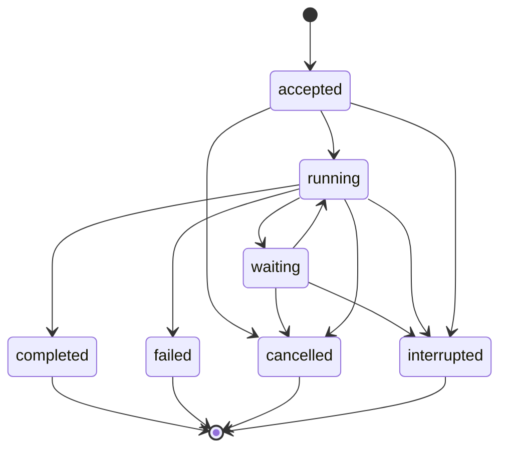

# Local Sessions and State

## Design Position

An Agent UI Session is the local Host authority for one interaction tree. It pins one resolved Agent profile snapshot, owns one root Thread, groups child Threads, stores Host Turn records, selects the latest complete root checkpoint, retains bounded AG-UI display replay, and associates process-local background job records with the Session. It supports local restart and presentation reconnect without turning UI data into Agent continuation state.

The shared [`Session`, `Thread`, `Turn`, and `Item` model](../interaction-model.md) owns those public concepts. A Session is neither a Pydantic provider session nor a Foundation `Execution`. Its persistence is designed for one local user, one machine-visible store, and one writer per advancing Thread. Foundation lifecycle, worker failover, multi-tenant authorization, and durable distributed child execution are outside this contract.

## Boundaries

| Concern                              | Owner                                    | Session relationship                                                                              |
| ------------------------------------ | ---------------------------------------- | ------------------------------------------------------------------------------------------------- |
| Thread and Capability continuation   | Harness `HarnessState`                   | Stores complete selected values without interpreting private namespaces                           |
| Profile composition                  | Resolved Agent UI snapshot               | Pins exact snapshot identity and digest                                                           |
| Local Turn acceptance and checkpoint | Agent UI session store                   | Serializes one Thread and atomically selects complete state                                       |
| Display replay                       | Agent Stream Protocol plus Agent UI Host | Retains bounded projection envelopes; never reconstructs `HarnessState`                           |
| Active model/tool work               | Harness run                              | Process-local and not made durable by a `running` turn record                                     |
| Background child execution           | Agent UI job monitor                     | Persists bounded metadata and terminal output; live task remains process-local                    |
| Model-facing session browsing        | Read-only Session Capability             | Uses a fresh current-session attachment and returns bounded safe projections                      |
| Filesystem atomicity and locking     | Agent UI store implementation            | Provides cross-process exclusion, atomic replacement, durability policy, and corruption detection |

## Session Record

The following Python-like schema is a conceptual serialized local contract:

```python
class LocalSession(BaseModel):
    schema_version: str
    session_id: str
    root_thread_id: str
    revision: int
    created_at: datetime
    updated_at: datetime
    profile_snapshot: ResolvedProfileSnapshot
    profile_digest: str
    parent_fork: SessionForkRef | None
    selected_checkpoint: CheckpointRef | None
    turns: tuple[TurnRecord, ...]
    items: tuple[ProjectedItem, ...]
    jobs: tuple[BackgroundJobRecord, ...]
    replay: PresentationReplayIndex


class CheckpointRecord(BaseModel):
    checkpoint_id: str
    thread_id: str
    turn_id: str | None
    harness_state: HarnessState
    state_digest: str
    committed_at: datetime


class TurnRecord(BaseModel):
    turn_id: str
    thread_id: str
    input: StoredRunInput
    state: Literal[
        "accepted",
        "running",
        "waiting",
        "completed",
        "failed",
        "cancelled",
        "interrupted",
    ]
    waiting_reason: Literal[
        "deferred_tool",
        "approval",
        "external_input",
    ] | None
    base_checkpoint_id: str | None
    run_ids: tuple[str, ...]
    result_projection: JsonValue | None
    failure: SafeFailure | None
    checkpoint_id: str | None
    accepted_at: datetime
    finished_at: datetime | None
```

`session_id`, `root_thread_id`, Turn IDs, Item IDs, checkpoint IDs, Run IDs, and job references are compact identifiers and grant no authority. When a root checkpoint is selected, `root_thread_id` equals its `HarnessState.thread_id`; every checkpoint must satisfy `checkpoint.thread_id == checkpoint.harness_state.thread_id`. Every retained [`ProjectedItem`](../agent-stream-protocol/00-overview.md#item-materialization-and-identity) references an existing Turn in the Session and uses that Turn's `thread_id`; its `item_id` remains stable across status updates and retained replay. Stored input, Item values, and result projections are bounded and pass the Host's local content policy. Secret credentials, live clients, current bindings, native plugin objects, task objects, locks, and open streams are never serialized.

Each revision selects at most one checkpoint. A completed turn references the complete checkpoint produced by its terminal Harness result. A failed Harness result may select a complete returned state only when the Harness contract supplies one and Host policy explicitly chooses it; otherwise the previous checkpoint remains selected. Cancelled and interrupted records never synthesize a newer state from partial messages, AG-UI events, or provider history.

## Store Layout and Atomicity

The store owns a versioned root namespace, immutable or content-addressed profile snapshots, per-session metadata, checkpoint blobs, AG-UI replay segments, and bounded background job records. Exact filenames and serialization codecs are implementation details, but these observable guarantees hold:

- a write is staged and validated before atomic publication;
- a metadata revision never points at a missing checkpoint or profile snapshot;
- every checkpoint and replay segment carries a digest or equivalent corruption check;
- replacing the selected checkpoint and completing its turn is one logical atomic commit;
- old complete checkpoints remain available until retention safely removes every reference;
- a single-writer lock protects one advancing Thread across local processes;
- readers either observe the prior complete revision or the next complete revision, never a half-written mixture.

The implementation flushes and synchronizes according to its declared local durability profile. Atomic rename alone does not claim resilience against storage-device failure. A failed publication leaves recoverable staged data unselected and cleanup-safe.

The store does not depend on terminal path conventions for authority. It canonicalizes configured roots, rejects traversal and malformed identifiers, and does not follow an untrusted session value to another arbitrary filesystem path. This is required to preserve the selected local store boundary, not a general sandbox claim.

## Turn Lifecycle



One application-service command creates the accepted record only after validating Session identity, target `thread_id`, expected revision, profile availability, input limits, and absence of another advancing Turn for that Thread. It can then start a Harness Run from the selected checkpoint with fresh bindings. `running` records an observation that the process entered a Run; it is not durable ownership of work and does not make that work restartable. `waiting` records that the same Turn awaits deferred tool results, approval, or external input. `waiting_reason` is present exactly in that state. Resumption appends a fresh `run_id` to the same Turn; `run_ids` are non-authoritative correlation and Run identity never replaces Turn identity.

At terminal Harness delivery, Agent UI validates the result and complete state, writes any checkpoint and replay material, and atomically completes the turn plus advances the session revision. If commit fails after model or tool work, the turn outcome remains unknown from the selected session revision. Recovery preserves the last committed checkpoint and marks the uncommitted turn interrupted or records a reconciliation diagnostic; it never reruns automatically and never infers rollback of external effects.

A user can explicitly submit a later turn from the last complete checkpoint after reviewing interruption evidence. The Host supplies that interruption as bounded reconciliation context when necessary. Repeating user intent is a new turn identity, not idempotent continuation of an unknown prior effect.

## Concurrency and Forking

A Thread has at most one foreground Turn in `accepted`, `running`, or `waiting`. The application service holds an in-process guard and the store verifies the expected revision under its cross-process lock before starting. Two stale callers cannot both advance one checkpoint. Another local process encountering an owned live lock reports a conflict rather than stealing it.

Independent Threads can execute concurrently. A Session fork creates a new Session and root Thread from the source's empty baseline or one complete source checkpoint. It creates a fresh `HarnessState` for an empty source and applies `HarnessState.fork()` when a checkpoint exists:

```python
class SessionForkRef(BaseModel):
    source_session_id: str
    source_revision: int
    source_checkpoint_id: str | None
    source_profile_digest: str
```

The fork can retain the source profile snapshot or select another already resolved snapshot. The source remains unchanged. Selecting another profile records both digests and requires explicit compatibility validation or a Host-approved history-only seed; private Capability state is never passed to an incompatible definition merely because message history is readable. The new Session records the source reference, receives a new `session_id` and `root_thread_id`, and gets independent future checkpoints, replay, jobs, and active-Run guards. The source remains selected by its original Session and Thread.

## Presentation Replay

The session retains [ordered `ProjectedEvent` envelopes](../agent-stream-protocol/00-overview.md#projection-context-and-envelope) in bounded segments, the latest bounded value for each retained semantic Item, and complete Host-approved message or state snapshots needed to resynchronize a renderer. Each segment records the AG-UI protocol profile, sequence range, event identities, Item identities where present, and retention generation. Compaction can replace Item deltas with a complete Item projection but preserves `item_id`.

Replay is a display projection. It can reconstruct visible text, tool observations, child activity, and terminal status but cannot:

- replace the selected checkpoint;
- satisfy a pending tool call or approval;
- restore Capability state or Environment state;
- prove that a missing transient delta never occurred;
- grant access to another session or child;
- restart a run.

Retention may compact token deltas into complete semantic messages and remove old transient activity after a snapshot. It preserves explicit gap metadata so a client never interprets compacted detail as a full byte-for-byte execution log.

## Read-Only Session Capability

Agent UI offers an optional definition-selected Session Capability for model-assisted browsing of the current session. It is read-only and receives one fresh `SessionReadRunCapability` bound to the exact current Session, root Thread, expected revision, content policy, and repository collaborator.

Its first-party tools provide bounded variants of:

- `list_session_items` for current-session retained semantic Item summaries, each with its canonical `item_id`;
- `search_session` over indexed current-session user-visible Item content, returning canonical Item IDs;
- `read_session_item` for one exact current-session `item_id`.

The model never supplies a filesystem path or another session ID. `read_session_item` resolves only an ID present in the current Session's retained Item index; Turn IDs, event IDs, replay cursors, provider IDs, and job IDs are not accepted as substitutes. Results are safe projections and exclude private Capability state, raw `HarnessState`, credentials, hidden model/provider frames, plugin data, internal receipts, and unapproved child detail. Search ranking is an observation and does not reorder checkpoints.

The Capability cannot create, select, switch, rename, fork, delete, compact, or export a session; change its profile; select a checkpoint; modify messages; submit input; control a run or child; rewrite a plugin; or mutate retention. Those remain explicit user/Host application commands. A missing or stale fresh attachment fails before a repository read.

## Background Job Records

A session can retain bounded job metadata and terminal safe results so later turns and surfaces can reconcile process-local child work. [Runtime Subagents and Surfaces](03-runtime-subagents-and-surfaces.md#background-job-lifecycle) owns the job lifecycle and routing contract.

The session record never treats `accepted` or `running` as durable work ownership. On process recovery, any such job from a previous process generation becomes interrupted unless its terminal result was already atomically retained. A new process does not recreate it from a task description or retained child state automatically.

## Recovery

At open, the store validates schema versions, profile and checkpoint references, digests, session revision monotonicity, turn transitions, replay sequence, job records, and lock ownership. Recoverable unselected staging files can be removed or quarantined. A selected missing or corrupt profile snapshot or checkpoint fails the session closed; display replay is not used as fallback continuation.

An abandoned process lock is reclaimed only after platform-appropriate ownership checks establish that its process generation is no longer live. Reclaiming the local writer lock grants permission to inspect and mark interrupted Host records; it does not prove prior model, tool, Environment, or provider work stopped cleanly.

## Retention and Deletion

Retention is configured at the local Host boundary and applied under the session lock. It can remove unreferenced checkpoints, compact replay segments, and expire terminal background detail while preserving the selected checkpoint, pinned profile snapshot, fork references required by retained children, and integrity of current indexes.

Deletion is an explicit user/Host operation outside the model-facing Session Capability. It conflicts with active foreground or background work and follows the store's declared deletion semantics. Removing local records does not roll back model-provider, tool, Environment, or external side effects.

## Failure Semantics

| Failure                                      | Outcome                                                                                       |
| -------------------------------------------- | --------------------------------------------------------------------------------------------- |
| Stale expected revision                      | Conflict before Harness dispatch                                                              |
| Live writer in another process               | Busy conflict; no second advancing turn starts                                                |
| Missing or incompatible profile snapshot     | Session cannot start a run                                                                    |
| Corrupt selected checkpoint                  | Session fails closed; replay is not promoted to state                                         |
| Process loss during model or tool work       | Last selected checkpoint remains; active turn and jobs become interrupted                     |
| Checkpoint publication failure after work    | Prior checkpoint remains selected; effects are unknown and require user/Host reconciliation   |
| Replay corruption with valid checkpoint      | Execution continuation can remain available; affected display range is an explicit replay gap |
| Session read attachment stale or mismatched  | Capability operation fails before content read                                                |
| Retention or deletion races with active work | Operation conflicts and changes nothing                                                       |

## Compatibility

Session schema, profile snapshot schema, `HarnessState` version, AG-UI profile, checkpoint codec, job record schema, and search index codec evolve independently. A migration writes and validates a new complete revision before selection. It never rewrites an existing content digest in place.

A newer Agent UI can open a session only when it can validate the session schema, reconstruct the pinned profile snapshot, import the selected Harness state through its owning codecs, and support or explicitly gap the retained presentation profile. Inability to render old AG-UI data does not permit discarding a valid checkpoint; inability to import the checkpoint does not permit continuing from rendered messages.

## Trade-offs

### Complete checkpoint selection vs. partial turn recovery

Selecting only complete Harness state avoids inventing a Pydantic partial tool-batch protocol. A process crash can lose completed but uncommitted local work and requires explicit reconciliation rather than automatic replay.

### Single writer vs. concurrent turns

Serializing one Thread gives deterministic checkpoint selection and avoids state merging. Parallel exploration uses explicit forks or independent sessions rather than racing writes to one history.

### Read-only model browsing

Read-only current-session tools provide useful recall without letting model content select or mutate Host lifecycle. Session switching and cleanup remain user actions, so agents cannot silently redirect their own continuation.

## Invariants

01. One session pins one resolved profile snapshot and selects zero or one complete checkpoint at a revision; only a session with a committed checkpoint can resume Harness state.
02. `HarnessState` is the only stored Agent continuation authority; AG-UI replay, transcripts, indexes, and turn projections are not substitutes.
03. One Thread has at most one advancing foreground Turn, enforced both in process and under the store lock.
04. A commit publishes Turn completion and checkpoint selection atomically or leaves the prior revision selected.
05. Process loss preserves unknown external effects and never automatically reruns interrupted foreground or background work.
06. A Session fork creates a new Session and root Thread from an exact complete source revision and never mutates its source.
07. The model-facing Session Capability can list, search, and read only safe current-session projections and cannot mutate Host state.
08. Local identifiers and persisted state grant no fresh run, child, repository, model, Environment, credential, or plugin authority.
09. Retention never removes a selected checkpoint or leaves a retained reference dangling.
10. A corrupt or incompatible selected checkpoint fails closed instead of falling back to display data.
