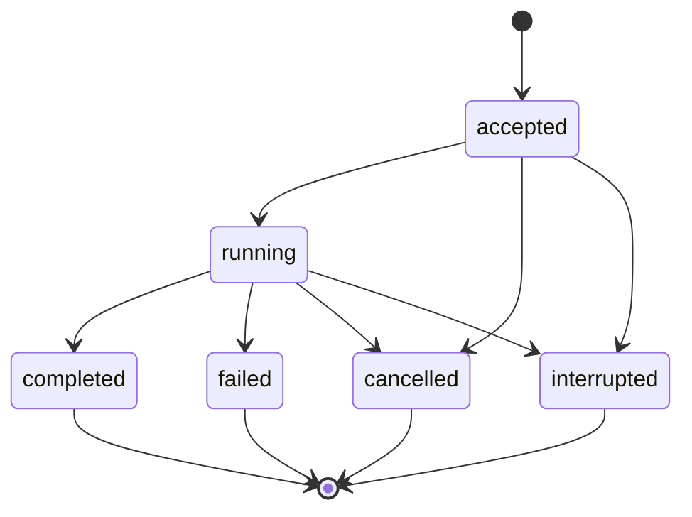

# Local Threads and State

## Design Position

An Agent UI Thread is the local Host authority for one interactive Agent lineage. It pins one resolved Agent profile snapshot, stores ordered Turns and Items, selects the latest complete Harness checkpoint, retains bounded AG-UI display replay, and associates process-local background job records with the lineage. It supports local restart and presentation reconnect without turning Items or UI data into Agent continuation state.

A Thread is not a Pydantic provider session. Agent UI implements the same Thread/Turn/Item interaction semantics locally, but its records are not Foundation Service resources unless an explicit import or synchronization contract says so. Its persistence is designed for one local user, one machine-visible store, and one writer per lineage. Foundation worker failover, multi-tenant authorization, and durable distributed child execution are outside this contract.

## Boundaries

| Concern                              | Owner                                    | Thread relationship                                                                               |
| ------------------------------------ | ---------------------------------------- | ------------------------------------------------------------------------------------------------- |
| Agent and Capability continuation    | Harness `HarnessState`                   | Stores complete selected values without interpreting private namespaces                           |
| Profile composition                  | Resolved Agent UI snapshot               | Pins exact snapshot identity and digest                                                           |
| Local turn acceptance and checkpoint | Agent UI thread store                    | Serializes one lineage and atomically selects complete state                                      |
| Display replay                       | Agent Stream Protocol plus Agent UI Host | Retains bounded projection envelopes; never reconstructs `HarnessState`                           |
| Active model/tool work               | Harness run                              | Process-local and not made durable by a `running` turn record                                     |
| Background child execution           | Agent UI job monitor                     | Persists bounded metadata and terminal output; live task remains process-local                    |
| Model-facing thread browsing         | Read-only Thread Capability              | Uses a fresh current-thread attachment and returns bounded safe projections                       |
| Filesystem atomicity and locking     | Agent UI store implementation            | Provides cross-process exclusion, atomic replacement, durability policy, and corruption detection |

## Thread Record

The following Python-like schema is a conceptual serialized local contract:

```python
class LocalThread(BaseModel):
    schema_version: str
    thread_id: str
    lineage_id: str
    revision: int
    created_at: datetime
    updated_at: datetime
    profile_snapshot: ResolvedProfileSnapshot
    profile_digest: str
    parent_fork: ThreadForkRef | None
    selected_checkpoint: CheckpointRef | None
    turns: tuple[TurnRecord, ...]
    items: tuple[LocalItemRecord, ...]
    jobs: tuple[BackgroundJobRecord, ...]
    replay: PresentationReplayIndex


class CheckpointRecord(BaseModel):
    checkpoint_id: str
    turn_id: str
    harness_state: HarnessState
    state_digest: str
    committed_at: datetime


class TurnRecord(BaseModel):
    turn_id: str
    state: Literal[
        "accepted",
        "running",
        "completed",
        "failed",
        "cancelled",
        "interrupted",
    ]
    base_checkpoint_id: str | None
    result_projection: JsonValue | None
    failure: SafeFailure | None
    checkpoint_id: str | None
    accepted_at: datetime
    finished_at: datetime | None


class LocalItemRecord(BaseModel):
    item_id: str
    turn_id: str
    sequence: int
    kind: LocalItemKind
    state: Literal["started", "completed", "failed"]
    safe_projection: JsonValue
    created_at: datetime
    completed_at: datetime | None
```

`thread_id`, `lineage_id`, Turn, Item, checkpoint, and job references are compact local identifiers and grant no authority. Item and result projections are bounded and pass the Host's local content policy. Secret credentials, live clients, current bindings, native plugin objects, task objects, locks, and open streams are never serialized.

Each revision selects at most one checkpoint. One user submission creates a Turn whose first Item is the accepted user message; subsequent messages, tool calls, commands, file changes, child activity, and terminal output become ordered typed Items. A completed Turn references the complete checkpoint produced by its terminal Harness result. A failed Harness result may select a complete returned state only when the Harness contract supplies one and Host policy explicitly chooses it; otherwise the previous checkpoint remains selected. Cancelled and interrupted records never synthesize newer state from Items, partial messages, AG-UI events, or provider history.

## Store Layout and Atomicity

The store owns a versioned root namespace, immutable or content-addressed profile snapshots, per-thread metadata, checkpoint blobs, AG-UI replay segments, and bounded background job records. Exact filenames and serialization codecs are implementation details, but these observable guarantees hold:

- a write is staged and validated before atomic publication;
- a metadata revision never points at a missing checkpoint or profile snapshot;
- every checkpoint and replay segment carries a digest or equivalent corruption check;
- replacing the selected checkpoint and completing its turn is one logical atomic commit;
- old complete checkpoints remain available until retention safely removes every reference;
- a single-writer lock protects one thread lineage across local processes;
- readers either observe the prior complete revision or the next complete revision, never a half-written mixture.

The implementation flushes and synchronizes according to its declared local durability profile. Atomic rename alone does not claim resilience against storage-device failure. A failed publication leaves recoverable staged data unselected and cleanup-safe.

The store does not depend on terminal path conventions for authority. It canonicalizes configured roots, rejects traversal and malformed identifiers, and does not follow an untrusted thread value to another arbitrary filesystem path. This is required to preserve the selected local store boundary, not a general sandbox claim.

## Turn Lifecycle



One application-service command creates the accepted Turn and initial user Item only after validating Thread identity, expected revision, profile availability, input limits, and absence of another advancing Turn. It then starts a Harness run from the selected checkpoint with fresh bindings. `running` records an observation that the process entered the run; it is not durable ownership of work and does not make that work restartable.

At terminal Harness delivery, Agent UI validates the result and complete state, writes terminal Items, checkpoint, and replay material, and atomically completes the Turn plus advances the Thread revision. If commit fails after model or tool work, the Turn outcome remains unknown from the selected Thread revision. Recovery preserves the last committed checkpoint and marks the uncommitted Turn interrupted or records a reconciliation diagnostic; it never reruns automatically and never infers rollback of external effects.

A user can explicitly submit a later turn from the last complete checkpoint after reviewing interruption evidence. The Host supplies that interruption as bounded reconciliation context when necessary. Repeating user intent is a new turn identity, not idempotent continuation of an unknown prior effect.

## Concurrency and Forking

A thread lineage has at most one foreground turn in `accepted` or `running`. The application service holds an in-process guard and the store verifies the expected revision under its cross-process lock before starting. Two stale callers cannot both advance one checkpoint. Another local process encountering an owned live lock reports a conflict rather than stealing it.

Independent lineages can execute concurrently. A fork creates a new thread and lineage from one complete source checkpoint:

```python
class ThreadForkRef(BaseModel):
    source_thread_id: str
    source_revision: int
    source_checkpoint_id: str | None
    source_profile_digest: str
```

The fork can retain the source profile snapshot or select another already resolved snapshot. The source remains unchanged. Selecting another profile records both digests and requires explicit compatibility validation or a Host-approved history-only seed; private Capability state is never passed to an incompatible definition merely because message history is readable. A fork gets independent future checkpoints, replay, jobs, and active-run guards.

## Presentation Replay

The thread retains [ordered `ProjectedEvent` envelopes](../agent-stream-protocol/00-overview.md#projection-context-and-envelope) in bounded segments plus complete Host-approved message or state snapshots needed to resynchronize a renderer. Each segment records the AG-UI protocol profile, sequence range, event identities, and retention generation.

Replay is a display projection. It can reconstruct visible text, tool observations, child activity, and terminal status but cannot:

- replace the selected checkpoint;
- satisfy a pending tool call or approval;
- restore Capability state or Environment state;
- prove that a missing transient delta never occurred;
- grant access to another thread or child;
- restart a run.

Retention may compact token deltas into complete semantic messages and remove old transient activity after a snapshot. It preserves explicit gap metadata so a client never interprets compacted detail as a full byte-for-byte execution log.

## Read-Only Thread Capability

Agent UI offers an optional definition-selected Thread Capability for model-assisted browsing of the current thread. It is read-only and receives one fresh `ThreadReadRunCapability` bound to the exact current thread, lineage, expected revision, content policy, and repository collaborator.

Its first-party tools provide bounded variants of:

- `list_thread_items` for current-thread turn, message, and retained job summaries;
- `search_thread` over indexed current-thread user-visible content;
- `read_thread_item` for one exact current-thread item reference.

The model never supplies a filesystem path or another thread ID. Results are safe projections and exclude private Capability state, raw `HarnessState`, credentials, hidden model/provider frames, plugin data, internal receipts, and unapproved child detail. Search ranking is an observation and does not reorder checkpoints.

The Capability cannot create, select, switch, rename, fork, delete, compact, or export a thread; change its profile; select a checkpoint; modify messages; submit input; control a run or child; rewrite a plugin; or mutate retention. Those remain explicit user/Host application commands. A missing or stale fresh attachment fails before a repository read.

## Background Job Records

A thread can retain bounded job metadata and terminal safe results so later turns and surfaces can reconcile process-local child work. [Runtime Subagents and Surfaces](03-runtime-subagents-and-surfaces.md#background-job-lifecycle) owns the job lifecycle and routing contract.

The thread record never treats `accepted` or `running` as durable work ownership. On process recovery, any such job from a previous process generation becomes interrupted unless its terminal result was already atomically retained. A new process does not recreate it from a task description or retained child state automatically.

## Recovery

At open, the store validates schema versions, profile and checkpoint references, digests, thread revision monotonicity, turn transitions, replay sequence, job records, and lock ownership. Recoverable unselected staging files can be removed or quarantined. A selected missing or corrupt profile snapshot or checkpoint fails the thread closed; display replay is not used as fallback continuation.

An abandoned process lock is reclaimed only after platform-appropriate ownership checks establish that its process generation is no longer live. Reclaiming the local writer lock grants permission to inspect and mark interrupted Host records; it does not prove prior model, tool, Environment, or provider work stopped cleanly.

## Retention and Deletion

Retention is configured at the local Host boundary and applied under the thread lock. It can remove unreferenced checkpoints, compact replay segments, and expire terminal background detail while preserving the selected checkpoint, pinned profile snapshot, fork references required by retained children, and integrity of current indexes.

Deletion is an explicit user/Host operation outside the model-facing Thread Capability. It conflicts with active foreground or background work and follows the store's declared deletion semantics. Removing local records does not roll back model-provider, tool, Environment, or external side effects.

## Failure Semantics

| Failure                                      | Outcome                                                                                     |
| -------------------------------------------- | ------------------------------------------------------------------------------------------- |
| Stale expected revision                      | Conflict before Harness dispatch                                                            |
| Live writer in another process               | Busy conflict; no second advancing turn starts                                              |
| Missing or incompatible profile snapshot     | Thread cannot start a run                                                                   |
| Corrupt selected checkpoint                  | Thread fails closed; replay is not promoted to state                                        |
| Process loss during model or tool work       | Last selected checkpoint remains; active turn and jobs become interrupted                   |
| Checkpoint publication failure after work    | Prior checkpoint remains selected; effects are unknown and require user/Host reconciliation |
| Replay corruption with valid checkpoint      | Thread continuation can remain available; affected display range is an explicit replay gap  |
| Thread read attachment stale or mismatched   | Capability operation fails before content read                                              |
| Retention or deletion races with active work | Operation conflicts and changes nothing                                                     |

## Compatibility

Thread schema, profile snapshot schema, `HarnessState` version, AG-UI profile, checkpoint codec, job record schema, and search index codec evolve independently. A migration writes and validates a new complete revision before selection. It never rewrites an existing content digest in place.

A newer Agent UI can open a thread only when it can validate the thread schema, reconstruct the pinned profile snapshot, import the selected Harness state through its owning codecs, and support or explicitly gap the retained presentation profile. Inability to render old AG-UI data does not permit discarding a valid checkpoint; inability to import the checkpoint does not permit continuing from rendered messages.

## Trade-offs

### Complete checkpoint selection vs. partial turn recovery

Selecting only complete Harness state avoids inventing a Pydantic partial tool-batch protocol. A process crash can lose completed but uncommitted local work and requires explicit reconciliation rather than automatic replay.

### Single writer vs. concurrent turns

Serializing one lineage gives deterministic checkpoint selection and avoids state merging. Parallel exploration uses explicit forks or independent threads rather than racing writes to one history.

### Read-only model browsing

Read-only current-thread tools provide useful recall without letting model content select or mutate Host lifecycle. Thread switching and cleanup remain user actions, so agents cannot silently redirect their own continuation.

## Invariants

01. One thread pins one resolved profile snapshot and selects zero or one complete checkpoint at a revision; only a thread with a committed checkpoint can resume Harness state.
02. `HarnessState` is the only stored Agent continuation authority; AG-UI replay, transcripts, indexes, and turn projections are not substitutes.
03. One lineage has at most one advancing foreground turn, enforced both in process and under the store lock.
04. A commit publishes turn completion and checkpoint selection atomically or leaves the prior revision selected.
05. Process loss preserves unknown external effects and never automatically reruns interrupted foreground or background work.
06. A fork creates an independent lineage from an exact complete source revision and never mutates its source.
07. The model-facing Thread Capability can list, search, and read only safe current-thread projections and cannot mutate Host state.
08. Local identifiers and persisted state grant no fresh run, child, repository, model, Environment, credential, or plugin authority.
09. Retention never removes a selected checkpoint or leaves a retained reference dangling.
10. A corrupt or incompatible selected checkpoint fails closed instead of falling back to display data.
