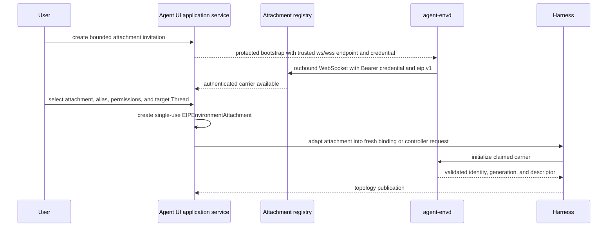
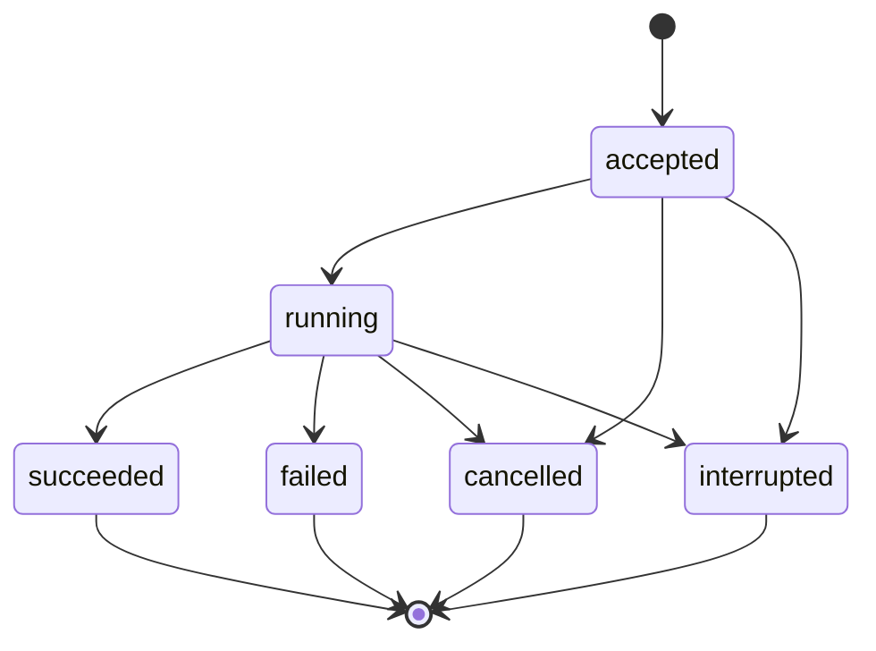
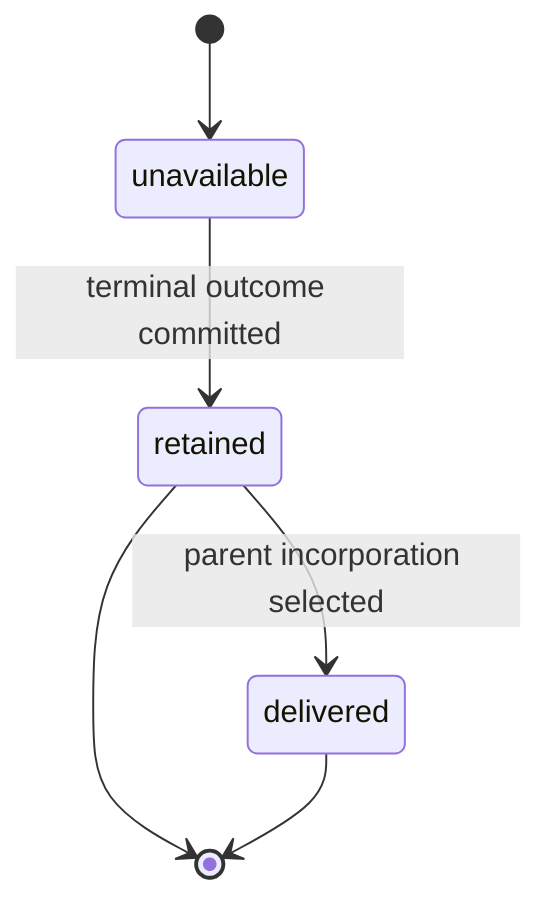

# Runtime Subagents, Dynamic Environments, and Surfaces

## Design Position

Agent UI has one foreground execution coordinator and one process-local background-child monitor behind a surface-neutral application service. Both use the complete child executable graph already built by the Harness. Inline children use the first-party Harness `DelegationCapability`; background children use an Agent UI-owned Host Capability and fresh run attachment at the [Host-managed asynchronous subagent boundary](../agent-harness/11-delegation-and-subagents.md#host-managed-asynchronous-subagents).

WebUI and TUI consume the same post-processor AG-UI events generated by that application service. Surface adapters can filter or group detail for their medium, but they do not run Agents, own child jobs, route results, mutate Environment topology, or independently translate Harness events.

The application service can also own an optional process-local envd attachment registry. It accepts authenticated outbound reverse-WebSocket carriers from `agent-envd` and lets an explicit Host selection claim one through a provider-package `EIPEnvironmentAttachment`. The Harness exhaustively adapts that fresh single-use attachment and remains the sole owner of the entered run topology and stable `BoundEnvironment` facade.

## Boundaries

| Concern                                      | Owner                            | Agent UI behavior                                                                                  |
| -------------------------------------------- | -------------------------------- | -------------------------------------------------------------------------------------------------- |
| Complete root and child executable graph     | Harness build                    | Borrows exact `SubagentCollection`; never rebuilds a child from parent internals                   |
| Blocking inline child invocation and state   | Harness Delegation Capability    | Uses normal tool call, nested child `HarnessState`, shared usage, and parent checkpoint boundary   |
| Background tool presentation                 | Agent UI behavior Capability     | Reads exact built children and exposes bounded spawn/status/steer/cancel tools selected by profile |
| Current background submission authority      | Fresh Agent UI run Capability    | Binds current Session, parent Thread, job monitor, child-binding factory, and policy               |
| Live task scheduling and synchronization     | Agent UI background monitor      | Owns supervised tasks, queues, wake-up, terminal retention, and process-generation state           |
| Child Agent loop, events, state, and cleanup | Same Harness API as root         | Calls child `ExecutableAgent.stream()` with fresh bindings                                         |
| AG-UI event observation                      | `converge-agent-stream-protocol` | Converts root and exposed child streams once, then applies the Agent UI processor                  |
| Envd invitation and attachment registry      | Agent UI application service     | Owns authenticated admission, routing, selection, and unclaimed candidate cleanup                  |
| Accepted-carrier EIP attachment              | Environment Provider package     | Supplies a single-use reverse-WebSocket session source without importing Harness types             |
| EIP requester session over claimed carrier   | `converge-agent-envd-client`     | Initializes envd and carries bounded control and file-data frames                                  |
| Active Environment topology                  | Harness                          | Adapts selected single-use attachments into fresh bindings or applies them through its controller  |
| Session checkpoint and job records           | Agent UI session store           | Commits parent checkpoints and bounded job facts under separate lifecycle rules                    |
| Durable distributed child Execution          | Foundation Service               | Not emulated by local jobs                                                                         |

## Shared Foreground Orchestration

The application service accepts a typed `SubmitTurn` command containing a session selector, expected revision, and bounded user input. It opens the session's pinned executable, requests fresh root `RunBindings`, enters exactly one `HarnessRunStream`, and is its sole consumer. The coordinator routes each Run's public events to one AG-UI observer, captures the terminal result, and asks the session store to commit the complete checkpoint.

Surface code receives:

- command acknowledgements and conflicts;
- session/profile query projections;
- retained and live AG-UI event subscriptions;
- background job query/control projections;
- surface-neutral safe failures.

A Web request handler and a TUI key binding submit the same command value. Neither keeps an independent message-history array as continuation authority. A surface-local optimistic item is discarded or reconciled against the application-service acknowledgement and replay identity.

## Dynamic Environment Attachments

Agent UI can act as the trusted control service in the [EIP outbound reverse-WebSocket profile](../agent-envd/03-transports-and-sessions.md#outbound-reverse-websocket-profile). Envd opens the network connection but remains the EIP responder; Agent UI accepts the carrier and remains the requester. The carrier does not define another Agent UI protocol and does not flow through AG-UI.



Creating an invitation is an explicit local Host operation. It allocates a compact process-local attachment reference, expected Environment identity, finite expiry and capacity, and admission policy. Its short-lived credential is delivered through a protected operator bootstrap path and never through an ordinary browser projection, URL, profile, session, replay event, model context, or log. The browser can observe safe states such as waiting, available, bound, unavailable, expired, or closed; those observations grant no Environment authority.

After carrier authentication, the registry retains one bounded uninitialized carrier candidate associated with the invitation's expected Environment identity. It does not create a run binding or share an initialized session. A later explicit application command selects the candidate, model-facing alias, permission ceiling, and target Session Thread. The registry creates one single-use provider-package `EIPEnvironmentAttachment` whose accepted-carrier session source can be claimed exactly once. During Harness binding entry, the low-level client sends the first `initialize` request and validates protocol version, Environment identity, daemon generation, descriptor, required methods, and configured limits before topology publication:

- if the target foreground run is active, Agent UI submits a higher complete topology request through that run's retained `EnvironmentTopologyController`;
- if no turn is active, Agent UI can retain the bounded selection in memory until the next turn constructs fresh `RunBindings`;
- expiry, cancellation, process shutdown, or failure before transfer closes the carrier and discards the candidate.

One accepted carrier and its initialized EIP session are claimed by at most one attachment and run binding. They are never shared concurrently between root runs, Session Threads, or background children. A root attachment is not inherited by a child; every child still receives independently authorized fresh attachments and bindings. After a run releases its provider scope, envd can reconnect into the application registry and offer a fresh carrier candidate for another explicit selection.

A transient carrier loss within the same selected Environment identity and daemon generation can be handled as bounded provider-private reconnect and typed availability change. It does not resume transfers, replay requests, or prove that an in-flight mutation was not dispatched. A changed daemon generation requires a fresh candidate and higher Harness binding revision; Agent UI never silently retargets an existing binding, cursor, handle, or operation.

The registry and listener are children of the application-service lifetime. Admission counts, pending candidates, initialized carriers, wait time, reconnect, and shutdown drain are finite. Restart invalidates invitations and selections and closes all carriers. Session records can retain only safe display facts; they never restore attachment credentials, sockets, EIP sessions, provider bindings, or routing authority.

The EIP ingress has a separate route and authentication domain from browser commands and AG-UI streams. It uses explicit `ws` or certificate/hostname-validated `wss`, the selected `eip.v1` subprotocol, a Bearer attachment credential, and first-message initialization after claim. Plain `ws` is valid only through an explicitly trusted loopback, private tunnel, or equivalent outer confidentiality boundary; cross-host and production deployments should use `wss`. The ingress can share the Agent UI server process and supervised lifespan, but the default plain loopback browser listener is not by itself an authorized reverse-WebSocket endpoint. Non-loopback advertisement requires operator-selected network exposure and the matching confidentiality policy; it does not convert Agent UI into a multi-user service.

A profile that selects the Harness `DynamicEnvironmentCapability` receives stable File/Shell tool schemas plus live topology context and notices when an attachment is published or removed. The attachment registry does not add that Capability to an already built Agent. Without the selected Capability or equivalent authored Environment Toolsets, Host attachment can still affect trusted run bindings but creates no hidden model-facing tool surface.

## Agent UI Background Capability

The profile-selected Agent UI Background Capability has stable configuration and tools but no live monitor. Its fresh `AgentUiBackgroundRunCapability` is a conceptual public run attachment:

```python
@dataclass(frozen=True, slots=True)
class AgentUiBackgroundRunCapability(AbstractCapability[AgentContext]):
    session_id: str
    parent_thread_id: str
    parent_turn_id: str
    parent_run_id: str
    monitor: BackgroundJobService
    child_binder: BackgroundChildBinder
```

The actual attachment exposes methods rather than public mutable fields. Harness finalizes it in the run Capability map under one stable ID and expected type. The behavior Capability reads the exact selected `BuiltSubagent` from `AgentContext.subagents`; it cannot submit an arbitrary executable or profile reference. The binder applies the authored child context and usage ceilings plus current Host policy and returns complete fresh child bindings.

The model-facing contract uses compact parent-scoped job references:

```python
class SpawnBackgroundChild(BaseModel):
    subagent: str
    task: JsonValue


class BackgroundSpawnResult(BaseModel):
    subagent_ref: str
    status: Literal["accepted"]


class BackgroundControlRequest(BaseModel):
    subagent_ref: str
```

`spawn` returns an ordinary bounded result after the monitor accepts ownership. It is never a Pydantic deferred call. Status, bounded wait, steer, and cancel resolve `subagent_ref` together with trusted current parent Session and Thread. A compact ref cannot address another Session or parent Thread and never substitutes for the monitor's internal job ID.

Steering is optional bounded input delivered to a running child through a Host-owned message seam supported by that child composition. Acceptance means the monitor queued or delivered the message to the exact live job; it does not mean the child incorporated it into a model request. A child without a compatible steering seam returns an unsupported outcome. Agent UI never mutates private Pydantic history or a live `AgentContext` to simulate steering.

## Background Job Lifecycle

Execution outcome and result delivery advance independently:





The monitor allocates a stable compact `subagent_ref`, records an accepted job, and returns. It later creates fresh child bindings and starts the exact built child executable in a supervised task. The live task, cancellation scope, queues, stream, child context, Environment, usage accumulator, and authority remain process-local and are never serialized.

A conceptual retained record is:

```python
class BackgroundJobRecord(BaseModel):
    job_id: str
    session_id: str
    parent_thread_id: str
    parent_turn_id: str
    child_thread_id: str | None
    subagent_ref: str
    subagent_name: str
    child_definition_id: str
    process_generation: str
    outcome: Literal[
        "accepted",
        "running",
        "succeeded",
        "failed",
        "cancelled",
        "interrupted",
    ]
    delivery: Literal["unavailable", "retained", "delivered"]
    child_run_id: str | None
    safe_result: JsonValue | None
    safe_failure: SafeFailure | None
    child_state: HarnessState | None
    created_at: datetime
    finished_at: datetime | None
```

Terminal result, bounded complete child state, and safe failure can be retained after the child stream and resources close. When child state exists, `child_thread_id` is required and equals `child_state.thread_id`; every child Harness Event and result carries that same Thread identity. They support later model input, status, and diagnostic display but do not recreate fresh authority. Retention size, count, and age are bounded per session. Advancing `delivery` never erases or rewrites `outcome`.

A process-generation mismatch turns a record whose outcome is `accepted` or `running` into `interrupted` during recovery. Its delivery remains `unavailable` because no complete child outcome was selected. Agent UI does not restart it automatically. A process-local background child therefore has no crash-recovery guarantee; work requiring independent durable retry or failover uses a Foundation child Execution.

### Result Routing and Wake-up

Child stream events and terminal result routing are separate:

1. public child Harness events can be projected into a distinct AG-UI child stream with parent correlation;
2. on terminal close, the monitor atomically retains a safe result or failure and complete state when available;
3. it publishes a Host bus notification and wakes eligible application-service subscribers;
4. if the parent session has an active turn with a compatible enqueue seam, Host policy may offer the result as new input;
5. otherwise the result remains retained for an explicit or policy-created later parent turn.

The monitor never completes the original spawn tool-call ID after spawn acceptance. A later parent turn receives typed Host-generated content naming the exact job and terminal outcome. Agent UI serializes foreground advancement, so result routing does not start a competing turn silently. Duplicate notifications retain one job/result identity and are incorporated at most once per chosen parent checkpoint under session revision checks.

`delivery="delivered"` records successful Host incorporation selection, not proof that a later model used or acted on the child content. `delivery="retained"` means a terminal outcome is available but no parent continuation has selected it. Both statuses preserve the separate execution outcome.

## Fresh Child Bindings

Every background start requests fresh bindings using trusted parent Session, parent Thread, and job identity, exact built edge, authored context policy, effective limits, and current Host policy. It does not retain or copy the parent `RunBindings`, plugin graph, `BoundPluginContext`, Environment, client connection, credential, message list, event queue, usage accumulator, or borrowed local task cell after the parent run.

For task sharing, the local Host can retain its own session-scoped task store and supply a fresh identity-bound child view under the Harness Working State contract. It cannot keep a parent-run borrowed cell beyond that cell's documented lifetime. Other Capability state remains child-private. A background child's complete `HarnessState` lives in the Host job record rather than the inline Delegation Capability's parent state.

The child runs through its ordinary `ExecutableAgent.stream()` path with a distinct run ID and usage accumulator. Edge usage limits remain ceilings; Host policy can narrow them. Cross-job budgets and strict aggregate admission are Host facts.

## Cancellation, Shutdown, and Failure

A model-facing cancel resolves the trusted job, marks a cancellation request, and asks the monitor to cancel and drain the child stream. Success means the process-local task reached a cancelled terminal observation; it does not roll back provider, tool, Environment, or external effects. A stale parent run attachment cannot control jobs after its run closes unless a later fresh attachment is explicitly authorized for that same Session and parent Thread.

Application shutdown stops accepting jobs and envd attachments, fences active Environment topology control, requests cancellation for active jobs, drains within the configured bound, closes child streams, Environment bindings, EIP sessions, and unclaimed carriers, and records remaining unknown outcomes as interrupted or unavailable. It then closes the foreground coordinator and stores before exiting. A terminal result is retained only after complete child cleanup reaches the Host's record-selection boundary.

| Failure                                         | Outcome                                                                                |
| ----------------------------------------------- | -------------------------------------------------------------------------------------- |
| Unknown or hidden child name                    | Tool validation failure before acceptance                                              |
| Missing, duplicate, or stale run attachment     | Fail closed before monitor submission                                                  |
| Compact ref belongs to another Thread           | Not found or authorization failure without disclosing target                           |
| Fresh child binding denied or invalid           | Job fails before child dispatch with bounded failure                                   |
| Child run fails with complete result state      | Safe failure and eligible child state retained under Host policy                       |
| Cleanup outcome unknown                         | Job interrupted; prior terminal record is not invented                                 |
| Result notification duplicated                  | Same retained identity; no duplicate child execution or automatic parent incorporation |
| Envd invitation expires before initialization   | Pending admission closes; no Environment binding or topology change                    |
| Carrier fails after possible mutation dispatch  | Binding becomes unavailable; outcome remains unknown until reconciled by EIP evidence  |
| Daemon generation changes                       | Fresh candidate and higher binding revision required; no silent retargeting            |
| Process exits while job or attachment is active | Job becomes interrupted, attachment closes, and neither authority is restored          |
| Parent has no eligible active enqueue seam      | Result remains retained for later explicit incorporation                               |
| Steering unsupported or races terminal close    | Bounded unsupported or terminal outcome; no private-history mutation                   |

## Surface Projection

The application service observes each Harness Run once, applies its Agent UI processor, and fans the resulting AG-UI events to subscribers. Agent UI wraps retained events in its own identities and ordering records. Both surfaces use retained replay followed by live subscription and deduplicate those Host event IDs.

### WebUI

WebUI is the browser client compiled into the Python distribution. The Python Host serves immutable assets and a loopback application API. The AG-UI transport carries events produced by the Harness/Protocol release selected by Agent UI and keeps browser routing separate from command, stream, and optional EIP ingress routes. Reconnect supplies an opaque presentation cursor; cursor gaps trigger a Host-approved snapshot and visible gap state.

WebUI can display safe attachment state and submit the same invitation, selection, detach, and topology commands owned by the application service. It never becomes the EIP requester, receives an attachment Bearer credential, handles EIP JSON-RPC or binary frames, or turns a displayed attachment into authority without the explicit Host command.

The WebUI includes a protocol inspector over the same processed AG-UI events consumed by its renderer. The inspector can display Host sequence, standard/custom type, public correlation, serialized event data, replay/live origin, and gap information. It does not gain access to provider frames, credentials, private exceptions, raw `HarnessState`, plugin objects, or Host receipts that are absent from those events.

### TUI

TUI attaches directly to the application service and renders the same AG-UI event schemas. It can collapse token deltas, background child detail, or completed tool sections to preserve terminal readability. This is a view filter: the application service and retained Host records still own event identity and order. Expanding a section reads the retained AG-UI events rather than private Harness objects.

Terminal resize, color capability, key bindings, clipboard support, and pager behavior are presentation concerns. They do not alter command or session semantics. TUI shutdown follows the same explicit application-service cancellation/drain flow as WebUI shutdown.

### Surface Equivalence

Surface equivalence means semantic command and observation parity, not pixel or widget parity. Both modes can select a profile, create/select/fork a session, submit input, cancel the active turn, inspect safe root/child/tool observations, control authorized background jobs, and operate configured envd attachment commands. The optional listener belongs to the application-service process rather than the browser renderer, so a TUI process can enable the same ingress when configured. A feature whose semantics exist only in one renderer belongs in that renderer and cannot become hidden execution authority.

## Compatibility

Application-service command schemas, session schema, Agent UI background Capability schema, attachment registry schema, EIP version, the selected Harness/Protocol release, Web transport API, and TUI rendering version independently. The bundled surfaces are built against the Agent UI-selected AG-UI event contract. A renderer can ignore custom events it does not use while standard AG-UI meaning remains intact. EIP compatibility is negotiated independently and never inferred from the Agent UI or AG-UI dependency version.

A running job retains the executable snapshot, child definition identity, and process generation with which it started. Editing a profile or upgrading a renderer cannot mutate it. Restart interrupts the job; it never reconstructs a live task under another version.

## Trade-offs

### Process-local background jobs

In-process scheduling gives local Agents useful parallel child work and immediate event visibility without introducing a durable service. Process loss interrupts jobs and result delivery, so Agent UI must preserve unknown effects and users choose Foundation Service when durability matters.

### One AG-UI stream vs. direct terminal rendering

TUI cannot exploit private Harness event classes as a second source of truth. The shared stream makes session replay and Web/TUI behavior consistent and keeps renderer upgrades independent of Harness internals.

### Retained result routing vs. deferred spawn

An ordinary spawn result lets the parent continue while the Host owns later wake-up and incorporation. It requires explicit job identity and delivery bookkeeping, but it does not misuse deferred tool semantics or keep a parent tool task alive indefinitely.

## Invariants

01. Inline delegation remains Harness-owned; Agent UI background behavior never copies its builder, Agent loop, nested state, or active tool-task lifecycle.
02. A background spawn completes with an ordinary accepted result and a compact scoped ref; child completion is later Host-routed input.
03. Every background child uses the exact built child executable and complete fresh bindings.
04. Live jobs, bindings, queues, cancellation scopes, Environment handles, credentials, and usage accumulators never become session or Harness state.
05. A prior-process nonterminal job becomes interrupted and is never restarted automatically.
06. WebUI and TUI submit the same typed commands and consume the same post-processor AG-UI event sequence.
07. Surface filtering changes layout and detail only; it cannot change event identity, run terminality, checkpoint selection, or result routing.
08. The protocol inspector observes the same processed events as renderers and grants no access to runtime data absent from those events.
09. Disconnect, result notification, parent incorporation, checkpoint commit, and rendering are independent facts.
10. Work requiring durable child acceptance, failover, retries, or cross-process delivery uses Foundation Service rather than local job files.
11. An authenticated envd carrier becomes only an available process-local attachment; explicit Host selection is required before it enters fresh bindings or active topology.
12. Each selected EIP session belongs to at most one run binding, while reconnect, generation changes, transfer loss, and mutation uncertainty preserve the owning EIP and Harness semantics.
13. Browser capability, AG-UI transport, envd attachment credential, and EIP session are separate authority and compatibility domains.
