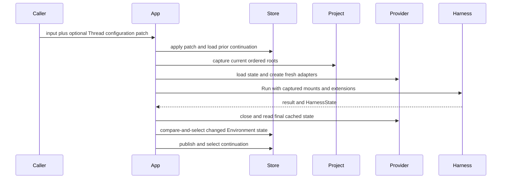

# Projects, Threads, and Environments

## Design Position

A Project is the only Agent UI concept for grouping local roots and organizing root Threads. It is a mutable named ordered root list modeled after Codex Project and is selected by each Thread. Agent UI defines no separate Workspace resource, Workspace root collection, or `WorkspaceBinding` input.

A Thread is one continuation-backed root or child conversation. It owns mutable sticky selections for Project, Agent, Environment profile, Harness Plugins, Environment Run Extensions, and MCP servers. A Run can atomically patch those selections and captures their complete effective values before execution. Subsequent Project or Thread changes do not affect the admitted Run.

## Projects

One file under `projects/` defines a Project:

```yaml
schema_version: "1"
kind: project
id: project-agent-foundation
name: Agent Foundation
position: 0
roots:
  - path: /work/agent-foundation
  - path: /work/design-notes
```

The conceptual model is:

```python
class ProjectRoot(BaseModel):
    path: str


class Project(BaseModel):
    id: ProjectId
    name: str
    roots: tuple[ProjectRoot, ...]
    position: int
```

Roots are canonical absolute existing directories, ordered and unique. The first root is the default working directory and receives mount ID `workspace`; later roots receive `workspace-2`, `workspace-3`, and so on. These are mount identifiers, not Workspace resources. Project position provides stable user ordering; recency is aggregated in storage from all associated non-archived Threads and does not belong in the file or a bounded Thread-list scan.

Changing Project roots affects later Runs of every Thread selecting the Project. A Run already admitted retains its captured roots. Removing a Project file removes it from the next accepted generation. Existing Threads retain the unresolved ID and reject later Runs until explicitly reassigned; no global fallback silently changes their local authority.

### Current-directory Resolution

The App can resolve a normalized current working directory to a Project for a local surface. Only each Project's first root participates in this launch lookup; later roots are additional Run mounts rather than independent Project entry points. A current directory equal to or beneath a first root matches that Project. The most specific containing first root wins, while an equally specific path shared by several Projects is ambiguous.

Resolution returns a configured Project or an unmatched or ambiguous outcome. It never creates a Project, adds or reorders roots, or makes the launch directory a surface-owned authority. The selected Project retains its configured first root as the default working directory represented by mount ID `workspace`, even when the current directory is a descendant. A surface that does not expose Project management can use this result as its new-Thread context and default Project filter.

## Thread Identity

```python
class ThreadMetadata(BaseModel):
    version: int
    title: str | None
    archived: bool


class Thread(BaseModel):
    thread_id: ThreadId
    parent_thread_id: ThreadId | None
    created_at: datetime
    updated_at: datetime
    metadata: ThreadMetadata
    configuration: ThreadConfiguration
    initial_state: ObjectRef
    continuation: ContinuationRef | None
```

A root Thread has no parent. An async child records its immediate parent and shares no mutable runtime object with it. The selected `HarnessState.thread_id` equals the Agent UI Thread ID; Agent UI does not add a second Session identity for the same conversation.

Current Run receipts, status, subscribers, steering queues, and live output remain process-local. A Thread can exist with no live Run. Thread creation calls `HarnessState.new()` once, uses its generated `thread_id` as the Agent UI Thread ID, and publishes that empty value as `initial_state`. The Thread initially has metadata version one and no selected continuation. Its first admitted Run uses `initial_state`; only a completed or suspended Run boundary can publish and select the first continuation.

Title and archive state form one metadata compare-and-select head independent from sticky configuration. A metadata command names the exact expected metadata version and atomically updates either or both fields. A changed head increments once; a no-op can retain its version. Title can be explicitly cleared. Root archive is rejected while that Thread has a current-process root operation, so an accepted operation cannot become hidden mid-Run. Child metadata changes require the parent-scoped child boundary.

## Sticky Thread Configuration

```python
class AgentResourceSource(BaseModel):
    agent: AgentId


class MarkdownSubagentSource(BaseModel):
    markdown: SubagentId


AgentSource = AgentResourceSource | MarkdownSubagentSource


class ThreadConfiguration(BaseModel):
    version: int
    project_id: ProjectId
    agent_source: AgentSource
    environment_profile_id: EnvironmentProfileId
    harness_plugin_ids: tuple[PluginId, ...]
    environment_run_extension_ids: tuple[RunExtensionId, ...]
    mcp_server_ids: tuple[McpServerId, ...]
```

The stored value is exact. It contains no `inherit`, omitted, or globally enabled state.

A new root Thread resolves an explicit Agent resource or the root YAML Agent default into `AgentResourceSource`, then resolves the other creation defaults and stores the exact result. Root Threads cannot select a Markdown subagent as their source; that concise format depends on a parent Agent capture.

A child Thread stores the selected roster entry as either an Agent resource or Markdown subagent source. Project, Environment profile, and Run Extensions default from the admitting parent capture. Agent-resource children use their own Plugin and MCP defaults when present; Markdown children inherit the admitting parent capture's exact Plugin and MCP lists. After creation the child owns these stored selections independently.

## Configuration Patch and Run Admission

A Thread can change configuration before or after any Run:

```python
class ThreadConfigurationPatch(BaseModel):
    project_id: ProjectId | Unset
    agent_source: AgentSource | Unset
    environment_profile_id: EnvironmentProfileId | Unset
    harness_plugin_ids: tuple[PluginId, ...] | Unset
    environment_run_extension_ids: tuple[RunExtensionId, ...] | Unset
    mcp_server_ids: tuple[McpServerId, ...] | Unset
```

Omitted fields retain the current Thread value. An empty collection disables all resources on that axis. A non-empty collection is the exact ordered enabled set. There are no retained disabled association rows.

A configuration mutation command contains an exact expected version:

```python
class ThreadConfigurationMutation(BaseModel):
    expected_version: int
    patch: ThreadConfigurationPatch
```

Every non-empty patch, including one admitted with Run input, requires `expected_version`. A root Thread patch rejects a Markdown `agent_source`; a child Thread can replace its source with either form. A Run admission with no configuration patch can omit the expected version because it does not write the configuration head. The combined admission operation:

1. loads the current Thread configuration;
2. rejects a non-empty patch whose required expected version differs;
3. applies and validates the patch;
4. commits the new exact configuration and incremented version;
5. captures the accepted file generation and current Project roots;
6. resolves and publishes the immutable Run composition;
7. closes all transactions before native construction or external I/O;
8. starts the Harness Run with the selected continuation's `HarnessState`, or the Thread's immutable `initial_state` when no continuation is selected.

The accepted patch applies to this Run and subsequent Runs. A separate update during an active Run is allowed but affects only the next admission. Steering never changes captured configuration.

## Thread Queries

Root Thread lists use opaque keyset cursors over descending `(updated_at, thread_id)`, with the optional Project filter, query, archive filter, and root-only shape bound into the cursor. Child execution and transcript pages likewise use deterministic opaque cursors for their own stable order. A cursor from another query shape is invalid rather than reinterpreted as an offset.

The summary projection exposes metadata and configuration versions, selected resource IDs, continuation state, and current-process activity without exposing a storage contract. The detail projection adds deferred requests and available actions. Transcript entries are bounded typed presentation values derived from the selected `HarnessState`; they are not serialized Pydantic AI messages and do not authorize continuation.

Project recency is the maximum `updated_at` over every associated non-archived Thread. The repository computes it as an aggregate independent from page limits, so Projects with older or child Threads are not omitted by an arbitrary scan bound.

## Environment Profile and Binding

A Thread selects exactly one Environment profile defined by [Extension Discovery and Management](01a-extension-discovery-and-management.md#environment-provider-discovery-and-profile-resources). A profile chooses one installed Provider plus Agent UI Host adapter configuration; it does not represent the runtime `Environment.environment_id`. Native is the omission fallback only while creating a root Thread; a later missing or failed explicit profile never falls back.

For each captured Project root, the App:

1. resolves the exact Provider and approved Host adapter;
2. loads current Host-authoritative state under the complete binding key;
3. asks the adapter to materialize root-specific validated Provider configuration;
4. creates a fresh pre-entry-inert `Environment` adapter;
5. constructs the deterministic Harness Project mount set;
6. adds the dedicated user Skill mount when the Run root Agent selects `skills`; and
7. creates fresh selected Environment Run Extensions around that aggregate.

The Provider configuration and adapter do not own the Project root list. The adapter receives one root at a time and can reject roots it cannot represent. The user Skill mount is a separate Host-owned Direct Local route and follows [Environment Skill Sources](02b-environment-skill-sources.md); it neither changes Project roots nor participates in Project Environment-state publication.

## Host-authoritative Environment State

Native and Local EIP use Project roots directly and ordinarily retain no portable re-entry state. A stateful Provider can return `EnvironmentState` for one root.

Agent UI uses one private binding identity:

```text
Thread ID
+ Environment profile ID and normalized profile digest
+ Host adapter key
+ normalized Project root path
```

The profile digest reuses the accepted generation's canonical normalized content for `provider_key`, Provider schema version, Provider configuration, Host adapter key, and adapter configuration. It excludes filename, YAML formatting, comments, and display-only fields. State lookup, supplied-state comparison, and publication use exactly that identity. Existing authoritative `None` does not permit fallback from `HarnessState.environment_states`. Continuation Environment state is a portable observation only and can be adopted only through an explicit import boundary.

Changing the selected Environment profile or any behavior-affecting normalized content produces a different state identity. Presentation-only edits preserve it. Switching back to the same compatible identity can recover its previous state. Removing and later restoring the same Project root behaves similarly. State is never shared merely because two Threads select the same Project.

## Root Run Environment Flow



Cleanup precedes final state reading. Environment-state publication occurs after failure or cancellation when a changed final value is known. Equal state performs no write. Environment-state and continuation publication are independent facts and do not roll one another back.

## Async Child Environments

A newly delegated child Thread initializes Project and Environment profile selections from the parent Run capture. Every child segment later uses the child Thread's own current selections and can apply an explicit patch before resume.

Each segment receives fresh Provider runtime collaborators, adapters, and Environment Run Extensions. It never borrows the parent's entered Environment facade. A descendant initializes from its admitting child capture under the same rule.

## Local EIP Runtime

Agent UI releases select one exact `agent-envd` release manifest and target hashes. Local EIP resolves only that managed executable or one explicit validated local override. It does not search ambient `PATH` or download a binary for Native execution.

The executable cache carries no Thread, Project, root, or Environment authority. Daemons, transports, process handles, and output cursors remain process-local to fresh adapters and never enter `EnvironmentState` or Thread storage.

## Thread Tools and Project Authority

Model-visible root Thread tools can list and inspect Threads, start or continue another root Thread, and steer an active Run. `run_thread` rejects a child target, defaults to the root target's sticky configuration, and accepts no arbitrary local root paths from model arguments. It cannot bypass a selected deferred request set. Async child continuation uses the linked `resume_subagent` path so the current parent roster and delegation ceilings remain available. Changing Project requires an explicit authorized Thread configuration operation through the App boundary.

`steer_thread` resolves and targets one exact process-local root receipt and preserves that Run's captured composition. Same-active-Thread recursive run or steer calls are rejected.

## Failure Semantics

| Failure                                  | Outcome                                                                     |
| ---------------------------------------- | --------------------------------------------------------------------------- |
| Invalid or inaccessible Project root     | Candidate generation or Run capture fails before native execution           |
| Current directory matches no first root  | A launch surface receives an unmatched result without creating a Project    |
| Current directory is equally ambiguous   | A launch surface receives an ambiguous result without choosing arbitrarily  |
| Project removed from accepted generation | Existing Thread remains inspectable; next Run requires reassignment         |
| Stale Thread configuration version       | Patch and admission are rejected without partial changes                    |
| Provider or Host adapter missing         | Run capture fails; Native is not substituted                                |
| Current Environment state invalid        | Admission fails explicitly                                                  |
| Adapter entry or extension entry fails   | Harness reports Run failure; known changed cached state is still considered |
| Cleanup or state publication fails       | Failure is reported independently from continuation selection               |
| Continuation publication conflicts       | Prior or concurrent continuation remains current                            |

## Invariants

01. Project is the only local-root grouping and root-Thread organization concept; Agent UI defines no Workspace resource.
02. Project roots are mutable, ordered, and captured per Run; `workspace` is only the first root's mount ID.
03. Current-directory lookup uses only configured first roots and never creates or mutates a Project.
04. Thread metadata and configuration are independent mutable compare-and-select heads.
05. Thread configuration is exact, versioned, and sticky.
06. Omitted patch fields preserve prior Thread state; empty lists disable one complete axis.
07. A Run captures one configuration generation, one Thread version, and one Project root list.
08. Root and child Threads can change Agent, extension, MCP, Project, and Environment profile selections between Runs.
09. Thread and transcript pagination uses query-bound deterministic keyset cursors; root lists bind their optional Project filter.
10. Every independent Run receives fresh Environment adapters and Run Extensions.
11. Environment state is isolated by Thread, Environment profile behavior, adapter, and root path.
12. Steering never changes an active Run's captured composition.
13. Destructive Provider lifecycle remains outside ordinary Run cleanup.
14. A selected Skills Capability can add only the dedicated user Skill mount and Environment-routed Skill sources; it does not broaden a Project Provider's Host paths.
