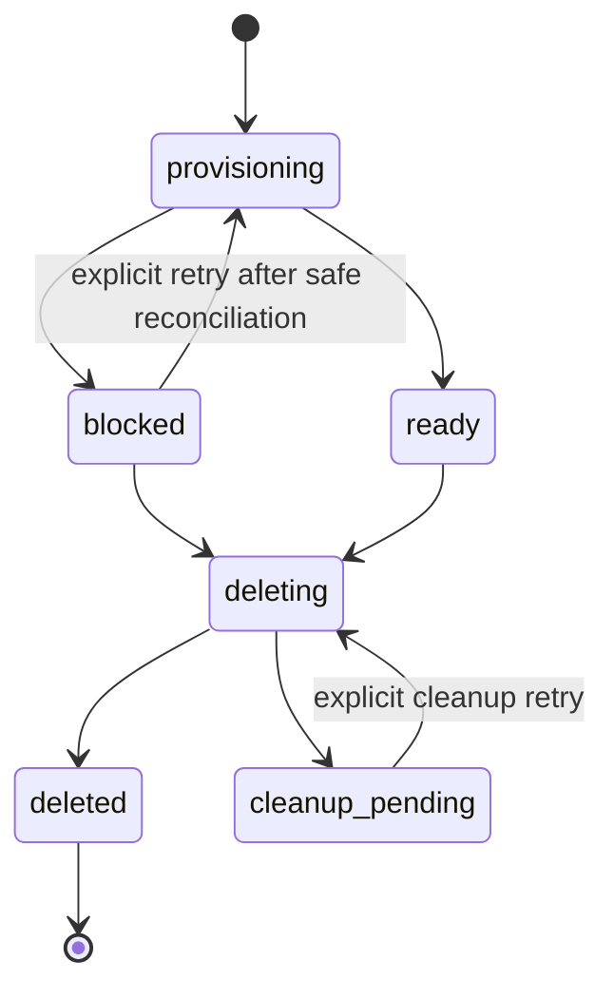
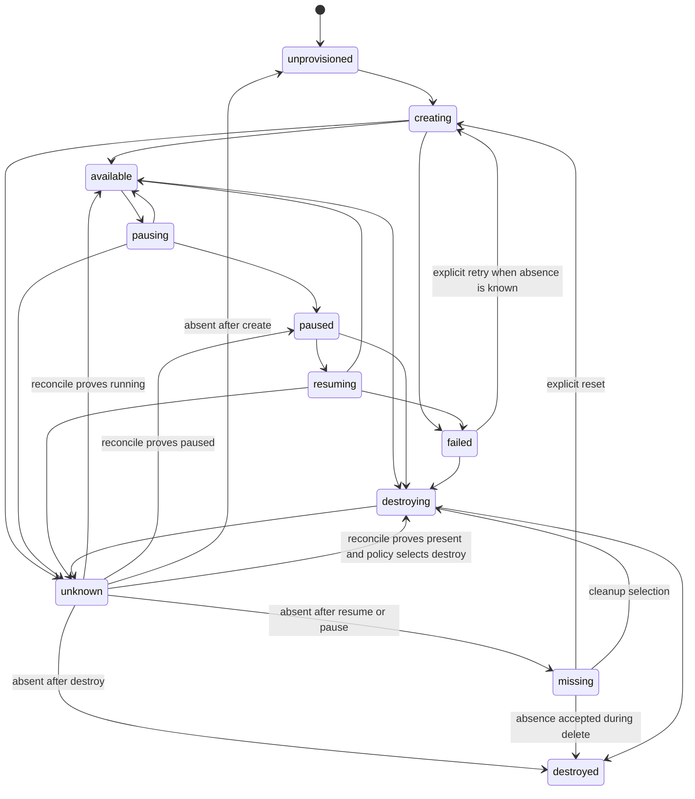
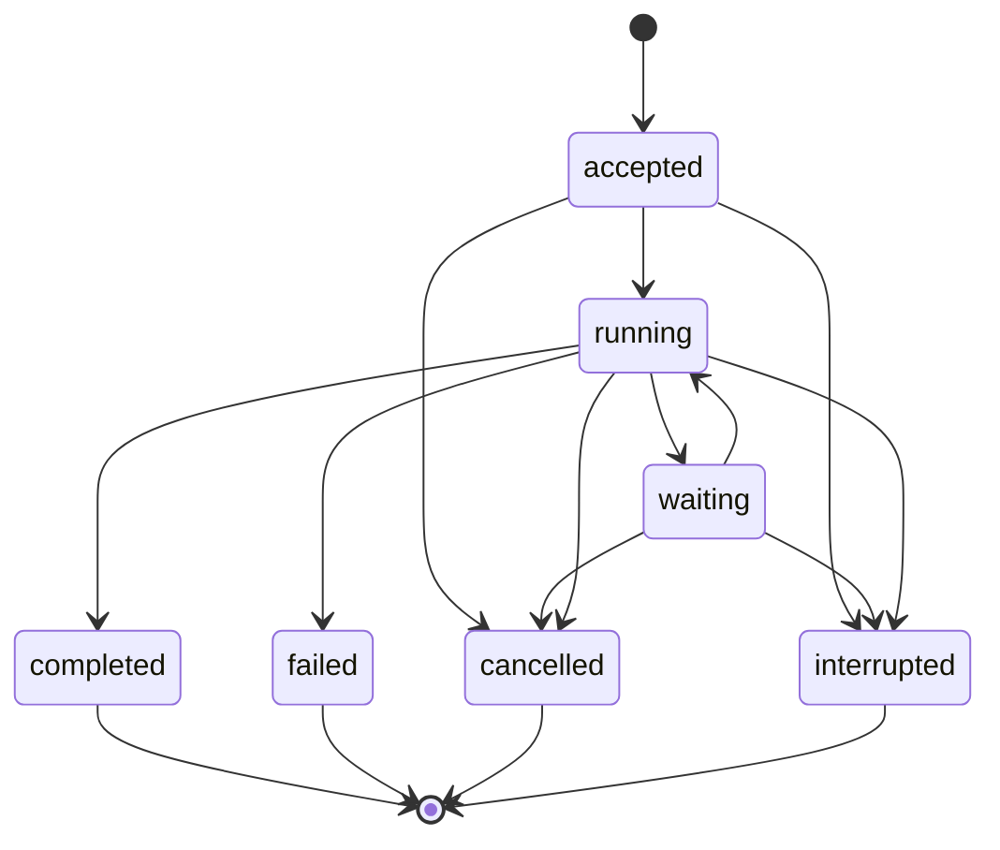

# Sessions, Environments, and State

## Design Position

An Agent UI Session is the local Host authority for one persistent interaction tree and work scope. It pins one immutable resolved Agent snapshot, one immutable resolved Environment snapshot, and one validated root/child Skill-exposure map; owns one root Thread; groups async-child Threads; serializes Turn advancement; selects complete `HarnessState` checkpoints; records assignments to Host-managed Environment resources; retains AG-UI presentation history; and supports Codex-style list, resume, fork, archive, and cleanup operations.

A Session is neither a Pydantic provider session nor a Foundation `Execution`. Its live model clients, provider managers, Environment attachments, Harness Runs, async-subagent tasks, and surface subscriptions are process-local. Local persistence supports restart and explicit continuation without claiming distributed work ownership or exactly-once external effects.

## Boundaries

| Concern                                           | Owner                           | Session relationship                                                                                 |
| ------------------------------------------------- | ------------------------------- | ---------------------------------------------------------------------------------------------------- |
| Agent composition                                 | Resolved Agent snapshot         | Session pins exact identity and digest                                                               |
| Desired Environment topology and lifecycle policy | Resolved Environment snapshot   | Session pins exact identity and digest independently from Agent                                      |
| Provider resource effects and state codec         | Environment Provider Manager    | Agent UI authorizes operations and persists selected provider-state objects                          |
| Harness Environment topology and operations       | Harness                         | Receives fresh attachments for one root or child Run                                                 |
| Thread and Capability continuation                | `HarnessState`                  | Complete checkpoint payload is stored without interpreting private namespaces                        |
| Turn acceptance and checkpoint selection          | Agent UI SQLite metadata        | Serializes one Thread and atomically selects existing immutable state objects                        |
| Presentation history                              | Compressed AG-UI segments       | Retained for replay and Item projection; never reconstructs `HarnessState`                           |
| Async child execution                             | Agent UI async-subagent service | Persists job, child checkpoint, pending input, and delivery facts; active task remains process-local |
| Model-facing Session browsing                     | Read-only Session Capability    | Uses a fresh exact-Session collaborator and safe indexed projections                                 |
| Dynamic configuration                             | Configuration generations       | New revisions become selectable; pinned Session snapshots do not change                              |

## Environment Definition

An Environment definition is a reloadable resource document that composes one or more exact Environment Provider specifications into a named Harness topology and Host lifecycle policy:

```python
class EnvironmentDefinitionDocument(BaseModel):
    schema_version: str
    environment_id: str
    display_name: str
    description: str | None
    bindings: tuple[EnvironmentBindingDefinition, ...]
    default_binding: str | None
    lifecycle: SessionEnvironmentLifecyclePolicy


class EnvironmentBindingDefinition(BaseModel):
    binding_name: str
    model_alias: str
    provider: EnvironmentProviderSpec
    permission_ceiling: EnvironmentPermissionSet
    required: bool


class SessionEnvironmentLifecyclePolicy(BaseModel):
    provision: Literal["eager", "on_first_run"]
    idle: Literal["keep_running", "pause_full", "pause_filesystem"]
    ownership: Literal["session_owned", "caller_owned"]
    delete: Literal["destroy", "detach"]
```

`EnvironmentProviderSpec` and its provider-owned configuration schema are defined by the [Environment Provider catalog](../agent-environment-provider/01-provider-specs-and-catalog.md). Agent UI validates every selected provider key, schema, parameter set, permission ceiling, topology alias, and lifecycle capability while accepting a configuration generation.

`binding_name` is a Host identity; `model_alias` is the bounded alias published through Harness topology. Names are unique in one Environment. `default_binding` is absent only for an empty topology and otherwise names one binding. The Environment definition contains no credential, provider resource ID, container/sandbox ID, endpoint resolved at runtime, attachment, EIP session, live provider object, or `HarnessState`.

Resolution captures exact provider specifications, provider factory provenance, permission ceilings, lifecycle policy, and topology into a compressed immutable `ResolvedEnvironmentSnapshot`. It does not provision resources. Dynamic reload can create another snapshot but never changes the Environment pinned by an existing Session.

## Session Record

The conceptual application view is assembled from SQLite metadata and referenced immutable objects; it is not one monolithic serialized file:

```python
class LocalSession(BaseModel):
    session_id: str
    creation_request_id: str
    root_thread_id: str
    lifecycle_state: Literal[
        "provisioning",
        "ready",
        "blocked",
        "deleting",
        "cleanup_pending",
        "deleted",
    ]
    lifecycle_failure: SafeFailure | None
    created_at: datetime
    updated_at: datetime
    title: str | None
    archived_at: datetime | None
    control_revision: int
    agent_snapshot: AgentSnapshotRef
    environment_snapshot: EnvironmentSnapshotRef
    skill_selections: tuple[SessionAgentSkillSelection, ...]
    parent_fork: SessionForkRef | None
    environment_assignments: tuple[SessionEnvironmentAssignment, ...]
    root: ThreadView
    children: tuple[ThreadView, ...]


class ThreadView(BaseModel):
    thread_id: str
    commit_revision: int
    selected_checkpoint: CheckpointRef | None
    active_turn: TurnRef | None
    turns: tuple[TurnProjection, ...]
    presentation: PresentationReplayIndex


class SessionAgentSkillSelection(BaseModel):
    agent_node_id: str
    mode: Literal["agent_default", "exact"]
    names: tuple[str, ...] = ()
```

`agent_node_id` selects one exact node in the pinned resolved Agent graph, not a mutable current Agent resource. `agent_default` uses that node's snapshot default. `exact` records an exact unique final-name set, including an empty set that disables Skills for that node. Session creation or fork resolves every entry against the node's pinned available Skill revisions and rejects unknown, ambiguous, duplicate, or out-of-node names. Omitted nodes use their Agent default. This map is immutable Session composition: changing it requires a fork rather than a metadata edit.

`session_id`, Thread, Turn, Item, checkpoint, Run, resource, and job identifiers are compact correlations and grant no authority. When a checkpoint is selected, `thread_id` equals its stored `HarnessState.thread_id`. Every retained Item belongs to one Turn and Thread; event sequence and replay cursor remain separate identities.

A Session pins both snapshots and its Skill-exposure map for its complete lifetime. Before persistence or provider effects, the Session compatibility resolver verifies every root and child Agent Environment requirement against the selected Environment binding names, provider-neutral operation families, permission ceilings, provider lifecycle capabilities, and child resource policy. It also resolves each effective Skill name set against the exact available package revisions of the corresponding Agent node. A missing or insufficient binding rejects creation/fork rather than silently narrowing the Agent's authored behavior. Display metadata such as title, archive, pin, ordering, and tags can change under `control_revision` without changing Agent or Environment composition. Selecting another composition creates a fork.

Session creation is durable before provider dispatch:



`creation_request_id` makes retries of one create command select the same provisional Session. `provisioning` and `blocked` Sessions are queryable and expose resource diagnostics but cannot accept Turns. `resume latest` selects only `ready` Sessions unless the user explicitly opens a non-ready Session for reconciliation or deletion.

## Environment Resource Assignment

One Environment binding can own several durable provider resource instances with distinct execution scopes:

```python
class RootEnvironmentOwner(BaseModel):
    kind: Literal["root"]


class AsyncChildEnvironmentOwner(BaseModel):
    kind: Literal["async_child"]
    subagent_job_id: str
    child_thread_id: str | None


type EnvironmentResourceOwner = RootEnvironmentOwner | AsyncChildEnvironmentOwner


class SessionEnvironmentAssignment(BaseModel):
    assignment_id: str
    session_id: str
    binding_name: str
    owner: EnvironmentResourceOwner
    host_resource_id: str
    created_at: datetime


class HostEnvironmentResource(BaseModel):
    host_resource_id: str
    provider_key: str
    provider_spec_digest: str
    resource_allocation: Literal[
        "single_from_spec",
        "multiple_from_spec",
    ]
    lifecycle_state: Literal[
        "unprovisioned",
        "creating",
        "available",
        "pausing",
        "paused",
        "resuming",
        "destroying",
        "destroyed",
        "missing",
        "unknown",
        "failed",
    ]
    operation_fence: int
    selected_provider_state: ProviderStateRef | None
    last_operation: EnvironmentOperationRecord | None
    updated_at: datetime
```

A Session assignment owns binding and execution scope; the Host resource record is the only provider lifecycle and fencing authority. Async-child ownership uses the already persisted subagent job ID before provider dispatch. `child_thread_id` is optional post-entry correlation filled only after the Harness creates or restores the child baseline, and it never replaces the assignment identity.

For `SINGLE_FROM_SPEC`, Agent UI resolves one canonical `host_resource_id` from provider key, exact provider-spec digest, and provider-owned logical resource identity. Every Session using that specification references the same Host resource record and operation fence. For `MULTIPLE_FROM_SPEC`, each independent allocation receives a new Host resource record and provider state. Repeated Session assignments never manufacture another lifecycle authority for a single underlying resource.

The Host resource record selects a provider resource-state object but never stores its payload in SQLite. `operation_fence` increases before each effectful management attempt and prevents a stale completion from selecting state after a later operation. Provider operation IDs and typed reconciliation observations support recovery; they do not claim exactly-once effects.

Lifecycle transitions are Host decisions around Provider Manager calls:



A transition such as `creating` is a durable intent/fence, not proof that provider dispatch occurred. Agent UI commits the intent in SQLite, performs the async Manager operation without a database transaction, publishes the returned provider-state object, and then commits the terminal lifecycle transition if the fence still matches.

Failure after possible dispatch becomes `unknown`. Another create, resume, pause, or destroy is denied until `EnvironmentManager.reconcile()` returns exact-operation running, paused, or absent evidence, or the user explicitly chooses a recorded orphaning outcome. Reconciliation maps `ABSENT` by prior action: create returns to `unprovisioned`, destroy becomes `destroyed`, and resume/pause becomes `missing`. A required `missing` resource blocks the Session until explicit reset provisions a new resource under a higher fence or delete accepts authoritative absence. A missing resource on `resume()` never silently creates a replacement. Caller-owned Direct Local resources are detached rather than removed even when the Session is deleted.

### Provision and Resume

One SQLite transaction first creates the provisional Session, its root Thread, pinned snapshots, every root assignment, any required new Host resource record/fence, and the `creation_request_id`. A `SINGLE_FROM_SPEC` assignment reuses the canonical Host resource record; a `MULTIPLE_FROM_SPEC` assignment creates a fresh record. Only then can provider effects start. `provision="eager"` moves the Session to `ready` after all required root instances are available and their provider state is selected. A required failure or unknown outcome moves it to `blocked` under the same Session identity; reconciliation can move its resource and Session back toward `ready`, while retry or delete never allocates another Session implicitly. Optional binding failure remains an explicit degraded topology on a ready Session. `on_first_run` creates `unprovisioned` root records and can mark the Session ready before provisioning; the first requiring Turn performs the fenced lifecycle before Harness dispatch.

Before a Run, Agent UI makes every required binding available:

1. load the pinned Environment snapshot and selected resource state;
2. construct a fresh provider runtime with current credentials;
3. create or resume the exact resource through its Manager;
4. publish and select any updated provider resource state;
5. enter the `ManagedEnvironment` and acquire one fresh single-use attachment;
6. supply all attachments as one complete Harness Environment topology in fresh `RunBindings`.

A `ManagedEnvironment` can remain entered across sequential Runs owned by the same application-service lifetime, subject to provider concurrency and Host policy. `dedicated` concurrent async children use distinct Host resource records only for providers advertising `MULTIPLE_FROM_SPEC`; every record has its own provider state, operation fence, pause/resume, recovery, and cleanup lifecycle. `shared_root` uses the existing root resource record but acquires a distinct attachment only from providers advertising `SHARED`. `serialized_root` keeps the accepted async job queued until root instances have no active attachment and then reuses them sequentially. `none` supplies no child topology. A child never inherits the parent's attachment or credential, even when it intentionally shares the underlying resource.

### Idle, Restart, and Cleanup

After a root or async-child activity scope becomes idle, the Session lifecycle policy selects keep-running, full pause, or filesystem-only pause. Unsupported pause modes fail before transition and do not silently become disconnect or destroy. Process shutdown disconnects live provider clients after attempting the selected bounded policy; disconnect itself is not pause or destroy.

On application restart, SQLite lifecycle and provider-state references remain. No socket, client, `ManagedEnvironment`, attachment, or Harness binding is restored. A later operation constructs a fresh Manager and calls `resume()` on the selected resource state.

Deleting a Session first moves it to `deleting`, blocks new work, drains or interrupts live work, and releases every root and child assignment. A Host resource can be destroyed only after no retained Session assignment or active attachment references it. Session-owned `MULTIPLE_FROM_SPEC` resources normally become destroy-eligible with their final assignment; a shared `SINGLE_FROM_SPEC` manager-owned resource remains under its one Host fence until the last authorized assignment releases it. Caller-owned resources detach and are never removed. Destroy-eligible resources retain cleanup records until authoritative absence or an explicit unresolved outcome is committed. An unknown cleanup moves the Session to `cleanup_pending`. Metadata and history are not physically removed while required resource cleanup remains retryable unless the user explicitly chooses an orphaning operation that records the external-resource risk.

## Turn and Checkpoint Model

```python
class TurnRecord(BaseModel):
    turn_id: str
    session_id: str
    thread_id: str
    input: StoredRunInput
    state: Literal[
        "accepted",
        "running",
        "waiting",
        "completed",
        "failed",
        "cancelled",
        "interrupted",
    ]
    waiting_reason: Literal[
        "deferred_tool",
        "approval",
        "external_input",
    ] | None
    pending_deferred: PendingDeferredRef | None
    base_checkpoint: CheckpointRef | None
    run_ids: tuple[str, ...]
    terminal_projection: JsonValue | None
    failure: SafeFailure | None
    selected_checkpoint: CheckpointRef | None
    accepted_at: datetime
    finished_at: datetime | None


class CheckpointRef(BaseModel):
    checkpoint_id: str
    thread_id: str
    state_object_digest: str
    harness_release: str


class PendingDeferredRef(BaseModel):
    object_digest: str
    request_digest: str
    request_codec_version: str
    source_run_id: str
    consumed_by_run_id: str | None
```

Stored input, terminal projections, and failure values are bounded safe content. Native clients, live bindings, plugin objects, tasks, locks, credentials, and open streams are absent.

A completed Turn selects the complete checkpoint produced by its terminal Harness result. A failed result can select a complete returned state only when the Harness contract supplies one and explicit Host policy accepts it. Cancelled and interrupted Turns never synthesize state from partial messages, AG-UI events, model provider history, or Environment files.

## Turn Lifecycle



One application command accepts a Turn only after validating Session identity, `lifecycle_state="ready"`, target Thread, expected `thread_commit_revision`, pinned snapshot availability, input limits, Environment eligibility, and absence of another advancing Turn. The short SQLite transaction creates the Turn and advances its accepted revision before model or provider work starts.

`running` means the process entered one Harness Run; it is not durable ownership of restartable work. `waiting` means one Harness Run completed with a suspended result and the same Turn now awaits deferred results, approval, or external input. Agent UI first publishes the complete waiting `HarnessState`, the separate complete `DeferredToolRequests` object, and pending AG-UI segments, then uses one SQLite transaction to select the checkpoint and unconsumed pending-deferred reference, transition `running -> waiting`, and advance the Thread commit revision. Resumption appends a fresh `run_id` to that Turn and enters a new Harness Run from this selected state under the Harness resume contract.

At terminal delivery, Agent UI validates the result, publishes the complete compressed checkpoint and pending AG-UI segment files, then commits the Turn terminal transition and selected checkpoint in one short SQLite transaction. File publication ordering and recovery are owned by [Local Storage and Recovery](03-local-storage-and-recovery.md).

If metadata commit fails after model, tool, or Environment work, the previous checkpoint remains selected and the effect outcome is unknown. Recovery marks a prior-process `accepted` or `running` Turn interrupted. A `waiting` Turn survives restart when its selected complete checkpoint, pinned snapshots, and complete unconsumed deferred-request object validate; corruption, explicit abandonment, cancellation, or incompatibility can transition it to `interrupted`. The Host never automatically reruns unknown work or infers rollback. A later user action can resume a valid waiting Turn or submit a new Turn from the last complete checkpoint with bounded reconciliation context.

## Pending Input Queue

A user can submit bounded follow-up input while a Thread has an advancing Turn when queueing is enabled. Queue acceptance is an SQLite-owned fact separate from Turn acceptance:

```python
class PendingSubmission(BaseModel):
    submission_id: str
    session_id: str
    thread_id: str
    expected_queue_revision: int
    input: StoredRunInput
    created_at: datetime
```

A pending submission is not part of Harness history, AG-UI presentation history, or a Turn until the application service selects it after the current Turn reaches an eligible boundary. Selection validates the latest Thread revision, creates a new Turn, and removes the queue row in one SQLite transaction. Cancellation or deletion of a queued submission has no Harness or provider effect.

The queue never silently merges input into a live model request or mutates private Pydantic message history. Explicit steering of a compatible async child follows the separate async-subagent contract.

## Concurrency

A Thread has at most one foreground Turn in `accepted`, `running`, or `waiting`. The application service holds an in-process guard and verifies the expected Thread commit revision in SQLite before dispatch. Two stale callers cannot both advance one checkpoint.

Session metadata edits use `control_revision` and can proceed independently when they do not alter execution selection. Environment lifecycle operations use per-resource fences and conflict with overlapping operations. Independent Sessions and Threads can execute concurrently subject to Host, model-provider, Environment-provider, and configured resource limits.

A second process cannot steal a live application-store lease. Reclaiming an abandoned process generation permits recovery and interruption marking, not automatic continuation of unknown work.

## Resume and Selection

The product exposes Codex-style Session operations through the application service:

- create a Session from selected Agent and Environment revisions;
- list and search current, recent, archived, pinned, and project-associated Sessions;
- open one exact Session;
- resume the most recent eligible Session under an explicit scope such as project root;
- rename, pin, order, tag, archive, and unarchive;
- fork from an exact complete checkpoint;
- inspect Agent, Environment, resource, Turn, checkpoint, child, and replay state;
- cancel or answer the current waiting Turn;
- delete after work and Environment cleanup policy permit.

“Resume latest” is a metadata query followed by ordinary exact-Session validation. Filesystem location, title, project root, or recency never substitutes for `session_id` or grants authority.

## Forking and Composition Change

A fork creates a new Session and root Thread from the source's empty baseline or one exact complete checkpoint:

```python
class SessionForkRef(BaseModel):
    source_session_id: str
    source_thread_id: str
    source_thread_commit_revision: int
    source_checkpoint: CheckpointRef | None
    source_agent_digest: str
    source_environment_digest: str
```

The new Session receives independent Agent and Environment snapshot selections, Environment resources, future checkpoints, replay, queue, jobs, and revisions. The source remains unchanged.

When the new Session selects the same compatible logical Agent snapshot, Agent UI uses `HarnessState.fork()` on the complete source checkpoint. Selecting a different Agent snapshot requires explicit compatibility validation. Private Capability state never enters an incompatible definition merely because message history is readable. When compatibility is not established, the Host can create a history-seeded fork with a fresh `HarnessState`; the lineage records that no private continuation state transferred.

Environment provider resources are never copied by `HarnessState.fork()`. The fork creates new assignments under its selected Environment lifecycle. A compatible `SINGLE_FROM_SPEC` resource can receive another assignment under the same Host lifecycle authority; a `MULTIPLE_FROM_SPEC` resource assigned exclusively to the new Session is newly provisioned unless an explicit provider-supported attach policy selects an existing resource. Caller-owned workspace sharing remains explicit.

## Presentation and Item State

Compressed AG-UI segments own durable presentation replay. SQLite indexes stable semantic Items and bounded search projections. Replay reconstructs visible messages, reasoning, tools, child activity, Environment availability observations, and terminal status, but cannot:

- replace a selected checkpoint;
- satisfy pending tool calls or approvals;
- restore Capability or provider resource state;
- grant access to another Session or child;
- restart a root or async-child Run;
- prove an external operation did not occur.

A replay gap does not invalidate a verified selected checkpoint. A corrupt checkpoint is never replaced by visible history.

## Read-Only Session Capability

Agent UI offers an optional definition-selected Session Capability for model-assisted browsing of the current Session. It receives one fresh `SessionReadRunCapability` bound to the exact Session, Thread, expected commit revision, content policy, and repository collaborator.

Its first-party tools provide bounded variants of:

- `list_session_items` for retained current-Session Item summaries;
- `search_session` over indexed current-Session user-visible content;
- `read_session_item` for one exact current-Session `item_id`.

The model never supplies a filesystem path or another Session ID. Results exclude raw `HarnessState`, provider state, credentials, hidden model/provider frames, plugin objects, internal receipts, and unapproved child detail.

The Capability cannot create, select, switch, rename, fork, archive, delete, import, export, or compact Sessions; change Agent or Environment composition; select a checkpoint; submit input; control a Run or resource; rewrite configuration; or mutate retention. Those are explicit application commands.

## Async Subagent Records

A Session retains bounded async-subagent job metadata, exact child Agent-node identity, parent scope and lineage, process generation, child Thread correlation, accepted steering input, complete child checkpoint references, complete pending `DeferredToolRequests` when waiting, safe terminal results, and a separate completion-delivery ledger. [Runtime, Subagents, and Surfaces](05-runtime-subagents-and-surfaces.md#async-subagent-job-lifecycle) owns execution and routing.

A live task, child stream, cancellation scope, Environment attachment, model binding, credential, native input router, and usage accumulator remain process-local. On recovery, an `accepted`, `queued`, or `running` job from another process generation becomes `interrupted` unless its terminal outcome was already committed. A `waiting` job can remain waiting only when its exact child checkpoint, unconsumed deferred-request object, pinned child definition, and Environment lifecycle references validate; resumption starts a fresh child Harness Run under the same logical job. The process never recreates or reruns unknown active model/tool work automatically.

Terminal completion and parent delivery are independent. A retained result can be delivered idempotently into an eligible active or later root Run, explicitly inspected, used as the basis of a linked `resume_subagent` job, or discarded under retention policy. Child `HarnessState` never becomes the parent Thread checkpoint.

## Recovery, Retention, and Delete

Recovery validates snapshot and Skill-package references, pinned Skill selections, checkpoint and deferred-request references, Thread identity, Turn transitions, async-job process generations and waiting state, subagent input/delivery ledgers, Environment resource fences, provider-state objects, queue ownership, and AG-UI sequence chains. A selected corrupt Agent snapshot, Environment snapshot, provider state required for lifecycle, or checkpoint fails the affected operation closed. Valid `waiting` Turns remain waiting across process generations; only process-owned active execution observations become interrupted.

Retention preserves every selected root or child checkpoint, unconsumed pending-deferred object, pinned snapshot and Skill package, fork reference required by a retained Session, pending Environment cleanup, undelivered async-child result, and queued submission. Deleting presentation detail can create explicit replay gaps but cannot delete continuation or provider lifecycle authority.

Session delete never claims rollback of model, tool, Environment, or external effects. Unknown provider destroy outcomes remain explicit cleanup records until reconciled or deliberately orphaned by an authorized user action.

## Failure Semantics

| Failure                                                  | Outcome                                                                                                                            |
| -------------------------------------------------------- | ---------------------------------------------------------------------------------------------------------------------------------- |
| Stale control or Thread revision                         | Conflict before affected mutation or Harness dispatch                                                                              |
| Repeated Session create request                          | Same `creation_request_id` returns the existing provisional or ready Session                                                       |
| Missing or incompatible Agent snapshot                   | Session cannot start a Run                                                                                                         |
| Missing or incompatible Environment snapshot/provider    | Session cannot provision or bind the affected topology                                                                             |
| Corrupt selected checkpoint                              | Thread fails closed; AG-UI history is not promoted                                                                                 |
| Corrupt selected provider state                          | Resource lifecycle fails closed; no replacement is created                                                                         |
| Process loss during model, tool, child, or provider work | Prior selected facts remain; active work becomes interrupted/unknown while valid waiting root Turns or child jobs remain resumable |
| Checkpoint publication/selection failure after work      | Prior checkpoint remains selected; effects require reconciliation                                                                  |
| Provider operation result loses its fence race           | Stale result is retained only as diagnostic evidence and cannot select state                                                       |
| AG-UI replay corruption with valid state                 | Continuation can remain available; affected range is an explicit gap                                                               |
| Queue delivery races Session advancement                 | Revision conflict; submission remains queued or is safely retried under one identity                                               |
| Retention/delete races active work                       | Operation conflicts and changes nothing                                                                                            |

## Compatibility

Session metadata schema, Environment definition/snapshot schema, provider resource-state codec, Agent snapshot schema, `HarnessState`, Turn and job schemas, AG-UI event schema, queue schema, and projection schema evolve independently. Unknown provider or state versions fail explicitly. Migration writes and verifies new immutable objects before switching SQLite references.

A newer Agent UI resumes a Session only when it can validate both pinned snapshots, reconstruct the logical Agent, reauthorize and resume Environment resources, import the selected complete Harness state, and decode or explicitly gap retained AG-UI history. Inability to render history does not permit discarding valid continuation; inability to import continuation does not permit continuing from rendered messages.

## Trade-offs

### Independent Agent and Environment selection

Separating behavior from runtime resources allows the same Agent to run in local, container, or remote Environments and the same Environment to host different Agents. Session creation must validate cross-product requirements and manage two immutable snapshots.

### Session-owned provider lifecycle

Binding provider resource state to the Session makes restart, pause, cleanup, and cost policy explicit. Provider operations remain outside SQLite transactions, so unknown outcomes require reconciliation rather than fictitious atomicity.

### Single-writer Thread advancement

Serializing each Thread gives deterministic checkpoint selection. Parallel exploration uses async-child Threads/jobs or explicit forks instead of racing one continuation state.

## Invariants

01. One Session pins exactly one resolved Agent snapshot, one resolved Environment snapshot, and one validated root/child Skill-exposure map, including while its durable lifecycle is provisional or blocked.
02. Agent, Environment, and effective Skill exposure change only through an explicit fork; dynamic configuration reload never mutates a Session.
03. `HarnessState` is the only stored Agent state authority; a waiting root Turn or async-child job additionally pins the exact complete `DeferredToolRequests`, and AG-UI, identifiers, SQLite Items, transcripts, provider state, or Environment files substitute for neither.
04. One Thread has at most one advancing foreground Turn, enforced in process and by expected SQLite revision.
05. A checkpoint file is published before a short SQLite transaction can select it.
06. Provider resources use durable Host fences and selected provider-state objects, while every Harness Run receives fresh single-use attachments and bindings; concurrent sharing or independent allocation requires explicit provider capability.
07. Closing a Harness binding, disconnecting a managed resource, pausing it, and destroying it are independent facts.
08. Process loss preserves unknown external effects and never automatically reruns interrupted root or async-child work; only a fully committed waiting boundary can be resumed explicitly.
09. A Session fork creates a new Session, root Thread, Environment assignment, and lineage without mutating its source.
10. Local identifiers, snapshots, state files, and provider resource IDs grant no current model, Environment, repository, credential, plugin, or execution authority.
