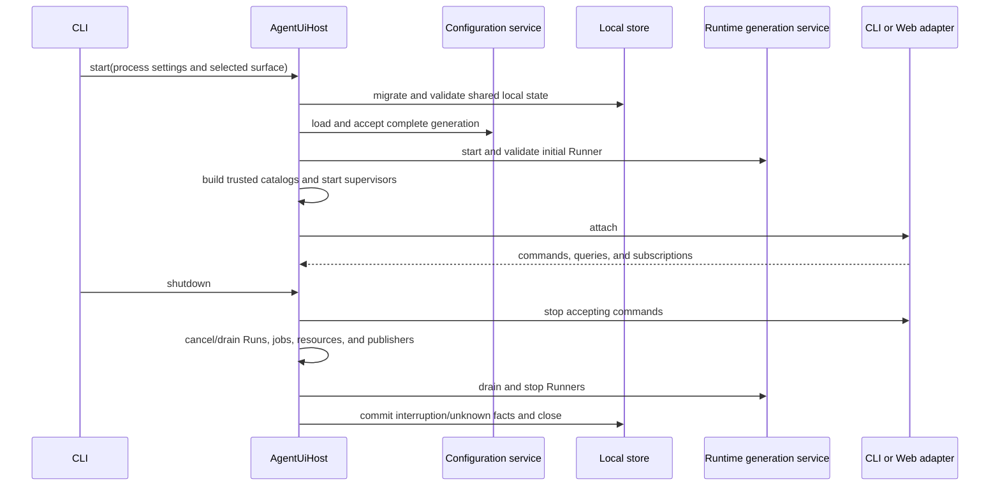
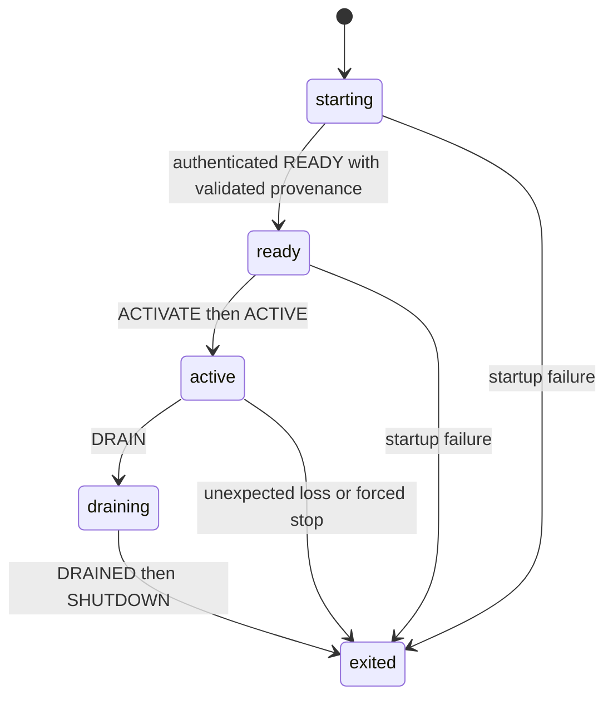
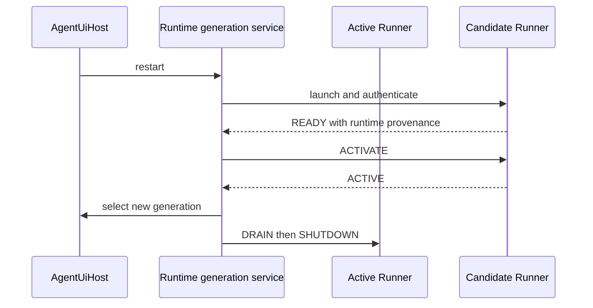
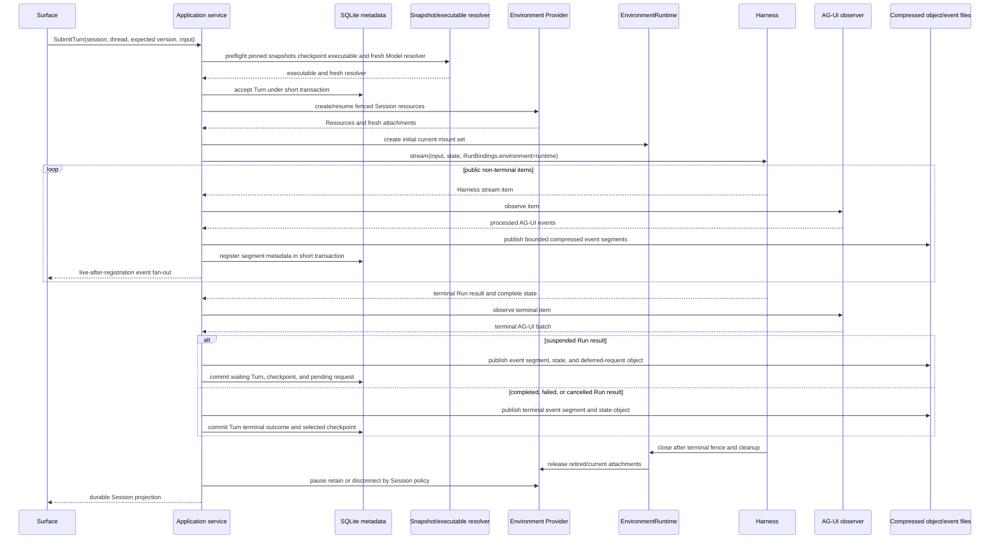
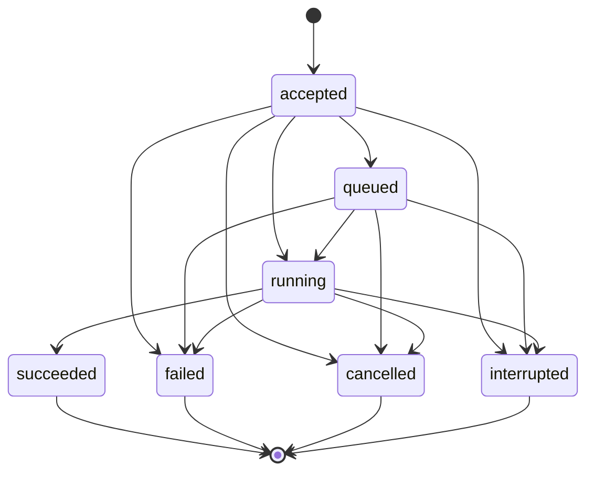
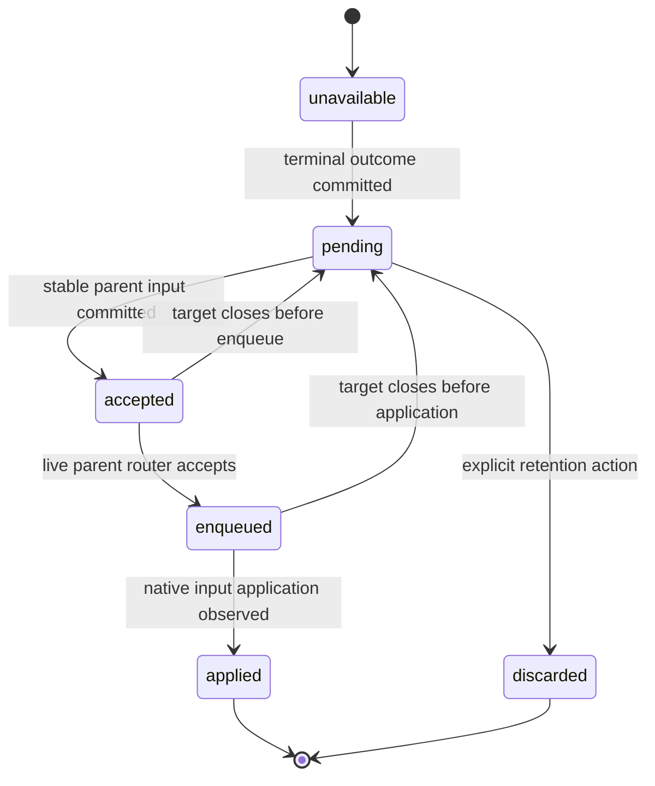
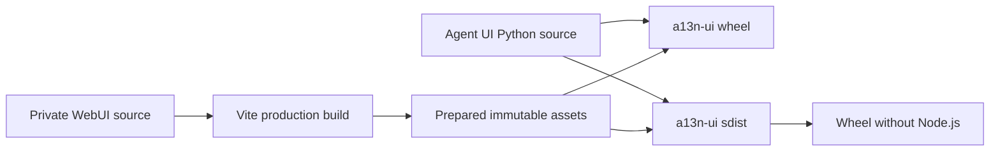

# Runtime, Subagents, and Surfaces

## Design Position

Agent UI has one stable surface-neutral `AgentUiHost`, replaceable runtime Runners, one foreground execution coordinator, and one async-subagent service. The Host is the only product boundary for configuration, composition, Environment lifecycle, Sessions, Runs, replay, runtime selection, and cleanup. CLI calls it directly in the stable process. WebUI reaches the same typed commands and queries through a thin loopback HTTP/SSE adapter.

The stable Host owns durable acceptance, routing, persistence, and commit semantics. A selected runtime Runner owns process-local Harness, plugin, Model, Environment Provider, and Agent Stream Protocol processing behavior. The foreground coordinator consumes every root Runner stream exactly once. Agent UI does not enable Harness blocking inline delegation. Its own definition-selected async-subagent Capability reads the immutable `SubagentCollection` built by the Harness, while a fresh run Capability submits exact `BuiltSubagent` values to Host-owned jobs. The async-subagent service consumes every child Runner stream exactly once. Agent Stream Protocol converts every complete root and async-child stream once with distinct correlation.

## Boundaries

| Concern                                  | Owner                                                         | Agent UI behavior                                                                                        |
| ---------------------------------------- | ------------------------------------------------------------- | -------------------------------------------------------------------------------------------------------- |
| Configuration source mutation and reload | Configuration service                                         | Atomic source write, generation acceptance, diagnostics, and subscriptions                               |
| Resource CRUD and validation             | Model, Prompt, Plugin, Skill, Agent, and Environment services | Typed application operations over one captured generation                                                |
| Complete root and child executable graph | Agent resolver and Harness build                              | Reuses exact immutable snapshot; no runtime child rebuilding                                             |
| Foreground Agent loop and continuation   | Harness                                                       | One entered `HarnessRunStream` with fresh `RunBindings`                                                  |
| Async child presentation                 | Agent UI async-subagent Capability                            | Fixed-background delegate/resume/info/wait/steer/cancel tools over exact built children                  |
| Async child scheduling and delivery      | Agent UI async-subagent service                               | Supervised tasks, durable metadata/checkpoints, input, cancellation, result retention, and process fence |
| Environment resource lifecycle           | Agent UI plus `EnvironmentProvider`                           | Fenced create/resume/pause/destroy and fresh attachments                                                 |
| Current Environment mount set            | Harness `EnvironmentRuntime`                                  | Selected Runner retains the runtime and reconciles fresh attachment-backed mounts                        |
| AG-UI conversion                         | Agent Stream Protocol                                         | One complete observer per root or async-child Run                                                        |
| Session/state/event persistence          | Agent UI local store                                          | SQLite control facts and compressed immutable payload files                                              |
| Runtime process lifecycle                | Agent UI runtime-generation service                           | Starts, validates, promotes, drains, and stops replaceable Runner processes                              |
| Durable acceptance and commit            | Stable `AgentUiHost`                                          | Owns routing, SQLite/object/event writes, fences, and terminal selection                                 |
| Process-local execution                  | Selected runtime Runner                                       | Owns Harness/plugin/Model/Provider objects and streams; never owns Agent UI storage                      |
| Web and terminal presentation            | Surface adapters                                              | Submit typed Host commands and consume safe query/event projections                                      |
| Distributed durable execution            | Foundation Service                                            | Not emulated by local process tasks or storage                                                           |

## Application Service

One `AgentUiHost` owns the supervised stable lifetime of:

- configuration and accepted-generation services;
- product resource catalogs and editors;
- Agent/Environment snapshot resolvers;
- executable cache;
- local metadata/object/event stores;
- model and credential adapters;
- Environment provider resources;
- Local Sandbox runtime resolver and verified executable cache;
- foreground run coordinator;
- async-subagent job, input, and delivery service;
- retained/live event subscriptions;
- runtime-generation routing and Runner supervision;
- Web or CLI surface adapter.

Its public surface is grouped by semantic services rather than storage tables:

```python
class AgentUiHost(Protocol):
    configuration: ConfigurationApplicationService
    models: ModelApplicationService
    prompts: PromptApplicationService
    plugins: PluginApplicationService
    skills: SkillApplicationService
    agents: AgentApplicationService
    environments: EnvironmentApplicationService
    sessions: SessionApplicationService
    runs: RunApplicationService
    events: EventApplicationService
    runtime: RuntimeGenerationApplicationService
```

Commands carry stable resource selectors, expected versions, bounded content, and explicit operation intent. Queries return detached safe projections. No application value exposes a SQLite connection, filesystem path as authority, `HarnessRunStream`, native Model, plugin object, `EnvironmentProvider`, provider attachment, `EnvironmentRuntime`, credential, task, lock, or raw `HarnessState`.

The runtime Runner constructs process-local Model resolvers and other execution collaborators from the exact Host-selected snapshot and fresh current authority before every attempted root or child Run. The default execution boundary fails explicitly with `model_resolver_unavailable`; an invalid collaborator fails before Harness dispatch. Configuration, Session, Environment, runtime-management, and replay operations remain available without a Model resolver, and no native resolver or credential is persisted or reconstructed from ambient state.

All mutation and execution paths are available to both CLI and WebUI according to the same local-user policy. A surface cannot acquire extra authority by reading storage, calling runtime packages, or controlling the Runner supervisor directly.

## Application Lifetime



Startup does not accept surface commands until authoritative SQLite metadata, selected state objects, configuration generation, projections required for queries, and the initial runtime Runner validate. Opening another Host never classifies another process's active work as abandoned. Shutdown stops acceptance, preserves external cancellation across cleanup, closes every entered Runner stream in its owning task, applies Environment lifecycle policy, seals pending AG-UI segments, stops runtime Runners, and closes this process's store connections.

## Runtime Runner Lifecycle

`AgentUiHost` remains alive while runtime Runners restart. The stable process owns its SQLite connections, immutable-object and event-store collaborators, configuration view, frontend listeners, runtime selection, and durable commit decisions. Other local Host processes can use the same data root through the storage concurrency contract. A Runner never opens Agent UI storage, edits desired configuration, accepts work durably, selects a checkpoint, or serves a frontend.

A Runner starts in a fresh Python interpreter from an exact argument vector without shell evaluation. Agent UI process control uses a private loopback connection with a versioned bounded message format and an unguessable single-use launch capability. Standard output and standard error remain ordinary diagnostic streams rather than protocol channels. Authentication and generation correlation complete before the launch capability is discarded.

The runtime-generation service uses one process-local lifecycle serializer so startup, restart, and close cannot interleave. It has no distributed lock or lease protocol. One generation follows these observable states:



`ready` proves that the child control endpoint authenticated and reported the expected Runner release, protocol version, and loaded provenance. A candidate performs no application work before activation.

Restart uses a direct activation cutover:



Failure before `ACTIVE` stops the candidate and leaves the previous active Runner selected. The Host changes its process-local selection only after `ACTIVE`; no prepare/commit consensus, admission barrier, or abort subprotocol is required for one passive candidate. After activation, only later eligible work selects the new generation. An active Run remains on the Runner that admitted it; work never migrates between interpreters, and Runner memory is never promoted to durable state.

Drain is bounded. Timeout escalates to terminate and then kill, and the resulting observation distinguishes graceful drain, nonzero exit, unexpected loss, forced termination, and forced kill. Process exit alone never proves that model, tool, provider, or Environment effects stopped or completed. Runner loss maps affected accepted work to the existing interrupted or unknown Host outcomes, while generation-fenced late output cannot commit.

Runtime status and restart are typed Host operations. They return detached generation observations and bounded diagnostics; CLI and WebUI never receive the control capability, socket, process handle, or direct supervisor reference.

## Configuration Editing and Reload

WebUI and CLI resource editors call the same Host commands. An edit:

1. reads one resource and its source revision from a captured configuration generation;
2. validates the proposed strict document locally;
3. stages the replacement source values and publishes a one- or multi-resource source transaction manifest under a source-specific edit lease;
4. requests an immediate configuration reload against the exact manifest digests;
5. succeeds only when the intended digest set appears in a newly accepted generation;
6. returns bounded diagnostics while leaving the prior accepted generation active on failure.

External file edits enter through the same reload pipeline. A file watcher is an optimization; periodic source reconciliation and explicit reload prevent dropped watcher events from becoming authority. One application event announces accepted generation, changed resource digests, and restart-bound settings without leaking source content or credentials.

Deleting or replacing current source content never removes immutable snapshots referenced by Sessions or active executables. A validation command can perform complete Agent reconstruction and cleanup without creating a Session.

## Local Sandbox Runtime Resolution

Agent UI presents `a13n.local-envd` as **Local Sandbox**. This is distinct from Direct Local: it requires a Host-launched envd process, trusted stdio EIP, and successful native isolation. Selecting Direct Local, Docker, or E2B never invokes Host envd acquisition.

Each Agent UI release contains one package-owned immutable manifest that pins an exact canonical agent-envd release and, for each supported Linux, macOS, and Windows x86_64/ARM64 target, the exact release archive identity, archive SHA-256, extracted executable SHA-256, and expected executable name. The wheel and sdist contain the manifest but do not bundle all native executables. Release validation rejects missing targets, mutable asset selectors, inconsistent versions, or hashes not reproduced from the selected agent-envd release artifacts.

The Host resolves Local Sandbox in this order:

1. when an explicit absolute executable override is configured, select only that path and perform no managed download;
2. otherwise detect the current supported OS/architecture, select its exact manifest entry, and use `runtimes/agent-envd/<version>/<target>/agent-envd[.exe]` under the data root;
3. when the managed executable is absent or fails hash validation, lazily download only the selected immutable archive, verify its embedded manifest hash, extract the one expected executable through bounded staging, verify the executable hash, and atomically publish it;
4. execute `agent-envd --version` and require the manifest's exact canonical release identity;
5. execute `agent-envd isolation probe --json` and require successful production-equivalent native isolation;
6. when the installed Environment Provider release exposes the required Local Envd runtime integration, supply the resolved absolute executable and a private-runtime allocator to that provider runtime; otherwise report `local_envd_provider_unavailable` before Provider or Harness dispatch.

Both the default managed path and an advanced absolute override must report the manifest's exact release identity; the override changes executable location, not Agent UI's selected envd version. Neither path searches ambient `PATH`. Download, hash verification, cache publication, target detection, override validation, and user-facing availability diagnostics belong to the Agent UI Host. The Local Envd Provider owns daemon configuration, private runtime and subprocess lifecycle, and fresh stdio `EIPEnvironmentAttachment`; `a13n-envd-client` owns only EIP transport/session behavior.

Artifact resolution and probe failure occur before provider or Harness dispatch. Daemon startup, isolation-descriptor, Environment-identity, required-method, or EIP compatibility failure closes the attempted provider process and leaves Local Sandbox unavailable. Agent UI never falls back to Direct Local, disables isolation, or silently selects an ambient executable.

## Foreground Run Flow

The `SubmitTurn` command names a Session, Thread, expected Thread commit version, and bounded input. The coordinator performs one canonical flow:



The coordinator is the sole `HarnessRunStream` consumer. It routes every item to the AG-UI observer before any surface sees it, captures the terminal result, validates complete state, and closes the stream in its owning scope. The selected Runner acts as the embedding Host for the Harness: it retains the single-use `EnvironmentRuntime` for the complete logical Run, while Harness lifecycle owns activation, the terminal mutation fence, mount retirement, and runtime close.

Model resolution, credential reads, Host run Capabilities, Plugin run binding, Session-read collaboration, async-subagent collaboration, exact Skill selection, provider attachments, `EnvironmentRuntime`, Identity, usage, and policy are fresh for every root and child Run. The embedding Host supplies the application-lifetime `RunModelResolverFactory`; the coordinator invokes it for each Run with the exact pinned Agent snapshot and passes its fresh resolver through public `RunBindings`. The default boundary is explicitly unavailable rather than ambient or synthetic. Pinned snapshots can narrow current authority but cannot restore it.

Input acceptance, Environment availability, Harness start, event-file registration, live event delivery, Harness terminal result, checkpoint selection, Environment pause, OTel export, and surface rendering are independent facts. Event fan-out follows successful durable registration, but neither delivery fact establishes the Harness or Turn outcome. A surface disconnect does not cancel work. Explicit cancellation requests ordinary Harness cancellation, drains the same entered stream, and records its actual outcome. Accepted or waiting work with no active stream can be cancelled directly under the expected Thread commit version; cancellation never selects partial state.

The fresh root bindings include the Agent UI async-subagent run Capability only when the pinned Agent node selects the behavior Capability. It is scoped to the exact Session, parent Thread, Turn, Run, Agent node, process generation, and current policy. Possession of the built child collection, a job ID, or a prior run Capability does not authorize submission.

## Deferred Input and Approval

A suspended Harness result keeps the same Host Turn in `waiting`. The coordinator publishes the complete selected `HarnessState`, the separate exact public `DeferredToolRequests` object returned by the Harness, and pending event segments, then atomically commits the `waiting` transition, both object references, unconsumed status, and Thread commit version in SQLite. A valid waiting Turn survives process restart. Surfaces render the corresponding safe projection and submit one typed response command bound to the Session, Thread, Turn, expected version, and exact deferred identifiers.

The Host loads and validates the complete pending request object, combines the authorized responses with that exact value in `DeferredToolResume`, records one consuming `run_id` before dispatch, directs the selected Runner to create a fresh Model resolver, fresh provider attachments, a new `EnvironmentRuntime`, and fresh Host bindings, and appends the Run to the same Turn. AG-UI replay and identifiers alone never reconstruct or satisfy deferred state. Stale, duplicate, mismatched, already-consumed, corrupt, or incompatible responses conflict before another Harness dispatch.

## Background Process Observation

The Harness `ShellToolset` and its recreatable `ProcessManager` own all six shell/process tools, the portable `process-N` projection in `AgentContextState`, independent unread output offsets, exact provider-identity rebinding, Turn-scoped completion waits, native enqueue hints, and terminal release. Agent UI does not implement a second process registry and does not replace `shell_wait`, `shell_status`, `shell_input`, `shell_signal`, or `shell_kill`.

Every foreground root or child Run that enters the configured Dynamic Environment Capability receives the same Turn-scoped Harness observation behavior. Completion and observation-gap events are non-authoritative hints; authoritative status and retained output remain in `BoundProcessOperations` and are reconciled through ordinary Harness tools. Agent UI may supply `ProcessEventHook` values to route a hint into telemetry or durable scheduling, but a hook, Harness task, and live bound handle are process-local and never enter a Session checkpoint or SQLite authority.

Agent UI persists the complete selected `HarnessState`, including the managed process projection, with the normal Thread checkpoint. To preserve a background process across a later Turn, it also retains or reconstructs the provider resource and attaches the same `provider_type`, `environment_id`, and `generation`; the fresh manager then lazily rebinds the exact provider process ID. An absent attachment remains unavailable without erasing the reference. A generation change or authoritative not-found result becomes `backend_lost` and never retargets through a current alias. If completion must wake work while no Harness Turn is active, Agent UI uses provider-native events or polling keyed by its durable Environment-resource record, schedules a new Run, and lets status or wait reconcile the result. The built-in Direct Local mount ends managed processes when its provider scope closes and cannot preserve them across Agent UI Runs. EIP can do so only while the `agent-envd` resource and retained output survive under the same generation.

## Environment Operations

Environment application commands provide full local product control:

- validate an Environment definition and provider availability;
- provision Session resources for every desired mount;
- inspect safe lifecycle and provider observations;
- resume or pause the resource assigned to one desired mount under its supported mode;
- reset by explicit destroy-and-create after authoritative absence;
- retain or explicitly destroy unreferenced provider resources according to lifecycle policy;
- release Session assignments and destroy eligible Host resources only after their final assignment;
- reconcile `unknown` operations with provider-specific evidence;
- subscribe to safe desired-mount and lifecycle changes.

Every effectful operation commits a fence before calling the `EnvironmentProvider` and commits returned state only under the same fence. The Host never exposes arbitrary vendor API passthrough. Provider credentials enter through fresh runtime collaborators and are absent from commands, SQLite payload columns, AG-UI, model context, and default logs/telemetry.

For each active Run, the selected Runner retains the exact `EnvironmentRuntime` supplied through `RunBindings.environment`. The runtime starts from one atomically prepared mapping containing every selected desired mount and keyed by the desired mounts' `model_alias` values. Agent UI does not mutate this current mount set during the Run. A provider availability change is reconciled through Host lifecycle authority and affects a later Run, whose fresh runtime again contains the complete pinned desired mount set.

The runtime and its current mount set are process-local and close with the Run. They do not change the Session-pinned desired mount definitions, default selection, provider resource assignments, lifecycle records, Agent snapshot, Dynamic Environment Capability selection, or Toolsets. Provider attachment and provider resource lifecycle remain independent from Agent configuration reload.

## Async Subagent Capability

The Agent UI async-subagent behavior Capability has reproducible instructions, tools, and policy but no live scheduler. Agent UI reconstructs it from `AsyncSubagentConfiguration`; it is never the Harness first-party `DelegationCapability`. During `for_run()` it reads the exact immediate `SubagentCollection` from the current `AgentContext` and requires one fresh typed run Capability:

```python
@dataclass(frozen=True, slots=True)
class AgentUiAsyncSubagentRunCapability(
    AbstractCapability[AgentContext]
):
    owner: AsyncSubagentOwnerScope
    jobs: AsyncSubagentJobService
    binder: AsyncSubagentBinder


class AsyncSubagentOwnerScope(BaseModel):
    session_id: str
    parent_thread_id: str
    parent_turn_id: str
    parent_run_id: str
    parent_agent_node_id: str
    parent_job_id: str | None
    depth: int
    process_generation: str
```

The public run Capability exposes typed methods rather than mutable scheduler fields. Agent UI places exactly one expected instance in fresh `RunBindings.capabilities`; missing, duplicate, stale, or wrong-type collaboration fails before child submission. The behavior Capability selects only `ctx.deps.subagents.require(name)`. It cannot submit an arbitrary executable, current Agent resource, snapshot ID, or path, and the collection itself grants no authority.

The standard model-facing tools are:

| Tool              | Contract                                                                                                        |
| ----------------- | --------------------------------------------------------------------------------------------------------------- |
| `delegate`        | Accept one new exact immediate child and bounded task; return its compact `execution_id` immediately            |
| `resume_subagent` | Create a new linked job from one compatible terminal execution and its selected complete child state            |
| `subagent_info`   | Page the current scope's configured child roster and safe job projections, or inspect one exact job             |
| `wait_subagent`   | Perform one bounded wait for an exact job or a snapshot of current nonterminal jobs; timeout never cancels work |
| `steer_subagent`  | Persist bounded input for one compatible live job when its edge enables steering                                |
| `cancel_subagent` | Record cancellation intent and request cancellation of one exact nonterminal job                                |

`delegate` and `resume_subagent` have no mode argument: every accepted execution is Host-scheduled and asynchronous. `wait_subagent` can suspend the current tool coroutine while the independently owned job progresses, but it does not convert the child into inline Harness delegation, share the parent usage accumulator, or make parent cancellation the child execution boundary.

All model projections are bounded and omit snapshot digests, provider state, deferred payloads, credentials, internal Agent identities, and raw child `HarnessState`. `execution_id` is a compact display-safe reference resolved together with the trusted owner scope. It cannot address another Session, parent Agent instance, or sibling owner merely by possession.

Spawn and resume idempotency derive from the native parent tool-call identity, parent Run, operation, and target. Replaying the same intent returns the same accepted job. Reusing that identity with another child, prior execution, task, or policy fails before side effects.

## Child Acceptance, Binding, and Start

Job acceptance is a short SQLite transaction that validates the owner scope, parent Turn and process generation, exact built edge and child Agent-node digest, configured depth/concurrency/spawn limits, edge lifetime, steering/continuation policy, and idempotency key. It creates the job before provider or model work and returns `execution_id` after commit. The live scheduling operation retains the exact `BuiltSubagent` object selected from `AgentContext.subagents`; acceptance is not proof that the child started.

The async-subagent service then prepares fresh child authority:

1. verify the retained exact `BuiltSubagent` against the child node and edge in the Session-pinned Agent snapshot; a new linked continuation reconstructs the pinned executable graph and selects the exact edge again through its parent `SubagentCollection` rather than building or looking up an independent child executable;
2. derive bounded child input under the authored `DelegationContextPolicy` without sharing parent messages or `AgentContext` by alias;
3. derive a fresh child `AgentIdentityRef` from the parent workload identity and the edge's `SubagentIdentityPolicy`: preserve `issuer`, `subject`, and all claims, then replace `agent_id` with the resolved child Agent's `agent_id` unless `inherit_agent_id=true`;
4. apply edge `usage_limits`, Host budget narrowing, depth, and current policy;
5. derive the child node's independent pinned Session Skill selection and supply a fresh `SkillSelectionRunCapability` when exact selection applies;
6. resolve current Model credentials and every child-required Host run Capability;
7. persist any child Environment assignments and operation fences before provider dispatch;
8. acquire fresh single-use provider attachments, construct one single-use child `EnvironmentRuntime`, and place it in complete child `RunBindings` through the trusted Agent UI binder;
9. enter `selected_built_subagent.executable.stream()` in a supervised Host task and consume it once.

The Agent UI binder owns the final complete child bindings and may replace the derived Identity when current Host authorization requires it; Harness does not rewrite Identity after the binder returns. The binder always creates a fresh child instance and lineage context even when `inherit_agent_id=true` preserves the logical Agent claim.

`dedicated` Environment policy allocates independent `MULTIPLE_FROM_SPEC` Host resources. `shared_root` acquires distinct attachments only from `SHARED` resources. `serialized_root` keeps the accepted job in `queued` until every selected root attachment is released, then acquires fresh sequential attachments. `none` supplies a fresh empty `EnvironmentRuntime`. A child never receives the parent's attachment, runtime, Model resolver, credential, run Capability, plugin run graph, or live scheduler object by inheritance.

A child can expose its own async-subagent Capability over its recursively built collection. The fresh child owner scope records `parent_job_id` and incremented depth, and all parent/edge/Host ceilings can only narrow. There is no separate nesting registry or runtime child builder.

## Async Subagent Job Lifecycle

One logical job owns exactly one non-suspending child Harness Run:



A job record owns stable job/root/parent/child identities, exact child node and edge, process generation, idempotency and lineage, state, one child Run ID, child Thread ID, Environment assignments, safe result/failure, terminal child checkpoint, cumulative Host accounting, and delivery identity. The selected child `HarnessState` belongs only to the child Thread and never enters parent `HarnessState` or the parent's selected checkpoint.

For each nonterminal stream item, the service applies the ordinary child AG-UI observer, persists bounded event segments, and publishes safe live detail. At a completed, failed, or cancelled boundary it publishes any complete child state and terminal events before committing the terminal job outcome. A child failure is a real failed job, not synthetic successful text.

Harness child invocations deny runtime deferred calls inside the same Run and never return a suspended result. If an unexpected bypass still produces terminal `DeferredToolRequests`, the Harness normalizes it to `status="failed"` with `code="subagent_deferred_unsupported"`; Agent UI commits that ordinary failed terminal job and exposes no answer, approval, denial, or resume action for it.

Opening another Host does not change an `accepted`, `queued`, or `running` job because process generation is not liveness evidence. It is never submitted or replayed automatically, even when no child Run ID was recorded. An explicit versioned cancellation or recovery operation can mark unresolved work `interrupted`; committed terminal outcomes remain. `resume_subagent` accepts a compatible terminal job with a selected complete child state and creates a new linked job under a new `execution_id`; it never mutates the terminal record, performs deferred resume, or consults the latest child definition. One terminal job can designate at most one delivery-successor continuation. Creating that successor atomically transfers its still-pending immediate-child delivery targets to the new job under the same stable delivery identities; a different continuation attempt conflicts rather than racing or duplicating delivery.

Active task, stream, model, provider attachment, `EnvironmentRuntime`, cancellation scope, native input router, usage accumulator, and authority remain process-local. Durable acceptance, failover, and automatic retry remain Foundation Service responsibilities.

## Steering

Steering uses an owner-scoped input ledger with stable input ID and states `accepted`, `enqueued`, `applied`, and `rejected`. The service commits content and idempotency before signaling a live child router. The router can apply it only at a native supported boundary; acceptance does not claim that a later child model request incorporated it. Terminal, cancelled, fenced, wrong-owner, disabled-edge, or incompatible jobs reject the input without a tool failure that could invite duplicate submission.

A process loss rejects accepted/enqueued steering that cannot be proven applied. Steering never mutates private Pydantic messages, `HarnessState`, or a live `AgentContext`, and cannot manufacture deferred approval or external-result input for a child.

## Completion Retention and Parent Delivery

Execution outcome and parent delivery advance independently:



A terminal result first becomes `pending` with a bounded safe outcome and stable delivery identity. Its exact parent execution scope is either the Session root Thread or the immediate parent async job recorded in `parent_job_id`. Under `completion_delivery="active_or_next_run"`, a fresh async-subagent run Capability checks pending deliveries for its exact parent scope before eligible model boundaries. If an active router exists, Agent UI commits a deterministic delivery-attempt input record before native enqueue. If no compatible parent Run is active, the delivery remains pending: a root-owned completion is considered in the next ordinary serialized root Run, while a nested completion is considered in the still-live parent job or the one explicitly designated delivery-successor continuation of that exact parent job. Completion never starts a root Turn or child continuation on its own. `manual` leaves the delivery pending until an explicit application delivery command; model query/wait can observe the result but does not advance delivery.

Delivery content names `execution_id`, child name, terminal state, safe bounded output/failure, and continuation availability. It contains no child state or authority. Each delivery attempt has a deterministic target-run input ID under one stable delivery identity. Input-ledger reconciliation makes retries idempotent within an attempt; a rejected target attempt returns the logical delivery to `pending` for a later compatible parent Run. `applied` means native parent input application was observed, not that a model followed or accepted the result. `subagent_info` and `wait_subagent` are observations and do not rewrite execution outcome; repeated delivery or query uses the same job and delivery identities.

Delivery into an active Run, delivery in a later Run, explicit result inspection, linked continuation, and surface notification all refer to the same retained job. None merges child message history or Capability state into the parent. Retention cannot delete a terminal job while delivery, linked continuation, export, terminal child state, or Environment cleanup still references it.

## Cancellation and Unknown Outcomes

Foreground cancellation of an active Run is a process-local request to that exact `HarnessRunStream`; the cancellation command returns the current Turn projection, while the sole coordinator drains the same entered stream and commits the observed terminal outcome. An accepted or waiting foreground Turn with no active stream can commit `cancelled` directly under the expected Thread commit version. Neither path selects partial state. Async-child cancellation records intent for the exact job before requesting its live coordinator task. Edge `lifetime="parent_scope"` requests child cancellation when the spawning root Turn or parent async job is cancelled, interrupted, or abandoned; `session` does not couple ordinary parent-scope completion or cancellation to the child. Session deletion fences and cancels every nonterminal child regardless of edge lifetime.

Cancellation does not roll back provider, tool, Environment, or external effects. If cleanup or external dispatch outcome is uncertain, the Turn/job/resource remains `interrupted` or `unknown` with bounded reconciliation evidence. Repeated cancel of a terminal job returns the same terminal projection. Duplicate event notification, surface reconnect, status query, or completion wake-up never duplicates execution or parent delivery. A stale run Capability cannot submit, steer, cancel, or claim delivery after its Run closes; a later fresh Capability must independently authorize the exact scope.

## Retained and Live AG-UI

The selected Runner observes each public item of every complete root and async-child Harness Run once, including the terminal result item, and applies the generation-selected Agent UI processor. The Host validates the resulting sequence, assigns Session presentation sequence and event identity, stores and registers compressed segments, and only then fans out detached values to subscribers. Every async child has its own Thread, Run, Agent-node, job, and lineage correlation and produces its own real terminal AG-UI outcome. Child presentation never substitutes for the job outcome, terminal child checkpoint, or parent-delivery ledger.

A subscription consists of:

1. registration of one bounded live queue and capture of the current durable replay watermark under the Session append lock;
2. one finite retained replay query ending exactly at that watermark;
3. live deliveries beginning strictly after the watermark, with deduplication by Host event identity and sequence;
4. explicit closure and replay resumption when backpressure, retention, or corruption prevents exact continuation.

This cutover is gap-free with respect to successfully registered segments: a concurrent append occurs wholly before the captured replay boundary or enters the already registered live queue. A bounded slow subscriber is disconnected instead of receiving silent interior loss and resumes through ordinary finite replay after its last sequence.

Subscribers never consume the Harness stream, file watcher, SQLite WAL, or event files directly. A query can page durable Items and protocol events without loading complete `HarnessState` or provider-state payloads.

## WebUI

WebUI is a complete browser product compiled into `a13n-ui`. It exposes pages and workflows for:

- Models and credential-reference status;
- Prompts;
- Plugin instances and factory provenance;
- Skills;
- Agent composition, validation, child topology, and revision history;
- Environment definitions, desired mounts, provider resources, lifecycle, and active-Run current mounts;
- Session list/search/resume/fork/archive/delete;
- streaming Agent interaction, reasoning, tools, approvals, questions, cancellation, and queued input;
- async-subagent configuration, job trees, live steering, cancellation, retained terminal results, and parent delivery;
- configuration reload diagnostics and restart-required settings;
- retained AG-UI protocol inspection and replay gaps.

The Python Host serves immutable bundled assets plus a thin command/query API and SSE event transport. Request handlers finish authorization and required short reads before streaming. An SSE generator holds no yielded database session and opens fresh short store operations only when needed.

The browser never becomes a model provider, Environment provider, EIP requester, Harness client, plugin loader, or storage reader. It receives safe projections and submits typed commands.

### Loopback Authority

The Web transport binds loopback by default for one local user. Each Host lifetime creates an unguessable browser capability presented by every command and stream attachment. The server validates exact `Host`, `Origin`, and capability values, exposes no wildcard credentialed CORS policy, and keeps browser API, static routes, and SSE routes distinct. Unknown API/stream paths never receive the browser shell through history fallback.

The capability is process-local, absent from configuration, Session storage, model context, URLs intended for sharing, and ordinary logs. Non-loopback exposure requires an adopting wrapper to provide authentication, authorization, TLS, Host, and origin policy; the built-in local capability is not a remote multi-user contract.

## CLI

The default `a13n-ui` command and explicit `a13n-ui tui` command are aliases for the same interactive terminal frontend. Both construct the same `AgentUiHost`, start its runtime-generation service before accepting terminal input, perform no HTTP request, start no Web server, and listen on no frontend port. One-shot CLI paths use the same Host boundary rather than defining another application core.

The interactive CLI is a Codex-style single-page terminal experience. One-shot commands expose explicit human-readable or machine-readable output without introducing a second application API. Both consume the same AG-UI schemas and durable query projections. Terminal resize, key binding, clipboard, color, and pager behavior do not alter command or Session semantics.

CLI exit follows the Host shutdown contract: stop frontend acceptance, explicitly cancel or drain current root and async-child work according to Host policy, drain runtime Runners, apply Environment policy, and close this process's storage collaborators last. Closing a renderer or abandoning a one-shot wait is not an implicit claim that accepted work or provider effects stopped.

## Surface Equivalence

Surface equivalence is semantic command and observation parity, not identical layout. Both modes can:

- manage all configuration resource kinds and trigger reload;
- validate and select Agent and Environment revisions;
- create, list, search, resume, rename, fork, archive, and delete Sessions;
- provision, inspect, pause, resume, reset, detach, and destroy authorized Environment resources;
- submit and queue input, cancel, answer approvals/questions, and inspect terminal outcomes;
- observe root/child/tool/reasoning/Environment events and replay history;
- control authorized live async children and inspect or deliver retained terminal outcomes;
- inspect safe configuration, storage, and replay diagnostics.

A renderer-only preference can remain surface-specific. Any operation that affects execution, storage, configuration, runtime selection, Environment resources, or authority belongs to `AgentUiHost` and cannot exist only as hidden renderer behavior.

## Packaging

`apps/harness-ui` remains private source input to the Python distribution:



Generated browser assets are not committed. Source-checkout builds use locked frontend dependencies and copy a manifest plus hashed assets into the package. The sdist contains prepared assets, so sdist-to-wheel construction does not require Node.js. Build and release verification fail when the application shell or referenced assets are missing.

Agent UI releases independently and pins one exact compatible Harness release group in published metadata. The same reviewed release source pins one exact agent-envd release manifest with all supported target assets and hashes. The private WebUI has no independent npm publication, version, tag, or release channel.

## Failure Semantics

| Failure                                                                        | Outcome                                                                                                                                       |
| ------------------------------------------------------------------------------ | --------------------------------------------------------------------------------------------------------------------------------------------- |
| Configuration edit or manifest fails validation                                | Application-owned transaction manifest is not selected; prior generation remains active                                                       |
| Stale command version                                                          | Conflict before affected dispatch or mutation                                                                                                 |
| Model or credential resolution fails                                           | Run fails before model use; pinned snapshot remains unchanged                                                                                 |
| Required Environment cannot become available                                   | Run does not enter Harness; provider lifecycle retains exact failure/unknown state                                                            |
| Local Sandbox artifact, version, probe, or Provider integration is unavailable | No provider/Harness dispatch and no Direct Local or ambient-executable fallback                                                               |
| Harness stream/projection fails                                                | Coordinator closes stream and attachments; Turn records actual failed/interrupted outcome                                                     |
| Event publication or registration fails                                        | No live fan-out occurs for that batch; Run completion remains independent and replay/recovery reports missing or directly recoverable history |
| Surface disconnect                                                             | Work continues unless explicit cancellation/policy says otherwise                                                                             |
| Unknown child name or owner-scoped execution ID                                | Validation/not-found before async-child side effects                                                                                          |
| Fresh child bindings or Skill selection denied                                 | Accepted job fails with bounded outcome before child Harness dispatch                                                                         |
| Child cleanup uncertain                                                        | Job becomes interrupted; no invented terminal success                                                                                         |
| Duplicate notification                                                         | Same job/event identity; no duplicate execution or delivery                                                                                   |
| Process exits during active work                                               | Runs/jobs become interrupted, resources follow bounded cleanup, and no live authority is restored                                             |

## Compatibility

Host command/query schemas, runtime process-control and business-protocol versions, configuration generation schema, Agent/Environment snapshots, Skill package and selection schema, Session store, async-subagent Capability/job/input/delivery schemas, selected Harness/Provider/Protocol release, package-owned envd runtime-manifest schema, Web API/SSE transport, and CLI renderer evolve independently. Bundled surfaces are built against the exact Agent UI application contract and selected AG-UI version.

A running Run/job retains the executable snapshot, child definition, Environment resource selection, Host process generation, and runtime Runner generation with which it started. Configuration reload, Runner restart, or renderer upgrade cannot mutate it. Unknown custom AG-UI events can remain inspectable even when a renderer does not assign them a specialized widget.

## Trade-offs

### One stable Host with two complete surfaces

A shared Host prevents terminal and browser products from diverging in configuration, runtime restart, resume, Environment, child, and event semantics. It requires all product behavior to be expressed as typed commands/queries rather than direct widget-to-runtime shortcuts.

### Process-local async children with durable boundaries

Local supervised tasks provide parallel Agent work and immediate visibility without introducing distributed execution. Metadata, terminal outcomes, and delivery survive restart, but active model/tool execution does not. Process loss interrupts accepted, queued, or running jobs, so durable acceptance, retry, and failover remain Foundation responsibilities.

### Stored AG-UI as the presentation contract

Using one processed event sequence makes live delivery, replay, protocol inspection, and both renderers consistent. It cannot replace `HarnessState` or provider state, so storage and UI must preserve those independent authorities.

## Invariants

01. CLI and WebUI use one Host contract, one local store, one execution coordinator, one Environment lifecycle path, one runtime-generation service, and one AG-UI sequence.
02. CLI is completely in the stable Host process and never starts or calls the Web transport.
03. No surface reads SQLite/object files for authority, constructs Agents, calls `ExecutableAgent.stream()`, manages provider resources, or translates Harness events independently.
04. Every root and child Run receives a fresh Model resolver, fresh provider attachments, one single-use Host-retained `EnvironmentRuntime`, and fresh credential, policy, and Host collaboration.
05. Agent UI never enables Harness inline delegation; its async Capability selects exact Harness-built children and executes them only through Host-owned jobs and the ordinary child stream API.
06. An async spawn completes with ordinary accepted metadata; child start, terminal outcome, and parent delivery are later independent facts, and no child waiting/deferred state exists.
07. Durable event registration precedes live delivery; both remain independent from Harness result, checkpoint selection, Environment lifecycle, OTel export, and rendering.
08. Dynamic configuration reload can affect new selections but never mutates an active executable, Run, job, pinned Skill selection, or Session composition.
09. Browser capability, model credential, Environment credential/attachment, and Session selector are separate authority domains.
10. Work requiring distributed durable acceptance, failover, retry, or remote multi-user policy uses Foundation Service rather than local process state.
11. Local Sandbox uses only the package-pinned managed envd executable or one explicit validated absolute override; acquisition is lazy and never affects Direct Local, Docker, or E2B.
12. Agent UI Host resolves and verifies envd artifacts, the Local Envd Provider owns subprocess/private-runtime lifecycle, and the low-level client owns only EIP communication.
13. A runtime Runner owns no Agent UI storage connection or durable commit authority, and a restart never migrates an active Run.
14. Candidate failure before activation leaves the selected Runner unchanged; forced Runner loss preserves only Host-committed facts and maps unresolved work to interrupted or unknown outcomes.
