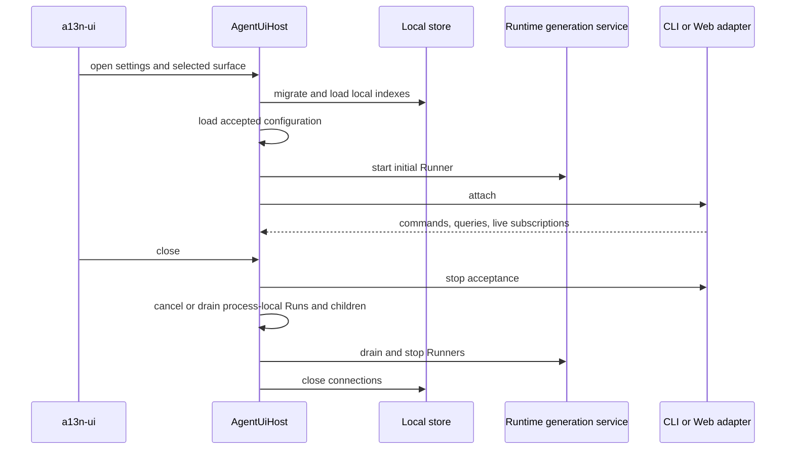
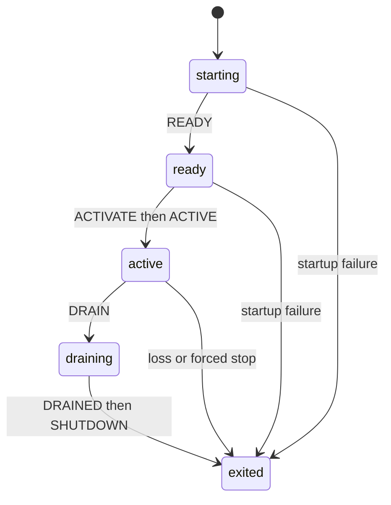
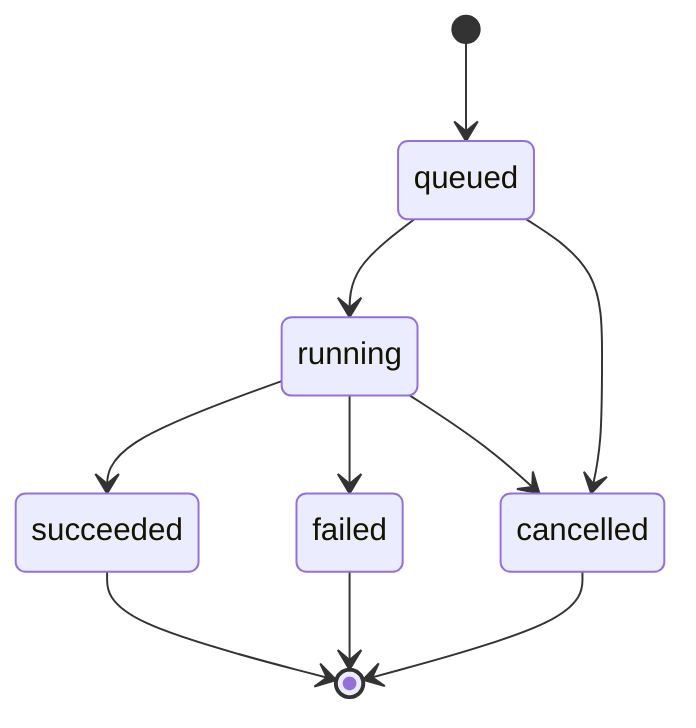

# Runtime, Subagents, and Surfaces

## Design Position

Agent UI has one surface-neutral `AgentUiHost`, replaceable runtime Runners, process-local root and child Run supervision, a live presentation hub, an append-only CLI, and a bundled multi-Session WebUI.

The Host owns Session and continuation selection. The selected Runner owns native Harness, Model, Plugin, Environment Provider, attachment, and Agent Stream Protocol objects for one runtime generation. Neither process boundary creates a durable worker protocol: accepted input and active tasks disappear if their owning Host exits.

## Boundaries

| Concern                            | Owner                             | Agent UI behavior                                                                     |
| ---------------------------------- | --------------------------------- | ------------------------------------------------------------------------------------- |
| Configuration and resource editing | Configuration service             | Validates file-backed definitions and publishes complete generations                  |
| Agent and Environment composition  | Snapshot services                 | Produces exact immutable snapshots for Sessions                                       |
| Root and child Agent loop          | Harness                           | One entered `HarnessRunStream` per process-local Run                                  |
| Continuation selection             | Stable Host                       | Publishes one complete continuation bundle and updates the Session's latest reference |
| Environment provider lifecycle     | Host plus provider package        | Persists provider state only where external resources require it                      |
| Current `EnvironmentRuntime`       | Selected Runner                   | Fresh process-local value for one Run                                                 |
| Async child scheduling             | Process-local Host/Runner service | In-memory tasks and delivery; no durable job subsystem                                |
| AG-UI conversion                   | Agent Stream Protocol             | Converts each public stream item once                                                 |
| Live presentation                  | Host live hub                     | Bounded best-effort delivery and optional in-memory replay ring                       |
| Runtime process lifecycle          | Runtime-generation service        | Launches, activates, drains, and stops Runner processes                               |
| CLI and Web presentation           | Surface adapters                  | Call the same Host commands, queries, and subscriptions                               |
| Distributed durable execution      | Foundation Service                | Out of scope                                                                          |

## AgentUiHost

`AgentUiHost` owns one frontend lifetime and composes:

- configuration and resource catalogs;
- Agent and Environment snapshot services;
- Session metadata and continuation service;
- Environment resource service;
- process-local Run registry;
- bounded live event hub;
- runtime-generation service;
- the selected CLI or Web adapter.

Its public values are detached and safe. They do not expose database sessions, storage paths as authority, native Models, credentials, plugin objects, Providers, attachments, `EnvironmentRuntime`, Harness streams, tasks, locks, or raw private Capability state.

The Host does not persist generic operation acceptance. A surface command either runs in the current process or returns after creating a process-local task owned by the Host. Closing the Host cancels or drains those tasks. A later Host sees only the latest selected Session continuation and persisted Environment provider state.

## Application Lifetime



Startup validates global settings, current configuration, schema, and the initial Runner. It validates Session continuations, provider state, snapshots, and executable artifacts when selected. It does not scan every retained Session, classify prior process work, replay input, or rebuild presentation history.

Shutdown does not write synthetic interruption rows. Work without a selected continuation simply disappears, leaving the prior continuation as the resume boundary.

## Runtime Runner Lifecycle

Runner process management uses a small private control protocol:

```text
HELLO/WELCOME -> READY -> ACTIVATE/ACTIVE -> DRAIN/DRAINED -> SHUTDOWN/EXITING
```



The Runner starts from an exact argument vector without shell evaluation. Because it is a child process owned by the same local application, the private channel needs only message-schema and generation correlation. It has no authentication, lease, consensus, two-phase cutover, or remote-worker behavior.

Restart follows direct activation:

1. launch a candidate;
2. require `READY` with the expected protocol and runtime provenance;
3. send `ACTIVATE` and require `ACTIVE`;
4. select the new generation for later Runs;
5. drain and stop the previous Runner.

A Run stays on the generation that admitted it. New Runs use the selected generation. Drain waits for local admitted work within a configured timeout, then terminates the old process if necessary. No Run migrates between interpreters.

Runner loss cancels its process-local Runs. Unless one already selected a complete continuation, their Sessions remain on the prior continuation. The Host can report that current output was lost; it does not persist interrupted/unknown Run state or attempt automatic replay.

## Execution RPC

The stable Host and selected Runner use a typed bounded message stream for actual execution. The first required operations are:

```python
class ExecuteRootRun(BaseModel):
    request_id: str
    generation_id: str
    session_id: str
    continuation: ContinuationReference
    agent_snapshot: SnapshotReference
    environment_snapshot: SnapshotReference
    input: RunInputValue


class RunnerRunEvent(BaseModel):
    request_id: str
    event: AguiEvent


class RunnerRunResult(BaseModel):
    request_id: str
    result: Literal["complete", "suspended", "failed", "cancelled"]
    continuation: ContinuationCandidate | None
    terminal_projection: JsonValue | None
    failure: SafeFailure | None
```

Messages are versioned enough to reject incompatible Host and Runner releases, but the protocol remains private to one `a13n-ui` distribution. It does not need durable acknowledgements, batch ledgers, exactly-once event delivery, or a general remote-worker abstraction.

The Runner reconstructs current collaborators from Host-selected snapshots and fresh local authority. The Host validates a returned continuation candidate and remains the only process that publishes it and updates the Session's latest continuation reference. That update is last-write-wins; it does not compare the continuation used to start the Run.

## Model and Credential Runtime

A Model definition contains provider key, model name, non-secret settings, and an optional credential reference. For every Run, the Runner:

1. resolves the selected Model revision from the pinned Agent snapshot;
2. resolves current credential material through the configured local backend;
3. constructs a fresh native Pydantic AI Model or resolver;
4. closes any owned client after the Run.

Credentials, Model clients, and resolvers are never persisted. Configuration validation can verify adapter availability and syntax without network access. Connectivity and credential validity remain Run-time facts.

## Environment Runtime

The stable Host owns desired Session assignments and the latest provider-state reference. The Runner owns process-local provider objects and attachments. A completed lifecycle operation returns detached provider state to the Host, which stores it with an ordinary last-write-wins update.

For a Run, the Runner builds one complete `EnvironmentRuntime` from fresh attachments and closes it with the Harness stream. The Host and Runner never serialize an attachment or runtime object between processes.

Local Sandbox resolves one exact package-selected envd executable or one explicit validated override. Managed download verifies the selected archive and executable before atomic publication. A version or isolation failure marks Local Sandbox unavailable; no fallback to Direct Local occurs. The executable cache is replaceable and carries no Session authority.

## Configuration Editing

CLI and WebUI edit the same definition files through Host operations. An edit validates the proposed document, writes a temporary file in the same source root, atomically replaces the target, and requests a configuration reload.

Edits use last-write-wins. There is no source transaction manifest, base-digest conflict protocol, lease, heartbeat, recovery daemon, or long-lived edit transaction. A multi-file edit is a sequence of ordinary file replacements; the accepted configuration changes only when the resulting complete graph validates.

External file changes enter through explicit reload or a simple watcher. The watcher is a convenience, not an authority requiring periodic durable reconciliation.

## Async Subagents

Agent UI exposes async-only child tools over the exact `SubagentCollection` built by the Harness:

| Tool              | Current-Host behavior                                                          |
| ----------------- | ------------------------------------------------------------------------------ |
| `delegate`        | Start one supervised child task and return a compact execution ID              |
| `subagent_info`   | Return current in-memory status and bounded output                             |
| `wait_subagent`   | Wait once for one child or a snapshot of current children                      |
| `steer_subagent`  | Offer input to a compatible live child router                                  |
| `cancel_subagent` | Request cancellation of one live child                                         |
| `resume_subagent` | Continue a retained child only while its process-local state remains available |

A child receives fresh Identity, Model, Skills, Capabilities, and Environment runtime according to the exact built edge. It does not inherit the parent's native clients, attachments, runtime, or mutable context by alias.

Child state is process-local:



There is no durable accepted job, child Thread database, child continuation selection, steering ledger, delivery ledger, idempotency key, linked-successor fence, or startup recovery. Completed child output is offered to its live parent. If the parent incorporates it and later selects a continuation, ordinary parent continuation preserves the result. If the process exits first, the child and undelivered result are forgotten.

Depth, child concurrency, and usage ceilings remain simple in-memory admission checks because they protect current resource use. They do not need durable accounting across Host lifetimes.

## Cancellation

Foreground or child cancellation addresses one current process-local Run. The owning task requests cancellation on the entered Harness stream and closes its fresh runtime collaborators.

If cancellation returns a complete Harness state that the product intentionally accepts, the Host can select that continuation. Otherwise the Session remains at its prior continuation. Cancellation does not roll back model, tool, provider, or filesystem effects.

Repeated cancellation of missing or finished process-local work returns current not-found/terminal status. It does not consult a retained Run ledger.

## Live Presentation

The selected Runner passes each public Harness item through one Agent Stream Protocol observer. The Host assigns process-local event sequence and forwards detached AG-UI values to current subscribers.

The live hub can keep a bounded in-memory ring per Session. A slow subscriber is disconnected or drops old transient events according to surface policy. Reconnect reloads the latest continuation projection and then consumes current live events. Agent UI does not promise gap-free replay across processes or restarts.

A live event is not proof that a continuation saved. A continuation can save even when presentation delivery fails. The UI reports save success separately from streamed output.

## CLI

`a13n-ui` and `a13n-ui cli` enter the same append-only interactive frontend. It uses ordinary stdin/stdout and can render Markdown, tool progress, and live events without alternate-screen ownership.

The initial command roots are:

```text
a13n-ui
a13n-ui cli [--resume SESSION_ID | --resume-last]
a13n-ui run [--session SESSION_ID] [--jsonl] [PROMPT|-]
a13n-ui sessions <list|show|create|fork|archive|delete>
a13n-ui config <list|show|validate|edit|reload>
a13n-ui diagnostics
a13n-ui runtime status
a13n-ui web
```

Interactive slash commands stay small: `/new`, `/sessions`, `/resume`, `/cancel`, and `/exit`. The frontend does not own Session or transcript state beyond rendering detached Host values.

Human one-shot mode writes final Agent output to stdout and progress/diagnostics to stderr. JSONL mode writes only stable machine values to stdout. CLI parsing, execution, and rendering remain separate modules.

## WebUI and Loopback Transport

The WebUI is a complete multi-Session browser application. It provides:

- Session create, recent, search, pin, archive, fork, and delete;
- selected Session continuation history and live output;
- refresh when another Host advances a Session;
- suspended-request approval or external result entry;
- Agent, Prompt, Plugin, Skill, Model, and Environment workflows;
- Environment availability and cleanup controls;
- current-Host async-child status;
- configuration and runtime diagnostics.

The loopback adapter maps HTTP requests to Host commands/queries and SSE to the live hub. It binds loopback only and accepts the configured WebUI origin. This local surface needs no user account, capability-token system, remote authorization, durable browser session, or multi-tenant policy.

An SSE disconnect stops that subscription. Whether a process-local Run continues is an explicit Host command policy, not an implication of transport cancellation. Browser reconnect reloads the selected Session continuation instead of requesting a durable event replay cursor.

## Surface Equivalence

CLI and WebUI share:

- configuration validation and edits;
- snapshot selection;
- Session create, resume, fork, metadata, and delete;
- Run start, cancel, suspended resume, and continuation save result;
- Environment lifecycle;
- runtime status;
- live AG-UI values.

They need not have identical layouts or workflows. The CLI optimizes for direct terminal use and scripts. The WebUI optimizes for persistent multi-Session browsing and configuration. Neither adds authority outside `AgentUiHost`.

## Validation

Required end-to-end coverage includes:

1. default and explicit `cli` enter the same frontend through Host and Runner startup;
2. one-shot human and JSONL output keep stdout/stderr contracts;
3. a complete and a suspended Run each select a resumable continuation;
4. process loss before selection resumes the prior continuation;
5. two local processes updating one Session follow documented last-write-wins behavior without corruption;
6. Runner restart sends later work to the new generation without migrating admitted work;
7. live presentation failure does not change continuation selection;
8. async-child work disappears on Host loss unless already incorporated into a parent continuation;
9. Web reconnect rebuilds from the latest continuation and attaches to current live output.
