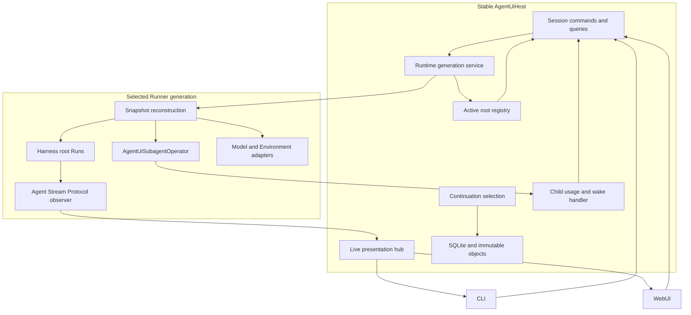
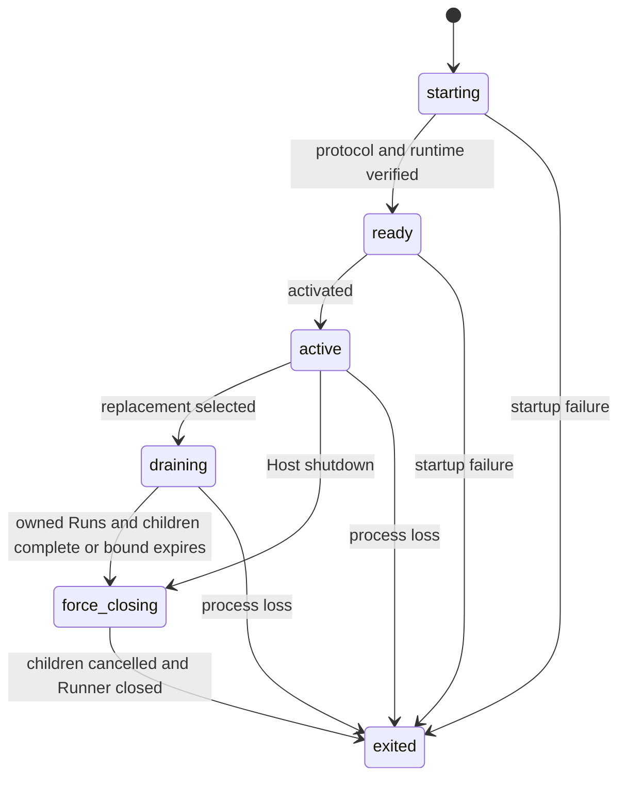
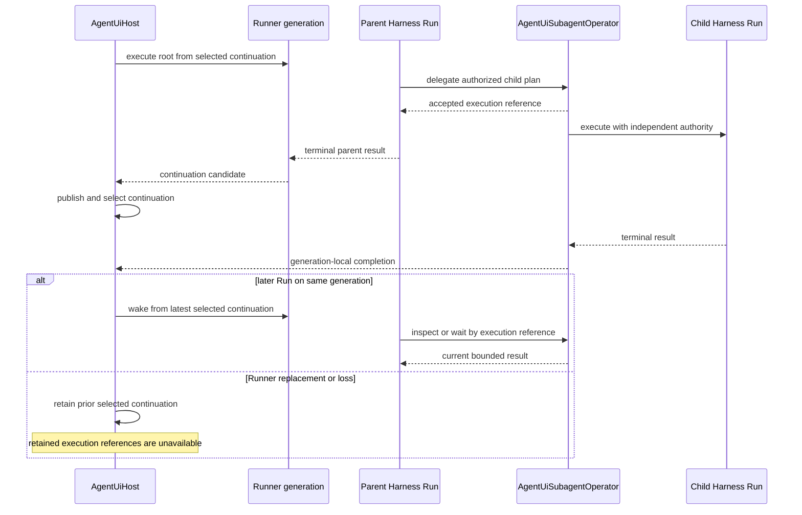

# Runtime, Async Work, and Surfaces

## Design Position

Agent UI has one surface-neutral `AgentUiHost` and replaceable runtime Runner generations. The Host owns Session commands, selected continuations, local persistence, active-root coordination, and presentation. A Runner owns process-local Harness, Model, Plugin, Environment Provider, and Agent Stream Protocol objects for work admitted to that generation.

Agent UI supplies one generation-owned `AgentUiSubagentOperator` for root Agents whose definitions select async subagents. Canonical child records, bounded output, usage, and completion observation remain in that Runner's memory. The stable Host can start one best-effort wake Run for an inactive Session after child completion, but it creates no durable job, queue, wake, or delivery subsystem.

Background shell uses the Harness default Run-owned process controller. Agent UI supplies no `HostedProcessRunCapability`, stores no process record or cursor, and performs no post-Run process wake. A background command can outlive one tool call but not its owning Harness Run; active-Run completion readiness and explicit polling remain standard Harness behavior.

[Async Subagent Lifecycle](../agent-harness/20-async-components-and-lifecycle.md) defines child lifecycle, while [Environment Integration](../agent-harness/08-environment-integration.md#command-and-background-processes) defines shell processes. This document owns Agent UI's Host/Runner placement, Runner-local child work, inactive-Session child wake policy, generation replacement, and surface behavior.

## Architecture and Ownership

| Concern                                                                 | Owner                                    | Boundary                                                                  |
| ----------------------------------------------------------------------- | ---------------------------------------- | ------------------------------------------------------------------------- |
| Configuration, immutable snapshots, Sessions, and selected continuation | Stable Host                              | Runner receives exact detached inputs selected for one request            |
| Root and child Agent loops                                              | Harness in selected Runner               | No live Harness object crosses the process boundary                       |
| Model and credential resolution                                         | Runner                                   | Uses pinned snapshot and fresh local credentials for each Run             |
| Environment adapter construction and operation                          | Runner with Host state publication       | Native Providers and adapters stay in Runner                              |
| Selected async-subagent tools                                           | `AgentUiSubagentOperator`                | Canonical children are generation-memory only; nested children run inline |
| Dynamic Environment tools                                               | Harness `DynamicEnvironmentCapability`   | Foreground and background shell use the current Run Environment           |
| Background process tracking and active readiness                        | Harness Run process controller           | No Agent UI record, cross-Run lookup, or idle wake                        |
| Async child completion usage and wake                                   | Stable Host                              | Generation-aware in-memory deduplication and best-effort inactive wake    |
| Continuation publication and selection                                  | Stable Host                              | Runner returns a candidate but cannot publish or select it                |
| Live AG-UI presentation                                                 | Agent Stream Protocol plus Host live hub | Best-effort and reconstructable from selected continuation                |
| Durable distributed execution                                           | Foundation Service                       | Not emulated by Agent UI                                                  |

## Host Lifetime

`AgentUiHost` owns one CLI or Web process lifetime. It opens the local store, loads accepted configuration, starts one Runner generation, and exposes the same commands and queries to both surfaces. Its public values are detached; no database session, storage path as authority, native Model, credential, Provider, Environment adapter, Harness stream, task, lock, or private Capability state escapes through a surface API.

Startup validates selected resources. It does not scan every retained Session, classify work from previous processes, replay accepted input, or reconstruct old child records. Process references present in historical messages grant no authority because default background work ended with its source Run.

Host shutdown is destructive for process-local work:

1. stop accepting new surface commands;
2. cancel active root Runs, whose Harness cleanup kills and releases default background processes;
3. request bounded shutdown of each generation's Agent UI subagent operator;
4. terminate and then kill a Runner process if bounded shutdown does not complete;
5. close the live hub and local store.

Shutdown writes no synthetic interruption record and does not advance a Session continuation merely because work was cancelled.

## Runner Generations

The runtime-generation service launches one authenticated local Runner process, verifies its protocol and runtime provenance, activates it, and selects it for later root Runs. The private protocol is bounded and typed but remains an implementation boundary of one `a13n-ui` distribution rather than a public worker protocol.

A replacement uses direct activation:

1. start and verify a candidate Runner;
2. activate and select the candidate for new work;
3. stop admitting root Runs to the previous generation;
4. allow admitted root Runs and generation-owned async children a bounded natural drain;
5. cancel remaining children through the old generation's operator and stop that Runner.

Default background processes are already owned by their exact root or child Harness Run and participate in that Run's cleanup. They never migrate, become generation records, or delay a generation after all owning Runs have closed.

## Root Run and Continuation Flow

For one root command, the Host sends the exact Session, Agent snapshot, Environment snapshot, selected continuation, current Host Environment states, Skill selections, input, and optional deferred results. The Runner reconstructs trusted process-local objects, constructs fresh Environment adapters before Harness entry, enters one Harness stream, converts public items through Agent Stream Protocol, and returns one complete or suspended continuation candidate.

The Host validates and publishes the candidate, then performs the only update that advances the Session's selected continuation. A failed Run, Runner loss, cancelled Run without an accepted complete state, or failed publication leaves the Session at its prior continuation. Input, partial output, live events, and an unselected candidate are not recovery authority.

Environment state crosses the boundary only as detached values. In unconditional finalization after success, failure, cancellation, checkpoint failure, or local-close failure, the Runner reads each adapter's infallible cached `dump_state()`, returns the latest known state, and closes remaining process-local resources. The Host publishes only values changed from those it supplied. Environment-state publication and continuation selection are independent outcomes.

## Model and Environment Adapters

The Runner resolves each logical Model only from the pinned Agent snapshot and installed adapter catalog. It obtains current credential material at Run time, constructs the native Model or resolver, and closes owned clients with the Run. Credentials and model clients are never persisted or sent to the Host.

The Host owns desired Session Environment assignments, current `EnvironmentState | None` for each association, and every warmup or destroy decision. For each independent Run, the Runner resolves selected trusted Providers, constructs fresh single-use Environment adapters from exact configuration, Host-selected current state, and fresh runtime collaborators without I/O, and supplies them as lightweight Harness mounts. Harness enters and closes the adapters; ordinary Run exit is non-destructive and never infers Session idleness or destroys a backing target.

Foreground commands and default background processes use that same entered Run Environment. Harness keeps background handles, output cursors, controls, and terminal watchers private to the Run. Run closure kills and releases remaining processes before adapter close. Agent UI never constructs another Environment scope for a process and never publishes process-specific Environment state.

An async child is different: the Agent UI subagent operator selects child Environment association, loads Host-authoritative current state, constructs fresh adapters and `RunBindings`, and starts one independent child Harness Run. Inline children borrow the active parent's facade and cannot mutate its mount set. Nested definitions use inline subagents; Agent UI exposes no nested async operator.

Local Sandbox resolves one exact package-selected `agent-envd` executable or one explicit validated override. Failure does not fall back to Direct Local. Executable cache state carries no Session or execution authority.

## Async Child Work and Wake

When a resolved root Agent selects standard async-subagent tools, reconstruction supplies the generation `AgentUiSubagentOperator`. Omitting that selection exposes no model-facing async child operation. Each admitted child receives fresh Identity, Model, Skill, Capability, and Environment authority from its exact resolved definition.

The operator retains bounded child status, activity, output, failure, usage, and resumability in Runner memory. A later Run in the same Session and Runner generation can query the public execution reference. Completion emits one typed generation-local event containing detached initiating correlation. The Host deduplicates child usage by child Thread identity; this aggregate is process-local and is never merged into parent Harness usage or continuation state.

For each child completion, the Runner reports whether the correlated Harness parent remains active, while the Host independently checks whether the Session has an active request. The Host no-ops wake only while both are active. Otherwise it schedules at most one wake behind the Session lock, rechecks that the source generation remains active and the Session has no active request, loads the latest selected continuation, and starts a normal input-less Run. There is no durable event queue. Completion from a draining generation records usage but cannot wake a replacement generation because the child execution reference cannot be rebound there.

Background-process completion is not part of this wake path. Harness can enqueue readiness only while the exact owning Run remains active. If the Run closes first, cleanup terminates the process and no later Agent UI Run is started for it.

## Cancellation, Shutdown, and Loss

Root cancellation targets one current Harness Run and therefore also cleans its default background processes. `shell_kill` targets one reference in that exact Run controller. Async subagent cancellation targets one retained Agent UI operator record. None rolls back model, tool, provider, filesystem, or external effects.

Parent Run and Environment exit do not cancel an accepted async child. Agent UI chooses generation shutdown as the child-operator ownership boundary. At that boundary the operator rejects new work, cancels live children, closes their independent Environment adapters non-destructively, and waits only for owned cleanup and dispatched completion handling.

An explicit Environment destroy or Session delete is a narrower Host lifecycle decision. Under the Session lock, the Host suppresses same-Session child wake, cancels active root Runs, and asks the authorized old generation to cancel matching async children before destroy. The Host then sends exact detached configuration, current state, and destroy command. The Runner constructs a fresh adapter, invokes `destroy()`, reads cached resulting state, closes it, and returns detached state and outcome for Host publication. No independent background-process adapter can remain after all owning Runs are closed.

If cleanup exceeds the Host bound, the runtime-generation service terminates and then kills the Runner. Child records, activity, uncollected output, and async usage disappear. Restart selects only the latest stored Session continuation; prior async execution references are unavailable and are never recovered, replayed, or retargeted. Historical default process references were already non-restorable.

## Live Presentation and Surfaces

The Runner converts each public Harness item once through Agent Stream Protocol. The Host live hub performs bounded best-effort fan-out to CLI and WebUI and may retain a small process-local replay ring. A slow or disconnected subscriber never controls Run or continuation lifecycle. Reconnect rebuilds retained history from the latest selected continuation and then follows current live output.

CLI and WebUI are peers over `AgentUiHost`. Both use the same configuration, Session, Run, cancellation, Environment, runtime-status, and live-event operations. The CLI provides interactive and one-shot terminal workflows; the WebUI provides persistent multi-Session browsing and configuration workflows. Neither surface reads storage for authority, controls a Runner directly, interprets private Harness events, or owns another orchestration loop.

## Stable Principles

01. The stable Host owns Session and continuation authority; a Runner owns process-local execution for one generation.
02. Root async subagents use one generation-owned Agent UI operator; nested children remain inline.
03. Default background shell is owned by the exact Harness Run, requires no Host operator, and cannot survive Run closure.
04. Harness active-Run process readiness is best-effort; Agent UI implements no process result retention, cross-Run lookup, or idle wake.
05. Canonical async child work can outlive its parent Run but never its owning Runner generation.
06. Async child usage is deduplicated in Host memory and never changes parent Harness usage or state.
07. Generation drain is bounded; shutdown cancels remaining children before process escalation.
08. Restart or Runner loss never migrates or retargets child work; retained references become unavailable.
09. Independent child Environment construction uses exact pinned specifications and current Host state; no parent Harness facade escapes its Run.
10. Live AG-UI delivery is independent of continuation publication and is never recovery authority.
11. Agent UI adds no durable Job, child Thread, background process, output, usage, steering, wake, or delivery record.
