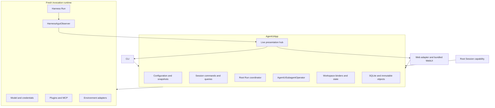

# Runtime, Async Subagents, and Surfaces

## Design Position

`AgentUiApp` is the only Agent UI application boundary. It runs Harness, Model, Plugin, MCP, Environment, Session, child-Thread, and observation behavior in one process. CLI, WebUI, and model-visible Session tools are thin adapters over its typed commands and queries.

Agent UI implements the complete Harness `SubagentOperator` contract as `AgentUiSubagentOperator`. It persists each logical async child as a child Thread, runs each delegate or resume as an independent Harness segment, saves exact child checkpoints, and returns one bounded saved execution view to model and presentation callers.

Agent UI is not a Plugin upgrade supervisor. Plugin authors can execute one headless Agent UI Run or call the Harness code library directly in a fresh process. Already imported Plugin code remains fixed for the App lifetime; Agent UI provides no candidate process, drain, or hot-replacement path.

Background shell remains the Harness default Run-owned behavior. Agent UI has no process manager, process database, cross-Run process lookup, or process-completion wake.

## Application Ownership



The App owns:

- configuration loading, snapshot selection, and trusted reconstruction;
- Session create, list, inspect, fork, archive, delete, root admission, cancel, and steer;
- root continuation publication and selection;
- message-time Workspace binding and Environment-state lifecycle;
- async child admission, execution, checkpointing, queries, wait, steering, cancellation, and linked resume;
- detached presentation projections and live fan-out;
- startup, shutdown, and bounded cleanup.

It does not expose database sessions, storage paths as authority, native Models, credentials, Provider objects, Environment adapters, Harness contexts, tasks, locks, or callbacks through a surface API.

## App Lifetime

One App lifetime:

1. configures logging at the executable boundary;
2. opens and migrates local storage;
3. loads one accepted configuration;
4. initializes trusted catalogs and the App-owned subagent operator;
5. attaches the selected CLI or Web surface;
6. serves commands until shutdown;
7. stops new admissions, cancels owned root and child Runs, completes bounded cleanup, marks non-terminal owned child segments consistently, and closes collaborators.

Module import starts no task, process, listener, or database connection. External I/O has explicit bounds and preserves cancellation.

## Root Run Coordination

One App admits at most one root Run for a Session. Another root submission while that Session is active is rejected rather than queued. Steering targets the current active root Run and has no durable acceptance before the live Run incorporates it.

For an admitted message, the App:

1. captures the Session, input, and authoritative `WorkspaceBinding`;
2. loads pinned snapshots and selected root continuation outside a long transaction;
3. resolves fresh credentials, Models, Plugins, MCP clients, Provider runtimes, and Environment adapters;
4. reconstructs the exact Agent graph with the App-owned subagent operator and root-only Session Capability;
5. starts one Harness stream and one root `HarnessAguiObserver`;
6. forwards public live events best effort;
7. finalizes Environment adapters and publishes changed state;
8. publishes an acceptable complete or suspended root continuation and compare-and-selects it against the reference loaded at admission;
9. returns independent execution, continuation, Environment-state, and cleanup outcomes, including an explicit concurrency conflict when another process changed a selected head.

No database transaction spans steps 3 through 8. A root cancellation request is process-local, does not prove rollback, and does not become a continuation unless Harness returns a complete state the App accepts.

## Agent UI Subagent Operator

### Admission and Identity

The Harness resolves the exact child definition, Identity, context, and usage ceilings before calling the operator. The operator may narrow authority but cannot choose another child or broaden the plan.

`delegate` performs one acceptance boundary:

1. verify the parent Session and Thread correlation in the operator context;
2. validate admission and child definition digest;
3. create one child Thread and segment-zero execution head;
4. commit the running execution before returning its public ID;
5. start the child segment under App ownership.

`resume_subagent` resolves one retained execution in the same parent Session scope, requires a selected compatible child checkpoint, preserves `child_thread_id`, increments `segment_index`, creates a new execution and `child_run_id`, and commits it before returning.

An accepted execution can outlive the parent root Run. Parent closure never cancels it by implication. Session deletion and App shutdown are explicit child ownership boundaries.

### Child Run Construction

Each segment receives:

- the exact resolved child Agent definition and derived Identity ceiling;
- one fresh Model resolver and current credential material;
- fresh Plugin and MCP collaborators;
- the exact inherited `WorkspaceBinding` and pinned Environment profile for that segment;
- fresh Environment adapters loaded from current Host state;
- a fresh child `HarnessState` for delegate or the exact selected state for resume;
- one `HarnessAguiObserver` bound to the child Thread and Run.

No parent `AgentContext`, entered Environment facade, live state coordinator, Model client, task, callback, or shell-process authority crosses into the child.

### Observation and Checkpointing

The operator consumes ordered public Harness stream items. Agent Stream Protocol converts them; Agent UI compacts the converted values into the bounded display owned by [Local Storage and Recovery](03-local-storage-and-recovery.md#compact-child-display). Each Harness Run inside a segment receives its own observer, including an internal denial continuation.

Closed activity is published to the live hub only at closed-item boundaries. Natural complete state boundaries can publish progress checkpoints. Terminal execution is acknowledged only after Environment cleanup, immutable terminal checkpoint publication, and atomic head selection.

Persistence failure is an execution failure, not a warning on a successful child. A saved earlier checkpoint can remain inspectable, but a terminal status never claims more than the selected checkpoint proves.

Agent UI performs no automatic parent wake Run after child completion. A currently connected surface receives live completion, and a later parent Run reconciles through `subagent_info` or `wait_subagent` against the saved head.

### Deferred Requests

A child suspension is not forwarded to the user or parent Session. The operator creates the complete denial/no-response results required by the exact deferred request set and continues the child through Harness continuation. The continuation uses a fresh child `run_id` and observer inside the same accepted execution segment; it does not create a model-facing execution or increment `segment_index`. The saved child Thread preserves every exact state boundary involved. Failure to continue safely produces an explicit child failure.

### Queries and Control

The public single-execution view contains:

- execution ID, child Thread ID, latest child Run ID, and segment index;
- subagent name and exact definition identity;
- running, succeeded, failed, cancelled, or lost status;
- bounded failure and resumability facts;
- saved compact activity for that segment.

It contains no raw `output` field. The final answer is represented by closed text activity. Tool arguments/results are redacted and truncated by fixed policy.

`subagent_info(execution_id)` and single-execution `wait_subagent(execution_id)` return the same view shape. Wait performs one bounded wait and then reads the authoritative head. No-ID list and fan-in forms return bounded summaries with offset pagination; they do not concatenate full activity.

Steering and cancellation operate only on a currently active process-owned segment and return acknowledgements, not invented completion. They are not durable queues. A race with terminal checkpoint selection returns the selected terminal truth.

Execution references are scoped to the originating root Session and parent Thread. A forked Session or copied message text grants no authority over source child Threads.

### Loss and Retention

Process loss never restarts or retargets an active segment. Once owner loss is established, its head becomes `lost`; any selected checkpoint remains inspectable. Explicit linked resume is permitted only when the execution head remains resumable, the exact saved checkpoint and child definition are compatible, and current policy authorizes it. A failed terminal checkpoint attempt leaves earlier progress readable but non-resumable.

Session deletion cascades child indexes after owned work is cancelled and Environment cleanup is attempted. Retention never becomes a scheduler, job lease, worker claim, delivery ledger, or takeover protocol.

## Root-only Session Capability

The resolved root Agent receives one Agent UI-owned Toolset with four operations:

```python
list_sessions(
    query: str | None = None,
    cursor: str | None = None,
    limit: int = 20,
)

get_session(
    session_id: str,
    history_cursor: str | None = None,
    history_limit: int = 50,
)

run_session(session_id: str, prompt: str)

steer_session(session_id: str, message: str)
```

`list_sessions` performs bounded fuzzy matching over safe Session metadata and returns an opaque cursor. `get_session` returns bounded detached metadata, root history projection, and current process-local activity when available. Neither exposes credentials, private Environment state, raw checkpoint objects, or storage paths.

`run_session` starts or continues work through the same App root command used by surfaces and inherits the caller's exact `WorkspaceBinding`. `steer_session` targets an already active root Run through the same App command. Same-active-Session recursive run or steer is rejected to prevent self-deadlock and ambiguous ordering.

The Toolset appears only on the root invocation. Child Agents and nested descendants cannot obtain it through configuration, inheritance, Plugin selection, or Markdown tool narrowing.

## Live Presentation

Each root or child Harness Run has one `HarnessAguiObserver`. The App live hub performs bounded best-effort fan-out and can retain a small in-memory ring. A slow or disconnected subscriber never blocks execution, checkpoint publication, or continuation selection.

Root retained history is reconstructed from the selected root continuation. Child retained history is loaded from compact saved checkpoints. Current-process live activity is merged only for presentation and never written back as continuation truth without its owning checkpoint path.

## CLI

`a13n-ui` is the normal terminal entry point. Its command families are:

```text
a13n-ui
  run ...
  config ...
  agent ...
  subagent ...
  environment ...
  session ...
  doctor
  web
```

Interactive Session use defaults the `WorkspaceBinding` to the current directory and accepts additional explicit folders. `a13n-ui run` is the headless one-shot execution path used by automation and local Plugin debugging. One-shot commands call the same App operations and produce bounded human-readable or structured output.

First-run onboarding:

1. selects a Model route and API-key source;
2. selects the default Agent;
3. explains the full-control Native default and lets the user select explicit Local EIP sandboxing;
4. writes the smallest valid `agent-ui.yaml` without implicit overwrite;
5. creates the canonical sibling `subagents` directory when absent;
6. detects selected Claude/Cursor/Codex sources and offers, but never silently performs, migration;
7. validates configuration and Local EIP readiness.

Subagent migration supports preview, interactive confirmation, `--dry-run`, and non-interactive `--yes`. Conflict resolution remains explicit.

## WebUI

The bundled WebUI uses one loopback HTTP/SSE adapter over detached App commands and queries. It supports configuration inspection, Agent and Environment selection, multi-Session browsing, root interaction, child Thread/segment display, cancellation and steering, diagnostics, and live updates.

The browser never receives a native filesystem capability or arbitrary Host path API merely because workspace paths are local. Folder selection is a surface-mediated local operation that becomes a validated `WorkspaceBinding` before App admission.

Unknown API or health routes do not fall back to browser HTML. The Web adapter owns transport authentication appropriate to a local single-user process but does not introduce a second authorization or Session model.

## Failure and Shutdown Semantics

| Condition                                              | Outcome                                                                                                         |
| ------------------------------------------------------ | --------------------------------------------------------------------------------------------------------------- |
| Root reconstruction or credential failure              | Message fails before model dispatch; prior continuation remains selected                                        |
| Root process loss                                      | Active input and partial output disappear; prior continuation remains selected                                  |
| Child admission persistence fails                      | `delegate` or resume is rejected before acceptance                                                              |
| Child execution succeeds but terminal checkpoint fails | Execution is failed, never falsely succeeded                                                                    |
| Live delivery fails                                    | Execution and persistence continue; saved projections remain authoritative                                      |
| Steering/cancellation races terminal completion        | Selected terminal head wins; acknowledgement does not rewrite it                                                |
| App shutdown                                           | New work stops, owned root/child Runs are cancelled, bounded cleanup runs, shell processes end with owning Runs |
| Cleanup exceeds bound                                  | Remaining process-local tasks are cancelled; no synthetic successful continuation is created                    |

## Invariants

01. `AgentUiApp` is the only application and orchestration boundary.
02. No supervisor, Runner generation, process protocol, or Plugin hot-replacement path exists inside Agent UI.
03. Root Runs are process-local and continuation-backed, not durably queued.
04. Every async child is a persisted child Thread of linked Harness Run segments.
05. Terminal child success requires acknowledged terminal checkpoint selection.
06. Child display includes closed bounded activity and no raw output field.
07. Deferred child interaction is denied/no-response and continued internally.
08. Child completion causes no automatic parent wake Run.
09. Run-owned shell processes have no Agent UI persistence or cross-Run control.
10. Session tools are root-only and use the same App operations as CLI and WebUI.
11. Surfaces consume detached projections and never read storage for authority.
