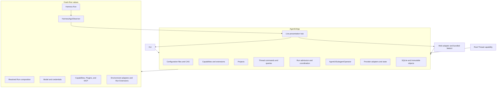

# Runtime, Async Subagents, and Surfaces

## Design Position

`AgentUiApp` is the only Agent UI application boundary. It runs configuration, catalog, Project, Thread, Harness, Model, Capability, Plugin, MCP, Environment, subagent, and observation behavior in one process. CLI, WebUI, and model-visible Thread tools are thin adapters over its typed commands and queries.

Agent UI implements the Harness `SubagentOperator` contract as `AgentUiSubagentOperator`. It persists each async child as an ordinary child Thread, runs each delegate or resume as an independent segment, saves exact checkpoints, and returns bounded saved execution views.

Agent UI is not a Python package installer or upgrade supervisor. Already imported extension and Capability code remains fixed for the App lifetime. Background shell processes remain Run-owned and have no cross-Run process manager or wake path.

## Application Ownership



The App owns:

- stable multi-file loading, accepted-generation selection, diagnostics, and expected-digest mutations;
- Capability and three-plane extension catalog projection;
- Project and configured-resource queries;
- Thread create, configuration update, list, inspect, root admission, cancel, and steer;
- immutable Run composition and continuation publication;
- Project-root Environment binding and state lifecycle;
- async child admission, execution, checkpointing, query, wait, steering, cancellation, and linked resume;
- detached presentation and bounded shutdown.

It does not expose database sessions, storage paths as authority, native Models, credentials, Provider objects, Environment adapters, Harness contexts, tasks, locks, or callbacks through a surface API.

## App Lifetime

One App lifetime:

1. resolves the config path and bootstrap data-root locator, then configures logging at the executable boundary;
2. opens and migrates local storage without depending on a valid root YAML;
3. loads or restores the last accepted file generation and reports current source diagnostics;
4. initializes Capability and extension catalogs plus release-owned Model, MCP, and Environment adapter integrations;
5. starts bounded configuration change observation;
6. attaches the selected CLI or Web surface;
7. serves commands until shutdown;
8. stops new admissions, cancels owned Runs, performs bounded cleanup, and closes collaborators.

A source change triggers a stable complete-tree candidate load. Invalid intermediate saves do not replace the accepted generation. Module import starts no task, process, listener, or database connection.

## Root Run Coordination

One App admits at most one root Run for a Thread. Another root submission while active is rejected rather than queued. Steering targets the current active Run and has no durable acceptance before Harness incorporates it.

For an admitted input, the App:

01. loads the Thread, optional patch, required expected configuration version for a non-empty patch, and selected continuation;
02. validates and commits the sticky configuration update when present;
03. captures the current accepted generation and selected Project roots;
04. resolves the exact Agent graph, Capabilities, tool visibility, Harness Plugins, MCP servers, Environment Provider, and Environment Run Extensions;
05. publishes the immutable resolved Run composition;
06. creates fresh native collaborators; each subscription-backed Model request resolves and refreshes its compatible OAuth credential when needed;
07. starts one Harness stream and observer from the prior `HarnessState`;
08. forwards public live events best effort;
09. finalizes Environment adapters and publishes changed state;
10. publishes and compare-and-selects an acceptable complete or suspended continuation;
11. returns independent execution, continuation, Environment-state, and cleanup outcomes.

No database transaction spans file I/O, catalog import, native construction, or steps 6 through 10. If capture fails, an already committed explicit Thread patch remains the Thread's desired next state and the Run reports why it could not start.

## Agent UI Subagent Operator

### Admission and Identity

The Harness resolves the selected child roster entry before calling the operator. The operator creates a child Thread whose discriminated Agent-resource or Markdown-subagent source comes from that entry. Project, Environment profile, and Environment Run Extensions initialize from the parent Run capture. Agent-resource children use their own Plugin and MCP defaults when present; Markdown children inherit the parent capture's exact Plugin and MCP lists.

`delegate`:

1. verifies parent Thread and Run correlation;
2. creates the child Thread and exact sticky configuration;
3. captures and publishes the child Run composition;
4. commits segment zero as `running` before returning its execution ID;
5. starts the segment under App ownership.

A surface can update the retained child Thread through the ordinary required-version configuration command before resume. `resume_subagent` then loads that Host-authorized sticky configuration, requires a selected terminal child checkpoint, increments `segment_index`, captures the new composition, commits the execution, and starts it. The new composition need not equal either the one that produced the prior checkpoint or the current parent roster definition. Harness still requires the same stable roster name and current plan context. Agent UI reapplies that roster edge's Identity policy to the selected replacement definition and intersects the plan usage ceiling with the replacement's own limits; the model cannot select the replacement Agent source.

An accepted child execution can outlive the parent Run. Parent closure never cancels it by implication. App shutdown is the process-local ownership boundary.

### Child Run Construction

Each segment receives:

- the child Thread's resolved Agent-resource or Markdown-subagent graph and Capabilities; a Markdown source resolves its explicit inheritance from the parent Run authorizing that linked admission;
- fresh Model, Harness Plugin, and MCP collaborators;
- captured Project roots and Environment profile selection;
- fresh Provider runtimes, Environment adapters, and Environment Run Extensions;
- the child Thread's newly published empty `initial_state` for delegate or selected child checkpoint state for resume;
- one `HarnessAguiObserver` bound to the child Thread and Run.

No parent `AgentContext`, entered Environment facade, live state coordinator, Model client, task, callback, or shell-process authority crosses into the child.

### Observation and Checkpointing

The operator consumes ordered public Harness stream items and compacts them into the bounded display owned by [Local Storage and Recovery](03-local-storage-and-recovery.md#compact-child-display). Closed activity is published live only at closed boundaries. Terminal success is acknowledged only after Environment cleanup, terminal checkpoint publication, and atomic head selection.

Agent UI performs no automatic parent wake Run after child completion. A connected surface receives live completion, and a later parent Run reconciles through `subagent_info` or `wait_subagent` against saved heads.

### Deferred Requests

A child suspension is not forwarded to the user or parent Thread. The operator supplies the complete denial/no-response values required by the exact request set and continues through normal Harness continuation. The continuation uses a fresh child `run_id` and observer inside the same segment. Failure to continue safely produces explicit child failure.

### Queries and Control

The public execution view contains execution, parent Thread, child Thread, child Run, segment, composition, status, bounded failure, resumability, and compact activity. It contains no raw unbounded output or private state.

Steering, cancellation, and bounded live waiting operate only when the current App owns the segment in its process-local registry. A saved `running` value without a matching local runtime is inspectable but grants no control. Execution references are scoped to their originating parent relationship.

### Loss and Retention

Orderly shutdown requests cancellation for locally owned segments. A durably completed cancellation becomes `cancelled`; a segment that cannot reach a terminal checkpoint becomes `lost`. Abrupt loss can leave a saved `running` head. Another App does not infer liveness, replay, or take over it.

Linked resume is permitted from a successful terminal execution whose exact selected checkpoint remains resumable, whose stable child roster name still resolves in the current parent, and whose current Host policy authorizes the operation. Compatibility applies to `HarnessState` schema and current selected component state, not equality with the prior Agent definition or Run composition.

## Root-only Thread Capability

The resolved root Agent receives one Agent UI-owned Toolset with operations conceptually equivalent to:

```python
list_threads(query: str | None = None, cursor: str | None = None, limit: int = 20)
get_thread(thread_id: str, history_cursor: str | None = None, history_limit: int = 50)
run_thread(thread_id: str, prompt: str)
steer_thread(thread_id: str, message: str)
```

`run_thread` accepts only a root Thread, uses that target's sticky configuration, and accepts no Project roots or configuration changes from model arguments. Async children continue through `resume_subagent`, which retains the current parent roster and delegation ceilings. `steer_thread` preserves the active Run composition. Same-active-Thread recursive run or steer is rejected.

The Toolset appears only on root invocation. Children cannot obtain it through Markdown, Capability selection, Plugin contribution, or tool visibility.

## Live Presentation

Each root or child Harness Run has one observer. The live hub performs bounded best-effort fan-out and can retain a small in-memory ring. A slow or disconnected subscriber never blocks execution, state publication, or continuation selection.

Retained history comes from selected continuations and child compact checkpoints. Current-process activity is merged only for presentation and never written back as continuation truth outside its owning checkpoint path.

## CLI

The CLI supports direct execution and focused validation or management without requiring exhaustive CRUD commands:

```text
a13n-ui
  run ...
  config validate
  config show
  config import-subagents ...
  project ...
  thread ...
  doctor
  web
```

Editing the root YAML, resource YAML, or canonical Markdown directly is a complete management path. Commands that mutate files consume expected source digests and use the same no-clobber boundary as WebUI operations.

Subagent import offers Claude Code, Cursor, and Codex detection, preview, dry-run, and explicit apply. It writes canonical Markdown only and never modifies source-product files.

Model account commands inspect compatible Codex or Grok login status and can start an explicit login, reauthentication, account switch, or shared logout under [Model Authentication and Compatible Account Stores](02a-model-authentication-and-account-stores.md). Existing usable product login is preferred over another browser flow.

## WebUI

The bundled WebUI uses one loopback HTTP/SSE adapter over detached App commands and queries. It supports:

- source-tree and validation diagnostics;
- Capability and extension discovery;
- expected-digest resource editing;
- Project, Agent, Plugin, Environment, MCP, and global-default management;
- sticky per-Thread selection and toggles;
- root and child interaction, inspection, cancellation, steering, and live updates.

Every editable response includes its current source digest. A stale mutation conflicts instead of knowingly replacing a newer manual or browser edit. The browser receives no native filesystem capability or arbitrary Host path API; Project paths enter only through validated resource mutations.

Unknown API or health routes do not fall back to browser HTML. The loopback adapter does not introduce a second authorization or Thread model.

## Failure and Shutdown Semantics

| Condition                              | Outcome                                                                                     |
| -------------------------------------- | ------------------------------------------------------------------------------------------- |
| Invalid source candidate               | Previous accepted generation remains active; diagnostics identify the source                |
| Stale WebUI or CLI mutation            | Mutation conflicts and returns the current source digest                                    |
| Root composition or credential failure | Run fails before model dispatch; prior continuation remains selected                        |
| Root process loss                      | Active input and partial output disappear; prior continuation remains selected              |
| Child admission persistence fails      | Delegate or resume is rejected before acceptance                                            |
| Child terminal persistence fails       | Execution is not reported as succeeded                                                      |
| Provider or extension cleanup fails    | Failure is reported independently; known state and continuation publication still proceed   |
| App shutdown deadline expires          | Remaining local tasks are cancelled; saved nonterminal facts do not become invented success |

## Invariants

1. `AgentUiApp` is the only local application boundary.
2. File editing, CLI, WebUI, and Thread tools converge on the same configuration and App operations.
3. Thread configuration patches are sticky; active Run compositions are immutable.
4. Root and child Runs use fresh native collaborators.
5. A child can resume with a different current composition while retaining the same Harness Thread history.
6. Saved nonterminal status never proves liveness or authorizes takeover.
7. Compact display and live delivery never become continuation authority.
8. The browser cannot bypass Project or expected-digest file authority.
9. Shutdown is bounded and does not invent completion.
