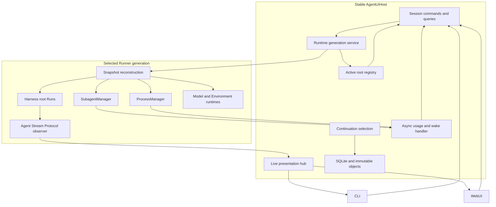
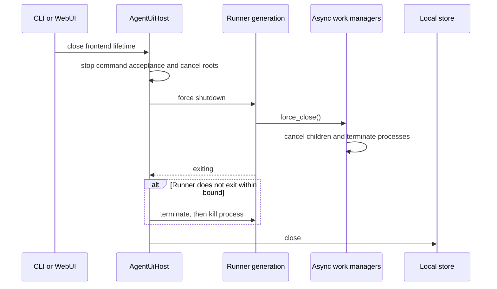
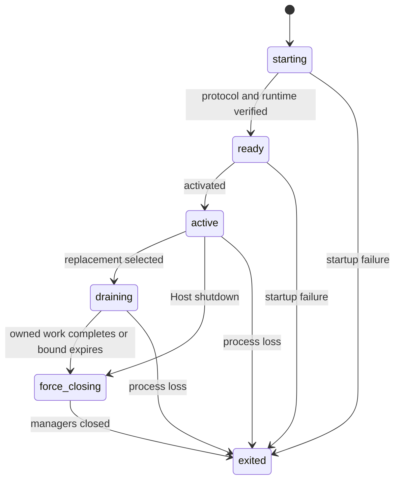
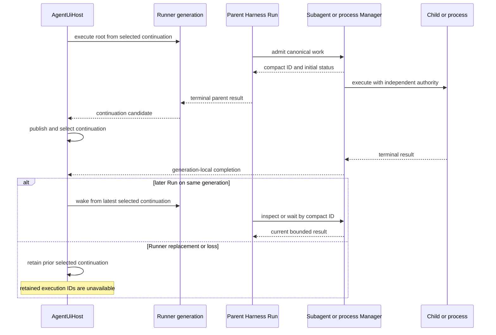

# Runtime, Async Work, and Surfaces

## Design Position

Agent UI has one surface-neutral `AgentUiHost` and replaceable runtime Runner generations. The Host owns Session commands, selected continuations, local persistence, active-root coordination, and presentation. A Runner owns process-local Harness, Model, Plugin, Environment Provider, and Agent Stream Protocol objects for the work admitted to that generation.

Agent UI reconstructs the standard Harness async-subagent and background-process operators once per Runner generation. Canonical child records, detached process bindings, retained output, and completion hooks remain in that Runner's memory. The stable Host aggregates asynchronous usage in memory and can start one best-effort wake Run from the latest selected Session continuation; it creates no durable job, queue, wake, or delivery subsystem.

The detailed Harness lifecycle is defined by [Async Components and Lifecycle](../agent-harness/20-async-components-and-lifecycle.md). This document owns Agent UI's Host/Runner placement, Runner-local async work, inactive-Session wake policy, generation replacement, and surface behavior.

## Architecture and Ownership

| Concern                                                                 | Owner                                    | Boundary                                                                            |
| ----------------------------------------------------------------------- | ---------------------------------------- | ----------------------------------------------------------------------------------- |
| Configuration, immutable snapshots, Sessions, and selected continuation | Stable Host                              | Runner receives only exact detached inputs selected for one request                 |
| Root and child Agent loops                                              | Harness in the selected Runner           | No live Harness object crosses the process boundary                                 |
| Model and credential resolution                                         | Runner                                   | Uses the pinned snapshot and fresh local credentials for each Run                   |
| Environment provider lifecycle and attachments                          | Runner with Host state publication       | Native providers stay in Runner; detached provider state returns to Host            |
| Selected async-subagent tools                                           | Harness `SubagentManager` in the Runner  | Canonical children are generation-memory only; nested children run inline           |
| Dynamic Environment tools                                               | Harness Capability                       | Root Agents use the generation process operator; nested Agents use foreground shell |
| Detached process Environment                                            | Runner                                   | Reopens exact pinned mounts with fresh bindings independent of the parent Run       |
| Async completion usage and wake                                         | Stable Host                              | Generation-aware in-memory deduplication and best-effort inactive wake              |
| Continuation publication and selection                                  | Stable Host                              | A Runner returns a candidate but cannot publish or select it                        |
| Live AG-UI presentation                                                 | Agent Stream Protocol plus Host live hub | Best-effort and reconstructable from the selected continuation                      |
| Durable distributed execution                                           | Foundation Service                       | Not emulated by Agent UI                                                            |

## Host Lifetime

`AgentUiHost` owns one CLI or Web process lifetime. It opens the local store, loads the accepted configuration, starts one Runner generation, and exposes the same commands and queries to both surfaces. Its public values are detached; no database session, storage path as authority, native Model, credential, Provider, attachment, Harness stream, task, lock, or private Capability state escapes through a surface API.

Startup validates resources when selected. It does not scan every retained Session, classify work from previous processes, replay accepted input, or reconstruct old Manager records.

Host shutdown is destructive for process-local work:

1. stop accepting new surface commands;
2. cancel active root Runs;
3. force-close each Runner generation's subagent and process managers and their process-local collaborators;
4. apply a bounded process-termination escalation if a Runner does not exit;
5. close the live hub and local store.

Shutdown first applies the bounded generation drain contract. If work remains when that bound expires, manager force-close cancels children, terminates processes, and releases their independent Environment runtimes. Shutdown writes no synthetic interruption record and does not advance a Session continuation merely because work was cancelled.

## Runner Generations

The runtime-generation service launches one authenticated local Runner process, verifies its protocol and runtime provenance, activates it, and selects it for later root Runs. The private protocol is bounded and typed but remains an implementation boundary of one `a13n-ui` distribution rather than a public worker protocol.

A replacement uses direct activation:

1. start and verify a candidate Runner;
2. activate and select the candidate for new work;
3. stop admitting root Runs to the previous generation;
4. allow already admitted root Runs and generation-owned async work a bounded natural drain;
5. force-close remaining child/process work and stop that Runner.

The old Runner admits no new root Run after replacement. Its drain waits only work already owned by that generation and is bounded by the Host; expiry proceeds to process termination escalation. A root Run, child, detached process, or reopened Environment remains on the generation that admitted it and never migrates between interpreters.

## Root Run and Continuation Flow

For one root command, the Host sends the exact Session, Agent snapshot, Environment snapshot, selected continuation, provider states, Skill selections, input, and optional deferred results. The Runner reconstructs trusted process-local objects, enters one Harness stream, converts public items through Agent Stream Protocol, and returns one complete or suspended continuation candidate.

The Host validates and publishes the candidate, then performs the only update that advances the Session's selected continuation. A failed Run, process loss, cancelled Run without an accepted complete state, or failed publication leaves the Session at its prior continuation. Input, partial output, live events, and an unselected candidate are not recovery authority.

Provider state crosses the boundary only as detached updates. The Host publishes an update before acknowledging it; the Runner does not continue a provider lifecycle transition whose required state publication failed. Native Provider, Resource, attachment, client, and `EnvironmentRuntime` objects remain in the Runner.

## Model and Environment Runtime

The Runner resolves each logical Model only from the pinned Agent snapshot and the installed adapter catalog. It obtains current credential material at Run time, constructs the native Model or resolver, and closes owned clients with the Run. Credentials and model clients are never persisted or sent to the Host.

The Host owns desired Session Environment assignments and latest provider-state references. The Runner ensures the selected Resources are available, acquires fresh attachments, builds one single-use `EnvironmentRuntime`, and returns detached provider-state changes for Host publication.

Foreground shell remains bound to the current Run Environment. Before admitting a root async child or background process, the Runner takes one detached admission-time snapshot of the exact pinned Environment definition and latest provider state whose Host publication has been acknowledged, then reopens from that snapshot with fresh runtime collaborators. This includes state first created or resumed earlier in the same root execution, so reopen does not repeat allocation from a stale request snapshot or combine mount states observed at different points during construction. The resulting child binding or managed process is self-contained after Manager acceptance. Reopen can share an underlying Direct Local directory, Local Envd workspace, Docker container, or E2B sandbox according to the selected provider; each provider owns concurrent reopen/session safety. The launcher never retains the parent Run's `BoundEnvironment`.

Only the root Agent receives this background-capable operator. Every nested Agent reconstructs the standard foreground operator, so subagent processes are isolated inside that child's own fresh Environment and cannot create another detached-process tree.

Local Sandbox resolves one exact package-selected `agent-envd` executable or one explicit validated override. Failure does not fall back to Direct Local. Executable cache state carries no Session or execution authority.

## Async Work and Wake Lifecycle

When a resolved root Agent selects standard async-subagent tools, Runner reconstruction uses the generation `SubagentManager`. Omitting the selection exposes no model-facing child operation. Root Dynamic Environment reconstruction independently uses the generation `ProcessManager`; nested reconstruction always selects inline subagents and foreground shell.

Each root or child execution opens fresh Identity, Model, Skill, Capability, and Environment authority from its exact resolved definition. `open_child` and `launch_process` are construction callbacks only: after Manager acceptance, the child scope or `ManagedProcess` is self-contained and the Manager is its sole lifecycle owner. Closing the parent scope rejects later submissions from that scope but does not cancel canonical work already admitted to the generation. Nested child definitions may contain further children, but Agent UI executes those edges inline and exposes no nested async operator.

The Managers retain bounded child status/output/failure/usage and process status/output/control state in Runner memory. A later Run in the same Session and Runner generation can reconcile a compact ID. Completion emits one typed generation-local event containing a detached snapshot of the initiating instance's Host-only references. The Host deduplicates async child usage by child Thread identity and process events by compact reference; this aggregate is process-local and is never merged into parent Harness usage or continuation state.

Before the correlated parent produces a terminal result, the stable Host hook is a no-op because active Harness steering owns observation. After the terminal boundary, including the short interval while that request is still cleaning up, the Host schedules at most one wake under the Session lock. The wake rechecks that the source generation is still active and the Session has no active request, reloads the latest selected continuation, and starts a normal input-less Run. There is no durable event queue. A completion from a draining generation records usage but cannot wake the replacement generation because its canonical Manager record cannot be rebound there.

## Cancellation, Force Close, and Loss

Root cancellation targets one current process-local Harness Run. Tool-authored cancellation or kill targets one retained Manager record. Neither operation rolls back model, tool, provider, filesystem, or external effects.

Parent Run and Environment exit never close generation Managers or their admitted work. Agent UI explicitly chooses generation shutdown as the Manager ownership boundary. At that boundary, Manager force-close rejects new work, cancels every live child, force-terminates every live process, releases independent Environment scopes, and waits only for owned cleanup and already-dispatched callbacks.

If cleanup exceeds the Host's bound, the runtime-generation service terminates and then kills the Runner process. Manager records, activity, successful output not yet collected, async usage, and retained Environment/process state disappear. Restart selects only the latest successfully stored Session continuation; prior compact IDs reconcile as lost and are never recovered, replayed, or retargeted.

## Live Presentation and Surfaces

The Runner converts each public Harness item once through Agent Stream Protocol. The Host live hub performs bounded best-effort fan-out to CLI and WebUI and may retain a small process-local replay ring. A slow or disconnected subscriber never controls Run or continuation lifecycle. Reconnect rebuilds retained history from the latest selected continuation and then follows current live output.

CLI and WebUI are peers over `AgentUiHost`. Both use the same configuration, Session, Run, cancellation, Environment, runtime-status, and live-event operations. The CLI provides interactive and one-shot terminal workflows; the WebUI provides persistent multi-Session browsing and configuration workflows. Neither surface reads storage for authority, controls a Runner directly, interprets private Harness events, or owns another orchestration loop.

## Stable Principles

01. The stable Host owns Session and continuation authority; a Runner owns only process-local execution for one generation.
02. Root async subagents and background processes use standard generation-owned Harness Managers; nested children remain inline and foreground.
03. Canonical async work can outlive its parent Run but never its owning Runner generation.
04. Active-Run observation and inactive-Session wake are distinct; at most one generation-aware best-effort wake uses the latest selected continuation.
05. Async usage is deduplicated in Host memory and never changes parent Harness usage or state.
06. Generation drain is bounded; force-close cancels children, terminates processes, and releases reopened Environments before process escalation.
07. Restart or Runner loss never migrates or retargets Manager work; retained compact IDs become lost.
08. Environment reopen uses exact pinned specifications and provider state with fresh bindings; no parent `BoundEnvironment` escapes its Run.
09. Live AG-UI delivery is independent of continuation publication and is never recovery authority.
10. Agent UI adds no durable Job, child Thread, background process, output, usage, steering, wake, or delivery record.
