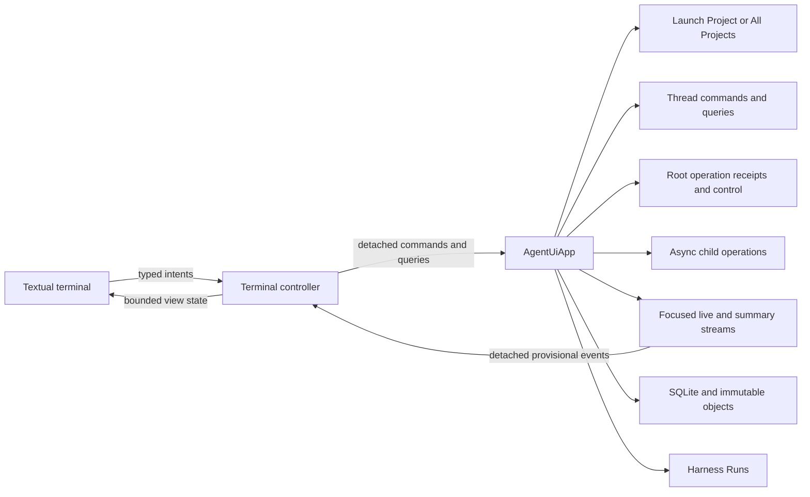
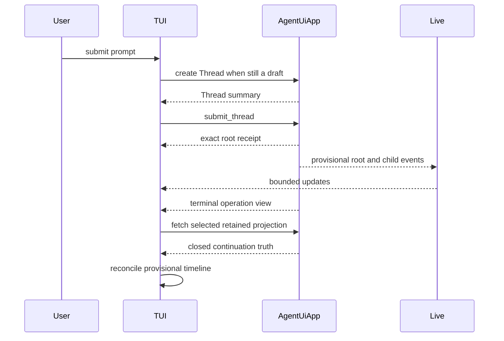

# Terminal Workstation Overview

## Design Position

The Agent UI TUI is a keyboard-first local Agent workstation built with Textual. It is a peer of the ordinary CLI and bundled WebUI over one process-local `AgentUiApp`. It optimizes terminal-native conversation, review, decisions, and multi-Thread supervision without reproducing a browser IDE or adding a service boundary.

The TUI has two top-level modes:

- **Focus mode** presents one root Thread and its complete descendant activity lineage.
- **Workbench mode** presents bounded root-Thread summaries and prioritizes work that needs human attention.

A mode transition changes presentation only. Root Runs and async child executions remain owned by the App and continue while the user moves between Focus and Workbench inside the same App lifetime. Leaving the App lifetime follows ordinary Agent UI shutdown and does not detach work into a daemon.

## Product Boundary

The TUI provides:

- current-directory Project resolution, a Project-filtered default Workbench, and an explicit All Projects fallback;
- root-Thread search, opening, archiving, and sticky configuration selection;
- retained transcript paging and live root-lineage presentation;
- prompt submission, exact steering, cancellation, and deferred response;
- structured assistant text, reasoning, tool, task, failure, and child activity;
- compact tool presentation and focused detail or diff review;
- attention-first multi-Thread supervision and bounded peek;
- command palette, contextual actions, `@` Project-path completion, and external-editor handoff;
- responsive wide, medium, and narrow layouts;
- explicit startup, degraded-live, conflict, and shutdown presentation.

It does not provide:

- durable root-input acceptance, a next-turn queue, worker takeover, or execution after App exit;
- direct SQLite, immutable-object, `HarnessState`, Model-client, Provider, or Environment-adapter access;
- a terminal-owned Agent loop or another execution coordinator;
- direct shell execution that bypasses the selected Agent, Capability, and Environment policy;
- a direct per-Thread Model selector when the selected Agent resource owns Model choice;
- creation, source editing, duplication, deletion, or import of configured resources and Skills;
- installation, removal, or upgrade of Capability, Harness Plugin, Environment Provider, or Run Extension packages;
- Git-backed undo or redo without a separately owned Agent UI change-reversal contract;
- public conversation sharing without a separately owned publication contract;
- an embedded PTY terminal emulator;
- browser preview, rich media editing, drag and drop, or a full code editor.

Desired-resource authoring uses direct file editing or the WebUI; Skill authoring uses direct file editing or external tools. The read-only configuration CLI locates, validates, and shows accepted files, while explicit import commands remain narrow conversion operations. The TUI can inspect accepted resources, installed catalogs, source locations, and diagnostics and can select existing resources for a draft or persisted Thread; those actions never create or mutate a resource or Skill source. It filters Workbench by the launch Project or shows All Projects. Interactive shell programs and long-form source editing use an external terminal or editor. Ordinary shell-tool activity remains a semantic timeline block with bounded output.

## Application Relationship



The TUI cannot make an operation true by rendering it. A submitted prompt becomes accepted only when the App returns a receipt. A steering or cancellation request becomes accepted only when the exact receipt control returns an acknowledgement. A visible answer becomes retained conversation truth only after the App selects the corresponding continuation and the TUI reconciles its provisional timeline.

## Startup and Routing

The default interactive entry opens the terminal shell before loading expensive optional views. Startup resolves the initial screen as follows:

1. An explicitly selected root Thread opens in Focus mode and sets the initial Workbench filter to that Thread's current Project.
2. Otherwise the App resolves the current working directory against configured Projects' first roots.
3. An explicit Workbench entry opens Workbench under the resolved Project filter, or as All Projects when resolution is unmatched or ambiguous.
4. Without an explicit route, one unambiguous Project opens a new draft in Focus mode with that launch Project context and the same Project-filtered Workbench behind it.
5. An unmatched or ambiguous directory opens All Projects with new-Thread creation disabled and one bounded configuration notice.

The launch directory is an input to [current-directory Project resolution](../04-projects-threads-and-environments.md#current-directory-resolution), not a new resource or dynamic root override. The TUI never creates a Project, reorders roots, asks the user to navigate a Project tree, or opens a Project picker. The configured first root remains the default working directory and receives mount ID `workspace`; later roots remain additional mounts managed through files or the WebUI. An unmatched or ambiguous notice identifies the resolved configuration location and offers the WebUI or direct-file path for repair without blocking inspection of existing Threads through All Projects.

The selected Workbench Project filter is terminal-local presentation state. The user can switch explicitly between the launch Project and All Projects. Opening an existing Thread does not change its stored Project. Returning to Workbench defaults to that Thread's Project only when no explicit filter is already selected.

A new draft remains terminal-local until the first submission. On submission, the controller creates the root Thread with the launch-resolved Project, Agent, Environment profile, Harness Plugins, Environment Run Extensions, and MCP servers, then submits the prompt. If Thread creation succeeds and prompt admission fails, the created Thread remains visible and the draft is restored; the TUI does not pretend the two operations were atomic.

Startup does not automatically resume the most recent Thread. Existing history opens only through an explicit Thread selection, preserving the distinction between a new task and continuation.

## Screen Model

| Surface                    | Purpose                                                                     | Lifetime                                         |
| -------------------------- | --------------------------------------------------------------------------- | ------------------------------------------------ |
| Focus                      | Full timeline and current-Thread operation                                  | Mounted only for the focused root Thread         |
| Workbench                  | Attention-ranked root Threads and bounded preview                           | One lightweight top-level mode                   |
| Review                     | Focused approval, diff, tool, task, or child detail                         | Screen or overlay above the owning mode          |
| Thread picker              | Search under the current Project filter with explicit All Projects fallback | Overlay or narrow full-screen view               |
| Command palette            | Discover and invoke context-valid actions                                   | Overlay                                          |
| Thread configuration sheet | Inspect Project and patch supported non-Project selections                  | Overlay; App version checks remain authoritative |
| Help/status                | Explain current bindings, state, and degraded conditions                    | Overlay                                          |

Opening a Review or picker preserves the underlying composer draft, timeline position, and selected Workbench row. Dismissing an overlay returns to that exact local presentation state unless the authoritative App state changed while it was open.

## Focus Mode

Focus mode is the primary turn loop. It contains:

- a compact identity and activity header;
- a semantic conversation and activity timeline;
- an optional contextual inspector;
- a mode-aware composer or deferred-decision surface;
- a footer showing only currently valid actions.

### Wide Focus Layout

```text
+ Agent UI - agent-foundation / Fix flaky tests - Assistant - Native - Running +
|                                                                              |
| YOU                                                      | TASKS  2/5        |
| Find the source of the flaky checkout test.              | [x] inspect       |
|                                                          | [*] reproduce     |
| ASSISTANT                                                | [ ] fix           |
| I will inspect the test setup and reproduce the race.    |                   |
|                                                          | CHILDREN  2       |
| |- Read  tests/test_checkout.py                 done     | [*] explorer      |
| |- Search  "checkout fixture"                  done     | [*] reviewer      |
| |- Shell  pytest tests/test_checkout.py -x     running   |                   |
| |    ... 14 passed, waiting on test_retry ...             | CONTEXT           |
| `- Subagents  2 running                                  | Agent assistant   |
|                                                          | Project foundation|
| Thinking                                                 | Env native        |
| inspecting retry cancellation...                         | MCP 2             |
|                                                                              |
+ Steer current run ------------------------------------------------------------+
| > Check whether the retry task survives fixture teardown.                    |
+------------------------------------------------------------------------------+
| Enter send  Alt+Enter newline  Ctrl+P commands  Ctrl+C cancel  Ctrl+O workbench|
+------------------------------------------------------------------------------+
```

The inspector can stack compact summaries for Tasks, Changes, Children, Context, and Thread configuration, but expands only one selected concern at a time. It is collapsible and never reduces the timeline below the minimum usable width.

### Medium and Narrow Focus Layout

At medium width, the timeline occupies the screen and the inspector becomes a switchable drawer. At narrow width, Focus renders one primary pane; Review, Context, Children, and Thread selection become full-screen drill-down surfaces.

```text
+ agent-foundation / Fix flaky tests - Running +
|                                               |
| YOU                                           |
| Find the source of the flaky checkout test.  |
|                                               |
| ASSISTANT                                     |
| I will inspect the setup and reproduce it.    |
|                                               |
| |- Read test_checkout.py               done  |
| `- Shell pytest ...                 running  |
|                                               |
+ Steer current run ----------------------------+
| >                                             |
+-----------------------------------------------+
| Ctrl+P commands  Ctrl+C cancel  Ctrl+O threads|
+-----------------------------------------------+
```

No narrow layout horizontally compresses a side-by-side diff or Workbench preview into unreadable columns. Those views switch to one-pane navigation.

## Workbench Mode

Workbench supervises root Threads under one exact Project filter or through All Projects without retaining one full widget tree or live Markdown stream per Thread. Its default filter comes from launch context. It does not group rows into a Project tree or require opening a Project before a Thread. All Projects rows carry a compact Project label; async child activity remains grouped under its owning root, and rows order by attention before ordinary recency.

A selected row exposes a bounded preview and context-valid actions. Taking over opens that root Thread in Focus while every other App-owned operation continues. Filter changes affect presentation only. The launch-resolved Project supplies new drafts; opening an existing Thread uses that Thread's stored Project without mutating either value.

### Wide Workbench Layout

```text
+ Workbench - Project: agent-foundation - 1 attention - 2 running --------------+
|                                                                              |
| NEEDS ATTENTION                         | PREVIEW                              |
| > ! API rate limiter                    | API rate limiter                     |
|     question - 20s - 2 children         |                                      |
|                                         | Where should counters be stored?     |
| RUNNING                                 |                                      |
|   * Investigate flaky checkout          | 1  Redis, sliding window             |
|     shell - 1m - 2 children             | 2  In-memory, per instance           |
|   * Update installation docs            | 3  Postgres                          |
|     writing - 35s                       | 4  Other                              |
|                                         |                                      |
| IDLE                                    | [Answer] [Open Thread] [Deny]         |
|   o Release checklist                   |                                      |
|   o Untitled thread-01J...              | CHILDREN                              |
|                                         | [x] storage explorer                 |
|                                         | [*] API reviewer                     |
+ New work: > dispatch another task... ----------------------------------------+
| Up/Down select  Enter open  Ctrl+N new  Ctrl+P commands                       |
+------------------------------------------------------------------------------+
```

The preview reflects the selected row's authoritative state:

- an awaiting Thread shows the exact pending decision sequence;
- a running Thread shows bounded latest activity and accepts steering only when the exact receipt permits it;
- an idle Thread accepts a new prompt;
- a failed or completed current-process operation shows its terminal outcome and continuation status;
- a root with children shows bounded rolled-up counts and selected child detail.

Workbench never queues ordinary text behind an active Run. Text entered for a running row is labeled and submitted as steering; rejection restores the draft. Dispatching new work creates another root Thread under the launch-resolved Project and is unavailable when launch resolution did not select one. Switching to All Projects does not invent a Project for new work.

### Medium and Narrow Workbench Layout

At medium width, the row list and preview are tabs. At narrow width, the list is primary and selecting a row opens its preview full screen before Focus takeover. The same attention order and actions apply at every width.

## Responsive Layout

Width classes are presentation policy, not protocol values. Concrete breakpoints belong to the terminal package and are validated against supported terminals.

| Width class | Focus                       | Workbench                     | Review                          |
| ----------- | --------------------------- | ----------------------------- | ------------------------------- |
| Wide        | Timeline plus one inspector | List plus preview             | Split diff when content permits |
| Medium      | Timeline plus drawer        | List or preview tab           | Unified diff by default         |
| Narrow      | One primary pane            | List then full-screen preview | Full-screen unified detail      |

A resize preserves selected Thread, selected row, focused semantic block, draft, overlay purpose, and reading anchor. It may close only a presentation arrangement that cannot exist at the new width, replacing it with the equivalent drawer or full-screen surface.

## Core Flows

### Prompt and Continuation



The composer clears only after Thread creation and prompt admission succeed. A local user-message echo can appear immediately, but it remains visibly provisional and is correlated by terminal-local submission identity rather than text matching.

### Moving Between Threads

When the user leaves Focus during an active Run:

1. the focused detailed subscription closes;
2. the App-owned root operation continues;
3. Workbench continues from summary invalidations and bounded refetches;
4. returning to Focus establishes a new snapshot cutover before live rendering;
5. retained state and current-process activity reconcile any events not observed while unfocused.

Focus never needs a full replay of every live delta to recover correct state.

### Deferred Decision

A selected suspended continuation can contain several pending requests. The TUI presents one question or approval at a time, accumulates a complete local answer set, then submits one exact response batch naming the selected continuation. A continuation change discards no draft silently: the App rejects the stale batch, the TUI refetches the current request set, and the user explicitly reviews the new state.

### Shutdown

If no App-owned operation is active, exit closes the TUI and App normally. If root or child work is active, the exit surface states that work is process-local and will not continue after shutdown. Confirmed exit stops new admissions, begins the App's bounded graceful drain, requests cooperative cancellation where required, restores ordinary terminal mode before waiting for potentially unbounded trusted cleanup, and renders no invented success for work without a terminal checkpoint.

## Stable Principles

01. Focus and Workbench are presentation modes over one App, not separate runtimes.
02. A new invocation starts new work unless the user explicitly selects an existing Thread.
03. Workbench provides attention-first supervision without mounting inactive conversations.
04. Switching focus never cancels App-owned work.
05. Exiting the owning App never claims that local work remains running.
06. Active input is steering, not a queued future turn.
07. Pending decisions preserve exact continuation and request correlation.
08. Responsive presentation never changes authority or state.
09. Terminal-native review uses progressive disclosure and external escape hatches instead of imitating a browser IDE.
10. Closed retained facts always reconcile provisional live presentation.
11. The current directory selects only a configured launch Project and default Project filter; the TUI never creates, reorders, or edits Projects.
12. The TUI can switch between the launch Project filter and All Projects without introducing another grouping model.
