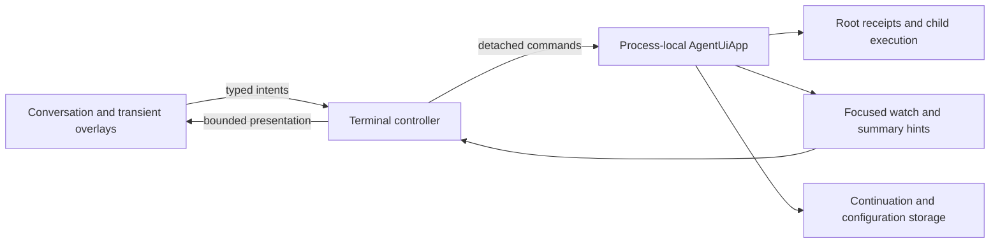
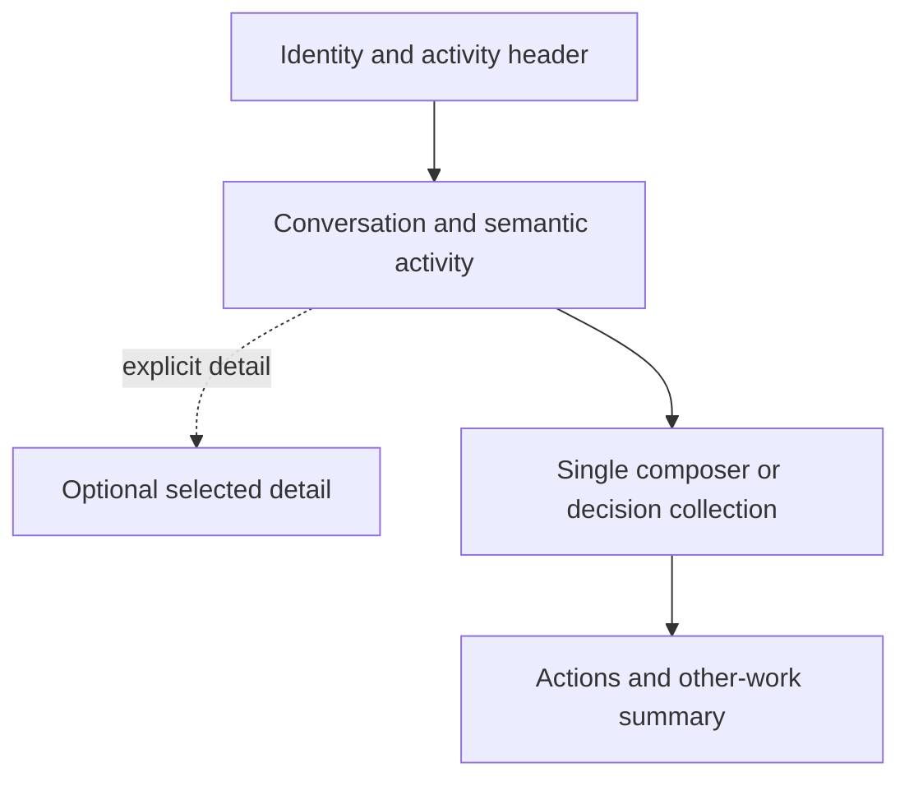

# Conversation Terminal Overview

## Design Position

The Agent UI TUI is a keyboard-first conversation interface built with Textual over one process-local `AgentUiApp`. It presents one current root Thread and its descendant activity, with a transient Thread picker for finding another conversation. There is no Workbench, dashboard, second top-level mode, or second task-dispatch composer.

Multi-Thread storage and process-local concurrency do not require a multi-task control center. Selecting another Thread changes presentation only: the App retains ownership of admitted root and child work. Exiting the App ends that local execution lifetime. The terminal neither starts nor attaches to a background Agent UI daemon. [Runtime and surfaces](../05-runtime-subagents-and-surfaces.md) owns the distinction between terminal lifetime and the longer-lived WebUI server.

## Product Boundary

The TUI provides:

- guided [first-use setup and Environment readiness](../06-setup-and-environment-readiness.md);
- current-directory Project resolution and explicit new-draft launch overrides;
- searchable recent root Threads with Project/All Projects filtering and bounded activity indicators;
- retained transcript paging, one live root-lineage view, and progressive tool, task, and child detail;
- prompt submission, exact receipt-scoped steering and cancellation, and complete deferred decisions;
- existing-resource selectors, command palette, `@` Project-path and `$` Skill completion, and external-editor handoff;
- responsive layouts and explicit startup, conflict, degraded-live, and shutdown recovery.

It does not provide a durable input queue, process takeover, a separate execution coordinator, direct storage or Harness access, shell execution outside Agent policy, arbitrary resource editing, package management, or a browser IDE. Setup is the narrow exception to ordinary read-only desired-resource handling: explicit confirmation creates reviewed starter files and sets defaults through the App's configuration boundary. It is not a generic terminal resource editor.

Model-visible cross-Thread collaboration is absent in TUI and one-shot CLI Runs. User-facing Thread selection and current-lineage subagent controls remain available. Only the WebUI App lifetime injects [Thread collaboration](../05-runtime-subagents-and-surfaces.md#webui-thread-collaboration-capability).

## Application Relationship

Rendering does not confer execution authority. Prompt admission requires a receipt; steering requires an acknowledgement against its exact receipt; visible output is retained only after continuation selection and reconciliation.

## Startup and Routing

Bare `a13n-ui` and `a13n-ui tui` start the same terminal. `a13n-ui webui` explicitly starts the browser server. No terminal invocation starts an HTTP listener or an Agent UI daemon.

The shell paints before opening the App or performing optional preparation. It then:

1. inspects accepted configuration and offers setup when a usable default composition has not been configured;
2. uses an explicit accepted `--project` or resolves the launch directory against Projects' first roots;
3. opens an explicitly selected root `--thread`, otherwise shows a new local draft;
4. verifies the effective Environment selection through the App readiness boundary before admitting work.

`--thread` is mutually exclusive with `--project`, `--agent`, `--environment-mode`, and `--environment-profile` draft overrides. These overrides do not modify files or existing Threads. Startup never silently resumes the most recent conversation.

If the launch directory is unmatched or ambiguous, the conversation shell remains usable for opening an existing Thread through All Projects. New submission is disabled until a valid draft Project is selected through setup or explicit accepted configuration. The notice includes the App-approved configuration path and a repair action; it does not send the user into a dashboard or invent a Project. On first use, setup may explicitly create a Project for the launch directory after confirmation. Outside setup, the stored Project is read-only in the TUI.

A new draft is local until first submission. The App creates the Thread using the selected Project, Agent, Environment and extension IDs, then admits the prompt. If creation succeeds but admission fails, the created Thread remains visible and the complete draft is preserved on that Thread. Creation and admission are independent completion boundaries.

## Screen Model

| Surface              | Purpose                                                                   | Lifetime                                      |
| -------------------- | ------------------------------------------------------------------------- | --------------------------------------------- |
| Conversation         | Current timeline, composer or decision collection, and optional inspector | One primary surface                           |
| Thread picker        | Recent/searchable root Threads under Project or All Projects              | Transient modal; full-screen at narrow widths |
| Review               | Approval, tool, diff, task, or child detail                               | Overlay over the current conversation         |
| Configuration        | Read-only Project and supported sticky selectors                          | Transient modal with exact version checks     |
| Setup/readiness      | Confirm starter resources or recover a selected Environment               | Explicit bounded workflow                     |
| Commands/help/status | Discover actions and inspect safe App facts                               | Transient modal                               |

Opening a picker preserves the current draft, timeline, reading anchor, and focused subscription. Highlighting a result does not subscribe to it or fetch a transcript preview. Only explicit selection opens that root, replaces the focused watch, and restores its local draft. Dismissal changes nothing. A newly created draft and inactive Thread drafts use the same bounded cache.

## Conversation Layout

A compact header shows Thread, Project, Agent, Environment, and current control state. The timeline occupies the main area. Optional contextual detail uses a collapsible inspector at wide widths and a single-pane drill-down at narrow widths. There is one multiline composer, replaced temporarily by decision collection when required, and a footer with context-valid actions.

Other process-local work appears as a compact summary, such as additional running roots or Threads waiting for input, with an action to open the picker. A count is exact only when supplied by an App-wide aggregate; otherwise the display states its bounded scope. The terminal never implies that a filtered page counts every active operation. Exit confirmation always uses the authoritative App-wide root and child counts.

## Navigation and Concurrency

`Ctrl+O` and `/threads` open the picker, not a mode toggle. `Ctrl+N` and `/new` start a local draft. `Esc` closes a modal without cancelling a Run or discarding input. Keyboard and mouse paths have the same effects. Search and Project filtering affect listing only and never change a Thread's Project.

Switching or starting a draft while another Thread runs is allowed. There is at most one root operation per Thread, not one per App. Current-thread submission while running is explicitly steering, never a silently queued next turn. Control of another Thread requires opening it; the picker has no preview composer, cross-row approval, cancellation, steering, or dispatch controls.

A closed browser tab and an exited terminal are different lifetime events. A WebUI server can continue its own work while no browser is attached. A terminal App stops owning work when it exits; saved conversation does not imply automatic recovery of interrupted execution.

## Responsiveness and Accessibility

The implementation maintains one bounded mounted timeline, lazily creates heavy detail views, preserves reading anchors and drafts across resize, and coalesces live repaint without losing semantic boundaries. Routine successful tools collapse while failures remain explainable. State is conveyed with text as well as color. No operation relies only on mouse input, a modifier-only hidden action, or automatic approval.

## Invariants

1. There is one conversation surface and one composer, not a Workbench mode.
2. The Thread picker is navigation, not a scheduler or alternate control surface.
3. Switching presentation never cancels App-owned work.
4. Existing Thread Project and resource authority remain App-owned.
5. Setup and Sandbox recovery require explicit choices and never silently downgrade isolation.
6. The TUI injects no cross-Thread model tools and starts no daemon.
7. Process-local status, saved continuation, and visible output remain distinct facts.
8. Shutdown confirms all active App work and restores the terminal before potentially unbounded cleanup.
