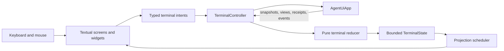
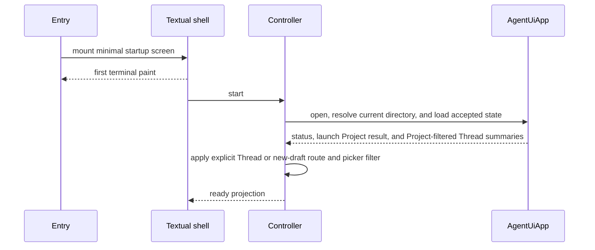

# Textual Runtime Architecture

## Design Position

The interactive terminal uses Textual in the same Python process and asynchronous event loop as one `AgentUiApp`. Textual owns terminal setup, layout, focus, input, screens, widgets, and rendering. It does not become an application-service, execution, storage, or continuation boundary.

The terminal architecture has four semantic layers:

1. a controller translates typed user intents into detached App operations and consumes App streams;
2. a pure reducer converts detached facts and provisional events into bounded terminal state;
3. a projection scheduler coalesces render work without changing semantic order;
4. Textual screens and widgets render the projected state and emit typed intents.



## Dependency Boundary

The terminal package may depend on:

- public detached Agent UI surface models and errors;
- the public App command, query, and subscription boundary;
- public AG-UI event models carried by Agent UI live events;
- Textual and its public Rich rendering values;
- small terminal-local immutable models.

It does not import:

- Agent UI storage repositories or ORM models;
- immutable-object readers or paths;
- `HarnessState`, `HarnessRunStream`, Pydantic AI message objects, or native deferred values;
- Model clients, MCP clients, Provider runtimes, or Environment adapters;
- `AgentUiSubagentOperator` implementation details;
- WebUI transport models as an alternate application contract.

`AgentUiApp` and the Harness import no Textual or terminal type. A narrow structural App protocol may be used to test the controller, but production has one concrete App authority rather than a replaceable runtime plugin layer.

## Terminal Components

| Component            | Owns                                                                                                   | Does not own                                                   |
| -------------------- | ------------------------------------------------------------------------------------------------------ | -------------------------------------------------------------- |
| Terminal entry       | TTY validation, minimal imports, logging setup, Textual launch, process exit mapping                   | App domain operations or rendering policy                      |
| `TerminalApp`        | Textual lifetime, conversation and modal routing, screen stack, bindings, terminal restoration         | Agent execution or authoritative state                         |
| `TerminalController` | App calls, subscriptions, receipt correlation, refetch, intent routing, and bounded controller tasks   | Widgets, storage, Harness values, or continuation construction |
| Reducer              | Deterministic semantic blocks, provisional state, reconciliation and lightweight other-work indicators | I/O, timers, App calls, or terminal rendering                  |
| Projection scheduler | Delta coalescing, stale-version rejection, and bounded render cadence                                  | Dropping semantic boundaries or changing App truth             |
| Focus screen         | One focused timeline, inspector, decision surface, and composer                                        | Other Threads' mounted histories                               |
| Review screen        | App-supplied diff, tool, approval, task, or child detail                                               | Reading Project files or granting authority                    |
| Semantic widgets     | Markdown, tool rows, task rows, child rows, notices, failures, and composer editing                    | App calls from event callbacks                                 |

A widget callback posts one typed intent. It never starts a Harness Run, calls storage, or independently resolves whether an operation is allowed.

## Startup Lifecycle

Startup separates first paint from App readiness:



The terminal entry avoids importing optional document conversion, syntax-heavy review, Project indexing, or embedded runtime modules before they are needed for first paint. The App can still fail during startup; the mounted shell renders the safe failure and recovery actions instead of leaving an unpainted alternate screen.

First-use setup and selected-Environment preparation follow [Setup and Environment Readiness](../06-setup-and-environment-readiness.md). They run as cancellable App operations after first paint, never under the terminal input lock, and publish typed progress/results. A stale result cannot change a newer draft or Thread selection.

Non-interactive CLI commands do not import or initialize Textual. Non-TTY input or output never accidentally starts a full-screen application.

## App Integration

### Summary Subscription

The picker and other-work indicator use one App-wide summary subscription plus bounded queries:

1. establish the summary subscription and record its epoch and cutover;
2. query the first root-Thread summary page under the current Project filter or through All Projects;
3. apply buffered invalidations after the cutover;
4. refresh current-operation and other-work projections on invalidation, without replacing an open picker's filter or accumulated pages;
5. reopen the summary barrier after a gap; refresh picker pages on explicit reopen, search/scope change, or Load more.

Summary invalidations are refetch hints, not row patches. The reducer never manufactures row truth from an invalidation alone.

A root-Thread summary page supplies enough bounded information to render rows without one detail query per Thread:

- root activity and exact current-process control availability;
- pending-decision kind and count;
- current-process terminal outcome summary when retained by the App;
- child persisted-status counts for running, succeeded, failed, cancelled, and lost, plus active and unavailable counts that partition only persisted-running children;
- latest safe activity summary and time;
- Thread identity, metadata, Project, Agent, Environment, and update time.

Highlighting a row performs no detail query or subscription. Explicit selection replaces the one focused watch. Switching between the launch Project and All Projects starts a fresh Project-filtered first-page query.

### Focus Watch

Focus uses one root-lineage watch at a time:

1. subscribe to the selected root Thread before snapshot reads;
2. obtain the Thread detail, bounded child and task projections, current root operation, selected continuation, and cutover cursor as one focused snapshot;
3. while later events remain buffered, query the latest retained transcript page through a cursor bound to that continuation;
4. reduce the snapshot and retained page;
5. consume only events later than the cutover;
6. reconcile terminal outcomes and selected continuations through explicit refetch;
7. close the watch when focus changes.

If the selected continuation changes while the retained page loads, the transcript query fails or resets rather than combining unrelated history and control state.

Only the current conversation owns live root-lineage event reduction. The picker sees other work through lightweight App summaries.

### Operation Receipts

The controller retains only the exact process-local receipt IDs required to observe or control root operations. Submission returns before preparation, so the controller:

- reflects `preparing` immediately from the receipt;
- starts a bounded terminal waiter or responds to root-operation invalidation;
- resolves steering and cancellation against that exact receipt;
- ignores a stale terminal result whose receipt no longer matches the tracked operation;
- removes terminal control only after applying the complete operation view.

The controller does not keep the operation alive; the App owns it. Switching screens or closing a Focus watch does not cancel the receipt.

### Deferred Response

The controller keeps pending answer drafts as terminal-local values and sends only the detached complete response input accepted by `respond_thread()`. It does not deserialize stored continuation objects or construct native Pydantic deferred types.

## Reducer Contract

The reducer is deterministic over explicit inputs:

```text
previous TerminalState
+ TerminalEvent(snapshot | live | outcome | command_result | local_intent_result)
= next TerminalState + ProjectionHints
```

For the same ordered inputs, it produces the same semantic state. Wall-clock labels, animations, and cursor blinking are projection concerns and do not enter reducer truth.

Reducer inputs carry monotonically comparable local versions or exact source correlation. The reducer:

- rejects stale snapshot or background-query results;
- treats duplicate closed facts idempotently;
- accumulates compatible text and reasoning deltas within one open part;
- pairs tool lifecycle values only by exact tool-call identity;
- groups child activity by root, parent, execution, and child Run identity;
- applies task updates by authoritative task-state version;
- preserves unknown custom events as bounded neutral activity when possible;
- distinguishes provisional blocks from closed retained blocks;
- updates the picker and bounded other-work indicators from App facts;
- emits render hints rather than calling Textual APIs.

It never:

- validates authorization or deferred completeness on behalf of the App;
- infers completion from silence, elapsed time, spinner removal, or stream closure;
- treats an invalidation as the changed value;
- merges different Runs because they belong to the same Thread;
- changes Thread metadata or configuration;
- persists a draft, read marker, or scroll position as execution truth.

## Event Normalization

Agent UI live events carry standard AG-UI events and complete namespaced custom fallbacks. The controller normalizes them into the terminal's closed input union before reduction. The normalization layer is exhaustive over the supported Agent UI/Harness release and has a safe unknown-event form.

Direct semantic mappings include:

| Live input                           | Terminal input                                                          |
| ------------------------------------ | ----------------------------------------------------------------------- |
| Text start/content/end               | Open, append, and close assistant block                                 |
| Reasoning start/content/end          | Open, append, and close reasoning block                                 |
| Tool call start/arguments/end/result | Tool lifecycle update                                                   |
| Harness tool extra                   | Correlated tool semantic update                                         |
| Working State task change            | Versioned task update                                                   |
| Child live event                     | Child timeline update under root lineage                                |
| Run finished/error                   | Provisional terminal activity; App operation view remains authoritative |
| Suspended run-result custom event    | Await terminal operation and selected pending-request projection        |
| Unknown custom event                 | Bounded neutral event with no control effect                            |

The TUI does not interpret private Pydantic AI or Harness implementation classes. A new compatible custom event can remain visible as neutral activity until the terminal adds a specific presenter.

## Streaming and Projection Scheduling

One contiguous open assistant or permitted reasoning block owns one Textual `Markdown` widget and one `MarkdownStream`. The controller and projection scheduler apply these rules:

1. reduce source deltas into bounded source text before rendering;
2. combine very small consecutive compatible deltas for a short bounded interval;
3. flush immediately at newline-sensitive transitions and semantic boundaries;
4. write coalesced fragments to the existing `MarkdownStream` rather than rebuilding an ANSI transcript;
5. stop the stream when the block closes;
6. reconcile the closed block from the retained App projection;
7. defer expensive final syntax presentation until a code fence or block closes when possible.

Coalescing changes repaint frequency only. It cannot cross a part identity, tool boundary, Run boundary, decision, failure, or terminal result. A slow renderer never blocks Harness execution or App publication; bounded live gaps use snapshot recovery.

Textual Messages and Signals carry projection mechanics only. The terminal does not create one semantic Message per model token or introduce a generic application event bus.

## Widget Retention and Rendering

Textual's retained tree is bounded explicitly:

- only the focused root Thread mounts a complete timeline;
- only a bounded window around the viewport, current turn, and open activity remains mounted;
- older retained blocks are represented by paging sentinels and remounted on demand;
- completed Markdown streams stop and lose active watchers;
- large tool output, diffs, Project-path choices, Skill choices, task graphs, and child detail mount lazily;
- Thread-picker rows are small immutable projections rather than hidden Focus screens;
- inactive Thread drafts use a bounded least-recently-used terminal cache;
- shell output, notices, and local errors have independent byte and row limits;
- resize work is coalesced and never reparses an unbounded transcript.

The compositor's dirty-region behavior is not treated as transcript virtualization. Off-screen mounted widgets still count against the terminal's bounds.

Closed App projections retain any content that the product promises to recover. Render caches, wrapped lines, syntax tokens, and measured heights are replaceable terminal-local data and may be discarded on resize or memory pressure.

## Markdown, Syntax, and Diff

Textual and Rich provide the only terminal rendering stack. The TUI does not render Markdown to ANSI and then parse that ANSI into another widget framework.

Assistant text uses safe Textual Markdown rendering. Tool JSON and code use bounded syntax rendering. Open incomplete code fences use a cheaper provisional style; complete closed content can receive full highlighting.

Diff rendering uses public Textual and Rich APIs or a separately reviewed permissively licensed dependency. It supports:

- unified presentation at every supported width;
- optional split presentation at wide widths;
- line numbers, additions, removals, and hunk boundaries;
- lazy materialization of long files or hunks;
- explicit truncation and omission markers;
- stable navigation independent from terminal resize.

The terminal does not depend on copied AGPL implementation or Textual private APIs. The repository lock selects the concrete compatible Textual release, and terminal regression validation covers that selected release.

## Input and Focus Discipline

The composer remains responsive while Markdown, tool output, summary invalidations, or child events arrive. Background surface work publishes a versioned result through the controller; it never mutates a widget from a non-owning task.

Focus rules are explicit:

- overlays trap focus only for their own controls;
- a decision can temporarily move focus to the timeline for context and exposes a direct return action;
- switching Threads preserves the corresponding draft and semantic reading anchor;
- a resize preserves logical focus even when the target moves into a drawer or full-screen view;
- ordinary terminal text selection coexists with block navigation;
- Escape follows the screen stack and never implicitly approves, denies, cancels a Run, or clears a draft.

Mouse interaction mirrors keyboard actions and is never the only path. Disabling mouse capture preserves terminal-native selection without making a workflow inaccessible.

## Failure and Recovery

| Failure                          | Runtime response                                                                                               |
| -------------------------------- | -------------------------------------------------------------------------------------------------------------- |
| App startup failure              | Keep terminal shell mounted; render safe diagnostics and exit/retry actions                                    |
| Summary stream gap               | Refetch the bounded root-Thread summary page under its exact current Project filter and establish a new cursor |
| Focus live gap                   | Disable provisional claims, establish a fresh focused snapshot, then resume                                    |
| Focus snapshot continuation race | Retry or reset; never combine transcript and requests from different continuations                             |
| Stale query or completion result | Discard by version and correlation                                                                             |
| Widget rendering failure         | Replace only that block with a safe rendering failure; App work continues                                      |
| Controller App call failure      | Restore relevant draft or selection and show the safe App error                                                |
| Terminal output failure          | Stop accepting intents, close Textual, and let the App perform bounded shutdown                                |
| Unexpected controller failure    | Log once at the executable boundary, enter failed presentation, and do not invent operation outcomes           |

Live recovery always uses retained and current-process App projections. The TUI has no event journal or replay store of its own.

## Shutdown and Terminal Restoration

`TerminalApp` owns terminal mode restoration while process control remains available. It restores the terminal before awaiting App collaborators that might ignore cooperative cancellation. Before a user-requested exit, the controller reads one detached authoritative App summary containing the counts of all process-local active root operations and child executions. This summary is independent of the current picker filter, search, pagination, and terminal retention bounds; presentation state is never used to infer whether confirmation is required.

Shutdown proceeds as follows:

1. stop accepting new terminal intents;
2. close command palette, pickers, and review surfaces without manufacturing decisions;
3. close focused and summary subscriptions;
4. show active process-local root and child work and obtain explicit confirmation when user-requested exit would interrupt it;
5. ask the App to stop new admissions and begin its graceful shutdown in an App-owned task;
6. consume immediately available terminal operation facts and stop projection tasks;
7. exit Textual and restore ordinary terminal mode;
8. await App shutdown in ordinary terminal mode, where a second process signal or external supervisor can enforce hard termination;
9. if App shutdown returns, map the final executable outcome to the ordinary CLI exit contract.

An App collaborator that ignores cancellation can prevent the process from returning but cannot keep the terminal restoration step behind that unbounded join. An uncatchable process termination can still prevent cleanup. Closing a screen, switching Thread, or losing the terminal connection is not itself an App shutdown command. Process ownership decides when the App lifetime ends.

## Resource and Responsiveness Invariants

01. Textual is a presentation runtime over `AgentUiApp`, not another application boundary.
02. One controller owns every terminal-to-App call and subscription.
03. The reducer is deterministic, bounded, replayable, and free of I/O.
04. Only Focus owns a full mounted transcript and detailed root-lineage stream.
05. The picker renders bounded summaries under one Project filter or through All Projects and never performs an N+1 detail scan to establish listing order.
06. One token does not imply one Textual Message, Markdown parse, layout, or terminal repaint.
07. Semantic boundaries are never dropped by coalescing.
08. App projections and terminal outcomes reconcile all provisional presentation.
09. Heavy details and old history mount lazily and remain explicitly bounded.
10. Terminal failure never changes execution, continuation, Environment, or child checkpoint truth.
11. Public Textual APIs and the repository lock define the supported framework boundary.
12. Shutdown restores ordinary terminal mode before waiting for potentially unbounded trusted App tasks and never implies detached execution.
