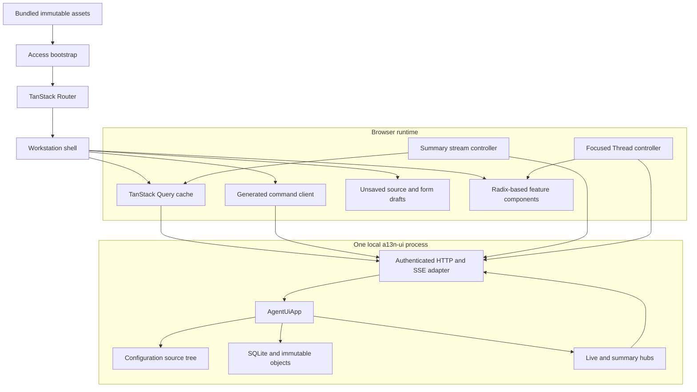
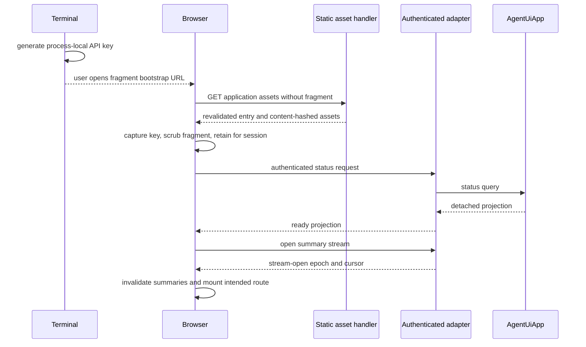

# WebUI Overview

## Design Position

The WebUI is the complete browser surface for one local `AgentUiApp`. It separates ordinary Thread interaction, detailed inspection, and desired-resource management without reproducing App behavior in JavaScript. The browser renders detached projections, prepares typed commands, reduces provisional live events, and manages unsaved drafts. The Web adapter authenticates and translates those operations but remains thinner than the App.

The application is a client-rendered single-page application. Production serves one static application tree and relative `/api` requests from the same origin. Entry HTML revalidates while content-hashed assets are immutable. There is no server-side rendering, browser-owned backend, Node.js runtime, service worker, offline command queue, or independent frontend deployment.

## Technology Profile

| Concern                | Selected technology and boundary                                                                                                                     |
| ---------------------- | ---------------------------------------------------------------------------------------------------------------------------------------------------- |
| Language and rendering | Strict TypeScript and React; React owns browser composition, accessibility wiring, and ephemeral view state only                                     |
| Build                  | Vite produces the immutable static asset tree consumed by `a13n-ui` packaging                                                                        |
| Routing                | TanStack Router owns typed History API routes, path parameters, search parameters, and route-level code splitting                                    |
| Server projections     | TanStack Query owns query caching, request cancellation, invalidation, and explicit refetch                                                          |
| Focused live state     | One small pure reducer per focused root Thread folds ordered generated stream frames outside the query cache                                         |
| Components and styling | Radix UI primitives provide accessible behavior; Tailwind CSS and repository-owned semantic tokens provide visual styling                            |
| Resource editing       | CodeMirror 6 is loaded only on configuration routes and edits the same exact YAML or Markdown draft used by guided controls                          |
| Contract access        | A generated TypeScript client and schemas derive from the Web adapter's versioned OpenAPI document; handwritten request types do not compete with it |
| Testing                | Vitest, Testing Library, and MSW cover browser units and HTTP integration; Playwright covers critical real-browser flows                             |

The npm lockfile owns exact package versions. These families are architectural choices because they determine component ownership, static-build behavior, routing and cache semantics, and the browser testing boundary. The generated Web adapter schema is the only browser wire authority; an independently versioned npm AG-UI event or transport package does not redefine it. The WebUI does not adopt a meta-framework, Redux-compatible global domain store, CSS-in-JS runtime, full visual component suite, CopilotKit runtime, upstream AG-UI transport client, or external component registry.

## Boundaries

| Concern                                                           | Owner                                         | WebUI relationship                                                    |
| ----------------------------------------------------------------- | --------------------------------------------- | --------------------------------------------------------------------- |
| Agent, Thread, Run, child, continuation, and Environment behavior | `AgentUiApp` and its owning specifications    | Issues typed commands and renders detached projections                |
| HTTP listener and API-key enforcement                             | Web adapter                                   | Supplies the authenticated same-origin browser boundary               |
| HTTP schemas and status mapping                                   | Web adapter OpenAPI contract                  | Generates the browser client and runtime decoders                     |
| Retained server state                                             | Agent UI files, SQLite, and immutable objects | Cached temporarily by TanStack Query without browser persistence      |
| Detailed live delivery                                            | Agent UI focused watch and Web adapter SSE    | Reduced into one resettable provisional live layer                    |
| Summary invalidation                                              | Agent UI summary hub                          | Invalidates exact query families and never supplies replacement truth |
| Route and selection state                                         | TanStack Router                               | Makes current feature, resource, Thread, filters, and panels linkable |
| Unsaved form and source state                                     | Focused React feature boundary                | Discardable until an exact mutation succeeds                          |
| Component behavior and appearance                                 | WebUI design system                           | Preserves domain semantics and accessibility across layouts           |
| Native filesystem and credentials                                 | Host process and compatible account stores    | Never exposed as browser authority or raw secret material             |

## Browser Architecture

The generated client handles bounded request and response documents. Summary and focused stream controllers use authenticated `fetch` streaming rather than native `EventSource`, because every `/api` connection carries the Bearer API key. Feature components do not construct raw endpoint URLs or parse SSE frames directly.

## Workstation Information Architecture

The workstation has three durable areas with different jobs:

1. **Threads** supports the ordinary interaction loop. Workbench supervises attention-ranked root Threads across All Projects or one selected Project; Focus presents one Thread's conversation, current semantic activity, decisions, and controls.
2. **Configure** provides the browser-only complete management surface for Projects, Models, Agents, canonical subagents, MCP servers, configured extensions, defaults, installed catalogs, compatible Model accounts, exact sources, and configuration diagnostics.
3. **Debug** provides read-only authenticated App status and current-App-lifetime Thread, Run, child, task, state, payload, and timing inspection without an ordinary composer.

The Threads area follows the same Focus/Workbench product model as the TUI while using browser-native Project navigation. The WebUI can show All Projects or one selected Project and can create, edit, reorder, or delete Project resources through Configure. The selector is a direct Project filter and creates no separate grouping, root, membership, or binding model.

The ordinary Threads area does not permanently surround conversation with receipts, raw events, task tables, configuration source, or timing panels. Current activity is progressively disclosed: active reasoning, tools, tasks, and child work remain understandable while running; settled intermediate work folds into a compact semantic summary while the final answer remains primary. An exact activity or failure can deep-link to its corresponding Debug selection.

The shell composes an area-specific layout around one dominant primary surface. Threads uses the global rail, an All Projects/Project selector, an optional Project-filtered Thread collection, and one primary Workbench or Focus surface. Configure uses resource-kind navigation, a collection, and one editor or conflict surface, including complete Project source management. Debug can use navigation, one diagnostic view, and one selected detail pane. Detail panes are closed by default and never reduce the primary surface below its usable width.

The application does not mount every Thread or detailed subscription in the background. One selected Focus or Debug Thread route owns one focused controller. Workbench and collection sidebars use bounded Project-filtered query projections and the App-wide summary stream.

## Canonical Routes

| Route                      | Meaning                                                                                         |
| -------------------------- | ----------------------------------------------------------------------------------------------- |
| `/`                        | Select the most relevant available workstation destination without creating data                |
| `/threads`                 | Attention-ranked Workbench; optional `project` search parameter filters by one exact Project    |
| `/threads/new`             | Browser-local new root-Thread draft; optional Project origin initializes its explicit selection |
| `/threads/$threadId`       | Focus for one root Thread; mutable Project selection is not embedded in the Thread identity     |
| `/configure/projects`      | Project resource collection and editor                                                          |
| `/configure/models`        | Model resource collection and editor                                                            |
| `/configure/agents`        | Agent resource collection and editor                                                            |
| `/configure/subagents`     | Canonical Markdown subagent collection and editor                                               |
| `/configure/mcp`           | MCP server collection and editor                                                                |
| `/configure/extensions`    | Harness Plugin, Environment profile, and Environment Run Extension management                   |
| `/configure/defaults`      | Root process settings and global Thread defaults, excluding Web listener access                 |
| `/configure/catalog`       | Installed Capability and extension availability and ambiguity                                   |
| `/configure/accounts`      | Compatible Model account status and explicit account operations                                 |
| `/configure/diagnostics`   | Accepted and candidate source diagnostics with exact editor navigation                          |
| `/debug`                   | Authenticated App, API-schema, listener, and access-mode status                                 |
| `/debug/threads/$threadId` | Read-only detailed inspection for one root Thread and its descendant lineage                    |

A single-kind resource editor appends `/$resourceId` to its collection route. The combined Extensions area uses `/configure/extensions/$extensionKind/$resourceId` so Harness Plugin, Environment profile, and Environment Run Extension IDs cannot collide in one route namespace. Search parameters own collection filters, selected Debug views, optional exact detail correlation, and an optional originating Project on canonical Thread routes when those values must survive sharing or reload. That origin controls return navigation and collection filtering only; it never changes the Thread's Project. Ephemeral dialogs, disclosure state, scroll position, and unsaved values stay outside the URL.

Client routes use the History API. The Web adapter serves `index.html` for a recognized non-API navigation path so a reload or direct link enters the same router. An unknown `/api` or health path never falls back to browser HTML.

## Startup and Access Flow

The terminal prints a normal URL, the generated key, and a convenience URL carrying that generated key only in the fragment. URL fragments are not sent in HTTP requests. The browser captures the value before router startup, removes it from the visible URL and browser history entry, stores it in origin-scoped `sessionStorage`, and verifies it through an authenticated status query. A user-supplied key is never echoed and enters through the same manual access screen.

If the listener uses the explicit dangerous bypass, the status request succeeds without a key and the shell marks the connection as unauthenticated. A `401` clears an invalid retained key and returns to the access screen without discarding the URL destination the user intended to open.

[Client Runtime and Data](01-client-runtime-and-data.md) owns the complete browser behavior. [Runtime, Async Subagents, and Surfaces](../05-runtime-subagents-and-surfaces.md#http-startup-and-access) owns key generation, listener enforcement, and terminal output.

## Packaging and Runtime

Vite emits content-hashed assets and one revalidated browser entry document. All JavaScript, CSS, icons, fonts, syntax assets, workers, and editor resources required at runtime are local files in that tree. Production does not fetch a CDN script, web font, remote configuration document, or source map from a third party.

The Agent UI release builds the browser application before the Python distribution, copies the complete prepared tree into `a13n_ui/static`, and records asset hashes. Both wheel and sdist include that prepared tree; rebuilding a wheel from the sdist requires no Node.js. The browser has no release identity independent from `a13n-ui`.

Feature routes and heavy editors are code-split, but a deployed frontend and backend always come from the same Python artifact. Runtime protocol-version negotiation between arbitrary frontend and backend releases is therefore unnecessary. The adapter still versions `/api` schemas so development proxies, cached tabs, and explicit compatibility failures remain diagnosable.

## Trade-offs

The selected stack favors a mature interaction and testing ecosystem over the smallest possible JavaScript bundle. Static Vite output and route-level splitting keep that cost bounded without adopting a server-rendered framework. TanStack Query and the focused reducer deliberately separate retained projections from high-frequency events; this adds two visible state layers but prevents transient stream fragments from becoming false durable truth. Radix plus local styling requires more design work than a full component suite, but it preserves a distinct workstation experience and avoids framework-owned visual policy.

## Invariants

01. The WebUI is one static same-origin SPA over one authenticated Web adapter and one `AgentUiApp`.
02. Project is the only local-root and root-Thread organization concept; the WebUI adds no second grouping model.
03. React renders detached values and owns no duplicate Agent, Project, or Thread domain model.
04. TanStack Query, Router, focused live state, and unsaved drafts have separate responsibilities.
05. Only one selected Focus or Debug Thread route owns detailed live reduction.
06. Threads and Debug remain distinct: the former owns ordinary interaction and control, while the latter owns detailed read-only inspection.
07. Canonical Thread URLs use stable Thread identity rather than mutable Project identity.
08. Configure owns complete desired-resource management that the TUI intentionally does not reproduce.
09. Every complete workstation operation remains available without server rendering or a Node.js runtime.
10. A direct client-route navigation loads the SPA, while unknown API and health routes remain explicit failures.
11. Browser assets are local and released only inside `a13n-ui`; entry HTML revalidates and content-hashed assets are immutable.
