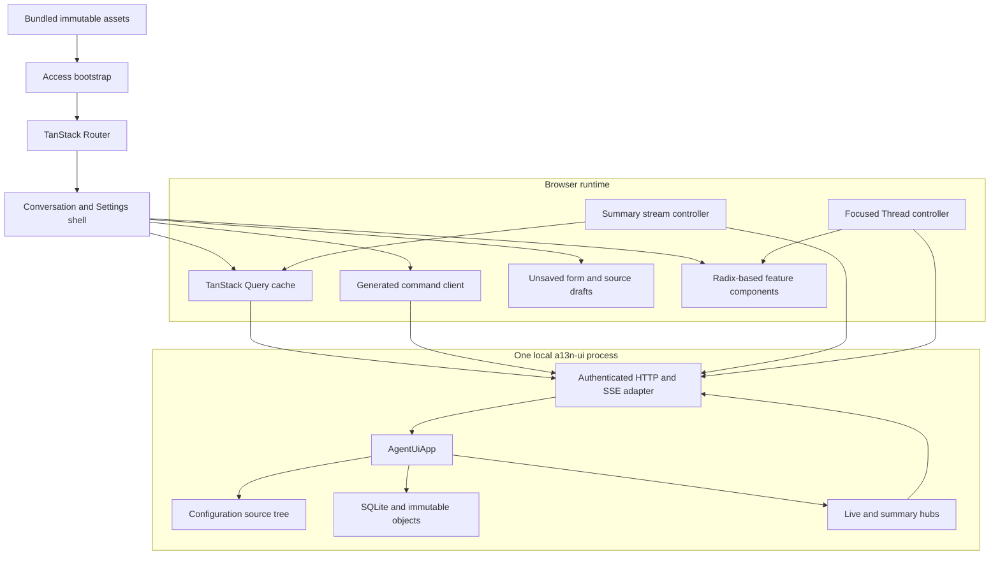
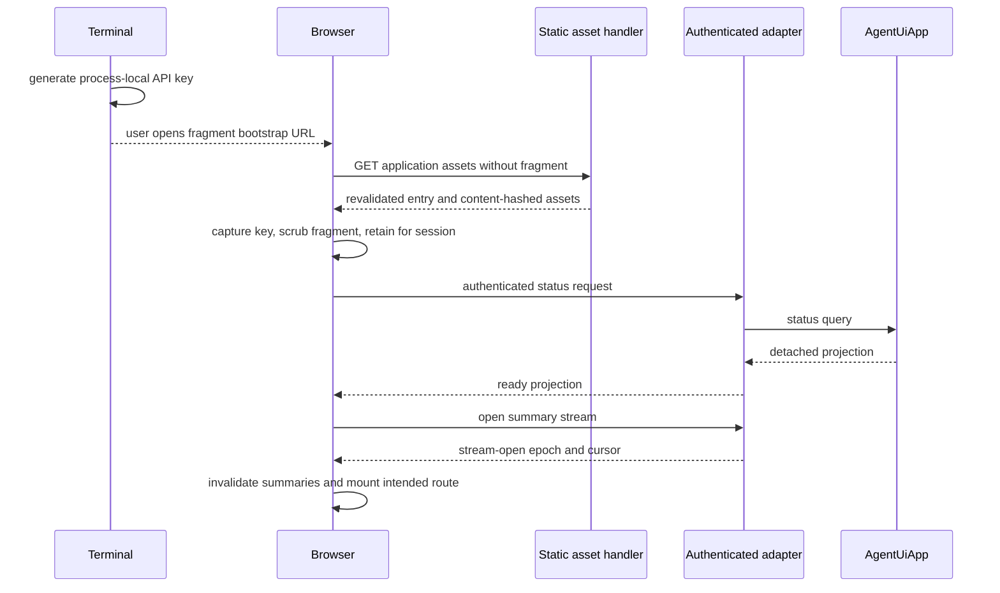

# WebUI Overview

## Design Position

The WebUI is the complete browser surface for one local `AgentUiApp`. Its default experience is a conversation browser rather than a dashboard: one sidebar selects or creates root Threads, one primary region presents the selected conversation, and one optional context panel exposes current Environment information or exact activity detail. Settings provides complete guided management without reproducing App behavior in JavaScript or requiring routine direct-file editing.

The application is a client-rendered single-page application. Production serves one static application tree and relative `/api` requests from the same origin. Entry HTML revalidates while content-hashed assets are immutable. There is no server-side rendering, browser-owned backend, Node.js runtime, service worker, offline command queue, or independent frontend deployment.

## Technology Profile

| Concern                | Selected technology and boundary                                                                                                                     |
| ---------------------- | ---------------------------------------------------------------------------------------------------------------------------------------------------- |
| Language and rendering | Strict TypeScript and React; React owns browser composition, accessibility wiring, and ephemeral view state only                                     |
| Build                  | Vite produces the immutable static asset tree consumed by `a13n-ui` packaging                                                                        |
| Routing                | TanStack Router owns typed History API routes, path parameters, search parameters, and route-level code splitting                                    |
| Server projections     | TanStack Query owns query caching, request cancellation, invalidation, and explicit refetch                                                          |
| Focused live state     | One small pure reducer per open root Thread folds ordered generated stream frames outside the query cache                                            |
| Components and styling | Radix UI primitives provide accessible behavior; Tailwind CSS and repository-owned semantic tokens provide visual styling                            |
| Resource editing       | Guided forms are primary; CodeMirror 6 loads only for advanced exact-source editing and conflict recovery                                            |
| Contract access        | A generated TypeScript client and schemas derive from the Web adapter's versioned OpenAPI document; handwritten request types do not compete with it |
| Testing                | Vitest, Testing Library, and MSW cover browser units and HTTP integration; Playwright covers critical real-browser flows                             |

The npm lockfile owns exact package versions. These families are architectural choices because they determine component ownership, static-build behavior, routing and cache semantics, and the browser testing boundary. The generated Web adapter schema is the only browser wire authority; an independently versioned npm AG-UI event or transport package does not redefine it. The WebUI does not adopt a meta-framework, Redux-compatible global domain store, CSS-in-JS runtime, full visual component suite, CopilotKit runtime, upstream AG-UI transport client, or external component registry.

## Boundaries

| Concern                                                           | Owner                                         | WebUI relationship                                                               |
| ----------------------------------------------------------------- | --------------------------------------------- | -------------------------------------------------------------------------------- |
| Agent, Thread, Run, child, continuation, and Environment behavior | `AgentUiApp` and its owning specifications    | Issues typed commands and renders detached projections                           |
| HTTP listener and API-key enforcement                             | Web adapter                                   | Supplies the authenticated same-origin browser boundary                          |
| HTTP schemas and status mapping                                   | Web adapter OpenAPI contract                  | Generates the browser client and runtime decoders                                |
| Retained server state                                             | Agent UI files, SQLite, and immutable objects | Cached temporarily by TanStack Query without browser persistence                 |
| Detailed live delivery                                            | Agent UI focused watch and Web adapter SSE    | Reduced into one resettable provisional live layer                               |
| Summary invalidation                                              | Agent UI summary hub                          | Invalidates exact query families and never supplies replacement truth            |
| Route and selection state                                         | TanStack Router                               | Makes Thread, Settings section, Settings filters, and contextual detail linkable |
| Unsaved form and source state                                     | Focused React feature boundary                | Discardable until an exact mutation succeeds                                     |
| Component behavior and appearance                                 | WebUI design system                           | Preserves domain semantics and accessibility across layouts                      |
| Native filesystem and credentials                                 | Host process and compatible account stores    | Never exposed as browser authority or raw secret material                        |

## Browser Architecture

The generated client handles bounded request and response documents. Summary and focused stream controllers use authenticated `fetch` streaming rather than native `EventSource`, because every `/api` connection carries the Bearer API key. Feature components do not construct raw endpoint URLs or parse SSE frames directly.

## Browser Information Architecture

The ordinary shell has two persistent regions and one optional region:

1. **Sidebar** provides New Thread, bounded Recent Threads, Projects with their root Threads, search and archive entry, and the Settings trigger. It is navigation rather than a separate work surface.
2. **Conversation** is the only ordinary execution surface. It presents one root Thread, retained messages, progressively disclosed live activity, deferred decisions, exact controls, and one composer.
3. **Context panel** is closed by default. It can present current Project and Environment context or one selected activity detail without reducing the conversation to a dashboard.

Project is the only root-Thread grouping. A Project row can create a Thread under that Project and expand a bounded child list. Recent Threads is a derived cross-Project index ordered by authoritative Thread recency; it does not own membership, acknowledgement, or another saved view. A Thread whose Project no longer resolves remains reachable through Recent, search, archive, or a bounded unresolved section supplied by the App.

The selected Thread opens directly as the ordinary conversation without an intermediate dashboard. Current reasoning, tools, tasks, and child work remain understandable while active. Settled intermediate work folds into concise inline summaries, and selecting a summary opens exact read-only detail on demand. A header or overflow action can replace the primary conversation with the complete activity log for that same root lineage; returning restores the conversation and its draft.

The optional Environment context presents only App-projected facts relevant to the selected Thread, such as Project, current root or working path, Environment profile and mode, active local processes, and available source or Asset references. A profile whose projection sets `canonical_host_paths=true` shows canonical local paths; other layouts show their applicable virtual Environment paths. Low-level mount aliases appear only in advanced detail when needed to explain a mapping.

Settings opens from the bottom of the sidebar and replaces the ordinary conversation region with a dedicated management shell. It uses section navigation plus one collection, guided editor, account flow, catalog, or diagnostic view. It is not a second global application area and does not remain mounted beside a conversation. Leaving Settings returns to the prior Thread or new-Thread draft when that destination remains valid.

The application does not mount every Thread or detailed subscription in the background. One open root Thread owns one focused controller shared by its conversation, activity log, and context detail. Sidebar collections use bounded recent or Project-scoped query projections plus the App-wide summary stream.

## Canonical Routes

| Route                    | Meaning                                                                                                |
| ------------------------ | ------------------------------------------------------------------------------------------------------ |
| `/`                      | Open the most recently updated non-archived root Thread, or an empty new-Thread draft when none exists |
| `/threads/new`           | Browser-local new root-Thread draft; optional Project origin initializes its explicit selection        |
| `/threads/$threadId`     | One root Thread conversation; optional typed search state selects activity or contextual detail        |
| `/settings`              | Stable Settings entry that selects the default section without changing App state                      |
| `/settings/projects`     | Project collection and guided root editor                                                              |
| `/settings/agents`       | Agent collection and guided composition editor                                                         |
| `/settings/subagents`    | Canonical Markdown subagent collection and editor                                                      |
| `/settings/models`       | Model collection and guided authentication-reference editor                                            |
| `/settings/accounts`     | Compatible Model account status and explicit account operations                                        |
| `/settings/environments` | Full Control, Sandbox, and custom Environment profile management                                       |
| `/settings/plugins`      | Harness Plugin and Environment Run Extension management as distinct resource kinds                     |
| `/settings/mcp`          | MCP server collection and guided transport editor                                                      |
| `/settings/defaults`     | Root process settings and global new-Thread defaults, excluding Web listener access                    |
| `/settings/catalog`      | Installed Capability and extension availability, provenance, ambiguity, and configuration entry        |
| `/settings/diagnostics`  | Accepted and candidate source diagnostics, App/listener status, and advanced exact-source navigation   |

A single-kind resource editor appends `/$resourceId` to its collection route. The combined Plugins section uses `/settings/plugins/$pluginKind/$resourceId` so Harness Plugin and Environment Run Extension IDs cannot collide in one route namespace. Search parameters on the canonical Thread route own conversation versus activity selection, optional context-panel mode, and exact detail correlation. Search parameters on Settings collection routes own shareable filters. Sidebar search, archive selection, Project expansion, and pagination are shell-local navigation state; selecting a result always enters its canonical Thread route. Ephemeral disclosures, scroll position, and unsaved values stay outside the URL.

Client routes use the History API. The Web adapter serves `index.html` for a recognized non-API navigation path so a reload or direct link enters the same router. An unknown `/api` or health path never falls back to browser HTML.

## Startup and Access Flow

The terminal prints a normal URL, the generated key, and a convenience URL carrying that generated key only in the fragment. URL fragments are not sent in HTTP requests. The browser captures the value before router startup, removes it from the visible URL and browser history entry, stores it in origin-scoped `sessionStorage`, and verifies it through an authenticated status query. A user-supplied key is never echoed and enters through the same manual access screen.

If the listener uses the explicit dangerous bypass, the status request succeeds without a key and the shell marks the connection as unauthenticated. A `401` clears an invalid retained key and returns to the access screen without discarding the URL destination the user intended to open.

[Client Runtime and Data](01-client-runtime-and-data.md) owns the complete browser behavior. [Runtime, Async Subagents, and Surfaces](../05-runtime-subagents-and-surfaces.md#http-startup-and-access) owns key generation, listener enforcement, and terminal output.

## Packaging and Runtime

Vite emits content-hashed assets and one revalidated browser entry document. All JavaScript, CSS, icons, fonts, syntax assets, workers, and editor resources required at runtime are local files in that tree. Production does not fetch a CDN script, web font, remote configuration document, or source map from a third party.

The Agent UI release builds the browser application before the Python distribution, copies the complete prepared tree into `a13n_ui/static`, and records asset hashes. Both wheel and sdist include that prepared tree; rebuilding a wheel from the sdist requires no Node.js. The browser has no release identity independent from `a13n-ui`.

Feature routes and heavy editors are code-split, but a deployed frontend and backend always come from the same Python artifact. Runtime protocol-version negotiation between arbitrary frontend and backend releases is therefore unnecessary. The adapter still versions `/api` schemas so development proxies, cached tabs, and explicit compatibility failures remain diagnosable.

## Trade-offs

The selected stack favors a mature interaction and testing ecosystem over the smallest possible JavaScript bundle. Static Vite output and route-level splitting keep that cost bounded without adopting a server-rendered framework. TanStack Query and the focused reducer deliberately separate retained projections from high-frequency events; this adds two visible state layers but prevents transient stream fragments from becoming false durable truth. Radix plus local styling requires more design work than a full component suite, but it preserves a distinct workstation experience and avoids framework-owned visual policy.

## Invariants

01. The WebUI is one static same-origin SPA over one authenticated Web adapter and one `AgentUiApp`.
02. Project is the only local-root and root-Thread organization concept; Recent Threads is derived navigation only.
03. The ordinary shell is a sidebar, one conversation, and one optional context panel; it has no global product-area rail.
04. The conversation is the only ordinary execution and composer surface.
05. One open root Thread owns at most one focused live controller across conversation, activity, and contextual detail.
06. Settings owns complete guided desired-resource management that the TUI intentionally does not reproduce.
07. React renders detached values and owns no duplicate Agent, Project, or Thread domain model.
08. TanStack Query, Router, focused live state, and unsaved drafts have separate responsibilities.
09. Canonical Thread URLs use stable Thread identity rather than mutable Project identity.
10. Every complete browser operation remains available without server rendering or a Node.js runtime.
11. A direct client-route navigation loads the SPA, while unknown API and health routes remain explicit failures.
12. Browser assets are local and released only inside `a13n-ui`; entry HTML revalidates and content-hashed assets are immutable.
