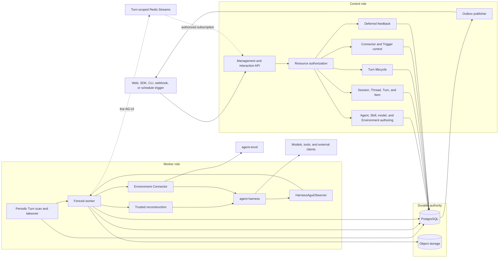
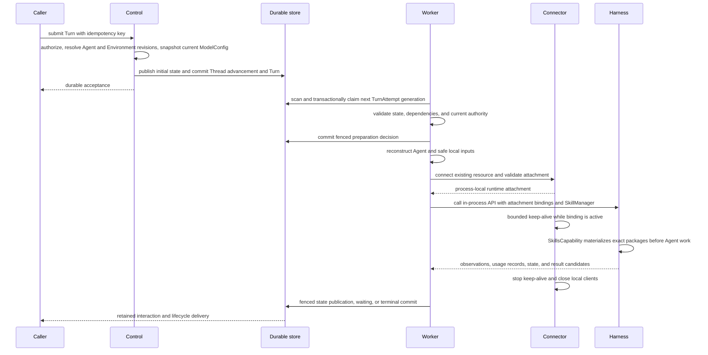
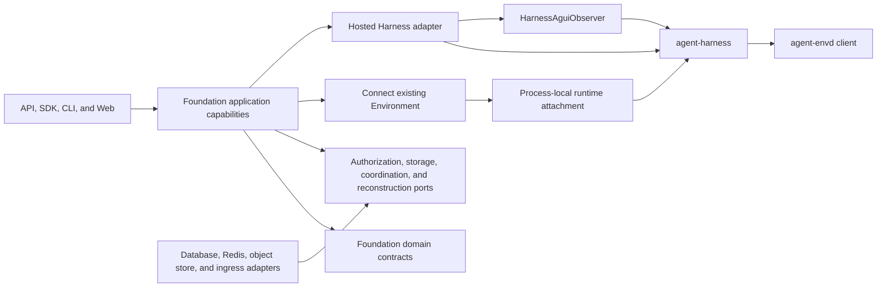

# Foundation Service Architecture

## Design Position

Foundation Service is the optional modular durable Host for Agent Foundation. It keeps one product schema, authorization boundary, executable package, and container image while assigning control and worker work to separately scalable process roles under the shared [runtime contract](01-runtime-configuration-and-deployment.md). It does not split lifecycle ownership across microservices.

The shared [Platform Interaction Model](../interaction-model.md) owns `Session`, `Thread`, `Turn`, and `Item`. Foundation persists each hosted Thread as an independent versioned relational resource, uses `Turn` as the durable Agent-work, scheduling, recovery, state, and outcome boundary, and uses `TurnAttempt` as one replaceable fenced worker generation. Every Foundation-managed Agent invocation accepts a Turn; Foundation defines no separate durable Execution resource.

The worker embeds the public Harness Python API. It loads exact [managed Harness plugin revisions](26-harness-plugin-artifacts-and-runtime-loading.md) on demand and exact [managed Skill revisions](27-skill-management.md) as inert Environment content from each AgentRevision lock, reconstructs process-local Agent values, and uses an exact trusted Environment connector to attach an already-running external resource. The connector maintains bounded keep-alive only while the current Harness binding is active; Foundation owns no Sandbox lifecycle. Redis delivery, Harness completion, AG-UI delivery, and telemetry are never durable completion authority.

## Architecture

PostgreSQL is the distributed authority for accepted resources, Thread version and head selection, Turns, current TurnAttempt generations, Agent tool dispatch evidence, pending actions, Environment configuration, and terminal outcomes. Each Worker discovers claim and takeover candidates directly from that durable state. Redis carries domain-owned live data flow, including each Turn's stable bounded-replay message stream; Redis publication alone never proves a relational lifecycle transition committed. Shared object storage holds the Turn's complete conditionally replaced state, immutable replay snapshot, and bounded large content. The detailed authorities belong to [Durable Thread Persistence](24-thread-persistence.md), [Durable Turn State](14-turn-persistence.md), [Environment Configuration and Runtime Bindings](19-environment-management.md), [Lifecycle and Stream Persistence](17-lifecycle-and-stream-persistence.md), and [Events, Interaction Projection, Usage, and Delivery](20-events-usage-and-delivery.md).

## Component Boundaries

| Concern                                                                    | Owner                                                         | Relationship                                                                               |
| -------------------------------------------------------------------------- | ------------------------------------------------------------- | ------------------------------------------------------------------------------------------ |
| Session, Thread, Turn, and Item meaning                                    | [Platform Interaction Model](../interaction-model.md)         | Foundation persists and authorizes its hosted representations                              |
| Runtime configuration, process roles, readiness, and drain                 | [Runtime](01-runtime-configuration-and-deployment.md)         | Starts one validated role composition                                                      |
| OSS, EE, and Cloud application composition                                 | [Distribution](02-distribution-composition-and-extensions.md) | Selects capabilities without changing common domain meaning                                |
| Organization, Workspace, identity, and resource authorization              | [Foundation IAM](10-identity-and-access-management.md)        | Applies to every public and internal product operation                                     |
| Durable Agent revisions, managed Skill revisions, and mutable ModelConfigs | Foundation control plane                                      | Selects exact Agent inputs and freezes current model configuration per Turn                |
| Managed Harness plugin artifacts and Worker compatibility                  | Foundation control plane and Worker runtime                   | Publishes exact trusted wheels and loads them on demand under process-local version checks |
| Durable Thread resource                                                    | Foundation                                                    | Owns Session membership, origin, current Turn, continuation head, and version              |
| Turn and TurnAttempt                                                       | Foundation                                                    | Own durable scheduling, state, fencing, recovery, and outcome                              |
| Environment, EnvironmentRevision, and Turn execution configuration         | [Environment Configuration](19-environment-management.md)     | Freezes an exact connection target in Turn state                                           |
| Process-local Agent composition and loop                                   | Harness                                                       | Built by a trusted Foundation reconstruction adapter                                       |
| External Environment resource lifecycle                                    | User and external provider                                    | Resource already exists and is running before Foundation connects                          |
| Runtime Environment connection and keep-alive                              | Trusted Foundation Environment connector                      | Returns a process-local attachment; keep-alive is scoped to the active binding             |
| Provider-neutral Environment operations and routing                        | Harness                                                       | Uses the supplied attachment without owning external resource lifecycle                    |
| Harness-to-AG-UI conversion                                                | `HarnessAguiObserver`                                         | Foundation supplies visibility processing, retention, and delivery                         |
| Durable lifecycle events, Items, and usage                                 | Foundation                                                    | Commits product facts independently from process-local observations                        |
| Client-side effects                                                        | External client                                               | Foundation authenticates feedback but does not claim the effect                            |

Foundation depends on the public Harness, Environment Provider, Agent Stream Protocol, and envd-client contracts. Those packages never import Foundation tenancy, database, lifecycle, or API types. The selected [distribution](02-distribution-composition-and-extensions.md) can add capabilities through explicit narrow boundaries without replacing the common resource authorizer or durable Turn/TurnAttempt kernel.

## Process Roles

One artifact supports two independently deployable roles and their all-in-one composition:

- `all` owns control and worker loops in one process;
- `control` owns product APIs, authorization, domain-owned control work, deferred feedback, and outbox publication;
- `worker` owns periodic Turn scanning, transactional claim and expired-lease takeover, Agent reconstruction, Environment connection and active-run keep-alive, Harness invocation, observation consumption, and fenced publication.

These names describe deployment roles, not product resources. A `Turn` remains the durable scheduled-work resource regardless of which role processes it. The [runtime contract](01-runtime-configuration-and-deployment.md) owns the complete component matrix, deployment profiles, readiness, and drain behavior. Worker-only processes expose operational probes but no product API and never migrate the schema.

## End-to-End Interactive Turn

The same `running` Turn can receive another TurnAttempt after an Attempt fails or its lease expires. The takeover transaction marks an expired old Attempt `failed`; Foundation defines no Attempt `lost` state. A new Attempt always creates fresh process-local objects and a fresh Harness Run. Under the [Agent control input and continuation contract](28b-agent-control-input-and-continuation.md), a waiting Turn is sealed; authenticated feedback accepts a new Turn whose `parent_turn_id` names that waiting Turn. The new Turn receives fresh state and later its own TurnAttempt. Retrying terminal intent likewise creates a successor Turn rather than rewriting sealed records.

Schedules, webhooks, service requests, and asynchronous children accept Turns and follow the same Worker scan, TurnAttempt, dispatch, Harness, state, and outcome contracts as interactive work.

## Dependency Direction

External applications call Foundation through its HTTP API or language SDKs. The worker does not call the Harness through a Foundation SDK or another service; it imports the Harness package and invokes its public process-local API directly.

## Independent Completion Boundaries

These facts advance independently:

1. a caller request is authenticated and authorized;
2. a Thread creation or versioned advancement, Turn, and initial complete state are durably accepted;
3. a TurnAttempt owns a live fenced lease;
4. an Agent tool dispatch record commits before that tool invocation;
5. Harness returns a process-local observation or candidate;
6. Foundation conditionally publishes complete Turn state and commits a waiting or terminal outcome;
7. an Item, lifecycle event, AG-UI envelope, or external result is delivered;
8. immutable usage records are ingested; an optional external capability can price or bill them without changing their identity.

No later fact follows merely because an earlier fact occurred. In particular, a Worker scan result is not ownership, Harness completion is not durable completion, a durable Agent tool dispatch without a checkpointed result has unknown outcome, and event delivery is not usage ingestion or external settlement.

## Invariants

1. Foundation has one domain and authorization model across `all`, `control`, and `worker` roles.
2. Session, Thread, Turn, and Item follow the shared platform meanings; Thread owns versioned advancement selection, while Turn and TurnAttempt directly own durable scheduling and recovery.
3. PostgreSQL is accepted lifecycle authority; Redis carries coordination and bounded Turn replay without becoming lifecycle authority.
4. One TurnAttempt starts at most one logical Harness Run.
5. Process-local Python values and runtime attachments never become Foundation durable payloads.
6. No database transaction spans model, tool, provider, Environment, queue, stream, sleep, or other external I/O.
7. Every authoritative TurnAttempt publication verifies the current generation and legal transition.
8. Product authorization remains outside Harness, Environment Provider, and envd peer-authentication logic.
9. Durable completion, projection, external delivery, usage ingestion, and any external settlement remain separate facts.
