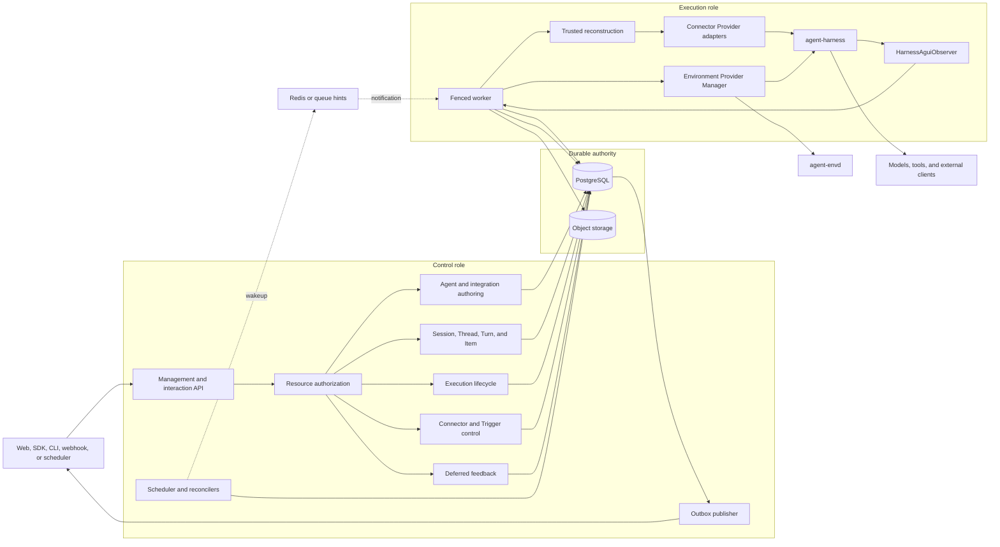
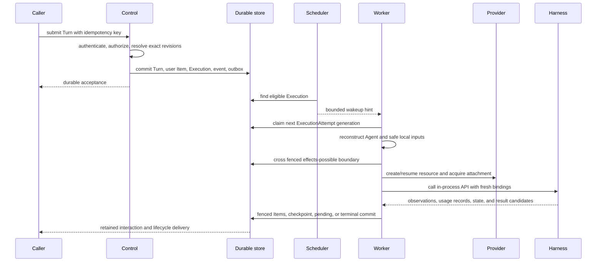
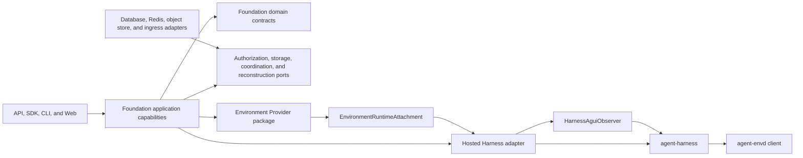

# Foundation Service Architecture

## Design Position

Foundation Service is the optional modular durable Host for Agent Foundation. It keeps one product schema, authorization boundary, executable package, and container image while assigning control-plane and execution-plane work to separately scalable process roles. It does not split lifecycle ownership across microservices.

The shared [Platform Interaction Model](../interaction-model.md) owns `Session`, `Thread`, `Turn`, and `Item`. Foundation additionally owns durable `Execution` and `ExecutionAttempt` resources for scheduling and recovery. Interactive work correlates the two models; [Triggers](12-connectors-connections-and-triggers.md) accept schedules and verified Connector events as standalone Executions without creating a Session or Turn.

The execution worker embeds the public Harness Python API. It reconstructs process-local Agent values, acquires fresh Environment attachments through the shared Provider package, and calls the Harness in process. Queue delivery, Harness completion, AG-UI delivery, and telemetry are never durable completion authority.

## Architecture

PostgreSQL is the distributed authority for accepted resources, interaction state, Executions, current ExecutionAttempt generations, dispatch evidence, checkpoints, pending actions, Environment lifecycle, and terminal outcomes. Redis and queue messages reduce discovery latency only. Object storage retains bounded large content under database-selected references.

## Component Boundaries

| Concern                                                       | Owner                                                           | Relationship                                                        |
| ------------------------------------------------------------- | --------------------------------------------------------------- | ------------------------------------------------------------------- |
| Session, Thread, Turn, and Item meaning                       | [Platform Interaction Model](../interaction-model.md)           | Foundation persists and authorizes its hosted representations       |
| Organization, Workspace, identity, and resource authorization | [Foundation IAM](04-identity-and-access-management.md)          | Applies to every public and internal product operation              |
| Durable Agent and integration revisions                       | Foundation control plane                                        | Selects exact serializable inputs and dependency locks              |
| Connector configuration, account authorization, and Triggers  | [Connector contract](12-connectors-connections-and-triggers.md) | Freezes managed tools and accepts unique unattended occurrences     |
| Execution and ExecutionAttempt                                | Foundation                                                      | Owns durable scheduling, fencing, recovery, and completion          |
| Process-local Agent composition and loop                      | Harness                                                         | Built by a trusted Foundation reconstruction adapter                |
| Provider specification and resource operations                | `converge-agent-environment-provider`                           | Foundation invokes Managers and persists selected provider state    |
| Runtime Environment attachment and routing                    | Provider package and Harness                                    | Provider supplies a fresh attachment; Harness adapts and enters it  |
| Harness-to-AG-UI conversion                                   | `HarnessAguiObserver`                                           | Foundation supplies visibility processing, retention, and delivery  |
| Durable lifecycle events, Items, and usage                    | Foundation                                                      | Commits product facts independently from process-local observations |
| Client-side effects                                           | External client                                                 | Foundation authenticates feedback but does not claim the effect     |

Foundation depends on the public Harness, Environment Provider, Agent Stream Protocol, and envd-client contracts. Those packages never import Foundation tenancy, database, lifecycle, or API types. Optional commercial integrations implement Foundation ports without replacing the common resource authorizer or durable execution kernel.

## Process Roles

One artifact supports three roles:

- `all` owns control and execution loops in one process;
- `control` owns product APIs, authorization, scheduling, control-plane reconciliation, deferred feedback, and outbox publication;
- `execution` owns worker claiming, Agent reconstruction, Environment resource attachment, Harness invocation, observation consumption, and fenced publication.

These names describe deployment roles, not product resources. An `Execution` remains a durable scheduled-work resource regardless of which role processes it. Rolling overlap is safe only when every background loop is idempotent, leased, or fenced. Execution-only processes expose operational probes but no product API and never migrate the schema.

## End-to-End Interactive Turn

The same Execution can receive another ExecutionAttempt after suspension or recoverable worker loss. A new Attempt always creates fresh process-local objects and a fresh Harness Run. It does not create another Turn. Retrying a terminal user intent creates another Turn and Execution rather than rewriting the terminal records.

A standalone Execution starts at durable Execution acceptance and follows the same scheduler, Attempt, dispatch, Harness, checkpoint, and completion contracts while omitting interactive Session and Turn references. Trigger acceptance additionally records the exact Trigger version and source occurrence after current authorization and deduplication.

## Dependency Direction

External applications call Foundation through its HTTP API or language SDKs. The worker does not call the Harness through a Foundation SDK or another service; it imports the Harness package and invokes its public process-local API directly.

## Independent Completion Boundaries

These facts advance independently:

1. a caller request is authenticated and authorized;
2. a Turn and initial Item, or a standalone Execution, are durably accepted;
3. an ExecutionAttempt owns a live fenced lease;
4. the Attempt crosses the durable effects-possible boundary;
5. Environment management or Harness returns a process-local observation or candidate;
6. Foundation selects a checkpoint, pending transition, or terminal outcome;
7. an Item, lifecycle event, AG-UI envelope, or external result is delivered;
8. immutable usage records are ingested; an optional external capability can price or bill them without changing their identity.

No later fact follows merely because an earlier fact occurred. In particular, queue acknowledgement is not ownership, Harness completion is not durable completion, absence of a provider receipt is not proof that no effect occurred, and event delivery is not usage ingestion or external settlement.

## Invariants

01. Foundation has one domain and authorization model across `all`, `control`, and `execution` roles.
02. Session, Thread, Turn, and Item follow the shared platform meanings; Execution and ExecutionAttempt own durable scheduling separately.
03. PostgreSQL is lifecycle authority; coordination loss changes latency, not accepted work.
04. One ExecutionAttempt starts at most one logical Harness Run.
05. Process-local Python values and runtime attachments never become Foundation durable payloads.
06. No database transaction spans model, tool, provider, Environment, queue, stream, sleep, or other external I/O.
07. Every authoritative Attempt publication verifies the current generation and legal transition.
08. Product authorization remains outside Harness, Environment Provider, and envd peer-authentication logic.
09. Durable completion, projection, external delivery, usage ingestion, and any external settlement remain separate facts.
10. Connector event ingress and outbound lifecycle webhook delivery are separate authenticated protocols and completion boundaries.
