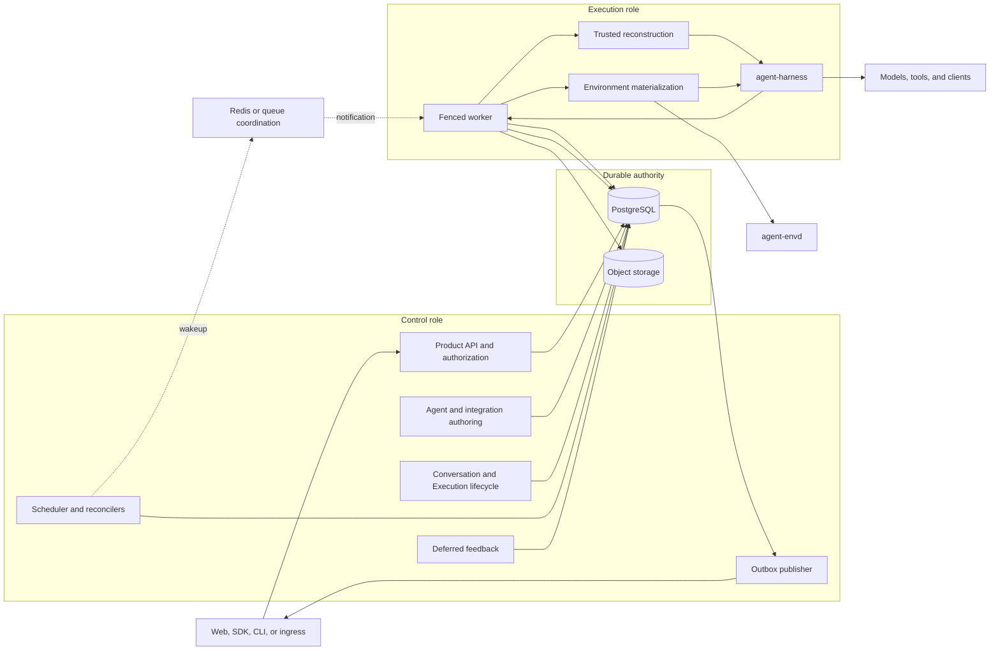
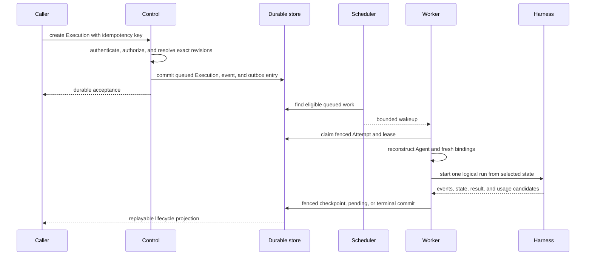
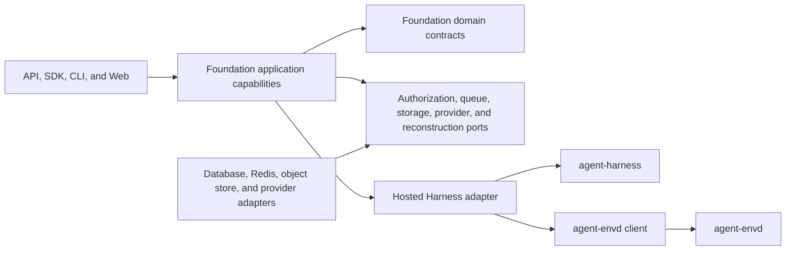

# Foundation Service Architecture

## Design Position

Foundation Service is a modular durable Host for Agents. It keeps one product schema, authorization boundary, executable package, and container image while assigning control-plane and execution-plane responsibilities to separately scalable process roles. This shape preserves one authority for lifecycle state without requiring every capability to become a network service.

The service embeds the public Harness API. It does not fork the Agent loop, serialize native Python objects, or use queue delivery as completion evidence. Every cross-process transition is committed as a Foundation-owned durable fact before it is projected to transports or telemetry.

## Architecture

PostgreSQL is the distributed durable authority for accepted work, selected revisions, ownership generations, checkpoints, pending actions, and terminal outcomes. Object storage may retain bounded large content and artifacts under durable database references. Redis and other coordination transports reduce scheduling latency but their loss never erases accepted work or changes a terminal fact.

## Component Boundaries

| Concern                                      | Owner                    | Relationship                                                             |
| -------------------------------------------- | ------------------------ | ------------------------------------------------------------------------ |
| Product resource scope and authorization     | Foundation control plane | Authenticates and authorizes every public and internal product operation |
| Durable Agent and integration revisions      | Foundation control plane | Selects exact serializable inputs and locks                              |
| Process-local Agent composition              | Harness                  | Built by a trusted Foundation reconstruction adapter                     |
| Conversation, Execution, Attempt, checkpoint | Foundation               | Durable lifecycle and continuation selection                             |
| Model and tool loop                          | Harness and Pydantic AI  | One logical Harness run inside one Foundation Attempt                    |
| Scheduling and worker ownership              | Foundation               | Uses leases, fencing, idempotency, and reconciliation                    |
| Environment provisioning and launch state    | Foundation               | Produces fresh bindings for the Harness                                  |
| Run-scoped Environment routing               | Harness                  | Enters and owns run resource scope                                       |
| Environment data-plane operations            | Provider or envd         | Enforces provider and EIP operation policy                               |
| Durable events and usage                     | Foundation               | Commits facts and publishes projections independently                    |
| Client-side effects                          | External client          | Foundation authenticates feedback but does not claim the external effect |

## Process Roles

The same artifact supports three roles:

- `all` owns control and execution loops in one process;
- `control` owns product APIs, scheduling, control-plane reconciliation, deferred feedback, and outbox publication;
- `execution` owns worker claiming, Agent reconstruction, Harness execution, run-scoped Environment reconciliation, and fenced candidate publication.

A role is a process ownership and scaling boundary. Roles share domain models, durable records, authorization semantics, and compatibility contracts. Rolling overlap is safe because every background loop is idempotent, leased, or fenced. An execution-only process exposes operational probes but no product API and never changes the database schema.

## End-to-End Execution

The request that accepts an Execution does not remain open until Agent completion. The worker performs model, tool, provider, and streaming I/O without an open database transaction. It opens a fresh short transaction only to publish a bounded fact and revalidates its ownership generation before every authoritative commit.

## Dependency Direction

Foundation depends on public Harness and envd-client contracts. The Harness and envd never import Foundation lifecycle, tenancy, database, or API types. Product surfaces call Foundation application capabilities rather than reconstructing lifecycle logic. Optional commercial or deployment-specific integrations implement public Foundation ports and do not replace the common authorization or execution kernel.

## Completion Boundaries

These facts advance independently:

1. a caller request is authenticated and authorized;
2. an Execution is durably accepted;
3. a worker claims an Attempt;
4. a Harness run returns a process-local candidate;
5. Foundation selects a checkpoint or terminal outcome;
6. an event or stream update is delivered;
7. an external client effect or child result is delivered;
8. usage is recorded, priced, billed, or paid.

No later fact is inferred merely because an earlier fact occurred. An acknowledged queue message is not a durable claim, a Harness result is not durable completion, and event publication is not billing completion.

## Invariants

1. Foundation Service has one domain and authorization model across `all`, `control`, and `execution` roles.
2. PostgreSQL is the distributed lifecycle authority; coordination loss changes latency, not accepted work.
3. One Foundation Attempt starts one logical Harness run.
4. Process-local Python values never become durable Foundation payloads.
5. No database transaction spans model, tool, Environment, queue, stream, sleep, or external I/O.
6. Every authoritative worker publication is fenced against the current Attempt generation.
7. Product authorization remains outside Harness and envd membership logic.
8. Durable completion, publication, external delivery, usage, billing, and payment remain separate facts.
