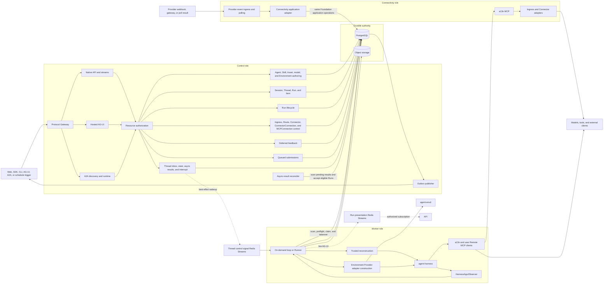
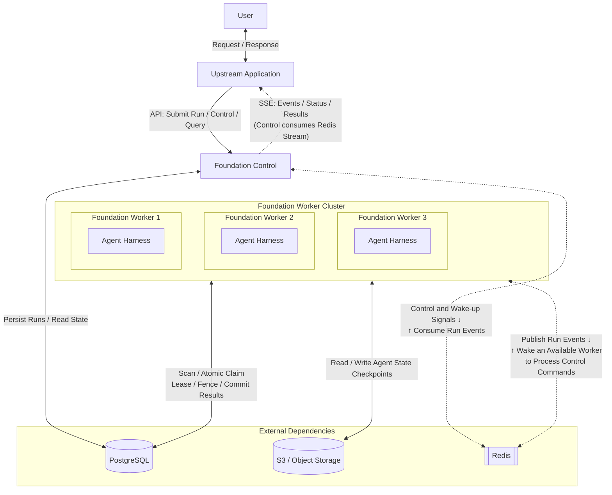
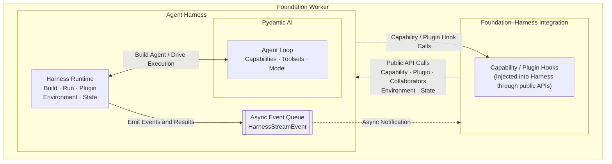
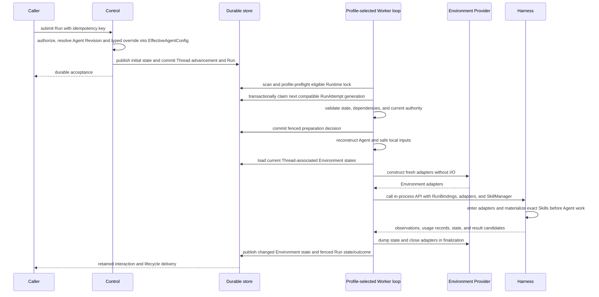
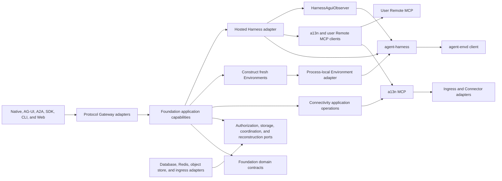

# Foundation Service Architecture

## Design Position

Foundation Service is the optional modular durable Host for Agent Foundation. It keeps one product schema, authorization boundary, executable package, and container image while assigning control, worker, and Connectivity data-plane work to separately scalable process roles under the shared [runtime contract](01-runtime-configuration-and-deployment.md). It does not split durable lifecycle ownership across microservices.

The shared [Platform Interaction Model](../interaction-model.md) owns `Session`, `Thread`, `Run`, and `Item`. Foundation persists each hosted Thread as an independent versioned relational resource, uses `Run` as the durable Agent-work, scheduling, recovery, state, outcome, and authority-Principal boundary, and uses `RunAttempt` as one replaceable fenced worker generation. Every Foundation-managed Agent invocation accepts a Run with one immutable User or Service Account Principal whose current authority is re-evaluated for execution; Foundation defines no separate durable Execution resource.

The worker embeds the public Harness Python API through the deployment's selected [Plugin Runtime profile](36-managed-harness-plugins-and-runtime.md). Run acceptance pins an internal Runtime lock. The default on-demand Worker preflights exact PluginVersions before claim; the optional runner profile starts clean lock-scoped child processes. The selected execution loop reconstructs process-local Agent values, materializes exact [managed Skill revisions](31-skill-management.md) as inert Environment content, and uses an exact trusted `EnvironmentProvider` to construct fresh adapters from current Host state. Harness enters and closes those adapters non-destructively; Foundation owns state publication, explicit cleanup, and orphan prune. Foundation supplies no hosted-process run capability: background shell uses the Harness Run-owned controller, receives active-Run completion readiness, and has no cross-Run lookup or idle wake. Redis delivery, Harness completion, AG-UI delivery, and telemetry are never durable completion authority.

## Architecture

PostgreSQL is the distributed authority for accepted resources, including immutable Asset publication records, eligible external-event admission and deduplication facts, Thread advancement and queue versions, head selection, queued submissions, the durable Thread inbox and its independent delivery-sequence counter, Runs, current RunAttempt generations, waiting pending summaries, current Thread-associated Environment state, and terminal outcomes. Ordinary steer and asynchronous results use one PostgreSQL acceptance-order FIFO. Each Worker discovers claim, takeover, and pending-inbox work directly from that durable state; control replicas scan pending asynchronous results for inactive-Thread advancement. Redis carries domain-owned live data flow, including each Run's stable bounded-replay message stream and each active Thread's expiring control-signal Stream; Redis publication or consumer-group progress never proves a relational transition or inbox consumption. Shared object storage holds immutable Asset content plus the Run's complete conditionally replaced state, including exact pending requests, consumed inbox receipts, immutable replay snapshot, and bounded large content. The detailed authorities belong to [External Connectivity](40-connectivity/README.md), [Asset Management](32-asset-management.md), [Durable Thread Persistence](11-thread-persistence.md), [Durable Run State](12-run-persistence.md), [Agent Control: Active Execution](19-agent-control-active-execution.md), [Agent Control: Queued Submissions](20-agent-control-queued-submissions.md), [Environment Configuration and Re-entry](29-environment-management.md), [Lifecycle and Stream Persistence](24-lifecycle-and-stream-persistence.md), and [Events, Interaction Projection, Usage, and Delivery](25-events-usage-and-delivery.md).

### Simplified Architecture Overview

- Workers coordinate Run execution ownership non-cooperatively through PostgreSQL
- Workers share Agent state through S3

### Foundation Worker-Harness Interaction

## Component Boundaries

| Concern                                                                 | Owner                                                                                                 | Relationship                                                                                                       |
| ----------------------------------------------------------------------- | ----------------------------------------------------------------------------------------------------- | ------------------------------------------------------------------------------------------------------------------ |
| Session, Thread, Run, and Item meaning                                  | [Platform Interaction Model](../interaction-model.md)                                                 | Foundation persists and authorizes its hosted representations                                                      |
| Runtime configuration, process roles, readiness, and drain              | [Runtime](01-runtime-configuration-and-deployment.md)                                                 | Starts one validated role composition                                                                              |
| OSS, EE, and Cloud application composition                              | [Distribution](02-distribution-composition-and-extensions.md)                                         | Selects capabilities without changing common domain meaning                                                        |
| Organization, Workspace, identity, and resource authorization           | [Foundation IAM](33-identity-and-access-management.md)                                                | Applies to every public and internal product operation                                                             |
| Agents, immutable Revisions, managed Skill revisions, and Models        | Foundation control plane                                                                              | Selects exact Agent inputs and freezes current model configuration per Run                                         |
| Immutable Workspace Assets                                              | [Asset Management](32-asset-management.md)                                                            | Publishes exact binary identity and supplies authorized Run input, output, and protocol references                 |
| Managed Harness plugin artifacts and Runtime locks                      | Foundation control plane and Worker runtime                                                           | Preflights on demand or stages exact trusted Runner environments                                                   |
| Native event ingress, a13n MCP, and Connector dispatch                  | [External Connectivity](40-connectivity/README.md)                                                    | Run in the `connectivity` role without moving durable management or Run authority                                  |
| Durable Thread resource                                                 | Foundation                                                                                            | Owns Session membership, origin, current Run, continuation head, and version                                       |
| Run and RunAttempt                                                      | Foundation                                                                                            | Own durable scheduling, state, fencing, recovery, and outcome                                                      |
| Queue-if-busy existing-Thread Run intent                                | [Queued Submissions](20-agent-control-queued-submissions.md)                                          | Accepts immediately when eligible or remains editable outside the Run DAG                                          |
| Thread inbox, steer, asynchronous results, and interrupt                | [Active Execution](19-agent-control-active-execution.md) and [Async Subagents](34-async-subagents.md) | Persists one cross-kind FIFO, binds waiting delivery, reconciles durable receipts, and uses Redis only for wakeups |
| Environment, EnvironmentRevision, and Run execution configuration       | [Environment Configuration](29-environment-management.md)                                             | Freezes exact desired Provider configuration in Run state                                                          |
| Current Environment state and Thread associations                       | Foundation Host                                                                                       | Selects authoritative state and publishes changed values                                                           |
| Fresh Environment construction and backing-target lifecycle             | Worker and trusted Environment Provider                                                               | Constructs one adapter per independent Run; Host policy owns warmup and destroy                                    |
| Process-local Agent composition and loop                                | Harness                                                                                               | Built by a trusted Foundation reconstruction adapter                                                               |
| Current Environment mount set, provider-neutral operations, and routing | Harness                                                                                               | Enters fresh adapters and closes them non-destructively                                                            |
| Background shell process lifetime and active readiness                  | Harness                                                                                               | Run-owned only; no Foundation process record, cross-Run lookup, or idle wake                                       |
| Harness-to-AG-UI conversion                                             | `HarnessAguiObserver`                                                                                 | Foundation supplies visibility processing, retention, and delivery                                                 |
| Durable lifecycle events, Items, and usage                              | Foundation                                                                                            | Commits product facts independently from process-local observations                                                |
| RunAttempt tracing and authorized backend query                         | [Observability](38-observability.md) and [Trace Query](39-trace-query.md)                             | Export and read best-effort diagnostic projections without becoming domain authority                               |
| Native, Hosted AG-UI, and A2A public protocols                          | [Protocol Gateway](15-protocol-gateway.md)                                                            | Map distinct wire protocols to the same application and IAM authority                                              |
| Client-side effects                                                     | External client                                                                                       | Foundation authenticates feedback but does not claim the effect                                                    |

Foundation depends on the public Harness, Environment Provider, Agent Stream Protocol, and envd-client contracts. Those packages never import Foundation tenancy, database, lifecycle, or API types. The selected [distribution](02-distribution-composition-and-extensions.md) can add capabilities through explicit narrow boundaries without replacing the common resource authorizer or durable Run/RunAttempt kernel.

## Process Roles

One artifact supports three independently deployable roles and their all-in-one composition:

- `all` owns control, worker, and Connectivity components in one process;
- `control` owns product APIs, authorization, domain-owned control work including Connectivity management operations, deferred feedback, and outbox publication;
- `worker` owns periodic Run scanning, transactional claim and expired-lease takeover, Agent reconstruction, fresh Environment construction and finalization, Harness invocation, observation consumption, and fenced publication; and
- `connectivity` owns provider event ingress and polling, the a13n MCP, Ingress native action adapters, and Connector runtime dispatch.

These names describe deployment roles, not product resources. Connectivity remains an internal Foundation Service module and process role, not a separate service or database. A `Run` remains the durable scheduled-work resource regardless of which role processes it. The [runtime contract](01-runtime-configuration-and-deployment.md) owns the complete component matrix, deployment profiles, readiness, and drain behavior. Worker- and Connectivity-only processes expose operational probes but no `/api/v1` product surface and never migrate the schema.

## End-to-End Interactive Run

The same `running` Run can receive another RunAttempt after an Attempt fails, yields at a complete graceful-handoff boundary, or its lease expires. A successful planned yield keeps heartbeat and lease renewal active until its transaction commits, terminalizes only the old Attempt, and resumes through a fresh Attempt and Harness Run from the same latest `state.json`. The stable Run Stream stays open and emits no false protocol terminal result. The takeover transaction marks an expired old Attempt `failed`; Foundation defines no Attempt `lost` state. A new Attempt always creates fresh process-local objects and a fresh Harness Run. Under the [Agent control input and continuation contract](18-agent-control-input-and-continuation.md), a waiting Run is sealed; authenticated Feedback or explicit waiting Continue accepts a new Run whose `parent_run_id` names that waiting Run. Waiting Continue supplies default deferred results and new input to the same first model request. Pending inbox delivery rolls through waiting and becomes visible only when the Foundation-owned awaited delivery hook runs after that request and any resulting tool batch. Retrying terminal intent likewise creates a successor Run rather than rewriting sealed records.

Schedules, webhooks, service requests, asynchronous children, and eligible automatic inactive-Thread asynchronous-result continuations accept Runs and follow the same authority-Principal persistence, Worker scan, RunAttempt, dispatch, Harness, state, and outcome contracts as interactive work. Active-Run asynchronous-result delivery creates no Run and instead shares ordinary steer's FIFO and durable receipt path in the current Run. Eligible pending delivery blocks completed sealing and can roll through waiting. Failure or cancellation suppresses child results originating from that Run and supersedes other pending delivery merely bound to it; a suppressed result can neither enter another Run nor trigger one.

## Dependency Direction

External applications call Foundation through Native HTTP/SDK, Hosted AG-UI, or A2A Gateway surfaces. The worker does not call the Harness through a Foundation SDK or another service; it imports the Harness package and invokes its public process-local API directly.

## Independent Completion Boundaries

These facts advance independently:

1. a caller request is authenticated and authorized;
2. a Thread creation or versioned advancement, Run, and initial complete state are durably accepted;
3. a RunAttempt owns a live fenced lease;
4. Harness returns a process-local observation or candidate;
5. Foundation conditionally publishes complete Run state and commits a waiting or terminal outcome;
6. an Item, lifecycle event, AG-UI envelope, or external result is delivered;
7. immutable usage records are ingested; an optional external capability can price or bill them without changing their identity.

No later fact follows merely because an earlier fact occurred. In particular, a Worker scan result is not ownership, Harness completion is not durable completion, a tool observation or external effect absent from the latest complete checkpoint is not recoverable Run state, and event delivery is not usage ingestion or external settlement.

## Invariants

01. Foundation has one domain and authorization model across `all`, `control`, `worker`, and `connectivity` roles.
02. Session, Thread, Run, and Item follow the shared platform meanings; Thread owns versioned advancement selection, while Run and RunAttempt directly own durable scheduling and recovery.
03. PostgreSQL is accepted lifecycle authority; Redis carries coordination and bounded Run replay without becoming lifecycle authority.
04. One RunAttempt starts at most one logical Harness Run.
05. Process-local Python values, Environment adapters, entered facades, and native clients never become Foundation durable payloads.
06. No database transaction spans model, tool, provider, Environment, queue, stream, sleep, or other external I/O.
07. Every authoritative RunAttempt publication verifies the current generation and legal transition.
08. Product authorization remains outside Harness, Environment Provider, and envd peer-authentication logic.
09. Durable completion, projection, external delivery, usage ingestion, and any external settlement remain separate facts.
10. Public protocol adapters share application and authorization authority but retain independent wire identities, errors, and delivery contracts.
11. A queued submission owns no execution lease or outcome; only atomic consumption accepts the Run that later owns scheduling and recovery. A state-first completed handoff can combine source sealing, first-entry consumption, and successor acceptance in one short transaction; otherwise terminal relational state remains sufficient for recovery scanning.
12. Graceful drain gates new claims while every active Attempt keeps renewing until an authoritative terminal commit or the drain deadline.
13. Planned `yielded` handoff preserves the running Run, state key, and stream, but its successor always receives a fresh RunAttempt and Harness Run.
14. Every distinct Asset publication creates an independent immutable Asset; Run references do not create another relation or Asset-specific continuation state.
15. Ordinary steer and async results share one PostgreSQL FIFO. Pending delivery blocks completed sealing and can roll through a waiting outcome to its direct successor, where an awaited Foundation Capability keeps it out of the successor's first model request. A failed or cancelled Run suppresses its own child results and supersedes other pending delivery bound to it; suppressed results cannot enter or create another Run.
