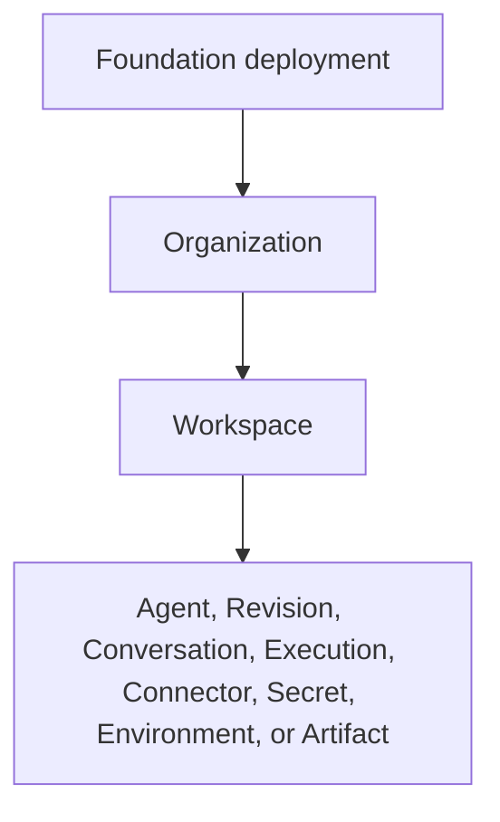

# Resource Scope and Authorization

## Design Position

Foundation Service uses one customer resource hierarchy and one product authorizer across self-hosted, enterprise-integrated, and managed deployments. Organization and Workspace scope are part of the common data model; deployment packaging or entitlement does not create another tenant schema or bypass authorization.

Product authorization answers who may create, inspect, change, invoke, or administer Foundation resources. Harness run authority separately limits what an executing Agent may do through tools, credentials, and Environments. A platform role can permit a caller to start an Execution without granting the resulting Agent every possible side effect.

## Resource Hierarchy



An Organization is the customer identity, organization policy, and organization administration boundary. A Workspace is the member-collaboration, role-assignment, resource-isolation, and default usage-attribution boundary. Foundation resources carry an explicit `workspace_id` unless their owning contract explicitly places them at Organization or platform scope.

The canonical hierarchy does not contain Project. A deployment may present a single-team experience by bootstrapping one Organization and one Workspace and hiding that navigation, but its resource identities and authorization checks retain the same scope. Folders, collections, tags, or namespaces may organize resources without becoming implicit authorization boundaries.

## Principals and Credentials

A principal is an authenticated actor or workload to which policy can apply. A credential proves or delegates an authentication fact for a principal; it is not itself a principal and cannot expand policy.

Foundation recognizes these product principal kinds:

- `Human` represents one person;
- `Service` represents non-human automation or an integration;
- `AgentWorkload` is optional and represents a stable deployed Agent workload when downstream access requires an Agent identity distinct from its caller.

Sessions, passwords, API keys, OIDC tokens, service tokens, and workload tokens are credentials. A principal can hold several credentials, rotate one without changing resource ownership, and lose one credential without deleting the principal. Credential records store metadata, ownership, lifecycle, and non-secret verification material; plaintext secret values do not enter ordinary resource, event, trace, or model payloads.

The platform operator trust domain is separate from customer membership. Operator access uses an explicit bounded elevation grant naming the target Organization, reason, expiration, and permitted actions. Elevation does not impersonate an Organization Owner, inherit customer credentials, or bypass audit.

## Membership and Fixed Roles

Organization and Workspace membership bind principals to fixed permission bundles. Workspace roles do not silently grant Organization scope.

| Role               | Scope and authority                                                                                                                     | Explicit exclusions                                                               |
| ------------------ | --------------------------------------------------------------------------------------------------------------------------------------- | --------------------------------------------------------------------------------- |
| Organization Owner | Organization lifecycle, ownership transfer, all Workspace administration, and organization policy                                       | Platform operator authority                                                       |
| Organization Admin | Organization membership, Workspace creation and administration, and organization policy                                                 | Ownership transfer or Organization deletion                                       |
| Workspace Admin    | Workspace membership, resource administration, capability availability, production policy, and Execution administration                 | Organization administration                                                       |
| Builder            | Create and edit Workspace Agents, revisions, Skills, Connectors, and test Executions; bind resources already available in the Workspace | Membership administration, Secret reveal, or expanding Workspace capability scope |
| Operator           | Invoke, observe, cancel, and retry authorized production Executions and operate approved resources                                      | Agent authoring, membership management, and Secret administration                 |
| Viewer             | Read safe Workspace resources, Execution state, and permitted audit projections                                                         | Mutations, invocation, credential use, and secret access                          |

Foundation authoring is Workspace collaborative rather than per-Agent ownership. A Builder can edit Agents in the Workspace subject to current policy; creating an Agent does not establish a private authorization island. A Workspace Admin controls which externally supplied or organization-scoped capabilities are available to the Workspace. Creating a Workspace-owned Tool, Skill, Connector, or Environment makes that resource addressable in the Workspace but does not grant every Agent or Execution permission to use it.

## Platform Permissions and Run Grants

The product permission catalog contains stable atomic actions such as:

- `agent.create`, `agent.update`, `agent.publish`, and `agent.invoke`;
- `execution.read`, `execution.cancel`, and `execution.retry`;
- `connector.create`, `connector.configure`, and `connector.use`;
- `secret.metadata.read`, `secret.use`, `secret.rotate`, `secret.reveal`, and `secret.delete`;
- `environment.configure`, `environment.attach`, and `environment.operate`;
- `workspace.members.manage` and `workspace.policy.manage`.

Fixed roles are permission bundles. Routes, streams, workers, feedback handlers, and background reconcilers call one authorizer rather than reproducing role `if` statements. Policy extensions compose the same atomic catalog and return the same decision contract.

Run grants use a separate namespace for model-triggerable operations, including `tool.call`, `connector.use`, `secret.use`, `environment.file`, `environment.shell`, `environment.network`, and approval obligations. Effective run authority is the intersection of:

1. the authenticated actor or service authority to invoke the Agent;
2. the exact Agent revision and optional AgentWorkload policy;
3. explicit delegation and parent-child lineage constraints;
4. Workspace and Organization policy;
5. current Environment and provider policy;
6. approval obligations and fresh credential leases.

No platform role alone is sufficient authorization for a model-triggered side effect. Foundation assembles a bounded policy input and supplies fresh typed run capabilities and bindings. Harness managed dispatch applies the run grant, and the provider or envd enforces its narrower operation policy.

## Authorization Contract

The conceptual authorization contract is:

```python
class AuthorizationInput:
    principal: PrincipalRef
    action: PlatformAction
    resource: ResourceRef
    organization: OrganizationRef
    workspace: WorkspaceRef | None
    context: AuthorizationContext


class AuthorizationDecision:
    allowed: bool
    policy_version: PolicyVersionRef
    reason_code: str
    obligations: tuple[Obligation, ...]
```

The authorizer evaluates current membership, bindings, resource scope, credential status, and applicable policy version. An allowed decision can add obligations but cannot carry plaintext credentials. Every durable Execution records the authenticated actor, selected Agent identity, delegation lineage, and run policy version needed to interpret its authority and audit trail.

Authorization is repeated for every operation and every paginated or streamed continuation. Identifier possession, a previously allowed operation, queue routing, or an existing Harness checkpoint does not preserve current product authority. Recovery reauthorizes fresh bindings without rewriting the historical decision under which earlier effects occurred.

## Credential Use

`use` and `reveal` are separate actions. An Agent normally receives only an audience-bound use lease from a credential broker after product authorization and run-grant evaluation. The lease is scoped to an exact operation, resource, audience, and lifetime. It does not enter prompts, tool arguments, `HarnessState`, ordinary events, traces, or logs.

Rotating a credential changes the material used for later leases without changing the principal, Agent revision, or resource owner. Revocation prevents new leases and causes a resumed Attempt to fail closed when fresh authority cannot be established.

## Failure and Security Semantics

| Condition                                              | Outcome                                                                                    |
| ------------------------------------------------------ | ------------------------------------------------------------------------------------------ |
| Missing or invalid credential                          | Authentication fails before resource lookup or mutation                                    |
| Authenticated but unauthorized principal               | Operation is denied; policy may conceal resource existence                                 |
| Cross-Workspace reference                              | Operation fails before reading or binding the target resource                              |
| Stale membership or policy version                     | Current authorization is re-evaluated; stale client intent does not preserve access        |
| Credential revoked during an active external operation | New use fails; the already dispatched external effect remains subject to provider evidence |
| Policy extension unavailable                           | Authorization fails closed for decisions requiring that extension                          |
| License or entitlement unavailable                     | Advanced provider behavior is unavailable; base authorization remains enforced             |

## Invariants

1. Every customer resource belongs to an explicit Organization and, unless explicitly organization-scoped, one Workspace.
2. Project is not a product authorization layer.
3. Credential kinds are not principal kinds and never own permissions independently.
4. Fixed roles resolve to atomic platform permissions through one authorizer.
5. A Builder can author Workspace Agents but cannot expand Workspace capability scope or reveal Secrets by default.
6. Product permissions and run grants are distinct and both are enforced.
7. Secret use does not imply Secret reveal.
8. Platform operator elevation is explicit, bounded, tenant-targeted, and auditable.
9. A reference, identifier, cursor, checkpoint, or queue message never grants authority by possession.
