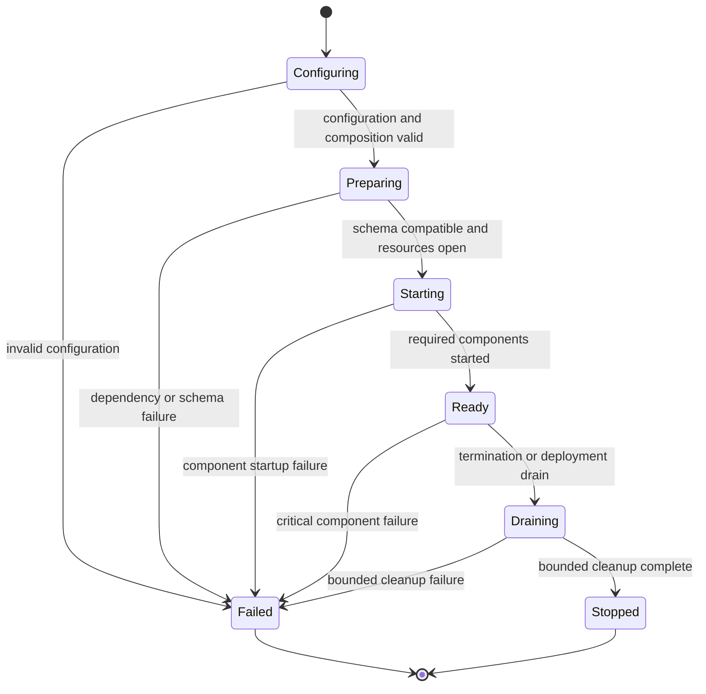

# Runtime Configuration and Deployment

## Design Position

Each Foundation Service product distribution ships one executable package and one container image. That build artifact fixes exactly one trusted distribution descriptor and starts it as a `control`, `worker`, or `connectivity` role, or as the all-in-one `all` composition. Configuration, schema preparation, resource construction, component startup, readiness, draining, and shutdown follow one process lifecycle regardless of whether the executable is invoked directly or through a container entrypoint.

Runtime owns process behavior, not domain behavior. It loads the distribution fixed by the artifact, validates one effective configuration, starts only the components assigned to the selected role, and fails closed when the deployment cannot preserve their required semantics.

## Boundaries

| Concern                                                             | Owner                                                                            | Relationship                                                        |
| ------------------------------------------------------------------- | -------------------------------------------------------------------------------- | ------------------------------------------------------------------- |
| Configuration sources, precedence, role, and deployment profile     | Runtime                                                                          | Produces one immutable effective configuration                      |
| Installed capabilities and role component set                       | [Distribution Composition](02-distribution-composition-and-extensions.md)        | Supplies the explicit application composition fixed by the artifact |
| Backend construction and capability semantics                       | [Storage](03-storage.md)                                                         | Constructs the selected typed clients and roots                     |
| Relational compatibility and migration application                  | [Relational Schema](04-relational-schema.md)                                     | Prepares or verifies the final distribution schema before readiness |
| Product ingress and operational probes                              | [HTTP Ingress](05-http-ingress-and-request-contract.md)                          | Exposes only the surfaces owned by the selected role                |
| Domain routers, reconcilers, publishers, and workers                | Owning Foundation domains                                                        | Declare role ownership and durable failure semantics                |
| Plugin Runtime profile and loading behavior                         | [Managed Harness Plugins and Runtime](36-managed-harness-plugins-and-runtime.md) | Defines on-demand import or Supervisor/Runner execution             |
| Container scheduling, replicas, secrets, mounts, and network policy | Deployment                                                                       | Supplies external resources without changing service semantics      |

The runtime does not define a general plugin loader, dependency-injection container, process manager, or dynamic configuration service. Domain code does not read process environment variables, choose a deployment role, run migrations, or start unowned background tasks.

## Effective Configuration

The executable selects a TOML file only through an explicit `--config PATH`. It then constructs one effective configuration in this precedence order, from lowest to highest:

1. release defaults;
2. one explicitly selected TOML file;
3. `FOUNDATION_*` environment variables;
4. explicit `--role` and `--host` executable overrides.

When no configuration path is supplied, no TOML file is loaded. The process does not search the working directory, user home, or image filesystem for `.env`, `foundation.toml`, or another implicit file. It does not merge several files or implement include, inheritance, or named profile semantics.

TOML groups settings by stable operational concern:

```toml
[service]
role = "all"
host = "127.0.0.1"
port = 8000

[database]
backend = "postgresql"

[redis]
backend = "redis"

[objects]
backend = "s3"

[filesystem]
root = "/var/lib/foundation"

[control]

[assets]
max_size_bytes = 104857600

[gateway]
a2a_enabled = true

[worker]
handoff_preference_window = "30s"

[connectivity]

[plugin_runtime]
mode = "on_demand"

[observability]
tracing = true
trace_content = "none"

[observability.query]
provider = "none"
```

The example defines section ownership, not an exhaustive setting catalog. The executable package documents concrete fields and environment names. An environment variable maps to its section and field under the `FOUNDATION_` prefix. Unknown TOML sections and fields are rejected; a misspelled or distribution-unsupported setting never disappears silently.

The artifact's fixed distribution descriptor supplies the complete typed configuration schema before values are parsed. No CLI option, TOML field, or environment variable selects a distribution or names an import target. Distribution-specific settings live in an explicit namespaced section and cannot reinterpret a common field. Secret-bearing values can come from the selected TOML file or environment. They remain redacted from representations, logs, traces, errors, probes, and generated configuration output. The deployment protects any file or environment source containing credentials.

Configuration is immutable after startup. Changing a setting requires a new process. The service performs no partial or hot reload that could leave replicas or role components using different configuration generations.

`worker.handoff_preference_window` is a finite positive internal scheduling duration used only for same-build claims after a planned handoff with `yield_reason="service_drain"`. Its release default equals one RunAttempt lease duration; an explicit value overrides that default but cannot be zero, negative, or unbounded. It does not delay Runner rotation, initial claims, failure recovery, or lease-expiry takeover.

`gateway.a2a_enabled` is the single protocol availability switch. It defaults to `true`. Native and Hosted AG-UI have no runtime enable setting. When false, the `control` or `all` process omits A2A discovery, runtime, streaming, push routes, and A2A delivery components while preserving every Native and Hosted AG-UI surface. The setting does not select another distribution and there is no Agent-level A2A enable setting.

`assets.max_size_bytes` is a positive finite deployment bound. Control applies it to Native and Gateway acquisition, and Workers apply the same effective value to Agent publication and Asset-backed input acquisition. Replicas that can accept or execute the same work use compatible bounds; a lower admission-specific Workspace quota can reject new publication but never reinterpret an already accepted Asset.

The observability section contains the tracing switch and Harness content selection owned by the [observability contract](38-observability.md), plus the independent query-provider selection and typed provider configuration owned by [Trace Query](39-trace-query.md). Exporter, endpoint, protocol, headers, TLS, sampler, batch, and timeout settings use standard `OTEL_*` input and do not gain Foundation aliases. Query providers do not inspect or reuse those exporter settings. Static configuration is validated before startup completes. Runtime exporter and query-backend availability are diagnostic and never become readiness dependencies.

### Background Model Prices

`pricing.auto_update` defaults to `true` (`FOUNDATION_PRICING_AUTO_UPDATE`). The execution-owning process starts Pydantic AI's shared background updater during lifespan and releases its ownership during shutdown. `control` and `connectivity` do not start it; `all` installs it once. Updates start immediately and repeat hourly without delaying readiness or Agent work. Download failure retains the latest usable prices and remains diagnostic, not a critical background-component failure. The updater has process-local, not cluster-wide, ownership; fetched prices are not stored in service tables or a disk cache.

Before each Harness build, execution captures the current immutable catalog off the event loop and passes `pricing_catalog` to the public builder. Later builds automatically adopt validated updates, while active Agents and existing usage records retain their original pricing. [Harness Cost Calculation](../agent-harness/12-events-observability-and-usage.md#cost-calculation) owns catalog precedence, revision identity, conversion fallback, and explicit policy overrides. Stopping or disabling one updater does not clear a snapshot previously published in that process. This background data refresh does not hot-reload the immutable process configuration.

## Deployment Profiles

Foundation supports two profiles:

| Profile        | Roles                                         | Relational           | Redis                              | Objects                          | Process constraint                                             |
| -------------- | --------------------------------------------- | -------------------- | ---------------------------------- | -------------------------------- | -------------------------------------------------------------- |
| Single-process | `all`                                         | SQLite or PostgreSQL | Process-local memory or real Redis | Local directory or S3-compatible | Exactly one service process when any local backend is selected |
| Distributed    | `all`, `control`, `worker`, or `connectivity` | PostgreSQL           | Real Redis                         | Shared S3-compatible storage     | One or more independently replaceable processes                |

The distributed profile requires PostgreSQL, real Redis, and shared object storage. It rejects SQLite, process-local Redis, and local object storage before opening service traffic. A mounted shared filesystem can satisfy a domain that explicitly owns filesystem semantics, but it does not replace shared object storage or make SQLite and local object locking distributed.

Real Redis is a required distributed data-flow and coordination dependency. Required does not mean universally authoritative: each owning domain defines the identity, retention, replay, and authority of the values it places in Redis. Durable Foundation resource state, RunAttempt fencing, and accepted lifecycle transitions remain relational facts unless an owning specification explicitly establishes a different authority.

## Process Roles

`control`, `worker`, and `connectivity` are independently deployable roles. `all` is their exact process composition. The default `on_demand` Plugin Runtime profile runs `WorkerExecutionLoop`, its claimed `RunAttemptExecutor` tasks, and a separately capacity-bounded `EnvironmentMaintenanceLoop` in the Worker process. The execution loop owns Run scan, compatibility preflight, bounded capacity admission, claim, and takeover; each successful Run claim starts one executor async task that owns lease renewal, control watching, plugin and Agent reconstruction, and Harness execution. The maintenance loop independently coordinates Workspace Environments, including renewal and due stop/delete actions, and never consumes an Agent execution slot. The optional `runner` profile gives each Worker a stable Supervisor that owns Runtime-lock discovery, claim gating, and child-process lifecycle; each lock-scoped Runner child owns its execution loop and executor tasks. In both profiles the Worker process owns Environment maintenance from the deployment-selected Provider catalog, independently of Plugin Runtime locks and whether a Run is present. Neither profile creates one OS thread per Attempt or target.

The `connectivity` role owns provider event webhooks, long connections, polling, and durable external-event admission processing. Control owns Account, AccountTarget, ConnectorProvider, ConnectorConnection, and MCPConnection management, including connection setup, advisory discovery, revocation, reconciliation, and MCP OAuth callbacks. The executing Worker or Runner loads trusted native-action and ConnectorProvider runtime adapters, constructs per-Attempt in-process a13n MCP tool groups, and directly connects selected Remote MCP servers through Harness clients. These roles share Foundation application operations and durable stores; none uses a private cross-pod Foundation API for this work. [External Connectivity](40-connectivity/README.md) owns the complete boundary.

| Capability                                                                            | `control` | `worker` | `connectivity` |    `all` |
| ------------------------------------------------------------------------------------- | --------: | -------: | -------------: | -------: |
| Product API                                                                           |       Yes |       No |             No |      Yes |
| Native and Hosted AG-UI Gateway surfaces                                              |       Yes |       No |             No |      Yes |
| A2A Gateway surface when enabled                                                      |       Yes |       No |             No |      Yes |
| Control authentication and authorization                                              |       Yes |       No |             No |      Yes |
| External tool Attempt and resource authorization                                      |        No | Executor |             No | Executor |
| Domain-owned control reconcilers                                                      |       Yes |       No |             No |      Yes |
| Outbox publication                                                                    |       Yes |       No |             No |      Yes |
| Native event ingress and polling                                                      |        No |       No |            Yes |      Yes |
| ConnectorProvider management adapter operations                                       |       Yes |       No |             No |      Yes |
| In-process a13n MCP, native-action and Connector runtime adapters, Remote MCP clients |        No | Executor |             No | Executor |
| Profile-selected Worker execution runtime                                             |        No |      Yes |             No |      Yes |
| Run scan, capacity, claim, and takeover                                               |        No |     Loop |             No |     Loop |
| Attempt lease and control watcher                                                     |        No | Executor |             No | Executor |
| Harness and Environment invocation                                                    |        No | Executor |             No | Executor |
| Environment maintenance and lease                                                     |        No |     Loop |             No |     Loop |
| Operational liveness and readiness probes                                             |       Yes |      Yes |            Yes |      Yes |
| Automatic migration when enabled                                                      |       Yes |    Never |          Never |      Yes |

Every background component has exactly one role owner. `all` installs the union once; it does not start a second application, duplicate a router, or construct another copy of shared process resources. Rolling overlap is safe only when the owning domain makes the component leased, fenced, or idempotent.

[Control Background Tasks](07-control-background-tasks.md) owns the control task catalogue and common periodic execution, recovery, and collection obligations. Its enabled tasks are required control role components under this document's startup, supervision, readiness, and drain contract; their domains retain transition and retention authority.

Queue recovery scans use `control_recovery_poll_interval_seconds` (default 1), `control_recovery_batch_limit` (64), and `control_recovery_item_timeout_seconds` (30). Async-result scans share those batch and item limits under the subagent maintenance cadence described below. Collection uses `control_collection_poll_interval_seconds` (300), `control_collection_batch_limit` (64), and `control_collection_timeout_seconds` (30). The recovery/collection intervals, counts, and timeouts are positive and finite, with bounded maxima validated by Settings. Collection and recovery iteration deadlines are `(item_timeout + 1) * batch_limit`; relational cleanup commits bounded batches, and object cleanup enforces the per-item deadline separately. Hook history and Asset tombstone minimum retention default to 30 days through their separate settings. Object publication uses `object_publication_timeout_seconds` (120); orphan collection additionally uses `object_orphan_minimum_age_hours` (24).

Existing publishers and Connector/Plugin reconcilers keep their domain cadence, claim limits, and retry policies under the shared periodic execution boundary. A Plugin Runtime command iteration is bounded by its configured command lease duration; a timed-out operation remains recoverable through the durable command phase. OAuth state reconciliation is bounded to one record and 30 seconds per iteration and never repeats an uncertain exchange.

One service process runs one ASGI worker. A deployment scales by adding service processes or container replicas rather than forking several independent role runtimes behind one process boundary. Runner-profile child processes are an internal Worker execution boundary, not additional service replicas or independently addressable Worker resources.

## Worker Build Identity

Every Foundation Service build artifact carries one immutable `worker_build_id`. Official images derive the value from the release version and source/build revision supplied by the existing `BUILD_VERSION` and `BUILD_REVISION` build inputs. Replicas of the same artifact therefore report the same build ID, while `worker_generation` remains unique to one Worker process lifetime. Runtime freezes both values at process startup and copies the build ID into every claimed `RunAttempt`.

The build ID comes only from trusted artifact metadata. It is not read from the database, Kubernetes API, organization input, or claim candidate, and cannot change while the process runs. A distributed `worker` or `all` process with missing, malformed, or placeholder production build identity never becomes ready. A local development artifact may use an explicit documented development identity that still remains immutable for that process.

`worker_build_id` records the actual Foundation Service build serving an Attempt. It is distinct from `PluginRuntimeLock.worker_release`, which is the historical Worker dependency baseline pinned when the Runtime lock is created. A newer build may restore an older Run only after the scheduling preflight proves that it can read the state and serve the exact pinned lock; build identity never grants lease authority, selects a target Pod, or substitutes another Runtime lock.

## Startup Lifecycle



Startup performs these ordered gates:

01. load the artifact's fixed distribution descriptor, Worker build identity, and effective configuration;
02. validate the role, distribution, and deployment profile as one unit;
03. configure process logging once;
04. apply or verify the final relational schema;
05. construct required storage and external clients;
06. initialize the Plugin Runtime mode from Control only for an empty deployment, or verify the persisted mode from every role;
07. start the selected role components under one supervised lifespan;
08. for a Worker role, register trusted outbound tool adapters and start Environment maintenance and either on-demand execution or the runner Supervisor with active-lock Runners selected by the persisted deployment mode;
09. for a Connectivity role, load the distribution's explicit inbound Ingress adapters and start event data-plane components; and
10. report readiness only after every preceding gate succeeds.

A container entrypoint delegates to this lifecycle and does not own another migration, role, or fallback policy. Worker-only and Connectivity-only processes verify the expected schema head and never mutate it. A control or all-in-one process can apply migrations under the schema contract when automatic migration is enabled; a deployment using a dedicated migration job disables replica migration.

Critical role components run under structured supervision. An unexpected normal return or unhandled failure from a critical component makes the process unready and terminates the process after bounded cleanup. The runtime does not silently restart one component inside a partially healthy process. Expected dependency disconnection is handled by the owning client or component without disguising an unrecoverable component failure.

## Liveness and Readiness

Liveness reports only that the process and event loop can answer a bounded probe. It does not query every dependency, claim product availability, or perform repair.

Readiness succeeds only when:

- startup completed and the process is not draining;
- a distributed Worker-capable role has a valid immutable production `worker_build_id`;
- the database is reachable and at the expected final distribution schema head;
- required Redis operations are reachable;
- the selected object store and required filesystem roots passed their bounded capability checks;
- every selected critical role component started successfully;
- a selected Worker has healthy Environment maintenance plus on-demand execution or the Runners required by its configured profile; and
- selected execution processes can construct their registered outbound tool adapters, and a selected Connectivity process can serve its registered inbound event boundaries. Individual remote connection failures affect their selected Runs rather than process readiness.

An enabled A2A surface contributes its required push and delivery components to readiness. A disabled A2A surface contributes no route, component, or readiness dependency.

Loss of PostgreSQL, Redis, shared object storage, or another role-required dependency makes the affected process unready. A transient dependency loss does not by itself make liveness fail or erase already committed work. The process stops accepting new dependent work while the owning component performs bounded reconnect behavior. An unrecoverable client or component failure terminates the process.

An OTLP endpoint and a selected trace-query backend are not role-required Service dependencies. Exporter failure, queue pressure, and trace-query failure preserve readiness and ordinary work while emitting bounded diagnostics under their owning observability contracts.

Probe responses expose only bounded status, role, build identity, and safe dependency categories. They contain no endpoint, credential, organization data, queue contents, traceback, or raw provider error.

## Drain and Shutdown

Drain makes readiness fail before the process stops accepting new work.

A control process rejects new product mutations and streaming connections, then stops ingress, domain-owned reconcilers, and publishers in an order that preserves committed state. An on-demand Worker stops new claims in both its `WorkerExecutionLoop` and `EnvironmentMaintenanceLoop`; a runner Supervisor gates Runner Run claims/takeover, while its Worker independently gates Environment maintenance claims. Runtime calls `RunAttemptControl.request_handoff(...)` on every active executor; the facade records that process-local request in its private gate without persisting it or changing lease authority. Each `RunAttemptExecutor` continues ordinary execution while its `LeaseMonitor` keeps heartbeat and lease renewal active and its `ControlWatcher` remains supervised. It waits for a safe boundary, publishes or reconciles complete state, quiesces its local Run, and prepares the planned-yield transaction.

Control-capable roles run child cancellation, asynchronous result publication, and successor reconciliation in one maintenance batch using the shared periodic execution boundary. Result scans use `control_recovery_batch_limit` and `control_recovery_item_timeout_seconds`. The batch runs once per `FOUNDATION_SUBAGENT_RECONCILE_POLL_INTERVAL_SECONDS` (default 1 second). On shutdown they stop new batches and wait up to `FOUNDATION_SUBAGENT_RECONCILE_DRAIN_SECONDS` (default 30 seconds) for the active batch; uncommitted work remains eligible for another replica. Control and Worker composition use the same MCP transport timeout and OAuth refresh lease/skew settings.

An in-flight Environment maintenance action may finish and conditionally publish during the drain deadline. No new action starts, and operation ownership is not extended beyond that deadline. If the external outcome remains unknown, the Worker preserves reconciliation evidence; a later eligible Worker reconciles the dispatched action before granting conflicting preparation or cleanup. Drain itself never chooses stop/delete merely because the Worker exits. Provider host affinity and state compatibility govern maintenance takeover, independently of Plugin Runtime locks.

An Attempt stops renewal only after `yielded`, an ordinary outcome, cancellation, or failure commits, or when the configured drain deadline arrives. Readiness failure and one failed yield CAS never release the lease. If the deadline arrives first, the process fences local execution, stops renewal, and exits; another Worker remains forbidden from takeover until the recorded lease actually expires. Shutdown never extends a lease indefinitely, reports unfinished work as successful, or lets two Workers hold valid authority for one Run.

Rolling deployment starts and readies compatible new capacity before old capacity is terminated. After a service-drain yield, a different compatible `worker_build_id` may claim the Run immediately; old-build replicas defer for the bounded `handoff_preference_window` and then become fallback capacity. Same-image restart therefore still recovers after the window. An incompatible upgrade must retain compatible old capacity or use a separately reviewed state or lock migration; handoff itself does not relax compatibility. Runner rotation uses its exact historical Runtime lock and does not apply this build-preference delay.

A Connectivity process rejects new event deliveries and polling claims before draining active bounded inbound operations. Worker or Runner Attempt cleanup closes local MCP groups and remote clients under the ordinary fenced drain contract. Shutdown cancellation is best effort and never reports an unknown external side effect as rolled back or automatically replays it on another replica.

Resources close in reverse ownership order after role components stop. Cancellation remains observable, cleanup is bounded, and process termination never relies on an unbounded background task or external call.

## Failure Semantics

| Failure                                       | Observable outcome                                     | Recovery                                                                          |
| --------------------------------------------- | ------------------------------------------------------ | --------------------------------------------------------------------------------- |
| Configuration is invalid or unknown           | Process exits before resource construction             | Correct the selected configuration                                                |
| Role and backend profile are incompatible     | Process exits before serving traffic                   | Select one supported profile                                                      |
| Schema is incompatible                        | Process remains unready and startup fails              | Apply the accepted final distribution history                                     |
| Required dependency is unavailable at startup | Process does not become ready                          | Restore the configured dependency                                                 |
| Required dependency disconnects after startup | Readiness fails and new dependent work stops           | Bounded reconnect restores readiness when safe                                    |
| Critical component exits unexpectedly         | Process becomes unready and terminates                 | Deployment replaces the process                                                   |
| One Environment maintenance action fails      | Worker remains ready; Environment records a safe error | The Environment-specific retry, lease and outcome-reconciliation contract applies |
| Drain deadline expires                        | Process stops without inventing successful work        | Durable lease expiry and Worker takeover determine recovery                       |
| Production Worker build identity is invalid   | Worker-capable process remains unready                 | Correct the immutable build metadata and replace the process                      |

No failure causes an implicit switch to a local backend, another distribution, or a weaker role.

## Compatibility

Role values, configuration precedence, stable TOML section names, Plugin Runtime mode, and supported deployment profiles are operational compatibility contracts. New optional fields and new distribution-owned namespaces can be added. Reinterpreting an existing field, changing precedence, making an accepted profile unsafe, or changing a role's ownership requires an explicit compatibility change.

The `gateway.a2a_enabled` field is a common operational compatibility contract; its absence has the release-default meaning `true`. The `assets.max_size_bytes` field is a common safety contract shared by every Asset publication and acquisition path.

The effective configuration is deployment input, not a durable product resource or public API representation. Replicas participating in one deployment use configuration and distribution versions that are compatible with the same schema and data-flow contracts.

`plugin_runtime.mode` defaults to `on_demand`. Control persists the selected value when initializing a deployment and may replace it only while no Plugin, AgentRevision, or Run exists. Every role verifies the resulting value before readiness. A non-empty mode mismatch never performs an in-place migration or starts with weaker semantics.

## Invariants

01. One executable and image per product distribution support `control`, `worker`, `connectivity`, and their `all` composition.
02. One immutable effective configuration is resolved before any service resource or background component starts.
03. No configuration file is loaded unless its path is explicit.
04. Distributed deployments require PostgreSQL, real Redis, and shared object storage.
05. Worker-only and Connectivity-only processes verify schema compatibility and never migrate.
06. `all` installs each control, worker, and connectivity capability exactly once.
07. A process becomes ready only after schema, dependencies, and selected critical components are ready.
08. A critical component cannot fail silently while the process remains ready.
09. Drain stops new work before bounded component and resource cleanup.
10. Runtime failure never selects a weaker backend, role, or distribution automatically.
11. Runtime configuration never selects a distribution or arbitrary code target; the build artifact fixes one trusted distribution descriptor.
12. Every deployment durably fixes one Plugin Runtime mode; `on_demand` executes in the Worker interpreter, while `runner` keeps Plugin code and Harness execution out of the stable Supervisor.
13. Native and Hosted AG-UI are always present on control-capable roles; A2A is controlled only by the default-on deployment-wide setting.
14. Every production Worker-capable process has one immutable artifact-derived `worker_build_id`; it is audit and preference metadata, not execution authority or the pinned Runtime dependency baseline.
15. Drain gates new claims immediately but active Attempts continue heartbeat and lease renewal until a terminal commit or the drain deadline.
16. Same-build planned-handoff deferral is finite, applies only after `yield_reason="service_drain"`, and never weakens compatibility, lease, or fence checks. Runner rotation has no build-preference delay.
17. Control and Worker paths apply one compatible finite Asset size bound; no protocol or Capability bypasses it.
18. Every Worker profile supervises Environment maintenance independently from RunAttempt execution and Plugin Runtime locks, including stop/delete deadlines when no Run is active.
19. Worker drain gates new target claims immediately; an unfinished target operation hands off only through recorded lease expiry and generation fencing.
