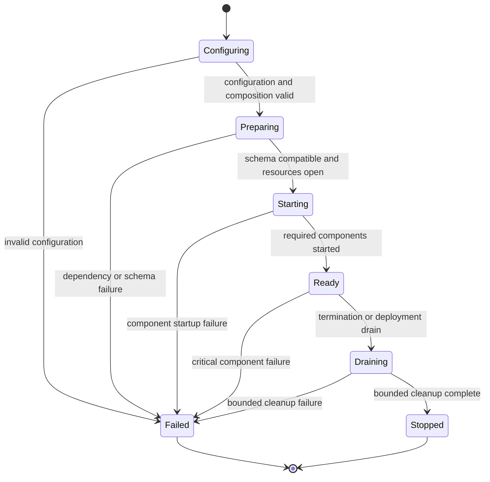

# Runtime Configuration and Deployment

## Design Position

Each Foundation Service product distribution ships one executable package and one container image. That build artifact fixes exactly one trusted distribution descriptor and starts it as a `control` role, a `worker` role, or the all-in-one `all` composition. Configuration, schema preparation, resource construction, component startup, readiness, draining, and shutdown follow one process lifecycle regardless of whether the executable is invoked directly or through a container entrypoint.

Runtime owns process behavior, not domain behavior. It loads the distribution fixed by the artifact, validates one effective configuration, starts only the components assigned to the selected role, and fails closed when the deployment cannot preserve their required semantics.

## Boundaries

| Concern                                                             | Owner                                                                        | Relationship                                                         |
| ------------------------------------------------------------------- | ---------------------------------------------------------------------------- | -------------------------------------------------------------------- |
| Configuration sources, precedence, role, and deployment profile     | Runtime                                                                      | Produces one immutable effective configuration                       |
| Installed capabilities and role component set                       | [Distribution Composition](02-distribution-composition-and-extensions.md)    | Supplies the explicit application composition fixed by the artifact  |
| Backend construction and capability semantics                       | [Storage](03-storage.md)                                                     | Constructs the selected typed clients and roots                      |
| Relational compatibility and migration application                  | [Relational Schema](04-relational-schema.md)                                 | Prepares or verifies the final distribution schema before readiness  |
| Product ingress and operational probes                              | [HTTP Ingress](05-http-ingress-and-request-contract.md)                      | Exposes only the surfaces owned by the selected role                 |
| Process tracer provider, content policy, and OTLP lifecycle         | [Observability](37-observability-and-trace-archive.md)                       | Adds one optional best-effort export path without changing readiness |
| Domain routers, reconcilers, publishers, and workers                | Owning Foundation domains                                                    | Declare role ownership and durable failure semantics                 |
| Plugin Runtime profile and loading behavior                         | [Plugin Runtime Loading](26-harness-plugin-artifacts-and-runtime-loading.md) | Defines on-demand import or Supervisor/Runner execution              |
| Container scheduling, replicas, secrets, mounts, and network policy | Deployment                                                                   | Supplies external resources without changing service semantics       |

The runtime does not define a general plugin loader, dependency-injection container, process manager, or dynamic configuration service. Domain code does not read process environment variables, choose a deployment role, run migrations, or start unowned background tasks.

## Effective Configuration

The executable selects a TOML file only through an explicit `--config PATH`. It then constructs one effective configuration in this precedence order, from lowest to highest:

1. release defaults;
2. one explicitly selected TOML file;
3. `FOUNDATION_*` environment variables;
4. explicit `--role` and `--host` executable overrides.

When no configuration path is supplied, no TOML file is loaded. The process does not search the working directory, user home, or image filesystem for `.env`, `foundation.toml`, or another implicit file. It does not merge several files or implement include, inheritance, or named profile semantics.

TOML groups settings by stable operational concern:

```toml
[service]
role = "all"
host = "127.0.0.1"
port = 8000

[database]
backend = "postgresql"

[redis]
backend = "redis"

[objects]
backend = "s3"

[filesystem]
root = "/var/lib/foundation"

[control]

[gateway]
a2a_enabled = true

[worker]

[plugin_runtime]
mode = "on_demand"

[observability]
tracing = true
trace_content = "none"
```

The example defines section ownership, not an exhaustive setting catalog. The executable package documents concrete fields and environment names. An environment variable maps to its section and field under the `FOUNDATION_` prefix. Unknown TOML sections and fields are rejected; a misspelled or distribution-unsupported setting never disappears silently.

The artifact's fixed distribution descriptor supplies the complete typed configuration schema before values are parsed. No CLI option, TOML field, or environment variable selects a distribution or names an import target. Distribution-specific settings live in an explicit namespaced section and cannot reinterpret a common field. Secret-bearing values can come from the selected TOML file or environment. They remain redacted from representations, logs, traces, errors, probes, and generated configuration output. The deployment protects any file or environment source containing credentials.

Configuration is immutable after startup. Changing a setting requires a new process. The service performs no partial or hot reload that could leave replicas or role components using different configuration generations.

`gateway.a2a_enabled` is the single protocol availability switch. It defaults
to `true`. Native and Hosted AG-UI have no runtime enable setting. When false,
the `control` or `all` process omits A2A discovery, runtime, streaming, push
routes, and A2A delivery components while preserving every Native and Hosted
AG-UI surface. The setting does not select another distribution and there is no
Agent-level A2A enable setting.

The observability section contains only the tracing switch and Harness content
selection owned by the [observability contract](37-observability-and-trace-archive.md).
Exporter, endpoint, protocol, headers, TLS, sampler, batch, and timeout settings
use standard `OTEL_*` input and do not gain Foundation aliases. Static
configuration is validated before startup completes. Runtime exporter
availability is diagnostic and never becomes a readiness dependency.

## Deployment Profiles

Foundation supports two profiles:

| Profile        | Roles                         | Relational           | Redis                              | Objects                          | Process constraint                                             |
| -------------- | ----------------------------- | -------------------- | ---------------------------------- | -------------------------------- | -------------------------------------------------------------- |
| Single-process | `all`                         | SQLite or PostgreSQL | Process-local memory or real Redis | Local directory or S3-compatible | Exactly one service process when any local backend is selected |
| Distributed    | `all`, `control`, or `worker` | PostgreSQL           | Real Redis                         | Shared S3-compatible storage     | One or more independently replaceable processes                |

The distributed profile requires PostgreSQL, real Redis, and shared object storage. It rejects SQLite, process-local Redis, and local object storage before opening service traffic. A mounted shared filesystem can satisfy a domain that explicitly owns filesystem semantics, but it does not replace shared object storage or make SQLite and local object locking distributed.

Real Redis is a required distributed data-flow and coordination dependency. Required does not mean universally authoritative: each owning domain defines the identity, retention, replay, and authority of the values it places in Redis. Durable Foundation resource state, TurnAttempt fencing, and accepted lifecycle transitions remain relational facts unless an owning specification explicitly establishes a different authority.

## Process Roles

`control` and `worker` are the two independently deployable roles. `all` is
their exact process composition. The default `on_demand` Plugin Runtime profile
runs Turn scan, compatibility preflight, claim, leases, plugin code, and Harness
execution in the Worker process. The optional `runner` profile gives each Worker
a stable Supervisor that owns Runtime-lock discovery, claim gating, and
child-process lifecycle; lock-scoped Runner children own the execution loop.

| Capability                                | `control` | `worker` |   `all` |
| ----------------------------------------- | --------: | -------: | ------: |
| Product API and browser application       |       Yes |       No |     Yes |
| Native and Hosted AG-UI Gateway surfaces  |       Yes |       No |     Yes |
| A2A Gateway surface when enabled          |       Yes |       No |     Yes |
| Authentication and authorization ingress  |       Yes |       No |     Yes |
| Domain-owned control reconcilers          |       Yes |       No |     Yes |
| Outbox publication                        |       Yes |       No |     Yes |
| Profile-selected Worker execution runtime |        No |      Yes |     Yes |
| Turn scan, claim, takeover, and lease     |        No |  Runtime | Runtime |
| Harness and Environment invocation        |        No |  Runtime | Runtime |
| Operational liveness and readiness probes |       Yes |      Yes |     Yes |
| Automatic migration when enabled          |       Yes |    Never |     Yes |

Every background component has exactly one role owner. `all` installs the union once; it does not start a second application, duplicate a router, or construct another copy of shared process resources. Rolling overlap is safe only when the owning domain makes the component leased, fenced, or idempotent.

One service process runs one ASGI worker. A deployment scales by adding service processes or container replicas rather than forking several independent role runtimes behind one process boundary. Runner-profile child processes are an internal Worker execution boundary, not additional service replicas or independently addressable Worker resources.

## Startup Lifecycle



Startup performs these ordered gates:

01. load the artifact's fixed distribution descriptor and effective configuration;
02. validate the role, distribution, and deployment profile as one unit;
03. configure process logging once;
04. apply or verify the final relational schema;
05. construct required storage and external clients;
06. construct the selected process telemetry boundary;
07. initialize the Plugin Runtime mode from Control only for an empty deployment, or verify the persisted mode from every role;
08. start the selected role components under one supervised lifespan;
09. for a Worker role, start the on-demand execution loop or the runner Supervisor and active-lock Runner selected by the persisted deployment mode;
10. report readiness only after every preceding gate succeeds.

A container entrypoint delegates to this lifecycle and does not own another migration, role, or fallback policy. A worker verifies the expected schema head and never mutates it. A control or all-in-one process can apply migrations under the schema contract when automatic migration is enabled; a deployment using a dedicated migration job disables replica migration.

Critical role components run under structured supervision. An unexpected normal return or unhandled failure from a critical component makes the process unready and terminates the process after bounded cleanup. The runtime does not silently restart one component inside a partially healthy process. Expected dependency disconnection is handled by the owning client or component without disguising an unrecoverable component failure.

## Liveness and Readiness

Liveness reports only that the process and event loop can answer a bounded probe. It does not query every dependency, claim product availability, or perform repair.

Readiness succeeds only when:

- startup completed and the process is not draining;
- the database is reachable and at the expected final distribution schema head;
- required Redis operations are reachable;
- the selected object store and required filesystem roots passed their bounded capability checks;
- every selected critical role component started successfully; and
- a Worker can scan work through a healthy on-demand loop or the healthy Runner required by its configured profile.

An enabled A2A surface contributes its required push and delivery components to
readiness. A disabled A2A surface contributes no route, component, or readiness
dependency.

Loss of PostgreSQL, Redis, shared object storage, or another role-required dependency makes the affected process unready. A transient dependency loss does not by itself make liveness fail or erase already committed work. The process stops accepting new dependent work while the owning component performs bounded reconnect behavior. An unrecoverable client or component failure terminates the process.

An OTLP endpoint or Trace Archive is not a role-required Service dependency.
Exporter failure, queue pressure, and archive failure preserve readiness and
ordinary work while emitting bounded diagnostics under the observability
contract.

Probe responses expose only bounded status, role, build identity, and safe dependency categories. They contain no endpoint, credential, tenant data, queue contents, traceback, or raw provider error.

## Drain and Shutdown

Drain makes readiness fail before the process stops accepting new work.

A control process rejects new product mutations and streaming connections, then
stops ingress, domain-owned reconcilers, and publishers in an order that
preserves committed state. An on-demand Worker stops its periodic scan; a runner
Supervisor gates every Runner scan. The selected runtime drains active work only
until the configured deadline and then commits an authoritative Attempt decision
or stops renewing so another Worker can take over after lease expiry. Shutdown
never extends a lease indefinitely or reports unfinished work as successful.

Resources close in reverse ownership order after role components stop. Cancellation remains observable, cleanup is bounded, and process termination never relies on an unbounded background task or external call.

## Failure Semantics

| Failure                                       | Observable outcome                              | Recovery                                                    |
| --------------------------------------------- | ----------------------------------------------- | ----------------------------------------------------------- |
| Configuration is invalid or unknown           | Process exits before resource construction      | Correct the selected configuration                          |
| Role and backend profile are incompatible     | Process exits before serving traffic            | Select one supported profile                                |
| Schema is incompatible                        | Process remains unready and startup fails       | Apply the accepted final distribution history               |
| Required dependency is unavailable at startup | Process does not become ready                   | Restore the configured dependency                           |
| Required dependency disconnects after startup | Readiness fails and new dependent work stops    | Bounded reconnect restores readiness when safe              |
| Critical component exits unexpectedly         | Process becomes unready and terminates          | Deployment replaces the process                             |
| Drain deadline expires                        | Process stops without inventing successful work | Durable lease expiry and Worker takeover determine recovery |

No failure causes an implicit switch to a local backend, another distribution, or a weaker role.

## Compatibility

Role values, configuration precedence, stable TOML section names, Plugin Runtime mode, and supported deployment profiles are operational compatibility contracts. New optional fields and new distribution-owned namespaces can be added. Reinterpreting an existing field, changing precedence, making an accepted profile unsafe, or changing a role's ownership requires an explicit compatibility change.

The `gateway.a2a_enabled` field is a common operational compatibility contract;
its absence has the release-default meaning `true`.

The effective configuration is deployment input, not a durable product resource or public API representation. Replicas participating in one deployment use configuration and distribution versions that are compatible with the same schema and data-flow contracts.

`plugin_runtime.mode` defaults to `on_demand`. Control persists the selected value when initializing a deployment and may replace it only while no Plugin, AgentPresetVersion, or Turn exists. Every role verifies the resulting value before readiness. A non-empty mode mismatch never performs an in-place migration or starts with weaker semantics.

## Invariants

01. One executable and image per product distribution support `control`, `worker`, and their `all` composition.
02. One immutable effective configuration is resolved before any service resource or background component starts.
03. No configuration file is loaded unless its path is explicit.
04. Distributed deployments require PostgreSQL, real Redis, and shared object storage.
05. Worker-only processes verify schema compatibility and never migrate.
06. `all` installs each control and worker capability exactly once.
07. A process becomes ready only after schema, dependencies, and selected critical components are ready.
08. A critical component cannot fail silently while the process remains ready.
09. Drain stops new work before bounded component and resource cleanup.
10. Runtime failure never selects a weaker backend, role, or distribution automatically.
11. Runtime configuration never selects a distribution or arbitrary code target; the build artifact fixes one trusted distribution descriptor.
12. Every deployment durably fixes one Plugin Runtime mode; `on_demand` executes in the Worker interpreter, while `runner` keeps Plugin code and Harness execution out of the stable Supervisor.
13. Native and Hosted AG-UI are always present on control-capable roles; A2A is controlled only by the default-on deployment-wide setting.
