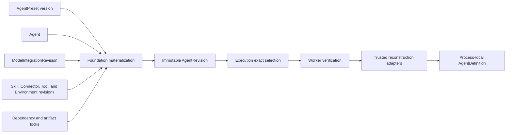
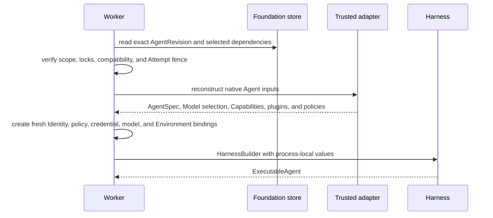

# Agent Revisions and Reconstruction

## Design Position

Foundation stores serializable Agent authoring resources and immutable executable revisions. It does not persist a Harness `AgentDefinition`, Python import target, plugin instance, native Model, Toolset, Capability, callable, client, credential, or provider binding. An execution worker reconstructs those process-local values through trusted installed adapters after verifying every selected revision and lock.

An Execution selects exact immutable inputs. It never resolves `latest` after durable acceptance or silently adopts edits made while queued, suspended, or recovering.

## Authoring Model

An `Agent` is the stable Workspace resource used for collaboration, policy, invocation, and workload identity. Agent metadata and publication pointers are versioned mutable product data. An `AgentPreset` is a reusable typed authoring input; it is not an executable object and does not override an Agent revision after materialization.

An `AgentRevision` is an immutable executable snapshot associated with one Agent. It contains only Foundation-owned serializable data and exact references, including:

- logical Agent instructions and typed input/output declarations;
- selected model-integration revision and model settings;
- Capability, Tool, Skill, Connector, and Environment declarations under their owning Foundation schemas;
- direct trusted adapter keys and bounded adapter configuration;
- optional Harness plugin configuration under the Harness-owned document contract;
- exact dependency, package, artifact, and schema compatibility locks;
- the stable Agent workload identity reference when the Agent uses one.

A `ModelIntegration` is a stable Workspace or Organization resource describing a trusted model-provider integration. A `ModelIntegrationRevision` is immutable and selects exact provider type, routing configuration, supported model surface, compatibility facts, and non-secret credential references. Hosted profiles that use logical model aliases require an explicit `ModelRunBinding` and fail closed rather than delegating to ambient native inference.

Changing materialized Agent content, a selected integration revision, or a dependency lock creates another Agent revision. Prior revisions selected by retained Executions remain addressable for their documented retention period.

## Revision Relationships

Materialization validates resource scope, references, schemas, permission to bind each resource, dependency compatibility, and all required locks before committing the immutable revision. The revision records identity and compatibility, not live authority. Current credentials, membership, run grants, provider availability, and Environment bindings are resolved freshly for every Attempt.

## Dependency Locks

A dependency lock identifies every artifact whose change could alter reconstruction, capability behavior, state compatibility, security, or output semantics. It includes exact package or artifact identities, trusted adapter keys, relevant schema or codec compatibility, and integrity digests when artifacts are externally materialized.

Package installation or entry-point availability grants no trust. The deployment selects allowed adapter and plugin keys, verifies the exact lock, and imports only those installed targets. A durable row never contains an arbitrary module, class, file path, shell command, or remote code URL for execution.

An adapter replacement can reconstruct a retained revision only when it explicitly declares compatibility with that revision and its locks. Name similarity, newer package versions, or a current default does not satisfy a missing lock.

## Worker Reconstruction

Reconstruction is deterministic with respect to the revision and declared locks, while live authority and provider reachability are intentionally fresh. The worker assigns a stable `AgentInstanceRef` to each independently advancing root, child, or fork history. Replacement Attempts preserve that reference for the same lineage but use new transient run correlation and fresh bindings.

The worker validates the complete definition before starting model or tool work. It does not partially execute a revision whose output schema, Capability state codec, plugin contract, model integration, Environment provider, or dependency lock is incompatible.

## Conversation Compatibility

A Conversation preserves one independently advancing Agent lineage and selected Harness checkpoint. Continuing it with another Agent revision is allowed only when the new revision explicitly accepts the selected checkpoint's Agent, Capability, output, Environment-state, and plugin compatibility facts. Otherwise the caller creates an explicit fork with a new lineage and no implied state migration.

Editing an Agent or publishing another revision never mutates an existing Execution, Attempt, checkpoint, pending action, or child. Retrying or resuming an Execution reconstructs the revision selected when that Execution was accepted.

## Failure Semantics

| Failure                                  | Outcome                                                                     |
| ---------------------------------------- | --------------------------------------------------------------------------- |
| Missing revision or lock                 | Attempt fails before Harness construction                                   |
| Artifact digest or package lock mismatch | Attempt fails closed and records bounded incompatibility evidence           |
| Unknown adapter or plugin key            | Revision is not reconstructed; no ambient import fallback occurs            |
| Model binding required but unavailable   | Attempt fails before native model inference                                 |
| Credential or policy unavailable         | Fresh binding fails; the immutable revision is not rewritten                |
| Checkpoint incompatible with revision    | Continuation fails before Harness entry; display history is not substituted |
| Worker lost during reconstruction        | Lease recovery creates a new Attempt; no process-local object is restored   |

## Invariants

1. An Execution selects one exact immutable Agent revision and exact integration revisions.
2. A revision contains serializable Foundation data and references only, never live Python objects or credentials.
3. Dependency and artifact locks are verified before Harness construction.
4. Package presence does not authorize an adapter, plugin, Capability, provider, or import target.
5. Every Attempt reconstructs fresh authority and bindings without mutating the selected revision.
6. Replacement Attempts preserve stable Agent lineage identity and change transient run correlation.
7. A retained checkpoint is used only under explicitly compatible Agent and state contracts.
