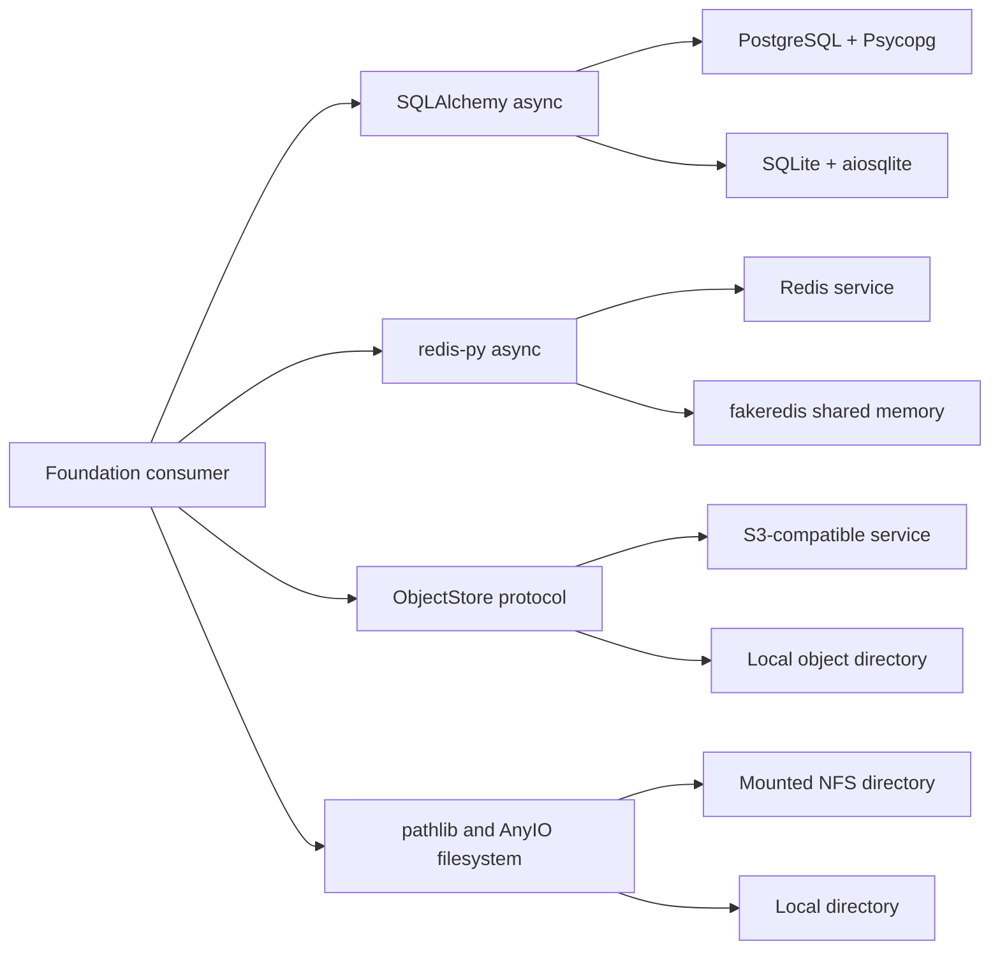

# Foundation Storage Capabilities

## Design Position

Foundation Service owns one internal storage substrate for relational data, Redis-compatible data structures, object storage, and mounted filesystems. It is part of `converge-foundation-service`; it is not an independently published Python distribution, a public SDK surface, or a business-domain repository layer.

The substrate standardizes backend selection, process lifecycle, safety, and the semantics that local and network backends share. It does not force unlike storage systems behind one generic provider interface. Consumers use mature upstream Python interfaces directly when those interfaces already own the semantics. Foundation defines a small protocol only for object storage, where the local filesystem and S3-compatible services otherwise lack a shared application-facing contract.

Storage capabilities contain no Agent, Turn, `TurnAttempt`, lifecycle-event, work-queue, webhook, or presentation-stream meaning. Domain owners compose these generic primitives and remain responsible for their schemas, keys, ordering rules, and authority.

## Boundaries

| Concern                                | Storage capability owner                                                   | Consumer owner                                                   |
| -------------------------------------- | -------------------------------------------------------------------------- | ---------------------------------------------------------------- |
| Backend configuration and construction | Selects exactly one configured backend for each capability                 | Declares which capabilities the process requires                 |
| Client and pool lifecycle              | Creates process-wide resources and closes them during application shutdown | Uses injected resources and does not construct competing clients |
| Generic storage semantics              | Defines the common local/network contract in this document                 | Chooses keys, schemas, queries, and domain meaning               |
| Durable authority                      | Supplies persistence primitives                                            | Declares which committed domain records are authoritative        |
| Coordination and delivery              | Supplies Redis commands, including Streams                                 | Defines queue, lease, notification, and replay policy            |
| Deployment resources                   | Accepts configured endpoints, credentials, roots, and mounts               | Deployment creates databases, buckets, Redis, and NFS mounts     |

The storage substrate does not own consumer schemas, migration history, domain repositories, serialization formats, retention policy, data residency, backup policy, or cross-resource transactions. Foundation Service owns its relational schema lifecycle through the [Relational Schema Lifecycle](03-relational-schema.md). Foundation's durable lifecycle and API contracts remain owned by [Foundation Service](README.md). Platform identifiers and persisted timestamps follow [Platform Data Conventions](../data-conventions.md).

## Capability Model



| Capability                  | Consumer surface                          | Network backend                           | Local backend                                    |
| --------------------------- | ----------------------------------------- | ----------------------------------------- | ------------------------------------------------ |
| Relational                  | SQLAlchemy asynchronous Core and ORM APIs | PostgreSQL through Psycopg 3              | SQLite through aiosqlite                         |
| Redis-compatible structures | `redis.asyncio.Redis`                     | Redis                                     | fakeredis with a process-shared fake server      |
| Objects                     | Foundation `ObjectStore` protocol         | S3-compatible storage through aiobotocore | Object semantics over a confined local directory |
| Files                       | `pathlib` plus AnyIO file operations      | NFS mounted by deployment                 | Local directory                                  |

Backend selection occurs while the process starts. Consumers receive the selected capability and do not branch on backend type. A failed network backend never causes an implicit switch to a local backend because that would create a second, divergent state system.

The following internal Python shape is representative of the consumer contract:

```python
async with transaction(storage.sessions) as session:
    await session.execute(statement)

await storage.redis.hset(key, mapping={b"status": b"ready"})
await storage.objects.put(object_key, payload, content_type="application/octet-stream")

path = await resolve_under_root(storage.files_root, logical_path)
async with await anyio.open_file(path, "rb") as file:
    chunk = await file.read(64 * 1024)
```

`storage` is lifecycle-owned wiring, not a uniform operation facade. SQL and Redis retain their upstream interfaces, objects use the Foundation protocol, and mounted files use ordinary path/file operations after root confinement.

## Relational Storage

SQLAlchemy's asynchronous `AsyncEngine`, `AsyncSession`, Core, and ORM APIs are the relational interface. Foundation does not wrap these APIs with generic `get`, `insert`, or `do` methods. A repository may add domain-specific queries, but a repository does not become part of the generic storage substrate.

PostgreSQL is the distributed-service backend and uses Psycopg 3. SQLite is the zero-service backend for the minimal single-process profile and uses aiosqlite. The same SQLAlchemy models, unit-of-work shape, and consumer code serve both backends for the declared portable subset.

The portable relational subset includes ordinary transactions, constraints, indexes, CRUD statements, joins, and SQLAlchemy-managed type conversion that has equivalent tested behavior on both backends. PostgreSQL-only SQL, data types, locking, isolation guarantees, advisory locks, and concurrency behavior are not portable. A feature that requires one of them declares PostgreSQL as a startup requirement instead of silently weakening its behavior on SQLite.

The canonical engine and session factory are constructed once per process. Each operation opens a short-lived session and transaction. An `AsyncSession` is neither shared across concurrent tasks nor retained across agent execution, network I/O, sleeps, background work, or streaming responses. Cancellation and exceptions roll back the active transaction, and cleanup is allowed to finish before cancellation propagates.

Foundation Service's ordered migration history is the schema authority for both relational backends. Domains own the meaning of their relational models and schema changes, while the service owns their aggregation into one history. Revision ordering, backend portability, application ownership, and failure behavior are defined by the [Relational Schema Lifecycle](03-relational-schema.md). Runtime `create_all` calls never replace migration history.

## Redis-Compatible Data Structures

The asynchronous redis-py client is the consumer interface. Foundation does not divide it into separate cache, list, map, queue, or event abstractions. The same injected client exposes strings with expiration, hashes, lists, sets, sorted sets, Streams, pipelines and transactions, and Pub/Sub. Domain code chooses commands and defines key namespaces, value encodings, delivery semantics, and retention. The shared factory keeps response decoding disabled so keys and values remain binary-safe; domains decode their own formats explicitly.

The network backend is a real Redis service. The local backend is fakeredis using one shared in-memory server per process. Both are supplied through the redis-py asynchronous interface, so consumers do not contain local-versus-network branches.

The in-memory backend is non-durable, loses all contents at process exit, and does not coordinate separate processes. It is valid only for a single-process minimal profile. A local deployment that needs exact server behavior, multi-process coordination, persistence, or Redis modules uses a real Redis service.

Only commands covered by the Redis dual-backend contract suite belong to the local compatibility contract. Configuration fails before serving traffic when a required command or server feature is unavailable in the selected backend. Differences in scripting, modules, blocking-command scheduling, server-side functions, eviction, persistence, clustering, and failure behavior are never silently treated as equivalent.

Redis data is coordination or derived state unless the owning domain contract explicitly says otherwise. Selecting Redis Streams does not by itself make a stream the durable authority for a domain lifecycle.

## Object Storage

Object storage uses one Foundation-owned `ObjectStore` protocol because S3 and a local directory do not provide a suitable common upstream Python interface. The protocol is asynchronous, binary-safe, and based on opaque object keys; it does not expose paths, directories, file descriptors, or provider client objects.

The protocol supplies these operations:

| Operation | Contract                                                                                                                                     |
| --------- | -------------------------------------------------------------------------------------------------------------------------------------------- |
| `put`     | Streams bytes to one key, records content type and string metadata, and supports unconditional, create-only, or expected-version publication |
| `open`    | Opens a managed asynchronous byte stream for the whole object or an explicit byte range                                                      |
| `stat`    | Returns size, content type, metadata, last-modified time, and an opaque version token without reading the body                               |
| `delete`  | Is idempotent for a missing key and optionally requires an expected version                                                                  |
| `list`    | Returns a bounded, deterministic page for a prefix plus an opaque continuation cursor                                                        |

`put` publishes either the complete object or no new visible object. A create-only or expected-version mismatch reports a conflict and never overwrites the existing object. A version token is meaningful only for conditional operations on the same object store; consumers do not parse it or assume that it is a content hash. A list cursor is meaningful only to the same backend and listing parameters and is not durable application state.

The network adapter targets S3-compatible object storage through an aiobotocore client owned by the application lifespan. Its supported service profile requires conditional `PutObject` and `DeleteObject`, range reads, head requests, and lexicographically ordered `ListObjectsV2` pagination. S3 directory buckets and compatible services that cannot preserve this profile are rejected during configuration.

The local adapter stores bodies and metadata beneath one configured root while preserving object semantics: keys remain opaque, publication uses an atomic same-filesystem replacement, conditional writes are serialized correctly within the process, and listing order and pagination are deterministic. Temporary upload data is not observable through `open`, `stat`, or `list` and is removed after failed or cancelled publication.

The local object backend is a single-process backend. Separate processes do not share its conditional-write coordination even when configured with the same directory; deployments requiring concurrent writers use S3-compatible storage.

Object keys are non-empty UTF-8 strings. They cannot contain NUL, be absolute paths, or resolve outside the local object root. The local adapter does not follow symlinks that escape that root. These restrictions apply before any filesystem access and do not turn keys into a public path syntax.

The protocol reports provider-neutral not-found, conflict, invalid-request, and unavailable outcomes. It preserves cancellation. Provider-specific errors may be attached as diagnostic causes but are not required for consumer control flow.

## Mounted Filesystem Access

Local files and NFS do not have separate Python providers. Deployment mounts NFS before starting the process and passes its mount point as a configured filesystem root; local mode passes a local directory. Application code uses the same `pathlib` and AnyIO operations for both.

The storage substrate may centralize confined-root resolution, bounded file streaming, and atomic same-filesystem replacement, but it does not invent a filesystem protocol or mirror the complete `open` API. Code accepting logical or untrusted names resolves them beneath the configured root, rejects absolute paths and parent traversal, and prevents symlink escape. Trusted internal code may use ordinary paths directly once the root boundary has been established.

Blocking file operations run through AnyIO's worker-thread facilities on service paths, with bounded concurrency and bounded buffering. Atomic replace is guaranteed only within one filesystem. NFS mounting, authentication, availability, cache consistency, quotas, backups, and access modes remain deployment responsibilities. Filesystem locks and SQLite files on NFS are not distributed-coordination mechanisms.

Filesystem storage and object storage remain distinct. Filesystem consumers may rename, traverse, and mutate paths; object consumers operate on opaque keys and conditional whole-object publication. Their implementations may share private byte-copy and atomic-file helpers without sharing an application interface.

## Lifecycle and Failure Semantics

All required capabilities are constructed during application lifespan and closed during shutdown. Startup validates configuration and performs bounded readiness checks for required network services, roots, and buckets. Credentials and provider clients stay process-local and are neither persisted in domain records nor included in diagnostic output.

| Failure                                   | Observable outcome                                                          | Retry rule                                                              |
| ----------------------------------------- | --------------------------------------------------------------------------- | ----------------------------------------------------------------------- |
| Configuration or unsupported capability   | Process does not become ready                                               | Change configuration or backend; do not degrade automatically           |
| Failure before a request is dispatched    | No storage effect                                                           | Retry within the caller's deadline when the operation is otherwise safe |
| Connection loss after dispatching a write | Effect may be unknown                                                       | Reconcile by identifier or version before retrying                      |
| Conditional-write conflict                | Existing state is preserved                                                 | Re-read and make a new domain decision                                  |
| Cancellation                              | Operation stops and owned resources are cleaned up                          | Caller decides whether to reconcile or retry                            |
| Shutdown                                  | New work stops and owned pools, clients, streams, and temporary files close | In-flight work follows the process shutdown contract                    |

Automatic retries are bounded, cancellation-aware, and limited to operations whose semantics make repetition safe. The storage layer does not retry an unconditional, potentially committed write merely because its response was lost. SQLAlchemy and redis-py surfaces preserve their native exception models; the Foundation-owned object protocol uses its provider-neutral outcomes.

## Compatibility and Verification

The storage substrate is an internal Foundation Service contract. Changing its Python construction helpers does not change a public service or SDK API. Changing persisted object layout, object conditional semantics, the supported Redis command set, or the relational portable subset requires migration and compatibility review because deployed data or consumer behavior may depend on it.

Each capability has a shared contract suite that runs the declared common behavior against both local and network backends:

- relational tests run against SQLite and PostgreSQL;
- Redis tests run against fakeredis and a real Redis service;
- object tests run against the local adapter and an S3-compatible service;
- filesystem tests run once against the shared mounted-directory behavior, with deployment integration covering NFS separately.

Provider-specific integration tests cover behavior outside the common subset without expanding the portable contract. Passing a local test alone never establishes network concurrency, durability, or failure guarantees.

## Trade-offs

Using capability-specific interfaces means Foundation consumers learn SQLAlchemy, redis-py, object-store, and filesystem semantics rather than one uniform storage vocabulary. This cost keeps transactions, Redis structures, object publication, and path mutation explicit and prevents a lowest-common-denominator abstraction.

Local backends optimize for zero-service development, not operational parity. They preserve the tested application-visible behavior needed by the minimal profile while accepting weaker durability, concurrency, and failure characteristics. Deployments that need network semantics run the corresponding network service locally.

## Invariants

01. Storage capabilities contain no Foundation business-domain schema or event meaning.
02. Backend selection occurs at process startup; consumers do not branch on the selected backend.
03. Network-backend failure never triggers implicit local fallback.
04. SQL consumers use SQLAlchemy's asynchronous API and short-lived sessions; Redis consumers use redis-py's asynchronous API.
05. Foundation owns a provider-neutral interface only for object storage; local files and mounted NFS share ordinary filesystem operations.
06. Local compatibility covers only behavior exercised by the corresponding dual-backend contract suite.
07. In-memory Redis state is process-local and non-durable.
08. The local object backend has exactly one writing service process.
09. Object and confined filesystem names cannot escape their configured roots.
10. Blocking filesystem work does not run on the service event loop.
11. A capability that cannot preserve required semantics fails explicitly before the process serves dependent traffic.
