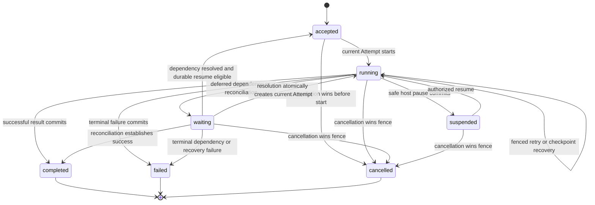
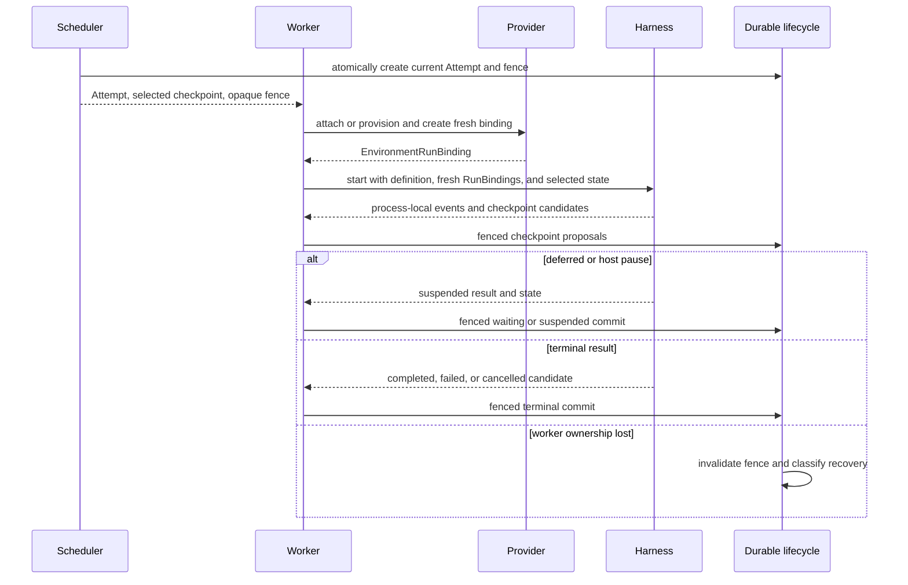

# Durable Execution Lifecycle

## Design Position

An `Execution` is the Foundation Service's durable logical unit of accepted Agent work at one exact root or child path in an immutable definition revision. An `Attempt` is one fenced worker ownership interval that can start at most one root process-local Harness run for that Execution. Inline descendants follow the Harness State-backed delegation contract inside that run and do not become additional Host Attempts. A Host-managed asynchronous subagent is instead another child `Execution` with its own Attempts and checkpoints. A retry, checkpoint recovery, deferred-tool continuation, or resume after a Host pause creates another Attempt under the same Execution; it never resurrects a prior Python task or reuses its authority.

The service owns acceptance, scheduling, Attempt fencing, checkpoint selection, recovery, durable completion, asynchronous child lineage, durable task coordination, and child-result retention and delivery. The Harness owns only the process-local result and `HarnessState` candidate described by [Execution Context and Lifecycle](../agent-harness/06-execution-context-and-lifecycle.md). `agent-envd` and Environment providers own their native resources and side-effect evidence, not the Execution state machine.

```mermaid
flowchart LR
    Accept[Durable acceptance] --> Execution[Execution]
    Execution --> Attempt1[Attempt generation 1]
    Attempt1 --> Harness1[Harness run]
    Harness1 --> Checkpoint[Committed checkpoint]
    Checkpoint --> Attempt2[Attempt generation 2]
    Attempt2 --> Harness2[New Harness run]
    Harness2 --> Terminal[Durable terminal commit]
```



This contract defines logical identities, states, fencing, and completion rules. It does not prescribe database tables, lease duration, heartbeat cadence, queue technology, worker scanning, or provider-specific recovery states.

## Boundaries

| Concern                                          | Owner                                                      | Relationship                                            |
| ------------------------------------------------ | ---------------------------------------------------------- | ------------------------------------------------------- |
| Durable Execution identity and state             | Foundation Service                                         | Sole public lifecycle authority                         |
| Attempt lease, generation, and commit fence      | Foundation Service scheduler and execution lifecycle       | Prevent stale workers from advancing durable state      |
| Process-local run, result, and `HarnessState`    | Harness                                                    | Candidate observations submitted by the current Attempt |
| Provider-adapter lifecycle record                | Environment provider adapter                               | Service has bounded opaque storage custody              |
| Environment-local state and side-effect evidence | EIP provider and affected external system                  | Revalidated under every fresh binding                   |
| Accepted input and command receipts              | [Execution API and Events](04-execution-api-and-events.md) | Inputs to lifecycle transitions, not Attempt state      |
| Durable model-usage records and estimates        | [Usage Recording](05-usage-accounting.md)                  | Independent observation boundary                        |
| Async child acceptance and lineage               | Foundation Service subagent lifecycle                      | Child is an independent Execution                       |
| Shared async task coordination                   | Foundation durable task scope                              | CAS API, never shared Python memory                     |
| Child-result retention and parent routing        | Foundation subagent delivery ledger                        | Later Host input, never a deferred spawn result         |
| Product delivery or webhook completion           | Connector or product                                       | Never commits Execution completion retroactively        |

## Core Model

The following Python-like types are conceptual domain contracts, not a serialized API or persistence schema.

```python
type ExecutionState = Literal[
    "accepted",
    "running",
    "waiting",
    "suspended",
    "completed",
    "failed",
    "cancelled",
]


type AttemptState = Literal[
    "leased",
    "running",
    "finished",
    "abandoned",
]


class AgentDefinitionTarget(BaseModel):
    definition_revision_ref: str
    agent_path: tuple[str, ...] = ()


class Execution(BaseModel):
    execution_id: str
    definition_target: AgentDefinitionTarget
    acceptance_ref: str
    agent_instance_ref: AgentInstanceRef
    root_execution_id: str
    parent_execution_id: str | None
    spawn_id: str | None
    predecessor_execution_id: str | None
    continuation_source_ref: str | None
    task_scope_ref: str | None
    state: ExecutionState
    version: int
    current_attempt_id: str | None
    selected_checkpoint_ref: str | None
    wait_reason: str | None
    result_ref: str | None
    failure: SafeFailure | None


class Attempt(BaseModel):
    attempt_id: str
    execution_id: str
    generation: int
    state: AttemptState
    selected_checkpoint_ref: str | None
    harness_run_id: str | None
    started_at: datetime | None
    finished_at: datetime | None
```

`execution_id` remains stable across every retry and resume. It is the ordinary Foundation Client resource identity. `definition_target` fixes both one immutable revision and one authored-name path through that revision's complete child graph; the empty path selects the root. The accepted input identity and target never change within the Execution. An asynchronous child target is derived from its authenticated parent's target plus one immediate built child name, so its embedded bytes and dependency-lock slice cannot be substituted with an independent child revision. Compatibility migration can translate a durable value through declared codecs without changing semantic target selection; running under another revision creates another Execution with explicit lineage.

`agent_instance_ref` is fixed for the Execution and is the durable non-authoritative root-Agent task-owner identity rebound into each fresh Attempt's root `AgentInstanceContext`; an Attempt or Harness run ID is never a task owner. An inline child has its own stable `AgentInstanceRef` under that root and remains a distinct task owner. An initially accepted top-level Execution has `root_execution_id == execution_id` and no parent, spawn, predecessor, or continuation source. An asynchronous child receives a new stable Agent instance ref, keeps the same root Execution ID, identifies its direct spawning parent Execution and immutable spawn record, has no predecessor, and owns its own acceptance, version, Attempts, state, result, and failure. A new sequential Execution created to incorporate retained child output keeps the lineage root and, when Host continuation policy preserves the logical Agent, its stable Agent instance ref; it targets the same Agent definition path as its predecessor, identifies that predecessor and the exact consumed delivery as `continuation_source_ref`, and has no `spawn_id`. These typed combinations distinguish Agent-hierarchy spawn from sequential continuation instead of overloading one parent field. `task_scope_ref` selects an optional Foundation-owned coordination scope and grants no task or execution authority by possession. When the selected root definition exposes the durable task service, Host policy fixes its scope during Execution acceptance. Child spawn applies the authored edge's `task_state` ceiling: `shared` selects the authorized parent scope, while `isolated` selects no scope or a distinct child-specific scope; product policy can narrow either choice but cannot turn isolated into shared. A continuation Execution preserves the predecessor's scope when it preserves that logical Agent. An Execution without provider-backed task tools has no task scope; the selection never comes from model input or Harness State and is immutable within that Execution.

`version` is the monotonic compare-and-swap domain for lifecycle transitions. `current_attempt_id` identifies the only Attempt that can submit new checkpoints or outcomes. `wait_reason`, `result_ref`, and `failure` are state-constrained values rather than independent status flags.

An Attempt generation is monotonic within one Execution. `attempt_id` and generation identify worker ownership but grant no authority by themselves. The scheduler issues a separate opaque lease fence to one worker. That fence is never accepted from model input, a client, `HarnessState`, or provider metadata.

`harness_run_id` is absent until the Attempt actually starts its root Pydantic run. It correlates process-local events and usage for this Execution; inline descendants retain their own Harness run IDs and Agent lineage without changing the Attempt identity. A Host-managed asynchronous child has another Attempt and another root Harness run under its own child Execution. It does not replace `attempt_id` or `execution_id`. An Attempt that dies before Harness start still remains an Attempt and can be abandoned without inventing a run ID.

## Execution States



`accepted` means the service durably owns runnable work; it does not mean a worker or model request exists. Initial acceptance and a resolved dependency with a durable resume-eligibility fact can both enter this state. Queue delivery, worker acquisition, and provider preparation can occur while the Execution remains accepted.

`running` means one current Attempt owns progress or that the service is replacing an expired Attempt without changing the public lifecycle. Internal states such as starting, leasing, recovering, or worker-crashed are diagnostics, not new public Execution states. `current_attempt_id` is cleared when a waiting, suspended, or terminal transition releases worker ownership.

`waiting` means no process-local Harness task remains and an external fact required by this Execution is still unresolved. Stable reason families include deferred external calls or approvals, dependency availability, and unknown-effect reconciliation. Asynchronous child spawn does not place the parent in `waiting`: spawn returns an ordinary receipt and parent work continues independently. Final dependency resolution atomically leaves `waiting` by creating durable resume eligibility or the next Attempt. The owning detail contract supplies typed reason data; [Client-Side Tools](02-client-side-tools.md) owns client-call pending batches.

`suspended` is an explicit safe host pause with a selected complete checkpoint. It is not a worker crash, provider timeout, or deferred dependency.

`completed`, `failed`, and `cancelled` are terminal durable facts. A failed Execution has a bounded safe failure and can identify whether recovery was exhausted or reconciliation established a terminal outcome. A terminal state never reopens; another requested run, including continuation with an asynchronous child result, creates another Execution.

## Asynchronous Child Executions

A definition-selected Foundation Subagent Capability captures the current executable's immutable `SubagentCollection` through its locked build integration. Its fresh run adapter maps model-visible child name and task arguments into the trusted `SubmitSubagentSpawn` operation defined by [Execution API and Durable Events](04-execution-api-and-events.md#asynchronous-subagent-operations). The operation carries the current parent Execution, Attempt generation, Harness run and tool-call identity, bounded child input, effective limits, and task-sharing choice, and the run adapter submits it under the current Attempt fence. From the immutable Execution and revision path, the service derives the stable parent Agent instance and child `AgentDefinitionTarget`; it never accepts arbitrary child bytes or a model-selected revision.

Spawn acceptance atomically:

1. verifies the current parent Attempt fence, run and tool-call identity, and bounded input;
2. resolves the exact immediate child edge from the immutable parent target, derives the child definition target, and validates context, limits, and task-sharing choice against that edge;
3. checks idempotency for that exact parent tool dispatch and returns the prior result for an identical retry;
4. allocates one stable child Agent instance with parent lineage and selects a compatible shared, isolated, or absent durable task scope; and
5. creates one immutable spawn link, child `Execution(state="accepted")`, acceptance record, and lifecycle events before making the child runnable.

The parent tool call completes with that receipt and can continue model work. It does not produce `CallDeferred`, create `DeferredToolRequests`, satisfy itself with the eventual child result, or retain a Python task. Spawn identity and child continuation live in Foundation records; the operation neither reads nor updates the parent Delegation State used by blocking inline calls. Reusing the same operation ID with different child, input, limits, or task policy fails closed. An exact same-dispatch retry is idempotent, but a replacement Attempt is a different invocation domain. If an accepted spawn is newer than the selected parent checkpoint, recovery presents that durable fact for reconciliation and does not blindly replay a semantically similar spawn under a new operation ID.

When the child Attempt starts, its worker resolves the exact target into the child's complete definition, selected plugin catalog, model, tools, Toolsets, Capabilities, output contract, and nested child graph. The Harness constructs that child's Agent-bound plugin graph and derives fresh run-bound instances; no live parent plugin or chain is inherited. It then reconstructs `AgentInstanceContext` from the fixed child ref and parent/spawn lineage and obtains fresh Environment, policy, credentials, client-tool attachment, model resolver, task-state binding, usage accumulator, and other `RunBindings`. No live parent object or ad hoc parent override substitutes for the child's own definition or run binding. The child may itself use inline delegation or spawn further child Executions under the same rules. Parent completion, failure, cancellation, or worker loss does not implicitly cancel an accepted child; cascade cancellation is an explicit Host policy that submits and fences a cancellation against each child Execution. Likewise, child failure does not rewrite the parent outcome.

### Durable Task Scope

Foundation asynchronous parent/child coordination uses a durable task provider keyed by Host-owned `task_scope_ref`. Every Agent-run-originated list, create, claim, or update carries the originating Execution, current Attempt ID and generation, valid lease fence, and the cell's bound stable `AgentInstanceRef`; stale or revoked workers fail before provider mutation. For the root run, that instance equals `Execution.agent_instance_ref`; for an inline child, it is the distinct child ref authorized through the current root run's trusted lineage. The service retains that provenance with each committed Agent operation for stale-owner reconciliation, without requiring those fields in the public mutation receipt. A separately authenticated product or user task API follows its own Principal authorization path and never borrows an Agent run credential.

Each mutation has a stable operation ID, canonical request digest, and immutable receipt. After authenticating current Attempt ownership, the provider first looks up that operation ID in its durable idempotency domain: an already committed matching digest returns the original receipt without re-evaluating the old expected revision, while reuse with different content fails closed. For a genuinely new operation, create allocates or validates its task ID without a prior scope revision; claim may omit the revision because current status, dependencies, eligibility, and same-owner rules are its atomic predicate; every general update, dependency edit, owner change, or status transition must compare the exact expected monotonic scope revision. All families derive owner or actor from the identity-bound cell's stable trusted `AgentInstanceRef` and commit the task change and receipt under one short transaction. Consequently a lost claim response is idempotent, a lost create response cannot create another task, and a stale general update cannot overwrite newer state.

Every Foundation definition that exposes the Foundation durable task service selects the Harness Working State Capability's explicit `task_mode="provider"`; definitions without that feature need not install Working State task tools. Each root Attempt receives a fresh `TaskStateRunBinding(source="provider")` whose API-backed cell is bound to `Execution.agent_instance_ref`, the Host-owned scope, and the current Attempt fence. Each inline child with provider-backed task tools receives another fresh cell bound to that child's stable ref and the same Attempt fence; shared policy selects the root scope, while isolated policy selects a distinct child scope. A child without task tools receives no task cell or scope. `WorkingState.tasks` must remain absent; imported local task contents are incompatible and can never seed or overwrite the provider. The optional Harness `ProviderTaskCursor` may retain only provider codec identity and an observed revision, not `task_scope_ref`, task data, mutation receipts, or authority.

No Python `TaskStateCell`, lock, or mutable `AgentContext` is shared across workers. Each run receives its own API-backed identity-bound cell, while the durable task map remains exclusively Host state and is not duplicated inside parent or child `HarnessState`. Cursor metadata and restored owner IDs grant no task authority.

A committed provider mutation can outlive the parent checkpoint that would have made a new inline child selector reachable. If that originating Attempt loses its fence first, the mutation remains an authoritative effect and the Host treats the task owner as requiring reconciliation; a replacement Agent claim conflicts rather than silently taking ownership. The task service can release or reassign that stale owner only through a Host-authorized expected-revision mutation, after which ordinary Agent claims resume. Harness recovery never fabricates rollback of the committed task effect.

### Child Result Delivery Ledger

```python
type SubagentDeliveryStatus = Literal[
    "retained",
    "targeted",
    "delivered",
    "incorporated",
    "delivery_unknown",
    "terminal_without_effect",
    "consumed_by_continuation",
    "cancelled",
]


class SubagentResultDelivery(BaseModel):
    delivery_id: str
    spawn_id: str
    child_execution_id: str
    parent_execution_id: str
    result_ref: str
    status: SubagentDeliveryStatus
    version: int
    target_attempt_id: str | None
    target_generation: int | None
    accepted_input_sequence: int | None
    continuation_execution_id: str | None
```

A child terminal transition atomically freezes one bounded terminal-outcome reference containing validated output or a safe failed/cancelled classification, appends child lifecycle events, and creates exactly one delivery ledger entry for the spawn. The delivered semantic value contains no child `HarnessState`, credential, Environment handle, authority, raw exception, or unbounded private message history. Parent input policy revalidates its classification and size before enqueue or continuation acceptance. This does not mutate or reopen the parent. The entry can take one of three routes under parent and product policy:

- **fixed active Attempt:** target one exact current parent Attempt and generation with typed Host-generated semantic input; delivery, incorporation, unknown-delivery, and replacement follow the same durable evidence rules as fixed-target steering;
- **retained:** remain queryable through spawn/status APIs until an authorized later route, explicit consumption, expiry, or cancellation policy wins its version fence;
- **continuation Execution:** atomically consume the entry once into a newly accepted Execution targeting the predecessor parent Agent definition, with typed predecessor and continuation-source lineage, selected compatible parent checkpoint or state, and the child result as new Host input.

A terminal parent is never reopened. A parent without an eligible active Attempt either retains the result or uses a new continuation Execution. The delivery never becomes `DeferredToolResults`, never claims the original spawn tool call is incomplete, and never starts two continuation Executions from one delivery. A target Attempt can become `delivery_unknown`; absence of an enqueue observation is not proof of non-delivery, and an unknown delivery cannot be rerouted or consumed into a continuation unless later authoritative evidence proves non-delivery.

## Attempt Fencing

Attempt acquisition atomically selects the input checkpoint, increments the generation, creates the Attempt, and makes it current. When acquisition follows a resolved dependency, the same transaction consumes one durable resume-eligibility fact keyed by its exact pending or reconciliation source; retrying acquisition cannot consume that fact into another Attempt. The scheduler then gives one worker an opaque lease fence. Only a request carrying the current Attempt and valid fence can:

- acknowledge Harness start and bind its `run_id`;
- accept a subagent spawn from that active run;
- accept an Agent-run-originated durable task mutation or child-control command;
- commit a checkpoint;
- commit a deferred or suspended boundary;
- propose or commit a terminal outcome;
- renew or release worker ownership.

Every write also compares the expected Execution version. Expiry, explicit revocation, or replacement of the current Attempt invalidates the old fence before another Attempt can become current. A late worker can finish local cleanup and report diagnostics, but it cannot select a checkpoint, append an authoritative lifecycle event, resume a dependency, or commit a terminal result.

Lease renewal is coordination, not lifecycle progress. Redis, in-memory queues, database notifications, or another wakeup mechanism can lose or duplicate messages without creating another durable owner.

## Checkpoints

A committed Host checkpoint binds all data needed to start a later Attempt under fresh authority:

```python
class ModelRoutePin(BaseModel):
    integration_ref: str
    route_key: str
    provider_ownership_ref: str | None = None


class ExecutionCheckpoint(BaseModel):
    checkpoint_ref: str
    execution_id: str
    attempt_id: str
    generation: int
    sequence: int
    harness_state: HarnessState
    launch_state_ref: str | None
    model_route_pin_ref: str | None
    incorporated_input_sequences: tuple[int, ...]
```

`harness_state` is the complete portable Harness value for this Execution's root run. It can include State-backed inline child message histories and private Capability state under the Delegation entry, but it contains no Foundation asynchronous child Execution, durable task map, or result-delivery record. `launch_state_ref` identifies a bounded encrypted Host envelope that can contain the selected definition provenance, opaque provider-adapter lifecycle record, exact client-tool attachment, delivery/recovery correlation, and other Host-owned continuation data. `model_route_pin_ref` separately selects an immutable encrypted `ModelRoutePin` produced by the locked model integration's run-bound recorder. Its opaque route key and provider-ownership reference contain no credential and grant no authority; they let that same integration validate and reconstruct an exact suspended-response target under fresh authority. Referenced envelopes cannot contain a live client, socket, task, plaintext credential, or provider object. Provider adapters and feature-specific codecs retain semantic ownership of their portions.

`sequence` is monotonic within the Attempt. `incorporated_input_sequences` is a strictly sorted, duplicate-free, gap-aware set of Execution-local input sequences proven represented by this checkpoint's message history or a declared compaction of it. It includes the accepted root input once incorporated and can retain entries from prior Attempts. A later sequence can therefore be represented without falsely confirming an earlier `delivery_unknown` or `terminal_without_effect` command. Terminal-state selection applies the same rule. [Execution API and Events](04-execution-api-and-events.md) owns those receipts, ordered dispatch, and delivery states.

A `HarnessCheckpoint` is only a process-local candidate. The service commits it only when:

1. the Attempt fence and expected Execution version remain current;
2. the candidate is a complete semantic boundary;
3. referenced Host launch state and any model route pin have passed their owning validation and bounds;
4. if `harness_state.message_history` ends in `ModelResponse(state="suspended")`, an exact route pin from the current integration and target is present; otherwise no stale pin is carried forward;
5. checkpoint sequence does not move backward, and the incorporated-input set only adds sequences that authoritative receipts and this exact state prove incorporated;
6. any immutable payload bytes are durable before the authority transaction, and checkpoint, launch-state, route-pin selection, plus its lifecycle event commit atomically.

A checkpoint is Execution-owned continuation state with producing-Attempt provenance. It can be emitted after a complete model, tool-batch, compaction, or terminal boundary, but it is not owned by a generic Step or Item and does not prove that an external side effect completed. The current model intentionally defines no durable `Step` resource.

A newer committed candidate can supersede the selected checkpoint, but old values remain immutable for audit and in-flight reader safety. When payload bytes live outside the authority database, the worker writes them under an immutable content reference first; the lifecycle transaction atomically selects that reference and appends the event. A failed transaction can leave an unselected blob for garbage collection but never an authoritative checkpoint without an event. Selection is an explicit Host fact; the Harness never loads an implicit latest checkpoint.

## Attempt Flow and Completion



A normal `HarnessRunResultEvent` or `run()` return becomes a durable result only through one fenced state transition. `RunCleanupError.outcome` remains an uncertain candidate; Host policy can recover, reconcile, or fail it, but cannot report a clean Harness completion that was never delivered.

A terminal commit is single-winner and idempotent. Repeating the same Attempt, fence, expected version, and semantically identical outcome returns the committed result. A conflicting outcome, stale fence, or stale version fails without rewriting the winner.

A deferred result commits `waiting` only after the service durably stores the exact pending request, selected checkpoint, and owning feature state. The final dependency-resolution transaction later creates exactly one durable resume-eligibility fact before another Attempt can be acquired. A Host pause commits `suspended` only with the exact safe-pause checkpoint. In both cases the worker releases ownership after commit; no Python run stays alive. An asynchronous child spawn is different: its own Execution is already durable, the parent does not transition to `waiting`, and the child terminal transaction later creates its delivery ledger entry independently.

## Recovery

Worker or transport loss does not by itself determine the Execution outcome. After invalidating the old fence, the service classifies the last authoritative boundary:

| Classification                                                        | Durable action                                                                            |
| --------------------------------------------------------------------- | ----------------------------------------------------------------------------------------- |
| Complete selected checkpoint; no unresolved effect                    | Create a new Attempt from that checkpoint                                                 |
| No run start and immutable accepted input remains unconsumed          | Create a new Attempt from accepted input                                                  |
| Retry-safe dependency change required                                 | Keep or return the Execution to accepted/running and create a new Attempt when eligible   |
| Deferred external fact already committed                              | Keep `waiting`; delivery or dependency recovery continues without an Agent task           |
| Possible external mutation without authoritative receipt              | Commit or retain `waiting` with reconciliation reason; do not replay the mutation blindly |
| Incompatible state, exhausted policy, or established terminal failure | Commit `failed` with bounded reason                                                       |

Recovery always creates a new Attempt and fresh Identity, Environment, policy, credential, model, telemetry, and client-executor bindings. For provider-suspended history, “fresh model” means the same locked integration reconstructs the pinned provider/account/deployment/region target and refreshes its credentials; ordinary health routing and fallback are disabled. If the target or provider-side job is no longer recoverable, the Attempt reports an explicit continuation failure rather than selecting another target. Recovery never increments a counter on a live Attempt and pretends the old fence is valid.

"No unresolved effect" requires affirmative evidence that no dispatch boundary was reached, that replay is read-only or protected by the same provider idempotency key, or that an authoritative provider receipt established the outcome. A crash during an operation without such evidence enters reconciliation or an attributed terminal failure rather than automatic replay. In particular, unmanaged in-process tools and provider-native mutations without receipts cannot be classified as safely undispatched merely because the Host observed no result; the base service does not add a durable dispatch protocol for them.

A provider reconciliation result is ordinary Host-owned input to another Attempt or terminal transition. Absence of evidence is not converted into success or failure. Provider-specific diagnostics such as crashed, disconnected, or container missing remain attributed details, not public Execution states.

## Suspend and Cancel Races

Suspend and cancel requests first produce durable command receipts under [Execution API and Events](04-execution-api-and-events.md). Acceptance proves only that the service owns the command.

For safe suspend, the current worker requests `HarnessRunStream.request_suspend()`. `suspended` commits only if the resulting complete state wins the Execution version and Attempt fence. If completion or deferred work commits first, the command resolves without rewriting that outcome.

For cancellation, the service fences new Attempt creation and asks any current worker to invoke native cancellation. The durable `cancelled` transition and a competing terminal transition use the same Execution compare-and-swap domain. Whichever valid transition commits first wins. A later local cancellation observation or result is stale. Cancellation never proves rollback of a provider or client-side effect; unresolved evidence can be retained in diagnostics and reconciliation records.

## Failure Semantics

| Failure                                                                               | Durable outcome                                                                              | Retry or reconciliation                                                                  |
| ------------------------------------------------------------------------------------- | -------------------------------------------------------------------------------------------- | ---------------------------------------------------------------------------------------- |
| Acceptance transaction fails                                                          | No Execution identity is returned                                                            | Caller retries with the same idempotency key                                             |
| Worker dies before Harness start                                                      | Current Attempt becomes abandoned                                                            | New Attempt can use accepted input                                                       |
| Worker dies after a complete checkpoint                                               | Old fence is invalidated                                                                     | New Attempt uses the selected checkpoint                                                 |
| Worker dies during a possible mutation                                                | Execution does not fabricate a terminal result                                               | Provider reconciliation or explicit policy is required                                   |
| Stale worker submits checkpoint or result                                             | Submission is rejected                                                                       | Worker performs local cleanup only                                                       |
| Immutable checkpoint payload is written but selection fails                           | Unselected payload can be garbage-collected                                                  | No lifecycle checkpoint or event is visible                                              |
| Checkpoint selection and lifecycle event diverge                                      | Invalid implementation outcome                                                               | Authority transaction must commit them atomically                                        |
| Harness result conflicts with cancel or another terminal proposal                     | One compare-and-swap winner                                                                  | Loser remains diagnostic, not lifecycle truth                                            |
| State, launch envelope, or model route pin is missing or incompatible                 | Attempt stops before model or tool work                                                      | Explicit migration, target recovery, or terminal failure                                 |
| Subagent spawn request is stale, unauthorized, or conflicts on idempotency            | No new child Execution or success receipt commits                                            | Current parent can retry only with the same valid invocation identity                    |
| Child terminal state or delivery-ledger creation cannot commit atomically             | Neither terminal completion nor routable child result is claimed                             | Retry the same fenced terminal transaction                                               |
| Active-parent delivery loses its fixed Attempt during dispatch                        | Delivery becomes retained, terminal-without-effect, or `delivery_unknown` only from evidence | Never silently reroute                                                                   |
| Delivery is consumed twice or with stale version                                      | Conflicting route is rejected                                                                | Read the committed receipt and current ledger version                                    |
| Durable task claim or update loses CAS                                                | Existing task owner and state remain unchanged                                               | Refresh scope revision and reevaluate eligibility                                        |
| Inline-child task mutation commits but its parent checkpoint lacks the child selector | Mutation and originating owner remain authoritative                                          | Host reconciles the stale owner with expected-revision mutation before replacement claim |
| Stale Attempt submits task mutation or child control                                  | Operation is rejected before target mutation                                                 | Current owner or separately authorized Principal retries                                 |
| Task operation retry has matching ID and digest                                       | Original immutable receipt is returned                                                       | Expected revision is not re-evaluated for that replay                                    |
| Task operation ID is reused with different content                                    | Integrity and idempotency conflict                                                           | No task mutation occurs                                                                  |
| Recovery policy is exhausted                                                          | Execution commits `failed`                                                                   | Another request creates a new Execution                                                  |

## Compatibility

Execution, Attempt, subagent-link, task-scope, result-delivery, checkpoint-envelope, durable-event, Harness-state, provider-lifecycle, and feature-specific continuation versions evolve independently. An upgrade reads old durable values only through declared codecs and migrations. Unknown required state fails before a new Attempt starts and never causes a fallback to accepted input that could replay completed side effects.

Public Execution states are stable semantic categories. Additive reason codes and diagnostics do not add new state transitions. Internal lease or scheduling implementations can change without altering Foundation Client behavior.

## Trade-offs

### Execution and Attempt vs. a public Session or Step graph

A stable Execution plus fenced worker Attempts captures retry and resume without exposing queue rows, worker crashes, provider startup states, transport sessions, or generic Steps as application resources. A product-facing Turn can project one Execution, while model and tool Items remain observations. Operators lose a single public status for every implementation detail but retain Attempt diagnostics.

### New Attempt on every recovery vs. in-place takeover

Creating a new generation makes stale ownership mechanically rejectable and keeps one root Harness run per Attempt. It creates more immutable records than mutating an old Session, but removes ambiguous in-place takeover semantics.

### Independent Child Executions vs. Host Jobs Inside Parent State

Giving each asynchronous child its own Execution reuses existing fencing, checkpoint, command, usage, and recovery semantics and lets the parent finish independently. It creates more durable records and requires an explicit result-delivery ledger, but avoids burying workers, retries, or delivery state in parent `HarnessState` or pretending a completed spawn tool call is still pending.

### Complete checkpoints vs. maximum restart progress

Only complete semantic boundaries can be selected. More work may replay after a crash, but no checkpoint claims a partial tool batch or unknown side effect is safe. Durable child spawn acceptance can survive before the parent records its ordinary receipt, so identical invocation retries are idempotent while genuinely ambiguous replay still follows explicit reconciliation rather than guessing semantic equivalence.

## Invariants

01. One `execution_id` identifies one durably accepted root or asynchronous child work item and one exact definition target.
02. At most one Attempt fence can advance an Execution at a time.
03. One Attempt starts at most one root process-local Harness run; inline descendants remain part of that root, an asynchronous subagent has another Execution, and retry or resume creates another Attempt generation.
04. A stale worker cannot accept a child spawn, mutate a durable task scope, control a child Execution, commit a checkpoint, waiting boundary, lifecycle event, or terminal outcome.
05. A Harness result is a candidate until one fenced durable transition commits it.
06. Checkpoint selection never moves backward; its gap-aware incorporated-input set never guesses across an unresolved receipt, and state never restores authority.
07. Every selected checkpoint whose message tail is provider-suspended atomically selects the exact non-secret model route pin; resume reconstructs that target or fails without rerouting.
08. Deferred waiting and safe suspension retain no live Python task.
09. Worker loss and cancellation never fabricate rollback or a provider side-effect outcome.
10. Public lifecycle states exclude provider-specific and scheduler-internal recovery states.
11. Execution completion, child-result delivery or incorporation, external delivery, telemetry export, durable usage recording, billing, and payment remain independent facts.
12. Async spawn returns an ordinary receipt and never suspends the parent through Pydantic deferred values; every child has independent lifecycle and fresh authority, and parent termination does not silently cancel it.
13. One child terminal result creates one versioned delivery entry that can target one active Attempt, remain retained, or be consumed once into a new typed-predecessor continuation Execution; it never reopens a terminal parent.
14. Cross-worker task sharing uses a fresh Attempt-fenced provider binding, stable operation receipts, Foundation durable CAS semantics, and never shared Python memory or an authoritative task map in Harness State.
