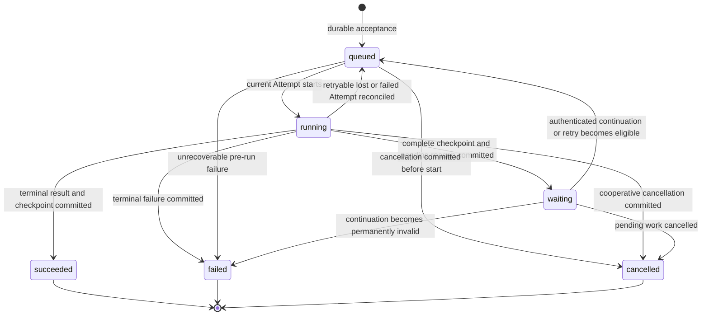
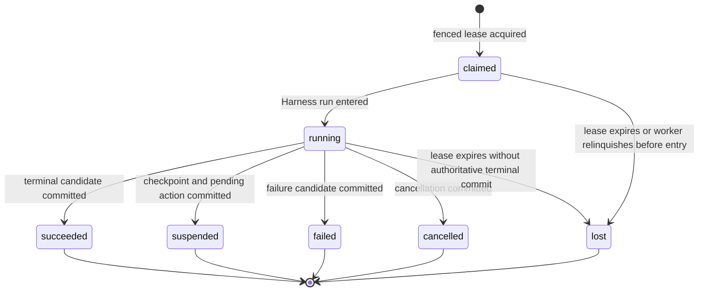

# Executions, Attempts, and Checkpoints

## Design Position

Foundation represents durable Agent work with three distinct levels: a Conversation owns an independently advancing lineage, an Execution is one accepted unit of work against that lineage, and an Attempt is one fenced worker ownership generation for that Execution. A Harness run is process-local and exists inside one Attempt; internal Pydantic model attempts do not create Foundation Attempt records.

This separation lets an Execution survive worker loss, deferred suspension, cancellation races, and selected retry without pretending that one process remained alive. It also keeps `HarnessState` as portable continuation data rather than durable lifecycle authority.

## Core Model

The following Python-like schemas are conceptual:

```python
class Conversation:
    id: ConversationId
    workspace_id: WorkspaceId
    agent_id: AgentId
    agent_instance_ref: AgentInstanceRef
    version: int
    selected_checkpoint_id: CheckpointId | None
    advancing_execution_id: ExecutionId | None


class Execution:
    id: ExecutionId
    workspace_id: WorkspaceId
    conversation_id: ConversationId
    agent_revision_ref: AgentRevisionRef
    actor_ref: PrincipalRef
    agent_identity_ref: AgentIdentityRef
    policy_version_ref: PolicyVersionRef
    status: ExecutionStatus
    wait_reason: WaitReason | None
    source_checkpoint_id: CheckpointId | None
    result_checkpoint_id: CheckpointId | None
    parent_execution_id: ExecutionId | None
    created_at: datetime
    cancel_requested_at: datetime | None


class Attempt:
    id: AttemptId
    execution_id: ExecutionId
    generation: int
    status: AttemptStatus
    worker_id: WorkerId
    lease_expires_at: datetime
    started_at: datetime | None
    finished_at: datetime | None


class Checkpoint:
    id: CheckpointId
    execution_id: ExecutionId
    attempt_id: AttemptId
    agent_revision_ref: AgentRevisionRef
    harness_state: HarnessStateEnvelope
    provider_continuation: ProviderContinuationEnvelope | None
    created_at: datetime
```

A Conversation selects at most one complete checkpoint and serializes foreground advancement of its lineage. A one-shot or webhook invocation still receives a Conversation identity, which may remain hidden from the caller. An asynchronous child receives its own Conversation and stable Agent instance so its history advances independently from its parent.

An Execution records the exact Agent revision, authenticated actor, Agent identity, policy version, delegation lineage, and `source_checkpoint_id` selected at acceptance. A fenced suspension or terminal commit can set its `result_checkpoint_id`; it never rewrites the source. The Execution does not derive these facts later from current defaults. An Attempt adds only worker ownership and process-run correlation; it does not change the semantic task or selected Agent revision.

## Execution State Machine



`waiting` carries one explicit reason such as `approval`, `client_tool`, `user_input`, `child_execution`, `retry_backoff`, `environment`, or `reconciliation_required`. The reason is data associated with a durable pending or reconciliation record, not another hidden task queue.

Terminal Execution states are immutable. A caller who repeats a failed or cancelled intent creates another Execution with its own idempotency identity. An explicitly supported retry command creates a successor Execution linked to the terminal source and reuses only the source facts that the owning failure contract declares safe.

## Attempt State Machine



Every Attempt generation is unique and monotonically increasing within its Execution. At most one generation owns a live lease. An expired, superseded, or relinquished generation is stale even if its process continues running. A stale process may finish local cleanup but cannot publish any durable fact.

## Checkpoint Selection

The Harness returns complete `HarnessState` candidates only at its defined public boundaries. Foundation stores a candidate and selects it in a transaction that verifies the current Execution, Attempt generation, Agent revision, Conversation version, and pending or terminal transition.

Checkpoint creation alone does not advance a Conversation. Selection atomically sets the Execution result checkpoint and advances the Conversation-selected checkpoint, or leaves both prior values unchanged. Partial model messages, emitted stream events, provider history, rendered AG-UI data, tool output fragments, and process memory never become a recovery checkpoint.

A suspended Harness result selects the complete checkpoint associated with its exact pending requests and commits the pending record in the same logical transition. A terminal result can select its complete final checkpoint even though event publication, external delivery, and usage settlement remain outstanding.

## Acceptance and Idempotency

Creating an Execution authenticates and authorizes the caller, validates the Conversation version, resolves exact revisions and policy, checks input bounds, and applies the caller's `Idempotency-Key`. Durable acceptance commits the queued Execution, source checkpoint selection, initial lifecycle event, and outbox entry as one unit.

The same principal, resource scope, idempotency key, and canonical request return the original Execution. Reuse with different content conflicts. A lost HTTP response after possible acceptance has unknown outcome until the caller repeats the same key or reads an authoritative receipt; changing the key creates possible duplicate intent.

## Cancellation

Cancellation is durable intent followed by cooperative enforcement. The control plane records `cancel_requested_at` after current authorization and wakes the owning worker or reconciler. A worker checks cancellation before expensive boundaries, propagates cancellation through Harness and provider contracts, performs bounded cleanup, and attempts a fenced terminal commit.

Cancellation cannot claim rollback of model, tool, child, Environment, or external client effects. If the worker disappears after a possible side effect, reconciliation preserves the unknown outcome. Cancelling a parent applies the explicit child policy from [Deferred Actions and Asynchronous Children](05-deferred-actions-and-children.md); it does not infer that independent children stopped.

## Failure and Unknown Outcome

| Failure point                                   | Durable outcome                                                                      |
| ----------------------------------------------- | ------------------------------------------------------------------------------------ |
| Before Execution acceptance                     | No Execution exists unless idempotency evidence says otherwise                       |
| After acceptance but before response            | Caller reconciles with the same idempotency key or Execution identity                |
| Before Attempt claim                            | Execution remains queued                                                             |
| Worker loss before Harness side effects         | Attempt becomes lost and the Execution can be retried from the selected checkpoint   |
| Worker loss after possible external side effect | Execution waits for reconciliation unless provider evidence makes replay safe        |
| Checkpoint commit conflict                      | Prior selected checkpoint remains authoritative; stale candidate is rejected         |
| Terminal commit conflict                        | Current durable state wins; local completion is discarded as non-authoritative       |
| Cancellation races with completion              | Exactly one fenced transition commits; the other observation remains diagnostic only |

## Invariants

1. A Conversation owns one independently advancing message lineage and selects at most one complete checkpoint.
2. An Execution is one durable semantic task; an Attempt is one worker ownership generation.
3. One Attempt starts at most one logical Harness run.
4. Internal Harness model recovery never creates a Foundation Attempt.
5. Execution acceptance pins exact Agent, policy, actor, identity, and source-checkpoint facts.
6. Only a fenced transaction can select a checkpoint or terminal outcome.
7. Partial history, stream replay, and display data never replace a complete `HarnessState` checkpoint.
8. Cancellation records intent and never implies rollback of external effects.
9. Unknown side effects remain explicit until authoritative evidence reconciles them.
