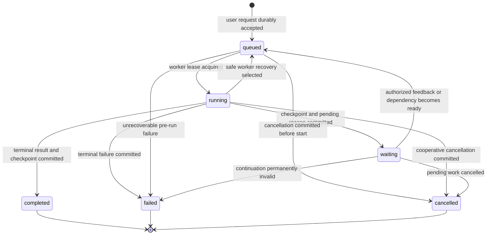

# Threads, Turns, Items, and Checkpoints

## Design Position

Foundation exposes one durable interaction model: a `Thread` is a continuing multi-turn Agent conversation, a `Turn` is one user request and all Agent work caused by that request, and an `Item` is one ordered semantic unit within the Turn. Messages, tool calls, commands, file changes, approvals, child-Agent activity, artifacts, and terminal output are represented as typed Items.

Worker ownership, leases, process runs, and checkpoints are internal Foundation mechanisms. They do not add another public resource between Turn and Item. A Turn can survive worker loss, deferred suspension, and selected recovery without changing its identity or pretending that one process remained alive.

## Public Core Model

The following Python-like schemas are conceptual:

```python
class Thread:
    id: ThreadId
    workspace_id: WorkspaceId
    agent_id: AgentId
    agent_instance_ref: AgentInstanceRef
    version: int
    selected_checkpoint_id: CheckpointId | None
    advancing_turn_id: TurnId | None
    created_at: datetime
    updated_at: datetime


class Turn:
    id: TurnId
    thread_id: ThreadId
    agent_revision_ref: AgentRevisionRef
    actor_ref: PrincipalRef
    agent_identity_ref: AgentIdentityRef
    policy_version_ref: PolicyVersionRef
    status: TurnStatus
    wait_reason: WaitReason | None
    source_checkpoint_id: CheckpointId | None
    result_checkpoint_id: CheckpointId | None
    retry_of_turn_id: TurnId | None
    parent_turn_id: TurnId | None
    created_at: datetime
    cancel_requested_at: datetime | None
    finished_at: datetime | None


class Item:
    id: ItemId
    thread_id: ThreadId
    turn_id: TurnId
    sequence: int
    kind: ItemKind
    status: ItemStatus
    payload: BoundedItemPayload
    created_at: datetime
    completed_at: datetime | None
```

A Thread owns one independently advancing Agent lineage. It selects the latest complete Harness checkpoint, orders its Turns, and retains Host-owned references to the selected Agent configuration and Environment workspace. A logical working-directory value can be part of selected Host state, but the Thread does not contain or replace the actual filesystem; provider resources and Artifacts retain their own authority.

One user request creates one Turn. The first Item records the accepted user input, and all resulting Agent work remains in that Turn until it completes, fails, or is cancelled. Approval responses, external client-tool feedback, and steering received while the Turn is active add Items to the same Turn. A new independent user request after the prior work reaches its accepted boundary creates another Turn.

One-shot, webhook, or scheduled invocation still receives a Thread identity, which the surface may hide. A Host-managed asynchronous child receives its own Thread and initial Turn so its history, scheduling, cancellation, and recovery advance independently from the parent.

## Item Semantics

Foundation defines a versioned, extensible Item-kind catalog. Its core semantic families include:

- `user_message` and `agent_message`;
- `tool_call` and `tool_result`;
- `command` and `file_change`;
- `approval_request` and `approval_response`;
- `child_agent` and `artifact`;
- bounded safe failure and terminal-result projections.

An Item is a durable semantic record, not every low-level runtime signal. Token deltas, provider-native frames, progress heartbeats, raw logs, private model reasoning, credentials, and arbitrary tool payloads do not automatically become Items. A running Item can advance through its owning typed lifecycle; after terminal commitment, its semantic identity and completed meaning are immutable.

Item `sequence` is monotonically increasing within one Turn. Foundation assigns it when the Item first becomes durable. A transient stream observation can refer to a provisional Item identity, but clients distinguish that observation from the later committed Item. Retrying publication reuses the durable Item identity and never creates another semantic action merely because delivery was duplicated.

[Events, Usage, and Delivery](07-events-usage-and-delivery.md) owns the distinction among Harness observations, durable Items, lifecycle events, and presentation envelopes. Items never replace `HarnessState` as continuation authority.

## Turn Lifecycle



`waiting` carries one explicit reason such as `approval`, `client_tool`, `user_input`, `child_turn`, `retry_backoff`, `environment`, or `reconciliation_required`. The reason points to a durable pending or reconciliation record; it is not another hidden task queue.

A worker restart, lease loss, approval suspension, or authorized continuation does not create another Turn. A recoverable transition returns the same Turn to `queued` and later starts a fresh Harness run from its selected checkpoint. Terminal Turn states are immutable. Repeating or explicitly retrying terminal user intent creates a successor Turn linked by `retry_of_turn_id` rather than rewriting the original outcome.

## Internal Worker Lease Generation

Foundation serializes worker ownership with an internal lease record conceptually containing:

```python
class WorkerLease:
    turn_id: TurnId
    generation: int
    worker_id: WorkerId
    harness_run_id: HarnessRunId | None
    lease_expires_at: datetime
```

Every successful claim increments `generation`. At most one generation owns a live lease for a Turn. Before publishing an Item, checkpoint, pending action, usage fact, or terminal outcome, the worker compares its generation with the current durable generation. An expired, superseded, or relinquished worker is stale and cannot publish authoritative state even if its process later resumes.

One lease generation starts at most one logical Harness run. A new generation after process loss or deferred continuation creates a fresh Harness run and fresh runtime bindings. Internal Pydantic model attempts inside that Harness run do not increment the worker lease generation.

The lease generation is an implementation-facing fencing contract. It is not a public Foundation resource, does not appear in the Thread/Turn/Item hierarchy, and grants no product authority by possession.

## Checkpoint Selection

The internal checkpoint is conceptually:

```python
class Checkpoint:
    id: CheckpointId
    turn_id: TurnId
    lease_generation: int
    agent_revision_ref: AgentRevisionRef
    harness_state: HarnessStateEnvelope
    provider_continuation: ProviderContinuationEnvelope | None
    created_at: datetime
```

The Harness returns complete `HarnessState` candidates only at its defined public boundaries. Foundation stores and selects a candidate in a transaction that verifies the current Turn, worker lease generation, Agent revision, Thread version, and pending or terminal transition.

Checkpoint creation alone does not advance a Thread. Selection atomically sets the Turn result checkpoint and advances the Thread-selected checkpoint, or leaves both prior values unchanged. Items, partial messages, stream replay, provider history, AG-UI data, tool-output fragments, and process memory never become a recovery checkpoint.

A suspended Harness result selects the complete checkpoint associated with its exact pending requests and commits the pending record in the same logical transition. A terminal result can select its complete final checkpoint even though Item publication, external delivery, and usage settlement remain independently outstanding.

## Acceptance and Idempotency

Creating a Turn authenticates and authorizes the caller, validates the Thread version, resolves exact revisions and policy, checks input bounds, and applies the caller's `Idempotency-Key`. Durable acceptance commits the queued Turn, initial user Item, source-checkpoint selection, lifecycle event, and outbox entry as one unit.

The same principal, resource scope, idempotency key, and canonical request return the original Turn. Reuse with different content conflicts. A lost HTTP response after possible acceptance has unknown outcome until the caller repeats the same key or reads an authoritative receipt; changing the key creates possible duplicate intent.

A Thread serializes foreground advancement. A second independent user request conflicts or waits under the owning API while `advancing_turn_id` names a non-terminal Turn. Steering, approval, and other typed feedback target that active Turn instead of creating a competing Turn.

## Cancellation

Cancellation is durable intent followed by cooperative enforcement. The control plane records `cancel_requested_at` after current authorization and wakes the owning worker or reconciler. A worker checks cancellation before expensive boundaries, propagates cancellation through Harness and provider contracts, performs bounded cleanup, and attempts a generation-fenced terminal commit.

Cancellation cannot claim rollback of model, tool, child, Environment, or external client effects. If the worker disappears after a possible side effect, reconciliation preserves the unknown outcome. Cancelling a parent applies the explicit child policy from [Deferred Actions and Asynchronous Children](05-deferred-actions-and-children.md); it does not infer that independent children stopped.

## Failure and Unknown Outcome

| Failure point                                | Durable outcome                                                                     |
| -------------------------------------------- | ----------------------------------------------------------------------------------- |
| Before Turn acceptance                       | No Turn exists unless idempotency evidence says otherwise                           |
| After acceptance but before response         | Caller reconciles with the same idempotency key or Turn identity                    |
| Before worker claim                          | Turn remains queued                                                                 |
| Worker loss before Harness side effects      | Lease expires and the same Turn can resume from the selected checkpoint             |
| Worker loss after a possible external effect | Turn waits for reconciliation unless provider evidence makes replay safe            |
| Stale worker publishes after replacement     | Generation check rejects every authoritative mutation                               |
| Checkpoint commit conflicts                  | Prior selected checkpoint remains authoritative; stale candidate is rejected        |
| Terminal commit conflicts                    | Current durable state wins; local completion is discarded as non-authoritative      |
| Cancellation races with completion           | Exactly one generation-fenced transition commits; the other remains diagnostic only |

## Invariants

01. The public durable interaction model is Thread, Turn, and Item; worker leases and checkpoints are internal mechanisms.
02. A Thread owns one independently advancing Agent lineage and selects at most one complete checkpoint.
03. A Turn contains one user request and all Agent work caused by that request.
04. Items are ordered semantic records and never substitute for `HarnessState` continuation.
05. One worker lease generation starts at most one logical Harness run.
06. A stale lease generation cannot publish an Item, checkpoint, usage fact, pending action, or outcome.
07. Turn acceptance pins exact Agent, policy, actor, identity, and source-checkpoint facts.
08. Only a generation-fenced transaction can select a checkpoint or terminal outcome.
09. Cancellation records intent and never implies rollback of external effects.
10. Unknown side effects remain explicit until authoritative evidence reconciles them.
