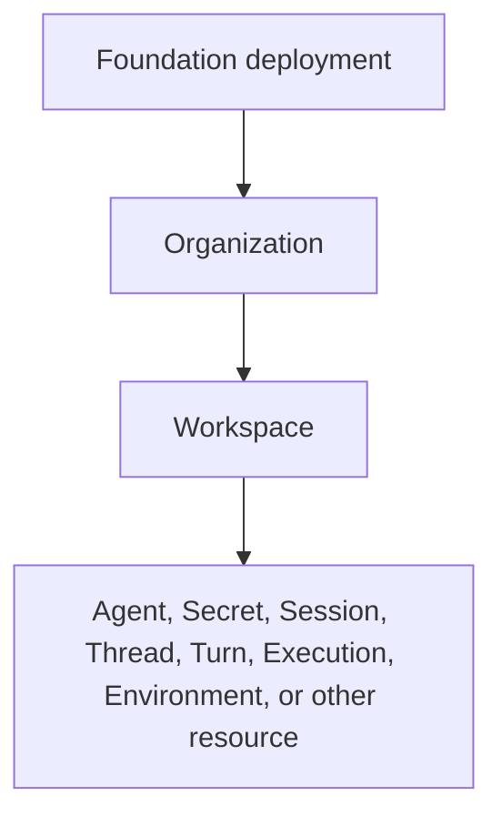

# Identity and Access Management

## Design Position

Foundation Service owns one Identity and Access Management (IAM) contract for Organization and Workspace tenancy, human and service identities, authentication credentials, built-in roles, RoleBindings, and security audit. The OSS distribution presents one Organization while retaining real Organization identifiers and tenant constraints in the common data model. Deployment topology, process role, license, and edition are not IAM resources or authorization shortcuts.

IAM authorizes a caller to inspect, change, invoke, or administer Foundation resources. Harness run authority separately constrains what an executing Agent may do through tools, Secrets, and Environments. Allowing a User or Service Account to invoke an Agent does not grant the resulting model arbitrary side effects.

## Boundaries

| Concern                                                         | Owner                                        | Relationship                                                                     |
| --------------------------------------------------------------- | -------------------------------------------- | -------------------------------------------------------------------------------- |
| Organization, Workspace, User, and Service Account identity     | This document                                | Defines durable identity, ownership, and lifecycle                               |
| Password, browser session, invitation, reset token, and API key | This document                                | Defines authentication and credential lifecycle                                  |
| RoleBinding, built-in roles, and product authorization          | This document                                | Defines the only durable product grant model                                     |
| Managed Secret value protection                                 | [Secret Management](01-secret-management.md) | Uses IAM scope and authorization without treating a Secret as a login credential |
| Agent revision and execution identity                           | Their owning Foundation documents            | Remain authorization targets and audit subjects, not IAM Principals              |
| Model-triggered tool and Environment authority                  | Harness run grants and providers             | Narrows an authorized invocation independently from product RBAC                 |
| OSS, EE, and Cloud capability composition                       | Distribution boundary                        | Adds capabilities without adding edition fields or bypassing common IAM checks   |

The canonical resource hierarchy is:



An Organization is the customer and tenant boundary. A Workspace is the collaboration, role-assignment, resource-isolation, and default usage-attribution boundary. Project is not a product concept. Deployment is an operational topology and trust boundary, not a customer resource, Principal, membership, or RoleBinding scope.

## Distribution Capability Boundary

The common relational model permits several Organizations so EE and Cloud can use the same durable contracts. The OSS application presents exactly one Organization:

- startup creates the Organization when none exists;
- Organization creation, deletion, transfer, switching, and joining are absent from the OSS API and UI;
- startup fails explicitly if the OSS database contains more than one Organization;
- every Organization creation atomically creates one mutable Workspace named `default`;
- an Organization Admin may create and delete additional Workspaces.

OSS supplies local email-and-password authentication, invitations, browser sessions, Workspace-bound User and Service Account API keys, built-in roles, and direct User or Service Account RoleBindings. It does not supply SSO, OIDC, external identity records, Groups, custom roles, Organization-bound API keys, product quotas, billing, or platform-operator elevation.

EE and Cloud add capabilities in separate modules while preserving the identifiers, tenant fields, Principal meaning, credential boundary, and authorizer contract defined here. Core rows contain no `edition`, `plan`, `license`, or deployment-placement field.

## Tenant and Identity Model

Every Foundation-owned ID follows [Platform Data Conventions](../data-conventions.md). IDs are globally unique, immutable, and encode no tenant, parent, authorization, region, or deployment information. Names are mutable labels and never replace IDs in a durable reference or policy decision.

Every tenant-owned row stores `organization_id`. Every ordinary Workspace-owned row also stores `workspace_id`, and a database constraint or composite foreign key proves that the Workspace belongs to the same Organization. The API-key table is the deliberate exception: it stores `organization_id`, `boundary_type`, and `boundary_id` so a later boundary kind does not require a schema rewrite. The service derives tenant fields from the selected parent and stored resource; it ignores or rejects client-supplied duplicates. Tenant ownership is immutable for an existing resource.

The Workspace table exposes a unique `(id, organization_id)` key for composite references. Tenant-scoped repository operations receive an explicit Organization and optional Workspace scope and include those predicates in the authoritative query. A later authorization check does not justify an unscoped tenant read.

Foundation recognizes exactly these OSS Principal kinds:

- `user` is one platform-wide human identity;
- `service_account` is one non-human identity owned by a Workspace.

A Principal receives authority only through current RoleBindings. A credential authenticates one Principal and can narrow its usable boundary; it never owns a role or expands that Principal's authority. Agent, Agent revision, Session, Execution, credential, and Secret identities are not Principals. Product authorization targets the stable Agent ID, while an accepted invocation selects the exact immutable Agent revision separately.

The conceptual references are:

```python
PrincipalType = Literal["user", "service_account"]


class PrincipalRef:
    principal_type: PrincipalType
    principal_id: str


class ResourceRef:
    resource_type: str
    resource_id: str
    organization_id: str
    workspace_id: str | None
```

These schemas are conceptual domain values, not wire or ORM models.

## Core Relational Contract

The tables below define durable meaning and constraints. Physical column types, index names, ORM classes, and migration mechanics remain implementation details. All timestamps are UTC instants. Mutable resources use a positive `version` for stale-write protection where exposed through the management API.

### `organizations`

| Column       | Durable meaning and constraint                      |
| ------------ | --------------------------------------------------- |
| `id`         | Primary key; immutable Organization ID              |
| `name`       | Mutable non-blank display name; not platform-unique |
| `version`    | Positive mutable-resource version                   |
| `created_at` | Immutable creation time                             |
| `updated_at` | Latest accepted metadata mutation time              |

The OSS capability never deletes an Organization. The schema does not encode the OSS singleton as a fixed identifier or a global constant.

### `workspaces`

| Column            | Durable meaning and constraint                    |
| ----------------- | ------------------------------------------------- |
| `id`              | Primary key; immutable Workspace ID               |
| `organization_id` | Immutable foreign key to `organizations.id`       |
| `name`            | Mutable non-blank display name                    |
| `normalized_name` | Service-derived case-insensitive uniqueness value |
| `version`         | Positive mutable-resource version                 |
| `created_at`      | Immutable creation time                           |
| `updated_at`      | Latest accepted metadata mutation time            |
| `deleted_at`      | Terminal logical-deletion time; null while active |

Active Workspaces are unique by `(organization_id, normalized_name)`. Logical deletion immediately denies new access and work, revokes bounded credentials, removes live descendant RoleBindings, revokes Service Account and Personal API Keys in the boundary, and starts separately managed physical cleanup. IDs are never reused. Deleted names may be reused by a new Workspace with a new ID.

### `users`

| Column              | Durable meaning and constraint                                         |
| ------------------- | ---------------------------------------------------------------------- |
| `id`                | Primary key; immutable platform User ID                                |
| `email`             | Current verified or claimed display form of the required email address |
| `normalized_email`  | Service-derived globally unique email lookup value                     |
| `name`              | Mutable display name; defaults to the email local part                 |
| `status`            | `active` or `disabled`                                                 |
| `email_verified_at` | Time control of the current email was verified; null when unverified   |
| `version`           | Positive mutable-resource version                                      |
| `created_at`        | Immutable creation time                                                |
| `updated_at`        | Latest accepted profile or status mutation time                        |

`id`, not email, is the identity used by RoleBindings, credentials, audit, and ownership. Changing email requires proof of control of the new address and atomically reserves its normalized uniqueness. An unverified email cannot drive password reset or automatic linking by an external identity extension.

An Organization Admin manages Organization RoleBindings, not the platform User record. It cannot change another User's profile, password, email, or status. A User may disable itself; deployment break-glass administration may disable or re-enable a User. Disabling revokes active browser sessions and causes all User API key authentication to fail while preserving unrevoked key records and RoleBindings. Re-enabling does not restore revoked sessions but makes otherwise valid, unrevoked keys usable again. OSS exposes no platform User deletion.

### `password_credentials`

| Column                | Durable meaning and constraint                                         |
| --------------------- | ---------------------------------------------------------------------- |
| `user_id`             | Primary key and foreign key to `users.id`; one local password per User |
| `password_hash`       | Encoded Argon2id verifier; never plaintext or reversible material      |
| `password_changed_at` | Time the current verifier became authoritative                         |
| `created_at`          | Initial password creation time                                         |

A User supplied only by an external identity extension can omit this row. OSS Users obtain it when accepting their initial invitation. Foundation does not use a generic credential supertable for passwords, API keys, and browser sessions.

Passwords contain 15 through 128 printable ASCII non-space characters (`0x21` through `0x7e`). Foundation requires no mandatory uppercase, lowercase, digit, or symbol mixture. It accepts no space, Unicode, tab, newline, or control character. OSS applies no password blocklist, login rate limit, account lockout, or periodic password expiration. Authentication failures use one generic public error and emit bounded audit evidence.

Changing a password with the current password preserves the current browser session and revokes the User's other sessions. Completing a forgot-password reset revokes all browser sessions. Neither operation revokes Personal API Keys.

### `auth_sessions`

| Column       | Durable meaning and constraint                                          |
| ------------ | ----------------------------------------------------------------------- |
| `id`         | Primary key; immutable browser-session ID                               |
| `user_id`    | Foreign key to the authenticated User                                   |
| `token_hash` | Unique non-reversible verifier for the opaque cookie token              |
| `created_at` | Authentication time                                                     |
| `expires_at` | Fixed deployment-configurable expiry; default seven days after creation |
| `revoked_at` | Explicit revocation time; null while unrevoked                          |

The plaintext token appears only in an `HttpOnly`, `Secure` cookie. Sessions do not use a long-lived self-contained JWT, sliding renewal, a remember-me mode, or a durable current-Workspace field. Browser closure does not itself revoke a session. Every request rechecks User status, session validity, selected resource scope, and current RoleBindings.

### `invitations` and `invitation_grants`

| `invitations` column  | Durable meaning and constraint                                           |
| --------------------- | ------------------------------------------------------------------------ |
| `id`                  | Primary key; immutable invitation ID                                     |
| `organization_id`     | Organization the recipient is invited to join                            |
| `email`               | Recipient display email                                                  |
| `normalized_email`    | Recipient lookup and conflict value                                      |
| `token_hash`          | Verifier for the current single-use invitation token                     |
| `verification_mode`   | `email` when acceptance verifies email control; `out_of_band` otherwise  |
| `expires_at`          | Deployment-configurable expiry; default seven days after issue or resend |
| `accepted_at`         | Successful acceptance time; null before acceptance                       |
| `accepted_by_user_id` | Existing or newly created User; null before acceptance                   |
| `revoked_at`          | Revocation time; null while unrevoked                                    |
| `created_by_user_id`  | Inviting User; null only for deployment bootstrap                        |
| `created_at`          | Initial creation time                                                    |
| `updated_at`          | Latest token rotation or terminal transition time                        |

| `invitation_grants` column | Durable meaning and constraint                                         |
| -------------------------- | ---------------------------------------------------------------------- |
| `invitation_id`            | Foreign key to the owning invitation                                   |
| `organization_id`          | Same Organization as the invitation                                    |
| `workspace_id`             | Target Workspace for a Workspace grant; null for an Organization grant |
| `resource_type`            | `organization` or `workspace`                                          |
| `resource_id`              | Exact target resource ID                                               |
| `role_key`                 | Valid built-in role for the target resource                            |

One grant exists per `(invitation_id, resource_type, resource_id)`. The stored tenant fields must match both the Invitation and target resource.

An invitation is pending exactly when it is unaccepted, unrevoked, and unexpired. Resend keeps the invitation ID, rotates `token_hash`, and invalidates the old link. Pending invitations create neither a User nor a RoleBinding.

Acceptance locks the invitation and atomically creates or links the User, creates `password_credentials` when local setup is required, creates the Organization Member or Admin RoleBinding, creates the authorized Workspace RoleBindings, and sets `accepted_at`. A Workspace Admin can invite only to its own Workspace; acceptance also creates an Organization Member binding when needed. An Organization Admin can invite to the Organization and several Workspaces. Adding an existing Organization member to a Workspace creates the RoleBinding directly and may send a notification without creating an Invitation.

### `password_reset_tokens` and `email_change_tokens`

| Column        | Durable meaning and constraint                    |
| ------------- | ------------------------------------------------- |
| `id`          | Primary key; immutable single-use token record ID |
| `user_id`     | Target User                                       |
| `token_hash`  | Unique non-reversible token verifier              |
| `expires_at`  | Bounded expiry time                               |
| `consumed_at` | Successful use time; null before use              |
| `created_at`  | Issue time                                        |

An `email_change_tokens` row additionally stores `new_email` and `new_normalized_email` and reserves their uniqueness at completion. SMTP delivery is required for self-service password reset and email change. Without SMTP, deployment break-glass administration can issue a one-time password-reset link; an Organization or Workspace Admin cannot set or reset another User's password.

### `service_accounts`

| Column            | Durable meaning and constraint                    |
| ----------------- | ------------------------------------------------- |
| `id`              | Primary key; immutable Service Account ID         |
| `organization_id` | Immutable owning Organization                     |
| `workspace_id`    | Immutable owning Workspace                        |
| `name`            | Mutable non-blank display name                    |
| `normalized_name` | Service-derived case-insensitive uniqueness value |
| `description`     | Optional bounded description                      |
| `status`          | `active` or `disabled`                            |
| `version`         | Positive mutable-resource version                 |
| `created_at`      | Immutable creation time                           |
| `updated_at`      | Latest accepted mutation time                     |
| `deleted_at`      | Terminal logical-deletion time; null while active |

Active Service Accounts are unique by `(workspace_id, normalized_name)`. A Service Account has no email, password, username, or Organization RoleBinding. It receives exactly one direct Workspace role of Viewer, Runner, or Builder. Workspace Admin and inherited Organization Admin authority create, update, disable, re-enable, delete, and manage its API keys. Builder cannot manage Service Accounts. Disablement temporarily blocks all keys; re-enablement restores otherwise valid keys. Deletion is terminal, revokes all keys, and retains the tombstone and audit history. A deleted name may be reused under a new ID.

### `role_bindings`

| Column               | Durable meaning and constraint                          |
| -------------------- | ------------------------------------------------------- |
| `id`                 | Primary key; immutable RoleBinding ID                   |
| `organization_id`    | Tenant owning both Principal relationship and resource  |
| `workspace_id`       | Target Workspace; null only for an Organization binding |
| `principal_type`     | `user` or `service_account`                             |
| `principal_id`       | Exact User or Service Account ID                        |
| `resource_type`      | `organization`, `workspace`, or `agent`                 |
| `resource_id`        | Exact authorization target ID                           |
| `role_key`           | Valid built-in role for this target and Principal kind  |
| `created_by_user_id` | User whose authority created the binding                |
| `created_at`         | Immutable creation time                                 |
| `updated_at`         | Latest role replacement time                            |

One direct binding exists per `(principal_type, principal_id, resource_type, resource_id)`. A role change updates `role_key`; removal deletes the row. RoleBinding has no status. There is no OrganizationMembership or WorkspaceMembership table; member views are authorized projections of current RoleBindings. Durable security audit retains history independently from the live grant.

The relational model uses polymorphic Principal and resource references without a universal Principal or Resource registry table. The service validates existence, kind, tenant, lifecycle, and allowed role before insert. Resource deletion removes descendant bindings. A missing or mismatched reference never grants authority.

The service enforces these tenant constraints:

- Organization bindings target a User, have `workspace_id = null`, and use `admin` or `member`;
- Workspace bindings target a User or same-Workspace Service Account and carry that Workspace ID;
- Agent bindings carry the owning Agent's Workspace ID;
- a User must have an Organization binding before receiving a descendant Workspace or Agent binding;
- a Service Account can bind only within its owning Workspace and can never use an Admin role;
- inherited Organization Admin authority creates no redundant Workspace rows.

### `api_keys`

| Column            | Durable meaning and constraint                                          |
| ----------------- | ----------------------------------------------------------------------- |
| `id`              | Stable public key identifier retained across rotation                   |
| `principal_type`  | `user` or `service_account`                                             |
| `principal_id`    | Owning Principal                                                        |
| `organization_id` | Tenant containing the credential boundary                               |
| `boundary_type`   | `workspace` in OSS; extension enum owned by IAM                         |
| `boundary_id`     | Exact Workspace ID for an OSS key                                       |
| `name`            | Mutable non-blank display label                                         |
| `secret_hash`     | Non-reversible verifier for the current high-entropy secret             |
| `expires_at`      | Optional expiry; OSS creation defaults to 90 days and permits no expiry |
| `rotated_at`      | Latest successful rotation time; null before first rotation             |
| `revoked_at`      | Permanent revocation time; null while unrevoked                         |
| `created_at`      | Immutable creation time                                                 |
| `updated_at`      | Latest name, rotation, or revocation mutation time                      |

Credential boundary is represented by `boundary_type + boundary_id`; the row does not duplicate a `workspace_id`. For a Workspace key, Foundation validates that `boundary_id` belongs to `organization_id`. OSS accepts only `workspace`.

A Personal API Key belongs to a User. Only that User can create or rotate it. A Workspace Admin can inspect safe metadata and revoke it but cannot create it for the User or observe its secret. A Service Account API Key is created, rotated, and revoked only by Workspace Admin or inherited Organization Admin authority. Several active keys per Principal and boundary are allowed for zero-downtime caller migration.

Creation returns a bearer value once. Its shape contains a stable public key ID and an independent high-entropy secret, for example `afk_key-7m4q9x2c.<high-entropy-secret>`. Storage retains only the public ID and secret verifier. Authentication accepts it only as `Authorization: Bearer <value>`; query, cookie, body, and alternate API-key headers are rejected.

Rotation atomically replaces `secret_hash`, retains the same key ID, name, owner, and boundary, sets `rotated_at`, and immediately invalidates the old secret. It does not create a grace period or another key ID. A caller needing overlap creates a second key and later revokes the first. Revoked or expired keys remain tombstones and are never hard-deleted through the API.

API key state is derived rather than stored: an unrevoked key before its optional expiry is `active`; a past expiry is `expired`; and any `revoked_at` is `revoked`. Revocation is terminal even when expiry would also apply.

Removing a User's access to a key boundary permanently revokes that boundary's Personal API Keys. Removing a Service Account's Workspace binding or deleting the Service Account revokes all of its keys. Role changes do not rotate or revoke a key; the next request observes the new effective permissions.

### `security_audit_events`

| Column            | Durable meaning and constraint                                                     |
| ----------------- | ---------------------------------------------------------------------------------- |
| `id`              | Primary key; immutable event ID                                                    |
| `organization_id` | Tenant for Organization or Workspace activity; null for platform identity activity |
| `workspace_id`    | Workspace for Workspace activity; otherwise null                                   |
| `actor_type`      | `anonymous`, `user`, `service_account`, or `system`                                |
| `actor_id`        | Actor identity when known; otherwise null                                          |
| `action`          | Stable namespaced security action                                                  |
| `resource_type`   | Affected resource kind when known                                                  |
| `resource_id`     | Affected resource ID when known                                                    |
| `auth_method`     | `password`, `session`, `api_key`, `bootstrap`, or `system`                         |
| `credential_id`   | Safe credential ID when applicable; never secret material                          |
| `outcome`         | `success` or `failure`                                                             |
| `occurred_at`     | Immutable event time                                                               |
| `request_id`      | Safe request correlation ID when applicable                                        |

Security audit events are append-only and distinct from Execution lifecycle events, application logs, traces, and UsageRecords. Login, password, email, User status, invitation, RoleBinding, API key, Service Account, Workspace, and Secret security mutations emit events. Events contain no secret material or credential verifier.

A successful security-sensitive mutation commits its audit event in the same short transaction as the authoritative state change. Authentication failures and denied attempts emit through a separate bounded path because no resource mutation transaction exists; audit unavailability never converts a denial into an allow.

Audit actor, credential, and resource IDs are retained evidence rather than cascading ownership references.

Organization Admin can read its Organization's events. Workspace Admin can read events scoped to its Workspace. Builder, Runner, Viewer, and Service Account cannot read security audit. A User can read its own login, session, and Personal API Key activity.

## Bootstrap and Invitation Flow

The first OSS startup uses deployment configuration containing only the initial Admin email. It creates the singleton Organization, its `default` Workspace, and one bootstrap Invitation granting Organization Admin. It generates a single-use initialization link. SMTP delivery sends the link to the configured email and marks successful acceptance as email verification; without SMTP, the service emits the link once through the protected startup-log boundary and acceptance does not verify the email.

The initialization endpoint requires the complete token, sets the initial name and password, creates the User and grants atomically, and permanently closes the bootstrap surface. There is no unauthenticated first-visitor claim. Until bootstrap succeeds, ordinary authenticated product routes are unavailable.

The acceptance transaction follows this conceptual application flow:

```python
async def accept_invitation(token: str, profile: NewUserProfile) -> UserRef:
    token_digest = hash_one_time_token(token)
    async with short_transaction() as tx:
        invitation = await tx.lock_valid_invitation(token_digest)
        user = await tx.find_user_by_normalized_email(invitation.normalized_email)
        if user is None:
            user = await tx.create_user(profile, invitation.email)
            await tx.create_password_credential(user.id, profile.password)
        await tx.apply_invitation_grants(invitation, user)
        await tx.mark_invitation_accepted(invitation, user.id)
        await tx.append_security_audit_event("invitation.accept", user.id)
    return UserRef(user.id)
```

The transaction revalidates every grant and the last-Admin invariant. It performs no external I/O while open.

## Built-in Roles and Permissions

Roles are immutable keys mapped centrally to stable resource actions. Each owning resource contract defines its actions; authorization code checks those actions, never numeric role ordering or scattered role-name conditionals. OSS has no persisted permission catalog, custom RoleDefinition table, or custom-role API.

Self-service actions such as editing one's own profile, managing one's own browser sessions and Personal API Keys, or accepting an invitation require exact subject equality and the relevant credential; they are not grants over another User through a Workspace role.

### Organization roles

| Role key | Permissions                                                                                                                                                                                                                |
| -------- | -------------------------------------------------------------------------------------------------------------------------------------------------------------------------------------------------------------------------- |
| `member` | Read safe Organization metadata and own Organization binding; list only Workspaces the User can access                                                                                                                     |
| `admin`  | Member permissions; update Organization settings; manage Organization User RoleBindings and invitations; create and delete Workspaces; inherit Workspace Admin in every active Workspace; read Organization security audit |

An Organization role applies only to a User. The last effective Organization Admin cannot be removed, demoted, disabled by a product operation, or leave. This includes self-disable by the last Admin. Pending invitations and disabled Users do not satisfy this invariant. Deployment break-glass recovery can disable the last Admin only as an explicit operational override and remains responsible for restoring an effective Admin. Organization Member alone grants no Workspace resource access and cannot list the complete Organization user directory.

### Workspace roles

| Role key  | Permissions                                                                                                                                                                                                     |
| --------- | --------------------------------------------------------------------------------------------------------------------------------------------------------------------------------------------------------------- |
| `viewer`  | Read safe Workspace metadata, resources, and histories; read Secret metadata but never Secret values                                                                                                            |
| `runner`  | Viewer permissions; invoke every Agent; cancel and retry every Execution in the Workspace                                                                                                                       |
| `builder` | Runner permissions; create, update, and delete Agents and all Agent-owned configuration; create, replace, delete, and bind Workspace Secrets                                                                    |
| `admin`   | Builder permissions; update Workspace settings; manage Workspace User RoleBindings and invitations; manage Service Accounts and their keys; inspect and revoke Personal API Keys; read Workspace security audit |

The role table does not decide whether Tool, Skill, Connector, Environment, or another Agent input is an independent Workspace resource. Its owning product contract defines that resource. Builder has complete Agent-authoring authority but cannot install executable code, expand deployment capability availability, manage identity, or change RoleBindings.

A Runner can invoke an Agent that uses configured Secrets but cannot inspect a Secret value, change Secret metadata, or change an Agent-to-Secret binding. Secret plaintext is never a role permission.

Direct Agent RoleBindings reuse `viewer`, `runner`, and `builder` as resource-level permission bundles. At Agent scope, Viewer grants Agent and associated Execution reads, Runner adds invocation, cancellation, and retry, and Builder adds Agent update, deletion, and Agent-owned configuration management; it grants no Agent creation, Workspace Secret management, or identity management. The common schema accepts these bindings now so later management surfaces can restrict a Principal to selected Agents without introducing another authorization model.

## Authorization Contract

Applicable grants form a pure allow union. Foundation defines no deny binding, specificity override, or implicit ownership grant. A direct narrow binding never subtracts a broader grant: Workspace Runner plus Agent Viewer can still invoke the Agent, while Workspace Viewer plus Agent Runner can invoke only that Agent.

The conceptual decision contract is:

```python
class AuthorizationInput:
    principal: PrincipalRef
    credential_id: str
    credential_boundary: ResourceRef | None
    action: str
    resource: ResourceRef


class AuthorizationDecision:
    allowed: bool
    reason_code: str
```

Every protected operation calls one authorizer. A request loads current Principal, credential, and applicable RoleBindings from the database once, then reuses that immutable request-local snapshot. A stream continuation or later operation authorizes again. OSS performs no cross-request authorization caching.

The core evaluation is equivalent to:

```python
async def authorize(request: AuthorizationInput) -> AuthorizationDecision:
    async with short_session() as session:
        principal = await session.require_active_principal(request.principal)
        credential = await session.require_valid_credential(request.credential_id)
        resource = await session.require_resource(request.resource)

        require_same_principal(credential, principal)
        require_boundary_contains(credential.boundary, resource)
        require_tenant_consistency(principal, resource)

        bindings = await session.load_applicable_role_bindings(principal, resource)
        permissions = union(role_permissions(binding) for binding in bindings)
        if resource.workspace_id is not None and principal_is_organization_admin(
            bindings, resource.organization_id
        ):
            permissions |= workspace_admin_permissions(resource.workspace_id)

    return decision(request.action in permissions)
```

The code is semantic pseudocode. Implementations centralize these checks but use canonical short-session helpers and never retain a database session across streaming, agent execution, or external I/O.

No credential contains a role snapshot. Identifier possession, an earlier allow, a cursor, an idempotency key, a queue message, or an existing Harness checkpoint never preserves authority for another operation.

## Product Authorization and Run Grants

Product RBAC decides whether a User or Service Account may invoke an Agent. Run grants separately constrain model-triggerable tool, Secret, and Environment operations. Effective run authority intersects the current Agent invocation permission, the immutable Agent revision, and current provider grants; a product role never reveals Secret plaintext or directly grants a model side effect. A resumed or retried Execution obtains fresh authority instead of retaining a role snapshot.

## Lifecycle and Revocation

User and Service Account removal from a resource deletes the live RoleBinding. Removing a User's Organization binding also removes descendant User bindings and revokes its Personal API Keys within that Organization. Removing a Workspace binding revokes Personal API Keys bounded to that Workspace when the User has no remaining effective access through Organization Admin inheritance. Rejoining does not resurrect revoked keys.

A User can leave a Workspace or Organization subject to the last-Admin invariant. A Workspace Admin can remove Workspace User bindings but cannot remove Organization membership. Organization Admin can remove Organization membership and its descendants. A Service Account cannot leave or move to another Workspace.

Authorization changes take effect on the next request or stream continuation. Revocation cannot undo an external effect already dispatched under an earlier allow.

## Failure and Security Semantics

| Condition                                          | Outcome                                                                            |
| -------------------------------------------------- | ---------------------------------------------------------------------------------- |
| Missing, malformed, expired, or revoked credential | Authentication fails before protected resource disclosure or mutation              |
| Disabled User or Service Account                   | Authentication fails; live RoleBindings remain stored                              |
| Authenticated but unauthorized Principal           | Operation is denied; policy may conceal resource existence with `404`              |
| Credential boundary does not contain resource      | Operation is denied before reading or binding the target                           |
| Cross-Organization or cross-Workspace reference    | Operation fails before target data is returned or mutated                          |
| Stale RoleBinding or resource version              | Current authority and version are re-evaluated; stale client intent grants nothing |
| Invitation or reset token is replayed              | Operation fails without changing the prior successful result                       |
| Last effective Organization Admin would be lost    | Mutation fails atomically                                                          |
| Authorization dependency is unavailable            | Protected operation fails closed                                                   |

Passwords, session tokens, invitation and reset tokens, API key secrets, Secret values, authorization headers, and credential verifiers never enter ordinary logs, traces, metrics, events, errors, model payloads, or API responses. Public authentication failures do not distinguish absent email, wrong password, disabled status, or unverified recovery eligibility.

## Compatibility

User, Service Account, Organization, Workspace, and RoleBinding IDs; Principal kind; resource identity; tenant ownership; and credential boundary are durable compatibility facts. Email, name, and display labels are mutable. OSS rejects unknown persisted Principal kinds, boundary kinds, role keys, and resource types rather than guessing their meaning. Extensions may add values and behavior but cannot reinterpret existing rows.
