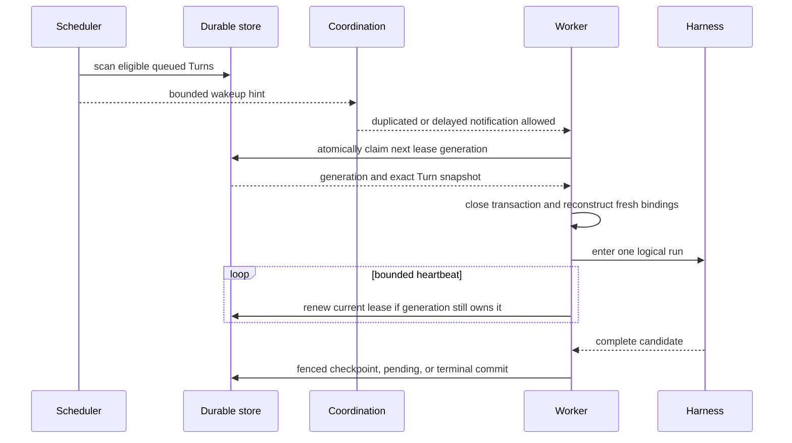

# Scheduling, Workers, and Recovery

## Design Position

Foundation scheduling converts durable eligible Turn state into fenced worker ownership. PostgreSQL remains the authority for eligibility, worker lease generations, and outcomes. Redis, queue messages, and in-process notifications reduce discovery latency but are disposable coordination hints.

Workers are process-role loops, not durable entities or owners of product truth. A deployment scales the execution role by adding processes or replicas that compete through the same claim contract.

## Scheduling Contract

A Turn is eligible when its durable state is `queued`, its admission and backoff constraints allow work, no live worker lease owns it, its exact dependencies remain resolvable, and current policy permits the transition. The scheduler uses bounded deterministic scans and idempotently records or signals eligible work.

A coordination message contains only enough identity to prompt a fresh durable claim. Receiving, acknowledging, duplicating, delaying, reordering, or losing that message cannot create, complete, cancel, or transfer a Turn or worker lease. A worker that receives a message for ineligible or already owned work performs no lifecycle mutation.

Admission control, quotas, and fairness can delay eligibility, but they do not create a second queue authority. The durable Turn retains its accepted identity and next eligible time.

## Claim and Lease

A claim transaction verifies eligibility, increments the Turn's worker lease generation, records worker identity and lease expiration, and moves the Turn to `running`. The worker closes the transaction before reconstruction or external I/O.

Lease renewal proves only that the current worker generation remains live enough to continue. It does not commit model progress, extend external credential lifetimes, or make process memory recoverable. A renewal that cannot confirm current ownership causes the worker to cancel local work and suppress authoritative publication.

## Fencing

Every worker-originated lifecycle write includes the Turn ID and worker lease generation. The durable mutation succeeds only when that generation still owns the current live lease and the expected Turn transition remains legal.

Fencing applies to:

- worker start and heartbeat;
- lifecycle events whose authority depends on the current lease generation;
- Item creation and lifecycle advancement;
- checkpoint creation and selection;
- pending-action acceptance;
- Environment desired/effective publication;
- child creation and result incorporation;
- usage records and terminal outcomes.

A worker may publish non-authoritative telemetry after losing its fence if the telemetry explicitly identifies the stale lease generation. It cannot publish a durable Item or lifecycle event that consumers could mistake for current state.

## Worker Run Boundary

After claim, a worker reads exact immutable inputs in bounded sessions, verifies dependency and adapter locks, materializes fresh model, policy, credential, and Environment bindings, imports the Harness Python package, and calls its public process-local API. One `RunUsage` accumulator and one `HarnessRunStream` belong to that lease generation.

The worker is the sole consumer of the Harness stream. It can project observations while the run is live, but only complete candidate boundaries can enter durable checkpoint or terminal transitions. Database sessions and locks never span model calls, tool calls, provider operations, queue waits, sleeps, event streaming, or Harness cleanup.

## Lease Loss and Reconciliation

A reconciler detects an expired lease under a lock that verifies its generation, records bounded loss evidence, and classifies recovery:

- no external work started: the Turn becomes queued;
- a complete selected checkpoint already exists: recovery starts from that checkpoint;
- provider receipts or idempotency evidence prove a safe result: the reconciler records that evidence and applies the owning transition;
- an external side effect may have occurred without authoritative result: the Turn enters `waiting` with `reconciliation_required`;
- the selected revision or state is permanently incompatible: the Turn fails with a bounded durable reason.

Replacement work claims a new lease generation and creates a fresh Harness run, controller, bindings, credential leases, and provider clients. It never restores a live task, database session, socket, tool dispatcher, or process-local Environment controller from the lost worker.

## Retry Semantics

Retries are admitted only by the owner of the failed boundary:

- provider transport retries remain within the provider or Pydantic contract;
- Harness model semantic recovery remains inside one live Harness run and lease generation;
- recoverable Foundation continuation of a non-terminal Turn claims another lease generation after durable loss, suspension, or retry admission;
- retrying a terminal Turn creates a successor Turn under the lifecycle contract rather than reopening the terminal record;
- external side-effect retries require operation idempotency or provider evidence.

Backoff is durable through an exact next-eligible timestamp. Restarting a scheduler does not reset the delay. Retry budgets count Foundation worker lease generations separately from internal Harness model attempts.

## Shutdown and Drain

A control process stops accepting new product work before shutting down owned ingress and reconcilers. An execution process stops claiming new Turn leases, continues bounded active work during its drain deadline, and either commits an authoritative result or relinquishes ownership so lease recovery can proceed.

Shutdown never extends a lease indefinitely or marks unfinished local work successful. Execution-only processes never migrate the schema. The shared image verifies schema compatibility before starting role-owned loops.

## Failure Semantics

| Failure                                      | Observable result                                                                      |
| -------------------------------------------- | -------------------------------------------------------------------------------------- |
| Coordination unavailable                     | Accepted work remains durable; discovery may be delayed and durable scanning continues |
| Duplicate queue message                      | At most one claim generation succeeds                                                  |
| Worker crashes before claim commit           | No worker lease ownership is created                                                   |
| Worker crashes after claim                   | Lease expires; reconciler classifies recovery                                          |
| Heartbeat delayed beyond lease               | Worker becomes stale even if it later reconnects                                       |
| Stale worker submits result                  | Fenced commit is rejected                                                              |
| Durable commit succeeds but response is lost | Idempotent read or operation receipt returns the committed fact                        |
| Reconciler overlap                           | Lease or idempotency contract permits one effective transition                         |

## Invariants

1. Durable eligibility and worker ownership are derived from PostgreSQL, not coordination delivery.
2. At most one live worker lease generation owns a Turn.
3. Every worker-originated durable mutation verifies the current generation.
4. Worker execution occurs outside database transactions.
5. Lease renewal proves ownership liveness only and does not checkpoint process memory.
6. Replacement workers use fresh process-local objects and the selected durable checkpoint.
7. Unknown external outcomes are reconciled rather than blindly replayed.
8. Role overlap during rollout is safe through leases, fencing, or idempotency.
