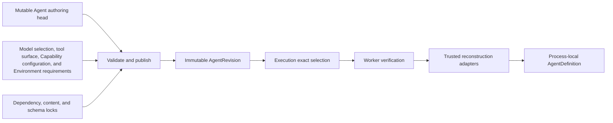
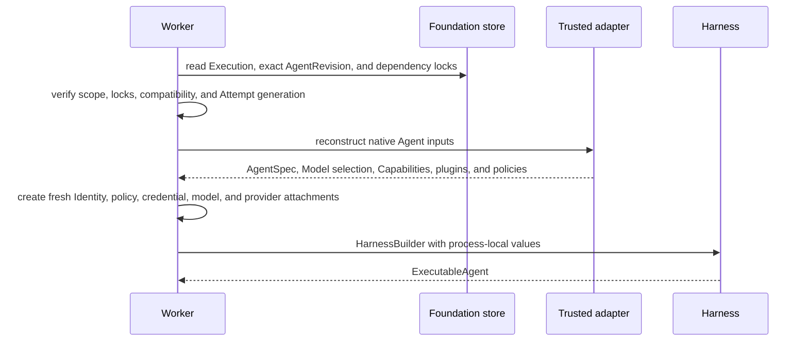

# Agent Revisions and Reconstruction

## Design Position

Foundation stores collaborative Agent authoring state and immutable executable revisions. It does not persist a Harness `AgentDefinition`, Python import target, plugin instance, native Model, Toolset, Capability, callable, client, credential, or provider binding. An execution worker reconstructs those process-local values through trusted installed adapters after verifying the selected revision and its locks.

An Execution selects exact immutable inputs. It never resolves `latest` after durable acceptance or silently adopts edits made while queued, suspended, or recovering. An interactive Turn references that Execution; a standalone Execution needs no synthetic Turn.

## Authoring Model

An `Agent` is the stable Workspace resource used for collaboration, policy, and invocation. It is an authorization target, not an IAM Principal. Agent metadata and its selected published revision are versioned mutable product data.

An `AgentRevision` is an immutable executable snapshot associated with one Agent. It contains only Foundation-owned serializable data and exact references, including:

- logical Agent instructions and typed input/output declarations;
- one exact model selection and bounded model settings under a trusted adapter-owned schema;
- the exact model-facing tool surface, Capability configuration, and Environment requirements needed for reconstruction;
- direct trusted adapter keys and bounded adapter configuration;
- optional Harness plugin configuration under the Harness-owned document contract;
- exact dependency, package, content-digest, and schema compatibility locks.

This contract exposes only `Agent` and `AgentRevision` as public Agent-authoring resources. A trusted reconstruction adapter interprets the bounded fields inside the selected Agent revision. Environment product revisions remain owned by [Environment Management](09-environment-management.md); Secret values and credential leases remain outside the revision.

Changing executable Agent content, its model selection, or a reconstruction lock creates another Agent revision. Prior revisions selected by retained Executions remain addressable for their documented retention period.

The revision boundary exists to prevent queued or suspended work from changing underneath the Worker. For example, a Builder can publish revision `agent-revision-7`, submit a Turn, and then edit the Agent's current model or tool surface before a Worker claims the Execution. The Worker still reconstructs `agent-revision-7`; it never reads the Agent's newer mutable head or resolves a current default.

## Revision Relationships

Publication validates resource scope, bounded adapter documents, schemas, permission to bind referenced resources, dependency compatibility, and required locks before committing the immutable revision. The revision records identity and compatibility, not live authority. Current credentials, RoleBindings, run grants, provider availability, and Environment bindings are resolved freshly for every `ExecutionAttempt` and Harness Run.

## Dependency Locks

A reconstruction lock identifies every package, external content unit, adapter, or schema whose change could alter reconstruction, Capability behavior, state compatibility, security, or output semantics. It includes exact package or content identities, trusted adapter keys, relevant schema or codec compatibility, and integrity digests when content is externally materialized.

Package installation or entry-point availability grants no trust. The deployment selects allowed adapter and plugin keys, verifies the exact lock, and imports only those installed targets. A durable row never contains an arbitrary module, class, file path, shell command, or remote code URL for execution.

An adapter replacement can reconstruct a retained revision only when it explicitly declares compatibility with that revision and its locks. Name similarity, newer package versions, or a current default does not satisfy a missing lock.

## Worker Reconstruction

Reconstruction is deterministic with respect to the revision and declared locks, while live authority and provider reachability are intentionally fresh. The worker assigns a stable `AgentInstanceRef` to each independently advancing root, child, or fork history. A replacement worker preserves that reference for the same Thread, when one exists, but uses a new `ExecutionAttempt`, transient Harness Run correlation, and fresh bindings.

The worker validates the complete definition before starting model or tool work. It does not partially execute a revision whose output schema, Capability state codec, plugin contract, model binding, Environment provider, or reconstruction lock is incompatible.

## Continuation Compatibility

A Thread preserves one independently advancing Agent lineage and selected Harness checkpoint. An Execution that continues the Thread selects an authoritative checkpoint. Continuing it with another Agent revision is allowed only when the new revision explicitly accepts the checkpoint's Agent, Capability, output, Environment-state, and plugin compatibility facts. Otherwise the caller creates an explicit fork with a new lineage and no implied state migration.

Editing an Agent or publishing another revision never mutates an existing Turn, Execution, Item, checkpoint, pending action, or child. A later Attempt for the same Execution reconstructs the revision selected when the Execution was accepted. A successor Execution can select another revision only through an explicit authorized request and compatibility check.

## Failure Semantics

| Failure                                 | Outcome                                                                     |
| --------------------------------------- | --------------------------------------------------------------------------- |
| Missing revision or lock                | Execution fails before Harness construction                                 |
| Content digest or package lock mismatch | Execution fails closed and records bounded incompatibility evidence         |
| Unknown adapter or plugin key           | Revision is not reconstructed; no ambient import fallback occurs            |
| Model binding required but unavailable  | Execution fails before native model inference                               |
| Credential or policy unavailable        | Fresh binding fails; the immutable revision is not rewritten                |
| Checkpoint incompatible with revision   | Continuation fails before Harness entry; display history is not substituted |
| Worker lost during reconstruction       | Lease recovery uses a new generation; no process-local object is restored   |

## Invariants

1. An Execution selects one exact immutable Agent revision and never resolves a mutable Agent head at Worker claim time.
2. A revision contains serializable Foundation data and references only, never live Python objects or credentials.
3. Reconstruction locks and content digests are verified before Harness construction.
4. Package presence does not authorize an adapter, plugin, Capability, provider, or import target.
5. Every ExecutionAttempt reconstructs fresh authority and bindings without mutating the selected revision.
6. Replacement workers preserve stable Thread identity when one exists and change Attempt generation and transient Harness Run correlation.
7. A retained checkpoint is used only under explicitly compatible Agent and state contracts.
