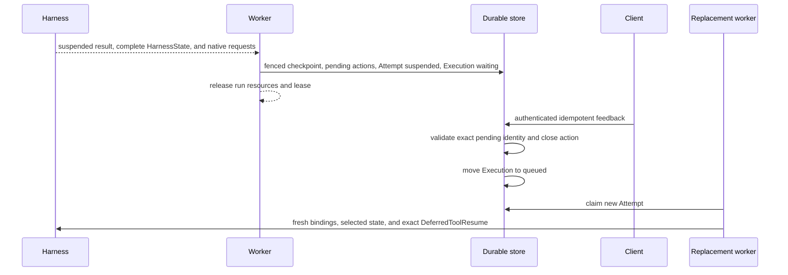
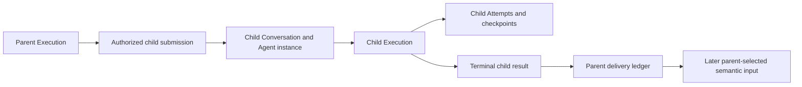

# Deferred Actions and Asynchronous Children

## Design Position

Foundation turns Harness suspension and Host-managed child work into durable lifecycles without extending a worker process across human or external waits. Deferred approvals, external client tools, and structured user input are durable pending actions. Asynchronous subagents are independent child Executions with their own Conversation, Agent instance, Attempts, checkpoints, cancellation, and result-delivery state.

The Harness continues to own native Pydantic deferred values and blocking inline delegation. Foundation does not encode pending authority in `HarnessState` or reinterpret an asynchronous child as an unfinished Pydantic tool call.

## Pending Actions

Pending action kinds remain semantically distinct:

- an `approval` asks an authorized human or service to permit a proposed action;
- a `client_tool` asks an external client to perform a named effect and return its native result;
- `user_input` requests structured information without authorizing another effect.

A conceptual pending record contains:

```python
class PendingAction:
    id: PendingActionId
    execution_id: ExecutionId
    attempt_id: AttemptId
    conversation_version: int
    kind: PendingActionKind
    native_request_envelope: NativeDeferredRequestEnvelope
    expected_responder: ResponderPolicy
    status: PendingActionStatus
    expires_at: datetime | None
```

The native request envelope preserves the exact complete deferred request returned by the Harness and the identity of the suspended message/tool surface. It carries no credential or ambient authority. Foundation separately records who can inspect, approve, execute, reject, or answer the action.

## Suspension and Resume



Suspension commits the complete checkpoint, exact pending requests, Attempt terminal state, Execution wait reason, lifecycle event, and outbox entry as one fenced logical transition. The worker then closes Harness and Environment resources. No lease, credential, provider client, socket, or database session remains alive while waiting.

Feedback authenticates the responder, authorizes the specific pending action, checks expiration and Conversation version, and applies an idempotency key. The same feedback identity and canonical content return the original receipt; different content conflicts. Closing every required pending action makes the Execution eligible for a new Attempt.

The replacement worker reconstructs the exact Agent revision and tool surface, supplies fresh bindings, and passes the authoritative prior request together with complete results through native `DeferredToolResume`. Feedback is supplied once on the first inner Harness attempt and is not copied into generic metadata or reconstructed from message text.

Approval and external execution remain separate. Approval does not claim that the client effect occurred; client success does not retroactively prove an approval decision. Rejection and expiry produce their owning native deferred result or a bounded durable failure without inventing a tool outcome.

## Asynchronous Child Executions



A Host-managed asynchronous spawn is an ordinary completed parent tool operation whose result names the accepted child Execution. It is not a deferred tool request, and child completion never fills the original spawn tool-call ID.

Child acceptance authenticates the parent Attempt, authorizes the exact declared child definition, intersects delegation and run grants, selects the child Agent revision, creates a stable child Agent instance and Conversation, and records the parent-child relationship. The child then follows the ordinary Execution and Attempt lifecycle independently.

The parent-child record states cancellation propagation, result visibility, retention, and delivery policy. A parent may continue, wait for a child, or terminate according to that explicit policy. Parent termination does not silently cancel a child whose contract declares independent continuation.

## Result Delivery

Child execution outcome and parent delivery advance independently. A terminal child result is immutable after its fenced commit. A delivery ledger records whether that exact child outcome is available, offered to the parent lineage, selected into a parent checkpoint, expired, or discarded under policy.

Repeated notifications reuse one child and result identity. The parent incorporates the result at most once into a selected checkpoint under Conversation version and parent fencing. A lost notification can be regenerated from the durable ledger; a delivered notification does not by itself prove that the parent model observed or checkpointed the result.

Result content is bounded and authorized at read and incorporation time. The parent receives a typed projection rather than the child's credentials, live Environment binding, private Capability state, or complete internal trace.

## Cancellation and Failure

| Condition                                      | Outcome                                                                         |
| ---------------------------------------------- | ------------------------------------------------------------------------------- |
| Worker lost after pending commit               | Execution remains waiting; no worker ownership is required                      |
| Feedback duplicated                            | Original feedback receipt is returned                                           |
| Feedback targets stale or closed action        | Request conflicts without starting another Attempt                              |
| Feedback responder unauthorized                | Request is denied without disclosing private pending content                    |
| Resume surface differs from suspended surface  | Attempt fails before Harness resume                                             |
| Child submission acknowledgement lost          | Parent retries with the same operation identity and receives the existing child |
| Child fails                                    | Terminal child failure is frozen and delivered according to parent policy       |
| Parent lost after child creation               | Child remains durable; delivery ledger preserves the relationship               |
| Parent incorporates result then commit is lost | Selected parent checkpoint determines whether incorporation occurred            |

## Invariants

1. Waiting for approval, client tools, user input, or child completion holds no worker lease.
2. Pending requests and feedback remain native typed values associated with one exact suspended checkpoint.
3. Every continuation starts a new Foundation Attempt and fresh Harness run.
4. Approval and external client effect are independent facts.
5. An asynchronous child is an independent Execution, not inline Harness delegation or a deferred spawn call.
6. Child acceptance, completion, notification, parent incorporation, and parent checkpoint selection are separate facts.
7. One terminal child result is incorporated into a parent lineage at most once.
8. Parent or child cancellation follows explicit durable policy and never implies rollback of effects.
