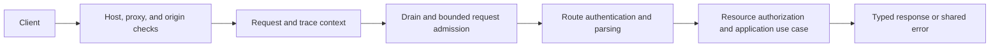

# HTTP Ingress and Request Contract

## Design Position

Foundation Service exposes one HTTP ingress for Native product APIs, Hosted
AG-UI, A2A, the optional browser application, streaming delivery, and
Connector MCP and event traffic, and operational probes. This contract owns
process-role exposure, request context, proxy and browser trust, authentication
boundaries, protocol-aware error enforcement, streaming resource safety, and
drain behavior.

Resource routes, fields, commands, and authorization actions remain owned by their domains. Shared JSON, status, pagination, error-envelope, version, and idempotency wire semantics remain owned by [Platform API Conventions](../api-conventions.md). HTTP middleware carries transport context; it does not become a database transaction, resource authorizer, or business workflow engine.

## Role Surfaces

| Surface                                                | `control` | `worker` | `connector` | `all` |
| ------------------------------------------------------ | --------: | -------: | ----------: | ----: |
| `/api/v1` product routes                               |       Yes |       No |          No |   Yes |
| `/ag-ui/v1` Hosted AG-UI routes                        |       Yes |       No |          No |   Yes |
| A2A routes and well-known discovery when enabled       |       Yes |       No |          No |   Yes |
| OpenAPI and interactive API documentation              |       Yes |       No |          No |   Yes |
| Browser application and static assets                  |       Yes |       No |          No |   Yes |
| Authorized SSE or WebSocket delivery                   |       Yes |       No |          No |   Yes |
| `/mcp/connectors/{connector_id}` standard MCP          |        No |       No |         Yes |   Yes |
| `/internal/mcp/connectors/{connector_id}` Harness MCP  |        No |       No |         Yes |   Yes |
| Connector webhook event ingress                        |        No |       No |         Yes |   Yes |
| Authenticated Connector Service internal operations    |        No |       No |         Yes |   Yes |
| `/internal/v1` control operator routes when configured |       Yes |       No |          No |   Yes |
| `/healthz` and `/readyz`                               |       Yes |      Yes |         Yes |   Yes |

A Worker-only process returns no product route, product OpenAPI document,
browser fallback, static application, or authenticated product stream. A
Connector-only process exposes only its MCP, event, authenticated internal, and
operational surfaces; it exposes no `/api/v1`, AG-UI, A2A, browser, or product
stream route. Unknown `/api`, `/ag-ui`, `/a2a`, `/mcp`, and well-known protocol
paths are never rewritten to browser HTML. Operational paths are outside the
product namespaces, unversioned, bounded, and excluded from product OpenAPI.

The internal operator surface is excluded from the public product OpenAPI, SDKs, browser application, and tenant IAM roles. A selected distribution exposes it only behind a configured deployment-owned operator authenticator and private routing policy. Requests without authenticated operator authority fail closed even when they originate on an internal network. The owning internal domain defines its resources and commands; the HTTP boundary preserves the same bounded body, error, request-ID, and transaction-lifetime rules as product ingress.

## Request Boundary

The diagram defines semantic order, not one middleware class per box. An implementation can combine stateless checks while preserving the same boundary and failure behavior.

The service owns the final request ID returned in the shared error envelope and emitted in safe diagnostics. It generates a bounded unpredictable request ID for every request. An inbound request ID can be recorded only as separately labeled, validated upstream correlation and never replaces the service identity or grants trust. Trace propagation follows the configured [OpenTelemetry boundary](38-observability.md#links-and-propagation) and remains distinct from product authorization. A later durable RunAttempt starts a parentless trace and can link this request context only while a valid context remains available; Foundation does not persist the context with the Run.

Request context contains only immutable safe values such as request ID, trace correlation, selected role, route identity, and authenticated Principal reference after authentication. It contains no live database session, credential secret, request body, mutable authorization cache, or provider client.

## Proxy, Host, and Browser Trust

Forwarded client address, host, and scheme values are ignored unless the direct peer belongs to the configured trusted proxy boundary. A process never trusts arbitrary `Forwarded` or `X-Forwarded-*` headers from the public network. The distributed profile requires an explicit accepted host set; malformed or unaccepted hosts fail before routing.

Production browser traffic is same-origin by default. The service does not enable permissive CORS to support local development; a development frontend proxies relative `/api` requests instead. A distribution that intentionally exposes cross-origin API access declares an exact origin and credential policy rather than reflecting request origins.

Cookie-authenticated state-changing requests require both an accepted Origin and the IAM-owned anti-CSRF proof. Safe reads still authenticate and authorize normally. Bearer API keys are not cookie credentials and do not bypass Host, body, authorization, or rate/admission checks.

Static browser assets use immutable cache policy where their content identity permits it. The browser entry point is not cached in a way that prevents deployment updates, and browser history fallback never captures `/api`, probe, or known static-asset failures.

## Authentication and Authorization Boundary

Authentication validates the exact presented credential and constructs an immutable Principal reference plus safe credential context. Resource authorization occurs after route parsing, against the selected stored Organization, Workspace, or resource, through the common IAM authorizer.

The standard Connector MCP surface authenticates a Workspace-bound Personal or
Service Account API Key and authorizes current `connector.invoke` authority. The
internal Harness MCP surface authenticates a signed short-lived RunAttempt
capability and rechecks its current fence. Connector event ingress authenticates
the Provider-specific event source before an authenticated Connector Service
operation submits its normalized occurrence to Control. These protocol
credentials do not create another Principal or durable session.

Authorization is not a generic pre-routing database middleware. The owning application use case opens a short session, loads current authority and resource state, authorizes the explicit action, and commits or returns a detached result. No request-scoped session survives into agent execution, an external call, background work, sleep, or streaming response.

Authentication establishment routes such as login, invitation acceptance, and password reset validate their exact credential before creating a Principal session. Public error concealment and security audit behavior remain owned by IAM.

## Errors and Diagnostics

Every Native `/api` failure, including framework validation, unknown API routes, authentication failures, domain errors, dependency failures, and unexpected exceptions, uses the shared bounded error envelope from Platform API Conventions. Framework-native `detail` responses never escape the `/api` boundary. Hosted AG-UI and A2A failures use the bounded error representation owned by their selected protocol contracts while preserving the same request ID and non-disclosure rules.

Connector MCP transport and JSON-RPC failures use the negotiated MCP protocol
shape while preserving the same safe request correlation and non-disclosure
rules. Connector event ingress returns only its bounded acknowledgement or safe
protocol rejection and never returns Provider payload or Run execution output.

The stable error code and safe details come from the owning boundary. Unexpected failures use a generic code and message, retain the request ID, and log the exception once at the boundary that handles it. Responses and diagnostics never contain traceback text, SQL, credentials, authorization headers, cookies, private paths, raw prompts, model output, tool payloads, or provider-native secret data.

Operational probe failures use a smaller bounded operational representation and do not pretend to be versioned product resources.

## Streaming Connections

SSE and WebSocket routes authenticate, authorize, and complete initial database reads in closed short sessions before constructing the streaming response. The stream receives immutable detached values and process-wide factories, never a yielded database session through its dependency graph.

Later database work opens a fresh short session for each bounded operation. Redis subscriptions, tasks, and other stream-owned resources are released in `finally`. Reauthorization occurs at the continuation boundary defined by the owning stream contract. Disconnect ends delivery but never interrupts a Run unless the client separately submits the authorized interrupt command.

When the process begins draining, it rejects new streams, signals or closes existing streams according to their owning reconnect contract, and releases subscriptions within the drain deadline. A reconnect uses the owning durable cursor or reports an explicit replay gap; it does not treat a transport connection as execution authority.

## Readiness and Dependency Failure

HTTP liveness and readiness semantics are owned by [Runtime Configuration and Deployment](01-runtime-configuration-and-deployment.md). In particular, loss of PostgreSQL, Redis, shared object storage, or another required role dependency makes the process unready. Product operations that reach an unavailable required dependency return the shared `503` error and safe retry guidance when known.

The service does not keep accepting work that it cannot durably authorize or accept merely because its HTTP socket remains open. Liveness stays independent so deployment infrastructure can distinguish a running but unavailable process from a dead process.

## Failure Semantics

| Failure                                       | HTTP outcome                          | Durable consequence                                      |
| --------------------------------------------- | ------------------------------------- | -------------------------------------------------------- |
| Host, proxy, Origin, or CSRF validation fails | Bounded rejection before use case     | No product mutation                                      |
| Authentication fails                          | Shared safe `401` or concealed result | IAM audit policy applies                                 |
| Authorization fails                           | Shared `403` or concealed `404`       | No product mutation                                      |
| Request validation fails                      | Shared `400` with safe field details  | No product mutation                                      |
| Required dependency is unavailable            | Shared `503`; process is unready      | Previously committed work remains under its owner        |
| Response is lost after commit                 | Client outcome is unknown             | Same idempotency key or authoritative read reconciles it |
| Stream disconnects                            | Delivery stops                        | Run and retained sources remain independent              |
| Unexpected exception                          | Shared generic `500` with request ID  | Transaction rollback or owning reconciliation applies    |

## Compatibility

Role surface exposure, same-origin security, request-ID behavior, and the rule that every `/api` error uses the shared envelope are service compatibility contracts. Framework middleware classes, ordering hooks, context storage, and exception implementation are private and can change without changing this contract.

A new common ingress check can be added when it rejects only requests outside the accepted trust or safety contract. Weakening proxy, Origin, CSRF, authentication, authorization, or error-disclosure behavior is a security compatibility change.

## Invariants

01. Only `control` and `all` expose `/api/v1`, browser assets, and product streams; only `connector` and `all` expose Connector MCP and event data-plane surfaces.
02. Every product request receives one service-owned request ID.
03. Untrusted forwarded headers never change client, host, or scheme identity.
04. Production browser access is same-origin unless an exact cross-origin policy is selected.
05. Middleware carries transport context and never owns resource authorization or a long-lived database session.
06. Every `/api` error uses the shared bounded error envelope; Hosted AG-UI and A2A use their owning bounded protocol errors, and framework-native error bodies do not escape any product boundary.
07. Streaming responses receive no yielded database session.
08. Client disconnect and transport delivery never define Run cancellation or completion.
09. Drain rejects new work before closing streams and ingress.
10. An open HTTP socket does not make an unready process product-available.
11. Internal network placement alone never authenticates an operator route, and internal routes never become public SDK or tenant-role surfaces.
