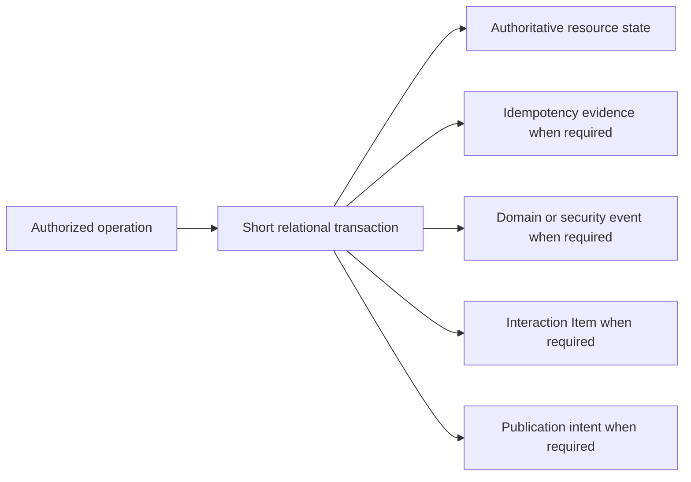
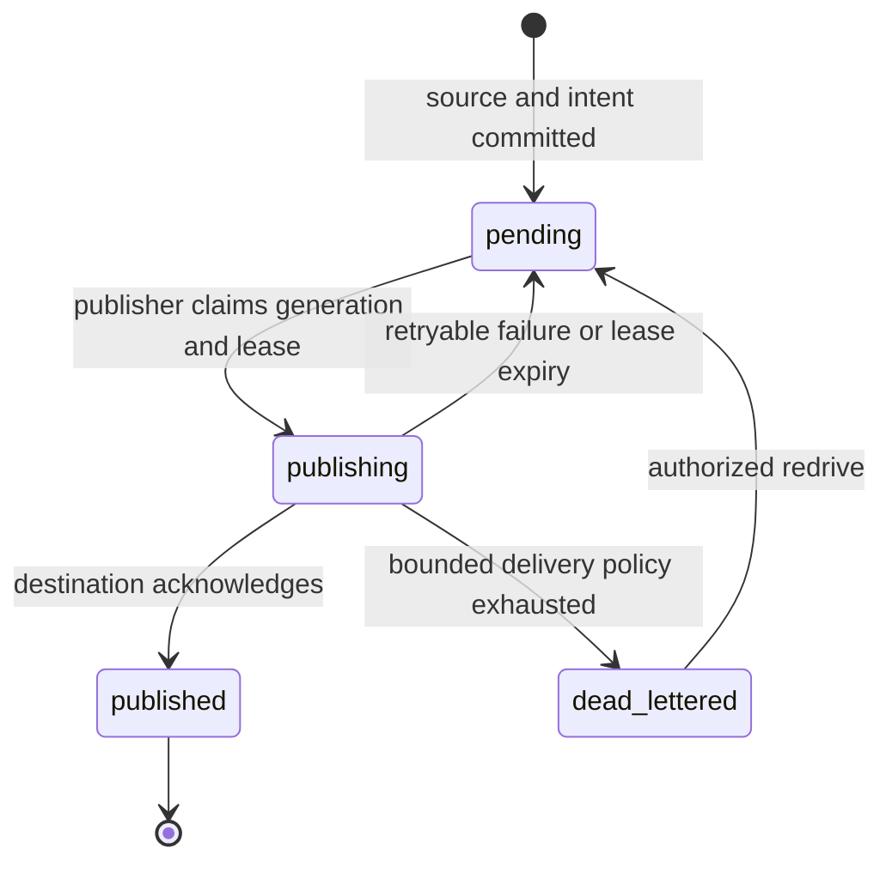

# Durable Operations and Outbox

## Design Position

Foundation Service uses ordinary relational state as the authority for product resources. Durable commands combine concurrency control, optional idempotency evidence, domain events, Items when applicable, and outbox publication intent without turning the service into an event-sourced system or claiming exactly-once network delivery.

This contract owns the shared persistence and retry boundary. Owning domains continue to define which state changes are legal, which event or Item represents them, which authorization action applies, and which external effects require reconciliation.

## Boundaries

| Concern                                      | Owner                                                          | Relationship                                                     |
| -------------------------------------------- | -------------------------------------------------------------- | ---------------------------------------------------------------- |
| Current resource state and legal transitions | Owning domain                                                  | Remains authoritative                                            |
| HTTP version and idempotency wire semantics  | [Platform API Conventions](../api-conventions.md)              | Supplies `expected_version` and `Idempotency-Key` behavior       |
| Shared operation persistence                 | This contract                                                  | Defines evidence, atomicity, and unknown-outcome handling        |
| Lifecycle event and Item meaning             | Owning event or interaction domain                             | Supplies bounded records for a committed transition              |
| Outbox claim and publication                 | This contract                                                  | Delivers committed intents with retry and deduplication identity |
| Delivery envelope, replay, and retention     | [Events, Usage, and Delivery](17-events-usage-and-delivery.md) | Exposes authorized retained and live sources                     |
| External provider or client effect           | Owning integration                                             | Supplies idempotency or reconciliation evidence                  |

The shared operation boundary is not a generic repository, application service base class, event bus, saga engine, or abstract unit-of-work framework. Domains use the canonical short relational transaction and focused helpers for the repeated evidence and outbox records.

## Versioned Mutation

A mutable resource exposes one monotonically increasing domain `version` when concurrent updates can be lost. A state-sensitive mutation compares the caller's expected version with the current locked resource version in the same short transaction that applies the change. A mismatch changes nothing and reports a conflict.

Immutable revisions and append-only records do not gain an artificial version. Internal worker publication additionally verifies the current ExecutionAttempt ID and generation under the owning fencing contract; a matching resource version does not bypass a stale worker fence.

## Idempotency Evidence

A create or command that can be retried under the public contract records bounded evidence scoped to:

| Field                               | Meaning                                                   |
| ----------------------------------- | --------------------------------------------------------- |
| Principal identity                  | Authenticated caller that owns the replay scope           |
| Credential or boundary scope        | Additional safe boundary required by the owning operation |
| Operation kind                      | Stable command identity                                   |
| Resource or parent scope            | Exact target collection or resource                       |
| Idempotency key digest              | Non-reversible identity for the opaque caller key         |
| Canonical request digest            | Detects reuse with different semantic input               |
| Result reference or bounded receipt | Reconstructs the original accepted response               |
| Evidence expiry                     | Finite retention selected by the owning API               |

Raw idempotency keys and secret request content are not stored in logs, events, traces, or diagnostics. The canonical request includes the semantic operation input and excludes transport-only values such as request ID and trace context.

The operation serializes concurrent uses of the same evidence scope. The same key and canonical request return the original result; the same key with different input returns a conflict. Replay resolves before a current-version comparison so a successful mutation can return its original result after advancing the resource version.

Idempotency evidence commits in the same relational transaction as the accepted mutation and result reference. An operation does not hold an idempotency reservation or database transaction across external I/O. If acceptance requires an external effect, Foundation first commits durable intent and performs the effect outside the transaction under an owning idempotency or reconciliation contract.

Expired or absent evidence does not prove that an earlier operation was never dispatched. Clients do not invent a new key merely because an acknowledgement was lost.

## Atomic Durable Commit

An accepted authoritative mutation commits one logical bundle in a short relational transaction:



If the transaction rolls back, none of its state, evidence, event, Item, or outbox records exists. A domain does not publish an authoritative event or retained Item before this commit. Authentication failures and denied attempts that have no resource mutation use the separate bounded security-audit path owned by IAM; audit failure never converts a denial into an allow.

Object upload, Redis publication, webhook delivery, provider calls, and other external I/O never occur inside the relational transaction. The domain stages external data when needed, commits only verified references, and owns cleanup or reconciliation if an external effect and relational selection diverge.

## Outbox Contract

An outbox intent names one committed source record and one publication class. It contains bounded routing metadata and references large or differently retained content rather than copying it. The source identity is stable across every publication attempt.

The shared durable record is conceptually:

```python
class OutboxRecord:
    id: OutboxRecordId
    source_kind: str
    source_id: str
    destination_kind: str
    destination_ref: str
    status: Literal["pending", "publishing", "published", "dead_lettered"]
    available_at: datetime
    claim_generation: int
    lease_expires_at: datetime | None
    attempt_count: int
    published_at: datetime | None
    last_error_code: str | None
```

Owning domains define the stable `source_kind` and `destination_kind` values. `destination_ref` identifies bounded configuration and contains no endpoint credential or Secret value. Outbox payload is derived from the immutable source record rather than copied as another authority.



Control or all-in-one processes own outbox publication. Publishers claim bounded batches with lease or lock semantics, perform delivery outside the claim transaction, and record success or retry state in a new short transaction. Several publishers can overlap safely.

Publication is at least once:

- a publisher crash before delivery leaves the intent pending;
- a crash after delivery but before acknowledgement can deliver the same source again;
- consumers and delivery projections deduplicate by the stable source or delivery identity defined by their owning contract;
- an acknowledgement never changes the underlying domain transition;
- a permanent publication failure remains durable and observable rather than being dropped or marked delivered.

A claim increments `claim_generation`; completion succeeds only for the current generation. A crash or lease expiry can therefore duplicate delivery but cannot let a stale publisher record success. Retry preserves the same source identity and uses durable `available_at`. `published` means the configured destination acknowledged, not that an end user processed the event. Dead-lettering emits an operational and security-safe diagnostic, and an authorized redrive reuses the same record and source identity.

Redis Streams, Pub/Sub, SSE, WebSocket, webhook, and analytical sinks are delivery mechanisms, not relational transactions. Redis is a required distributed dependency, but successful Redis publication alone never proves that the source domain mutation committed. The owning delivery contract defines whether a Redis value is retained, replayable, or intentionally live-only.

Ordering is scoped, not global. An owning domain assigns a monotonic sequence where consumers require ordered replay for one resource or stream. Independent resources and publication classes do not share a fictitious total order.

## Worker Publication and External Effects

A worker can commit state, events, Items, usage evidence, and outbox intents only under the current ExecutionAttempt fence. It does not bypass the relational commit by publishing a lifecycle result directly to Redis or a client.

Before an external effect can occur, the worker commits the owning dispatch boundary. After an unknown external outcome, it retries only when the same external idempotency identity or authoritative evidence makes repetition safe. Missing logs, Redis messages, telemetry, or receipts never prove that no effect occurred.

## Failure Semantics

| Failure                                              | Durable outcome                                                                     | Retry or reconciliation                              |
| ---------------------------------------------------- | ----------------------------------------------------------------------------------- | ---------------------------------------------------- |
| Validation or authorization fails before transaction | No mutation evidence or outbox intent                                               | Caller corrects intent or authority                  |
| Transaction rolls back                               | Entire logical bundle is absent                                                     | Retry only when the operation remains safe           |
| Response is lost after commit                        | Mutation outcome is unknown to caller                                               | Replay the same idempotency key or read authority    |
| Same key carries different request                   | Existing result is preserved                                                        | Return conflict; never replace evidence              |
| External effect outcome is unknown                   | Durable intent remains without invented result                                      | Use owning receipt or reconciliation                 |
| Publisher crashes before acknowledgement             | Source can be delivered again                                                       | Stable identity deduplicates downstream              |
| Redis or another sink is unavailable                 | Outbox remains pending; affected runtime is unready when the dependency is required | Restore dependency and resume bounded publication    |
| Permanent delivery rejection                         | Intent remains durably failed and observable                                        | Correct configuration or use owning repair operation |
| Stale worker publishes                               | Fenced transaction rejects the mutation and outbox                                  | Current Attempt or reconciler decides outcome        |

## Compatibility

Domain resource meaning, version semantics, idempotency scope, canonical request meaning, source event identity, and command side-effect boundary are compatibility facts. Storage table layout, claim query shape, helper APIs, and batching strategy are internal when they preserve those facts.

Changing an idempotency scope or allowing a previously non-repeatable effect to replay requires an incompatible API or explicit migration contract. New publication sinks can be added without changing the committed source identity or making their acknowledgement authoritative.

## Trade-offs

The outbox adds relational records, publisher lag, and duplicate-delivery handling. Foundation accepts those costs to keep domain commitment independent from Redis and external availability. Keeping current resource state authoritative avoids event-sourcing complexity while still producing durable, replayable facts where domains require them.

## Invariants

01. Current relational resource state, not event replay, is the ordinary product authority.
02. Version checks, idempotency evidence, mutation, and required outbox intent commit atomically when they belong to one accepted operation.
03. Idempotency replay resolves before current-version comparison.
04. No relational transaction spans Redis, object storage, provider, client, or other external I/O.
05. Outbox publication is at least once and preserves one stable source identity across retries.
06. Publication acknowledgement never defines the underlying domain transition.
07. Worker-originated durable publication verifies the current Attempt fence.
08. Missing evidence never proves that an external effect did not occur.
09. Redis availability is required in distributed operation, but Redis delivery alone never proves relational commitment.
10. The shared operation contract does not introduce event sourcing, a generic repository, or a second unit-of-work abstraction.
