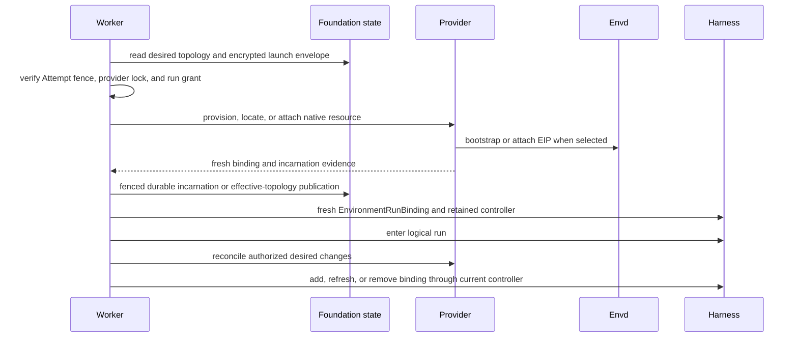

# Environment Provider Lifecycle

## Design Position

Foundation owns hosted Environment provider selection, desired topology, provisioning and attachment orchestration, encrypted launch envelopes, durable resource-incarnation evidence, and fresh `EnvironmentRunBinding` construction. The Harness owns the entered run-scoped Environment aggregate and its process-local topology controller. A provider or agent-envd owns native resource operations and provider-observed evidence.

Foundation does not persist a generic Sandbox whose state claims to replace provider semantics. It stores the minimum typed Host facts needed to select, recreate, attach, authorize, and reconcile provider resources under their owning compatibility contracts.

## Boundaries

| Concern                                         | Owner                                               |
| ----------------------------------------------- | --------------------------------------------------- |
| Provider registration and operator trust        | Foundation deployment                               |
| Workspace permission to configure or attach     | Foundation authorizer                               |
| Desired Environment topology                    | Foundation durable execution or Agent configuration |
| Native resource provisioning and teardown       | Selected provider adapter                           |
| Encrypted launch and reattachment payload       | Foundation provider envelope                        |
| Run-scoped Environment aggregate and controller | Harness with Host-retained controller               |
| Files, commands, processes, ports, and receipts | Direct provider or agent-envd through EIP           |
| Product membership and browser authentication   | Foundation or product gateway, never envd           |

Provider and Harness entry-point availability exposes only an operator-selected implementation catalog. It never authorizes a Workspace, Agent, or Execution to use that implementation.

## Durable Provider State

The conceptual Host state distinguishes:

- `EnvironmentDesiredTopology`: the authorized logical resources and capabilities an Execution requests;
- `EnvironmentLaunchEnvelope`: encrypted provider-specific material required to provision, locate, attach, or destroy a native resource;
- `EnvironmentIncarnation`: the exact logical Environment identity, provider identity, generation, and binding/topology incarnation facts;
- `EnvironmentEffectiveTopology`: the latest fenced set of bindings successfully materialized for the current Attempt.

These records contain no live client, socket, process handle, controller, credential, or unbounded provider object. Provider payloads carry explicit codec compatibility and are interpreted only by the selected provider adapter. `HarnessState.environment_state` remains separate and contains only provider-defined portable backend data imported after fresh reachability and authority exist.

## Materialization and Reconciliation

Provisioning before Harness entry follows an explicit unentered-discard contract. If the Attempt loses ownership or Harness entry fails, the Host does not publish the resource as an effective binding and invokes bounded provider cleanup or durable reconciliation.

During an entered Harness run, only the current worker retains the paired topology controller. Authorized desired changes are read through fresh short transactions, materialized outside the database, and published through the active controller. Durable desired acceptance, provider materialization, effective Harness publication, and provider teardown are separate fenced facts.

A replacement Attempt reconstructs desired topology from Foundation state and consumes selected provider launch state before creating new bindings. It never restores the prior controller or assumes that a provider generation remained reachable. A changed or missing native resource creates new incarnation evidence rather than retargeting an existing binding reference silently.

## agent-envd Boundary

When a provider uses agent-envd, Foundation or the provider owns resource provisioning, envd bootstrap, attachment credential issuance and refresh, and teardown. Envd receives trusted configured mounts and operation policy, authenticates the exact EIP peer, and enforces Environment generation, method, filesystem, process, network, and resource limits.

Envd does not query Organization membership, Workspace roles, Agent revisions, or Foundation tables. EIP operation IDs and receipts record daemon-observed facts; they do not prove Foundation checkpoint or Execution completion. Browser clients never receive envd attachment credentials or raw transfer handles.

## Failure Semantics

| Failure                                  | Durable handling                                                                            |
| ---------------------------------------- | ------------------------------------------------------------------------------------------- |
| Provider unavailable before provisioning | Attempt waits or fails under explicit retry policy; no effective binding exists             |
| Provision succeeds but publication fails | Launch evidence drives cleanup or reconciliation; Harness does not receive the binding      |
| Attempt loses fence during provisioning  | Result is not published; provider cleanup or reconciliation owns the orphan                 |
| Envd generation changes                  | Prior handles and receipts are fenced; a fresh binding and incarnation are required         |
| Desired topology changes during run      | Current worker materializes and publishes through the paired controller if still fenced     |
| Provider effect has unknown outcome      | Foundation preserves launch evidence and requires provider reconciliation                   |
| Portable Environment state incompatible  | Attempt fails before Harness continuation; launch state is not substituted as Harness state |
| Teardown fails                           | Execution completion remains distinct; provider cleanup stays durably reconcilable          |

## Invariants

1. Foundation owns desired topology and provider launch authority; Harness owns only the entered run resource.
2. Live provider and controller objects never enter durable state or `HarnessState`.
3. Provider launch state and portable Harness Environment state are separate envelopes.
4. Effective topology publication is fenced to the current Attempt and controller.
5. Envd enforces EIP and provider policy without querying product membership.
6. An envd receipt is provider evidence, not Foundation completion.
7. Resource provisioning, Harness publication, Execution completion, and teardown are independent facts.
8. Foundation does not invent a generic Sandbox state that overrides provider-native semantics.
