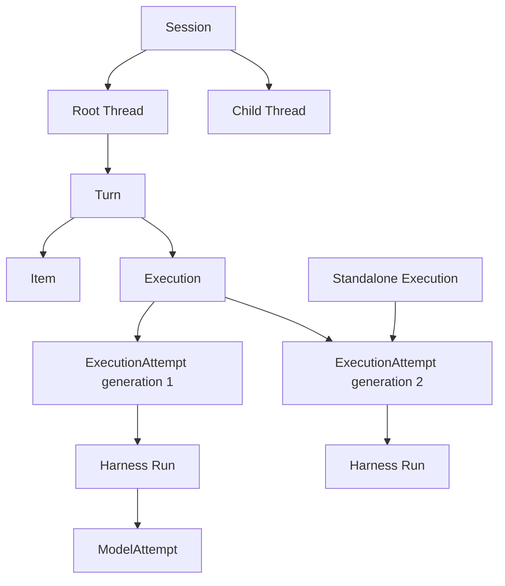
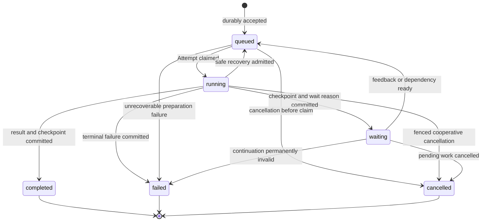
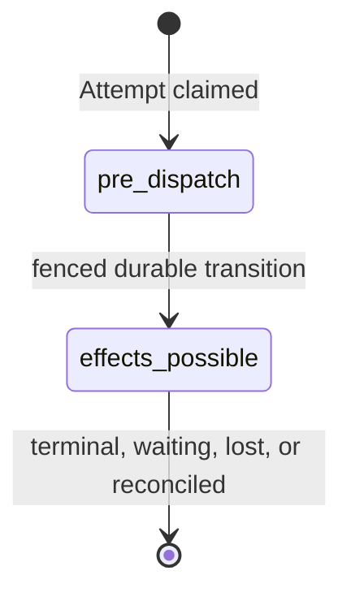

# Interactions, Executions, Attempts, and Checkpoints

## Design Position

Foundation implements the shared [`Session`, `Thread`, `Turn`, and `Item`](../interaction-model.md) interaction model and a separate durable execution model. An `Execution` is accepted schedulable work. An `ExecutionAttempt` is one fenced Worker ownership generation for that Execution. Neither a Harness Run nor a model request replaces those durable identities.

An interactive Turn normally creates one Execution. A standalone webhook, scheduled job, or service request can create an Execution without a Session or Turn. Worker loss, approval suspension, and selected recovery create later ExecutionAttempts for the same non-terminal Execution; they do not create another Turn or pretend that one process remained alive.

## Relationships



The diagram shows correlation, not mandatory containment. An interactive Execution records its Session, Thread, and Turn references. A standalone Execution omits Session and Turn and records a Thread only when it continues Harness state. Every Item belongs to a Turn; execution lifecycle events are not Items merely because they are deliverable to the same client.

## Conceptual Durable Model

The following schemas are conceptual rather than wire or storage formats:

```python
class Execution:
    id: ExecutionId
    organization_id: OrganizationId
    workspace_id: WorkspaceId
    session_id: SessionId | None
    thread_id: ThreadId | None
    turn_id: TurnId | None
    agent_revision_ref: AgentRevisionRef
    actor_ref: PrincipalRef
    policy_version_ref: PolicyVersionRef
    status: ExecutionStatus
    wait_reason: WaitReason | None
    source_checkpoint_id: CheckpointId | None
    selected_checkpoint_id: CheckpointId | None
    parent_execution_id: ExecutionId | None
    retry_of_execution_id: ExecutionId | None
    trigger_source: TriggerExecutionSource | None
    connector_selections: tuple[ResolvedConnectorSelection, ...]
    current_attempt_generation: int
    cancel_requested_at: datetime | None
    created_at: datetime
    finished_at: datetime | None


class ExecutionAttempt:
    id: ExecutionAttemptId
    execution_id: ExecutionId
    generation: int
    worker_id: WorkerId
    status: ExecutionAttemptStatus
    dispatch_phase: DispatchPhase
    harness_run_id: HarnessRunId | None
    lease_expires_at: datetime
    started_at: datetime
    finished_at: datetime | None


class TriggerExecutionSource:
    trigger_id: TriggerId
    trigger_version: int
    occurrence_key: str
    source_type: Literal["schedule", "connector_event"]


class ResolvedConnectorSelection:
    connector_revision_id: ConnectorRevisionId
    connection_id: ConnectionId | None
```

At most one live Attempt generation owns an Execution. Generation increases monotonically and fences every worker-originated lifecycle mutation. `trigger_source` exists only for an Execution accepted by the [Trigger ingress contract](12-connectors-connections-and-triggers.md#trigger-input-and-occurrence-acceptance); public callers cannot assert it. Connector selections record the exact Connection or explicit connectionless result accepted for each Agent declaration and grant no authority. Attempt IDs and generations are implementation-facing observability and management values, not bearer authority.

## Execution Lifecycle



`waiting` names one explicit durable reason such as approval, client tool, structured user input, child Execution, retry backoff, Environment reconciliation, or unknown external outcome. Waiting holds no worker lease. Resumption returns the same Execution to `queued` and later creates another Attempt.

Terminal Execution states are immutable. Repeating terminal intent creates a successor Execution linked by `retry_of_execution_id`. For interactive work, the Host also creates the corresponding successor Turn rather than reopening the terminal Turn.

## Durable Dispatch Boundary

Each Attempt begins with `dispatch_phase="pre_dispatch"`. While pre-dispatch, the worker may read durable inputs, verify locks, reconstruct pure process-local values, and perform other work that cannot cause an external effect. Immediately before the first operation that may enter Environment management, Harness, model, tool, provider, client, or another effectful boundary, the worker commits `dispatch_phase="effects_possible"` under its generation fence.



The transition is deliberately conservative. A worker can crash after committing `effects_possible` but before dispatching anything; recovery still treats the outcome as potentially effectful. This false positive is safer than replaying a mutation after a worker dispatched it but failed to write evidence.

Automatic requeue after lease loss is permitted only when durable state proves the current Attempt remained `pre_dispatch`. After `effects_possible`, recovery requires a selected complete checkpoint, operation idempotency, provider or client evidence, or an explicit reconciliation decision. Missing receipts and absent telemetry do not prove that no effect occurred.

## Attempt and Harness Mapping

One ExecutionAttempt starts at most one logical Harness Run. Before entry, the worker resolves exact revisions, revalidates accepted Connector selections, creates fresh run Capabilities, acquires fresh Connection credentials and Environment attachments, and builds fresh `RunBindings`. A later Attempt reuses the accepted Connection IDs but creates a new Harness Run, controller, clients, credentials, and bindings.

One Harness Run can contain several internal `ModelAttempt` values under the Harness recovery contract. Provider transport retries and ModelAttempt recovery do not create ExecutionAttempts. Conversely, an ExecutionAttempt never restores a task, socket, database session, controller, live provider resource handle, or Harness Run from another process.

## Checkpoint Selection

The internal checkpoint is conceptually:

```python
class Checkpoint:
    id: CheckpointId
    execution_id: ExecutionId
    attempt_id: ExecutionAttemptId
    attempt_generation: int
    thread_id: ThreadId
    agent_revision_ref: AgentRevisionRef
    harness_state: HarnessStateEnvelope
    created_at: datetime
```

The Harness returns complete `HarnessState` candidates only at its public boundaries. Foundation stores and selects a candidate in a transaction that verifies current Execution state, Attempt generation, Agent revision, Thread identity, and the pending or terminal transition.

Checkpoint creation alone advances nothing. Selection atomically updates the Execution and, for interactive work, the owning Thread and Turn result references. Provider resource state remains in the separately encrypted Environment management envelope. Items, AG-UI envelopes, partial messages, provider history, tool fragments, and process memory never become continuation state.

## Acceptance and Idempotency

Interactive acceptance authenticates and authorizes the caller, validates Session and Thread versions, resolves exact revisions and policy, and applies the caller's `Idempotency-Key`. It commits the Turn, initial user Item, Execution, source checkpoint, lifecycle events, and outbox intents as one logical unit.

Public standalone acceptance performs the same checks for its Workspace and caller-authorized source state while omitting interaction records. It cannot claim Trigger identity or override a Connection selected by the Agent revision and current selection rules. The same principal, scope, key, and canonical request return the original acceptance receipt; reuse with different content conflicts. A lost response after possible acceptance remains unknown until the caller repeats the same key or reads authoritative state.

## Cancellation and Unknown Outcome

Cancellation is durable intent followed by cooperative enforcement. A worker checks cancellation before expensive or effectful boundaries and attempts a generation-fenced outcome commit. Cancellation never claims rollback of model, tool, child, Environment, provider, or client effects.

If the worker disappears after `effects_possible`, the Execution remains waiting for evidence or explicit reconciliation unless a selected checkpoint or idempotency contract proves safe continuation. Exactly one legal generation-fenced transition wins a cancellation/completion race; the losing local result remains diagnostic only.

## Invariants

01. Session, Thread, Turn, and Item retain the shared platform meanings.
02. Execution owns durable schedulable work; ExecutionAttempt owns one fenced Worker generation.
03. Interactive and standalone Executions share one scheduler and recovery contract.
04. One live Attempt generation owns an Execution, and one Attempt starts at most one Harness Run.
05. A stale Attempt cannot commit lifecycle state, checkpoint selection, pending work, or terminal outcome.
06. `effects_possible` is committed before any operation that may cause an external effect.
07. Absence of a receipt, event, or telemetry signal never proves pre-dispatch safety.
08. Only a complete selected `HarnessState` checkpoint advances Thread continuation.
09. Terminal records are immutable; retry creates explicit successor records.
10. Cancellation records intent and never implies rollback of external effects.
11. Trigger source metadata and accepted Connector selections are immutable Execution facts, not caller overrides or bearer grants.
