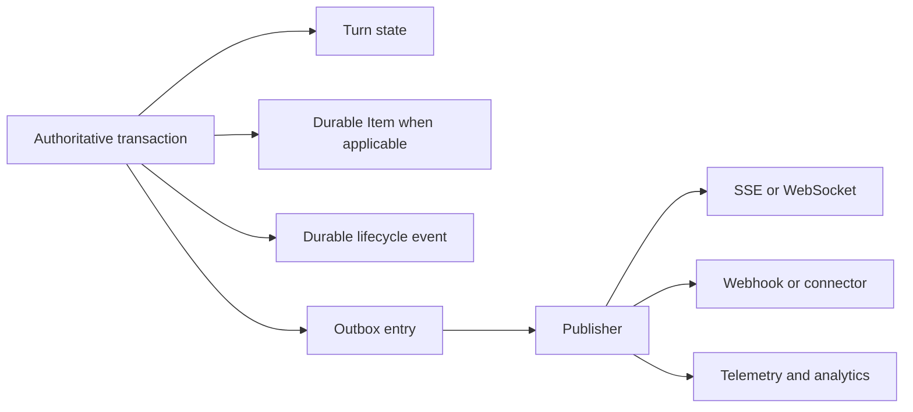

# Events, Usage, and Delivery

## Design Position

Foundation stores durable Items, lifecycle events, and usage facts without turning transport replay, telemetry, pricing, billing, or external delivery into Turn authority. Authoritative state transitions and their outbox entries commit together; publishers and projections can retry independently.

Harness events remain process-local observations. Foundation chooses which bounded observations become durable Items or lifecycle events and identifies the originating Thread, Turn, and worker lease generation. Persisting an Item or event never promotes a partial Harness message sequence into a checkpoint.

## Observation and Record Layers

The system keeps four layers distinct:

| Layer           | Meaning                                                           | Authority                                            |
| --------------- | ----------------------------------------------------------------- | ---------------------------------------------------- |
| Harness event   | Process-local observation emitted while one Harness run is active | No durable authority                                 |
| Foundation Item | Ordered semantic content or action within one Turn                | Durable product record, but not continuation state   |
| Lifecycle event | Durable fact that a Foundation state transition committed         | Audit and publication fact for its owning transition |
| AG-UI envelope  | Live or retained presentation projection delivered to a UI        | Display and reconnect only                           |

A message, tool call, command, file change, approval, child-Agent reference, or artifact can become an Item after type validation, redaction, authorization, and a generation-fenced commit. Heartbeats, token deltas, arbitrary logs, provider frames, private reasoning, credentials, and unbounded payloads do not become Items by default.

One Harness observation can update a provisional live projection before its Item is durable. The committed Item keeps a stable identity and monotonic sequence within its Turn. Delivery retries reuse that identity. A completed Item is not recreated merely because an SSE subscriber reconnects or an outbox publisher retries.

## Durable Events

Each Turn has a monotonic durable lifecycle-event sequence distinct from its Item sequence. An event records its Foundation event identity, Thread, Turn, optional worker lease generation, event kind, committed timestamp, actor or system origin, bounded typed payload, and schema compatibility. Event sequence establishes replay order for that Turn, not global causal order across all resources.

Lifecycle events include durable Turn acceptance, worker claim or lease loss, Item commitment, checkpoint selection, suspension, feedback acceptance, cancellation intent, terminal completion, child relationship changes, and reconciliation outcomes. Item content is referenced rather than copied into every lifecycle event.

An authoritative mutation and its lifecycle event commit in the same transaction. An outbox entry in that transaction records publication work. A publisher can deliver the event to SSE, WebSocket, webhook, notification, or analytical sinks after commit. Duplicate publication preserves one event identity.

## Stream and Replay

Clients authenticate and authorize before opening a stream and on every replay continuation. A stream cursor is opaque, scoped, and non-authoritative. Disconnect does not cancel a Turn or change checkpoint selection. Reconnect replays retained Items and lifecycle projections and can explicitly report a retention gap; it never reconstructs missing Agent continuation from display data.

Streaming routes close authentication and initial-read database sessions before constructing the stream. They use subscriptions or fresh bounded sessions for later reads and release every subscription in `finally`.

## Harness Observation Projection

The current worker is the sole consumer of one `HarnessRunStream`. It can emit transient low-latency observations before durable commitment and later correlate them with committed Items. Every authoritative Item or lifecycle publication verifies the current worker lease generation. Consumers distinguish transient observations from committed Items and lifecycle events.

Earlier Harness semantic-attempt events remain observations even when a later internal attempt succeeds. A stale worker cannot publish new authoritative Items or lifecycle events, although bounded telemetry can record its stale diagnostic outcome.

Agent Stream Protocol owns reusable Harness-to-AG-UI projection semantics. Foundation owns durable Item mapping, transport, retention, replay, authorization, and the mapping from committed Thread and Turn facts to product surfaces. A Foundation adapter can project the same safe Harness observation both to a provisional AG-UI envelope and later to a durable Item, but the two retain separate identities and authority. AG-UI replay does not become Foundation Item, checkpoint, or lifecycle-event authority.

## Usage Records

`RunUsage` is a process-local accumulator for one Harness run. The worker converts its bounded usage observations into Foundation usage records associated with the exact Workspace, Thread, Turn, worker lease generation, Agent revision, model-integration revision, provider, and recorded unit dimensions.

Usage insertion is idempotent under a stable producer and observation identity. Incremental observations and terminal snapshots cannot double count the same provider usage. A stale worker cannot record authoritative usage after losing its lease-generation fence, but reconciliation can preserve separately identified provider evidence that escaped before loss.

Raw usage, aggregation, pricing, budget enforcement, billing, invoice generation, and payment are separate facts. A pricing record identifies the exact pricing revision used; changing current prices does not reinterpret retained raw usage. Turn completion does not imply usage settlement, and usage settlement does not change Turn outcome.

## Artifacts and Large Content

Foundation metadata and lifecycle authority remain in the durable database. Bounded large inputs, outputs, checkpoints, logs, files, and generated assets may be stored as immutable or versioned Artifacts in object storage. A durable Artifact record owns digest, size, media type, scope, retention, encryption, and storage reference.

An object-store key, signed URL, file path, or digest is not a product authority token. Reads are reauthorized and use bounded short-lived delivery. Database state never points at a partially published object; staging becomes selected only after content integrity and durable metadata commit succeed.

## Observability

OpenTelemetry traces and metrics project process and lifecycle behavior for diagnosis. They include stable service, role, build, trace, Thread, Turn, worker lease generation, and provider correlation when safe. They omit credentials, authorization headers, plaintext secrets, raw prompts, model output, tool payloads, and uploaded content by default.

Trace export is best effort and cannot commit or repair a Turn. Durable audit and lifecycle facts use their owning event contracts; telemetry loss does not erase them, and telemetry presence does not prove their commitment.

## Failure Semantics

| Failure                                             | Outcome                                                                           |
| --------------------------------------------------- | --------------------------------------------------------------------------------- |
| State transaction rolls back                        | Associated event and outbox entry do not exist                                    |
| Outbox publisher crashes after delivery             | Same event can be delivered again with the same identity                          |
| Client disconnects                                  | Turn continues according to durable state                                         |
| Replay range expired                                | Client receives an explicit gap and current authoritative resource state          |
| Object upload succeeds but metadata commit fails    | Unselected object is cleaned or retained for bounded reconciliation               |
| Metadata commits but selected object is unavailable | Artifact read fails explicitly; display data is not treated as checkpoint content |
| Usage observation duplicated                        | Idempotency evidence suppresses double counting                                   |
| Pricing unavailable                                 | Raw usage remains durable; pricing and billing wait independently                 |
| Telemetry exporter unavailable                      | Durable Turn processing continues; bounded diagnostics report exporter failure    |

## Invariants

1. Thread, Turn, and Item are durable product records; Harness observations and AG-UI envelopes are projections.
2. Authoritative state transition, lifecycle event, and outbox intent commit together.
3. Item or event publication and client receipt do not define Turn completion.
4. Items, stream replay, and AG-UI display data never become Harness continuation state.
5. Stale workers cannot publish authoritative Items, events, or usage records.
6. Usage is deduplicated independently from pricing, billing, and payment.
7. Artifact storage references and signed delivery URLs grant no product authority by possession.
8. Database metadata never selects a partial object-store candidate.
9. Telemetry observes the system and never acts as durable lifecycle authority.
