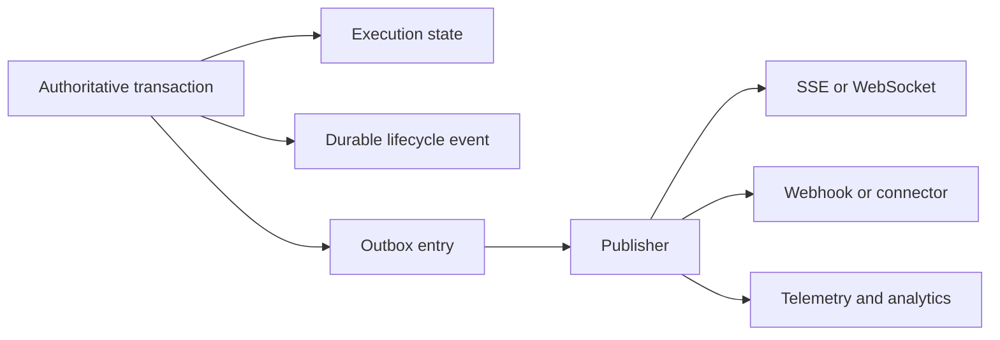

# Events, Usage, and Delivery

## Design Position

Foundation stores durable lifecycle events and usage facts without turning transport replay, telemetry, pricing, billing, or external delivery into execution authority. Authoritative state transitions and their outbox entries commit together; publishers and projections can retry independently.

Harness events remain process-local observations. Foundation chooses which bounded observations become durable lifecycle or interaction events and identifies the originating Execution and Attempt. Persisting an event never promotes a partial Harness message sequence into a checkpoint.

## Durable Events

Each Execution has a monotonic durable event sequence. An event records its Foundation event identity, Execution, optional Attempt generation, event kind, committed timestamp, actor or system origin, bounded typed payload, and schema compatibility. Event sequence establishes replay order for that Execution, not global causal order across all resources.

Lifecycle events include durable acceptance, Attempt claim/loss, checkpoint selection, suspension, feedback acceptance, cancellation intent, terminal completion, child relationship changes, and reconciliation outcomes. High-volume model tokens, raw prompts, model output, tool payloads, credentials, and private Capability state are not copied into lifecycle events by default.

An authoritative mutation and its lifecycle event commit in the same transaction. An outbox entry in that transaction records publication work. A publisher can deliver the event to SSE, WebSocket, webhook, notification, or analytical sinks after commit. Duplicate publication preserves one event identity.

## Stream and Replay

Clients authenticate and authorize before opening a stream and on every replay continuation. A stream cursor is opaque, scoped, and non-authoritative. Disconnect does not cancel an Execution or change checkpoint selection. Reconnect replays retained durable events and can explicitly report a retention gap; it never reconstructs missing Agent continuation from display data.

Streaming routes close authentication and initial-read database sessions before constructing the stream. They use subscriptions or fresh bounded sessions for later reads and release every subscription in `finally`.

## Harness Observation Projection

The current worker is the sole consumer of one `HarnessRunStream`. It may emit transient low-latency observations before durable commitment and later attach their Attempt identity to durable projections. Consumers distinguish transient observations from committed lifecycle events.

Earlier Harness semantic-attempt events remain observations even when a later internal attempt succeeds. A lost or stale Foundation Attempt cannot publish new authoritative lifecycle events, although bounded telemetry can record its stale diagnostic outcome.

Agent Stream Protocol owns reusable Harness-to-AG-UI projection semantics. Foundation owns durable transport, retention, replay, authorization, and the mapping from committed Execution facts to its product surfaces. AG-UI replay does not become Foundation checkpoint or event authority.

## Usage Records

`RunUsage` is a process-local accumulator for one Harness run. The worker converts its bounded usage observations into Foundation usage records associated with the exact Workspace, Execution, Attempt, Agent revision, model-integration revision, provider, and recorded unit dimensions.

Usage insertion is idempotent under a stable producer and observation identity. Incremental observations and terminal snapshots cannot double count the same provider usage. A stale worker cannot record authoritative usage after losing its Attempt fence, but reconciliation can preserve separately identified provider evidence that escaped before loss.

Raw usage, aggregation, pricing, budget enforcement, billing, invoice generation, and payment are separate facts. A pricing record identifies the exact pricing revision used; changing current prices does not reinterpret retained raw usage. Execution success does not imply usage settlement, and usage settlement does not change Execution outcome.

## Artifacts and Large Content

Foundation metadata and lifecycle authority remain in the durable database. Bounded large inputs, outputs, checkpoints, logs, files, and generated assets may be stored as immutable or versioned Artifacts in object storage. A durable Artifact record owns digest, size, media type, scope, retention, encryption, and storage reference.

An object-store key, signed URL, file path, or digest is not a product authority token. Reads are reauthorized and use bounded short-lived delivery. Database state never points at a partially published object; staging becomes selected only after content integrity and durable metadata commit succeed.

## Observability

OpenTelemetry traces and metrics project process and lifecycle behavior for diagnosis. They include stable service, role, build, trace, Conversation, Execution, Attempt, and provider correlation when safe. They omit credentials, authorization headers, plaintext secrets, raw prompts, model output, tool payloads, and uploaded content by default.

Trace export is best effort and cannot commit or repair an Execution. Durable audit and lifecycle facts use their owning event contracts; telemetry loss does not erase them, and telemetry presence does not prove their commitment.

## Failure Semantics

| Failure                                             | Outcome                                                                           |
| --------------------------------------------------- | --------------------------------------------------------------------------------- |
| State transaction rolls back                        | Associated event and outbox entry do not exist                                    |
| Outbox publisher crashes after delivery             | Same event can be delivered again with the same identity                          |
| Client disconnects                                  | Execution continues according to durable state                                    |
| Replay range expired                                | Client receives an explicit gap and current authoritative resource state          |
| Object upload succeeds but metadata commit fails    | Unselected object is cleaned or retained for bounded reconciliation               |
| Metadata commits but selected object is unavailable | Artifact read fails explicitly; display data is not treated as checkpoint content |
| Usage observation duplicated                        | Idempotency evidence suppresses double counting                                   |
| Pricing unavailable                                 | Raw usage remains durable; pricing and billing wait independently                 |
| Telemetry exporter unavailable                      | Durable execution continues; bounded diagnostics report exporter failure          |

## Invariants

1. Authoritative state transition, lifecycle event, and outbox intent commit together.
2. Event publication and client receipt do not define Execution completion.
3. Stream replay and AG-UI display data never become Harness continuation state.
4. Stale workers cannot publish authoritative events or usage records.
5. Usage is deduplicated independently from pricing, billing, and payment.
6. Artifact storage references and signed delivery URLs grant no product authority by possession.
7. Database metadata never selects a partial object-store candidate.
8. Telemetry observes the system and never acts as durable lifecycle authority.
