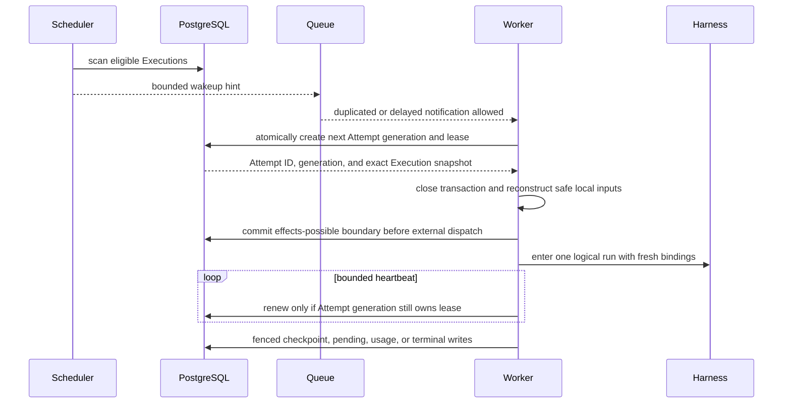

# Scheduling, Workers, and Recovery

## Design Position

Foundation scheduling converts durable eligible Execution state into fenced ExecutionAttempt ownership. PostgreSQL remains authoritative for eligibility, Attempt generations, leases, dispatch phase, and outcomes. Redis, queue messages, and in-process notifications reduce discovery latency but are disposable hints.

Workers are process-role loops, not durable product owners. A deployment scales the `execution` role by adding processes or replicas that compete through the same claim contract.

## Scheduling Contract

An Execution is eligible when it is `queued`, admission and backoff constraints allow work, no live Attempt owns it, exact dependencies remain resolvable, and current policy permits the transition. The scheduler uses bounded deterministic scans and idempotently records or signals eligible work.

A coordination message contains only enough identity to prompt a fresh durable claim. Receiving, duplicating, delaying, reordering, acknowledging, or losing that message cannot create, complete, cancel, or transfer an ExecutionAttempt. Operational admission control and fairness can delay eligibility but do not create another queue authority.

## Claim and Lease

A claim transaction verifies eligibility, allocates the next ExecutionAttempt generation, records worker identity and lease expiration, and moves the Execution to `running`. The worker closes the transaction before reconstruction or external I/O.

Lease renewal proves only current ownership liveness. It does not commit progress, extend credential lifetime, or make process memory recoverable. A renewal that cannot confirm current ownership causes the worker to cancel local work and suppress lifecycle publication.

## Fencing

Every worker-originated lifecycle mutation includes the Execution ID, Attempt ID, and generation. It succeeds only when that generation still owns the live Attempt and the requested state transition remains legal.

Fencing applies to:

- Attempt state, dispatch phase, and heartbeat;
- lifecycle events and Item commitment;
- checkpoint creation and selection;
- pending-action acceptance;
- Environment desired/effective observations;
- child acceptance and result incorporation;
- terminal outcomes.

Usage ingestion has a narrower exception defined by [Events, Usage, and Delivery](10-events-usage-and-delivery.md): an immutable UsageRecord that proves already incurred usage can arrive after lease loss under its original Attempt attribution, but it cannot advance lifecycle state.

A stale worker may publish bounded non-authoritative telemetry identifying its stale Attempt. It cannot publish a lifecycle event or Item that consumers could mistake for current product state.

## Worker Run Boundary

After claim, a worker reads exact immutable inputs in bounded sessions, verifies dependency locks, and reconstructs safe process-local Agent values. Before invoking any potentially effectful Environment, provider, Harness, model, tool, or client boundary, it commits the Attempt's `effects_possible` phase.

The worker uses the shared Environment Provider contract to create or resume resources and acquire fresh attachments, then imports the Harness Python package and calls its public process-local API. It is the sole consumer of the `HarnessRunStream` and the owning `HarnessAguiObserver`. Database sessions and locks never span reconstruction I/O, provider calls, Harness work, queue waits, sleeps, event streaming, or cleanup.

## Lease Loss and Recovery

A reconciler detects an expired lease under a lock that verifies its Attempt generation. Recovery depends on durable evidence:

| Evidence                                                                     | Recovery                                                                                                      |
| ---------------------------------------------------------------------------- | ------------------------------------------------------------------------------------------------------------- |
| Attempt remained `pre_dispatch`                                              | Execution can return to `queued` automatically                                                                |
| Complete selected checkpoint exists                                          | A later Attempt continues from that checkpoint                                                                |
| Agent tool dispatch has no matching result in selected state                 | Record `unknown_outcome`; a later Attempt shows it to the Agent and never replays the call automatically      |
| Environment-management or other non-Agent provider operation remains unknown | The owning domain applies its exact idempotency or reconciliation contract before depending on that operation |
| Selected revision or state is permanently incompatible                       | Execution fails with a bounded durable reason                                                                 |

The `pre_dispatch` conclusion comes from the fenced Attempt record, not from missing logs, receipts, heartbeats, or telemetry. For Agent tool calls, Foundation compares its durable dispatch records with the selected Harness state and classifies every unmatched call as `unknown_outcome`; it does not inspect provider business state before admitting another Agent attempt. The owning Environment Manager and other non-Agent domains retain their exact reconciliation boundaries. Lack of evidence never becomes proof of no side effect.

Replacement work creates a new ExecutionAttempt, Harness Run, Environment attachment, controller, credentials, and provider clients. It never restores another process's live task, session, socket, dispatcher, controller, or attachment.

## Retry Semantics

Retries remain owned by the layer that knows the failed boundary:

- provider transport retries remain in the provider or Pydantic contract;
- Harness semantic recovery creates another ModelAttempt inside one Harness Run;
- Foundation recovery creates another ExecutionAttempt only after a durable loss, suspension, backoff, or retry decision;
- retrying a terminal Execution creates a successor Execution rather than reopening the original;
- a post-recovery Agent decision is expressed as an ordinary new tool call, not a replay command; and
- Foundation does not guarantee cross-Attempt reuse of the prior invocation's request or idempotency key.

Backoff uses an exact durable next-eligible timestamp. Scheduler restart does not reset it. Attempt budgets count ExecutionAttempts separately from ModelAttempts and provider retries.

## Shutdown and Drain

A control process stops accepting new product work before stopping ingress and reconcilers. An execution process stops claiming Attempts, continues bounded active work until its drain deadline, and either commits an authoritative transition or relinquishes ownership for lease recovery.

Shutdown never extends a lease indefinitely or marks unfinished local work successful. Execution-only processes never migrate. Role overlap during rollout remains safe through leases, fencing, and idempotency.

## Failure Semantics

| Failure                                 | Durable outcome                                                                                                                      |
| --------------------------------------- | ------------------------------------------------------------------------------------------------------------------------------------ |
| Coordination unavailable                | Accepted work remains durable; discovery can be delayed                                                                              |
| Duplicate queue message                 | At most one new Attempt generation succeeds                                                                                          |
| Worker crashes before claim commit      | No Attempt ownership exists                                                                                                          |
| Worker crashes while `pre_dispatch`     | Lease expires; safe automatic requeue is permitted                                                                                   |
| Worker crashes after `effects_possible` | Lease expires; unmatched Agent tool calls become `unknown_outcome`, while non-Agent operations follow their owning recovery contract |
| Heartbeat arrives after lease expiry    | Worker is stale even if it reconnects                                                                                                |
| Stale worker submits lifecycle result   | Fenced commit is rejected                                                                                                            |
| Scheduler scans concurrently            | Claim serialization prevents duplicate live ownership                                                                                |

## Invariants

1. PostgreSQL, not coordination delivery, owns eligibility and Attempt state.
2. At most one live Attempt generation owns an Execution.
3. Every worker-originated lifecycle mutation verifies the current generation.
4. Worker activity and external I/O occur outside database transactions.
5. `effects_possible` is a durable conservative boundary, not an inference from receipts.
6. Replacement Attempts use fresh process-local values and only selected durable state.
7. Unknown Agent tool outcomes are shown to the next Agent rather than blindly replayed; non-Agent domains retain their owning reconciliation contracts.
8. Late immutable usage evidence cannot mutate lifecycle state.
