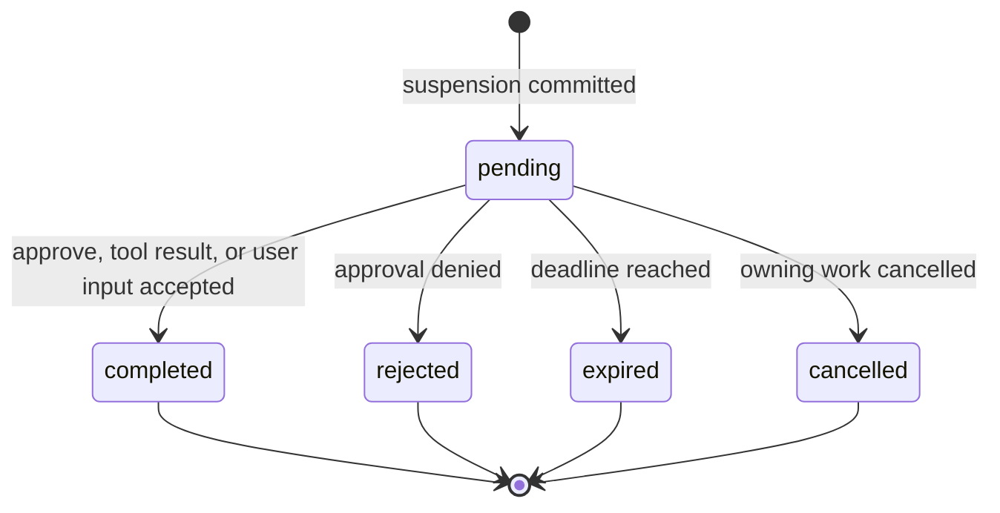
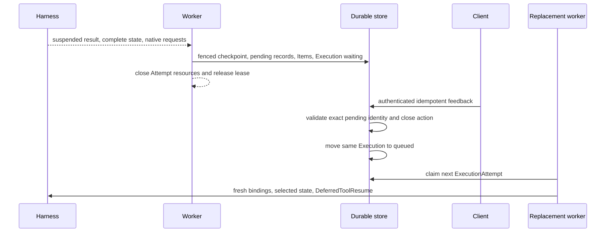
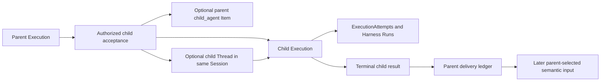
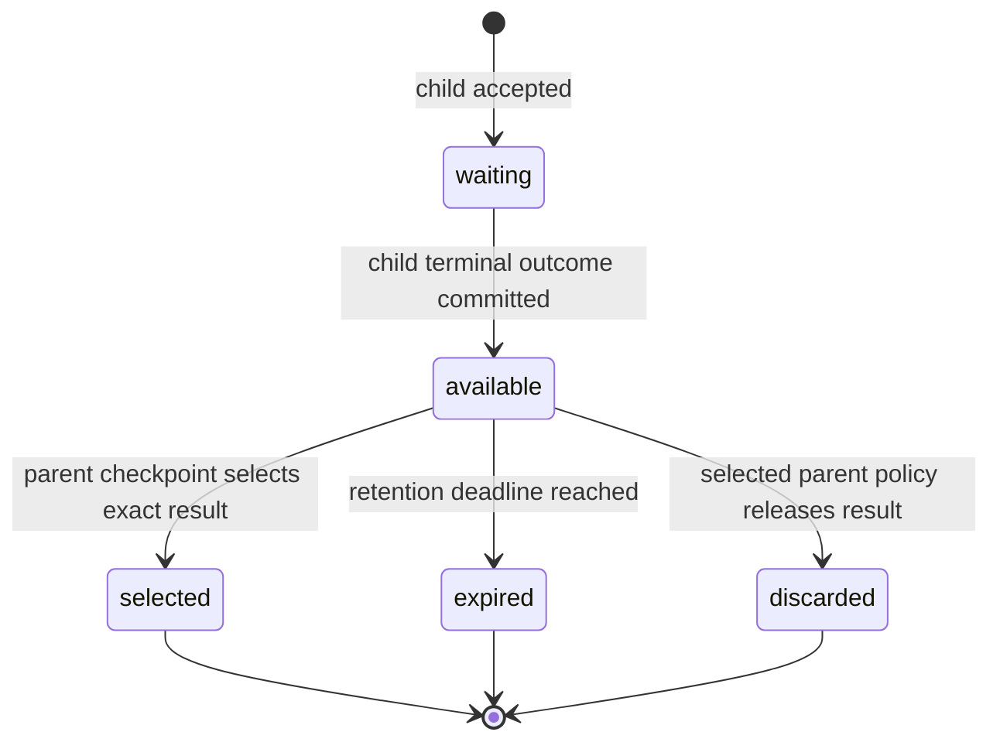

# Deferred Actions and Asynchronous Children

## Design Position

Foundation turns Harness suspension and Host-managed child work into durable lifecycles without retaining a Worker across human or external waits. Approval, client-tool execution, and structured user input are durable pending actions owned by one Execution. For interactive work, their user-visible requests and responses are Items in the owning Turn.

An asynchronous subagent is an independent child Execution. When it owns an independently advancing visible history, Foundation also creates a child Thread under the same Session. The child has its own Attempts, Harness Runs, checkpoints, cancellation, Environment attachments, usage, and result-delivery state.

The Harness continues to own native Pydantic deferred values and blocking inline delegation. Foundation does not encode pending authority in `HarnessState` or reinterpret asynchronous submission as an unfinished Pydantic tool call.

## Pending Actions

Pending kinds remain distinct:

- `approval` asks an authorized human or service to permit a proposed action;
- `client_tool` asks an external client to perform a named effect and return its native result;
- `user_input` requests structured information without authorizing another effect.

The conceptual record is:

```python
PendingActionStatus = Literal[
    "pending",
    "completed",
    "rejected",
    "expired",
    "cancelled",
]


class PendingAction:
    id: PendingActionId
    execution_id: ExecutionId
    source_attempt_id: ExecutionAttemptId
    source_attempt_generation: int
    checkpoint_id: CheckpointId
    session_id: SessionId | None
    thread_id: ThreadId | None
    turn_id: TurnId | None
    request_item_id: ItemId | None
    response_item_id: ItemId | None
    kind: PendingActionKind
    native_request_envelope: NativeDeferredRequestEnvelope
    native_result_envelope: NativeDeferredResultEnvelope | None
    expected_responder: ResponderPolicy
    status: PendingActionStatus
    version: int
    expires_at: datetime | None
    resolved_by: PrincipalRef | None
    resolved_at: datetime | None
```

The native envelope preserves the exact complete deferred request and the suspended message/tool surface identity. It carries no credential or ambient authority. Foundation separately authorizes who may inspect, approve, reject, execute, or answer it.

`PendingActionStatus` has this complete lifecycle:



All transitions out of `pending` are terminal and compare the current `version`. `completed` stores the exact native approval, client-tool, or user-input result. `rejected` is valid only for an approval and stores the native denial result. Expiration and cancellation do not fabricate a successful native result; they fail or cancel the owning continuation according to its already selected policy. A terminal action is never reopened. Idempotent repetition of the same resolution returns the original receipt, while different content conflicts.

For example, if an Agent proposes deleting a repository, the Harness can return an approval request and complete state. Foundation commits a `pending` approval and releases the Worker. Hours later an authorized responder approves the exact request; Foundation stores the native approval result, moves the action to `completed`, and queues the same Execution. A fresh Worker resumes from the selected checkpoint. Repeating that approval returns the first receipt, while approving changed tool arguments conflicts.

## Suspension and Resume



Suspension commits the complete checkpoint, pending actions, source Attempt outcome, Execution wait reason, applicable Items, lifecycle event, and outbox intent as one generation-fenced logical transition. The worker then closes Harness, Environment, credential, provider, socket, and database resources.

Feedback authenticates the responder, authorizes the exact pending action, checks expiration and current resource versions, and applies an idempotency key. Interactive feedback creates or completes the corresponding response Item in the same Turn. Once every action in the suspended native request set is `completed` or validly `rejected`, the same Execution becomes eligible for another Attempt. An `expired` or `cancelled` action instead applies its selected failure or cancellation policy.

The replacement worker reconstructs the exact Agent revision and tool surface, supplies fresh bindings, and passes the authoritative request and complete results through native `DeferredToolResume`. Approval and external execution remain separate facts: approval does not prove the client effect occurred, and client success does not retroactively prove approval.

## Asynchronous Child Executions



The relationship and its result delivery are durable internal records rather than new public top-level resources:

```python
class ChildExecutionRelationship:
    id: ChildExecutionRelationshipId
    parent_execution_id: ExecutionId
    parent_attempt_id: ExecutionAttemptId
    parent_attempt_generation: int
    child_execution_id: ExecutionId
    child_thread_id: ThreadId | None
    spawn_operation_id: str
    parent_mode: Literal["continue", "wait_for_result"]
    cancellation_policy: Literal["independent", "request_child_cancel"]
    result_visibility: Literal[
        "parent_execution",
        "parent_thread",
        "session",
    ]
    created_at: datetime


class ChildResultDelivery:
    relationship_id: ChildExecutionRelationshipId
    child_execution_id: ExecutionId
    terminal_status: ExecutionStatus | None
    terminal_result_item_id: ItemId | None
    result_payload: BoundedSafePayload | None
    result_digest: str | None
    status: Literal[
        "waiting",
        "available",
        "selected",
        "expired",
        "discarded",
    ]
    selected_target_execution_id: ExecutionId | None
    selected_target_checkpoint_id: CheckpointId | None
    available_at: datetime | None
    expires_at: datetime | None
    finalized_at: datetime | None
```

`spawn_operation_id` is the opaque idempotency identity of the accepted parent tool operation. It makes lost child-acceptance acknowledgement safe: the same parent operation returns the same relationship and child. `parent_mode` determines whether the parent continues immediately or enters `waiting`. `cancellation_policy` can request cooperative child cancellation but never claims rollback, and `result_visibility` is an upper bound that is still checked against current authorization on every read or incorporation. A result payload is bounded; larger content uses an authorized Item-owned content reference under the [large-content contract](10-events-usage-and-delivery.md#large-content). Its digest binds later incorporation to the exact terminal result.

A Host-managed spawn is an ordinary completed parent tool operation. Its Item, when interactive, names the accepted child Thread and Execution. It is not a deferred request, and child completion never fills the original spawn tool-call ID.

Child acceptance verifies the current parent Execution and Attempt generation, authorizes the exact declared child definition, intersects delegation and run grants, selects the child Agent revision, and records the parent-child relationship. Acceptance commits one child identity under the parent's idempotent operation identity even when acknowledgement is lost.

The relationship states Session membership, optional child Thread, cancellation propagation, result visibility, retention, and delivery policy. A parent can continue, wait, or terminate according to that explicit policy. Parent termination never silently cancels an independently continuing child.

## Result Delivery

Child outcome and parent delivery advance independently. A terminal child result is immutable after fenced commit. A delivery ledger records whether that exact outcome is waiting, available, selected into a parent continuation, expired, or discarded.



Transport notification does not change this state. A result can be offered to several replacement Attempts while it remains `available`; only the generation-fenced transaction that selects a complete parent checkpoint can advance it to `selected`. That transaction records the target Execution and checkpoint, so a Worker crash cannot cause the result to enter the same parent lineage twice.

For example, a parent Agent can launch a research child with `parent_mode="wait_for_result"`. When the child completes, its immutable result becomes `available` and the parent Execution is queued. If the resumed parent Worker crashes before selecting a checkpoint, the result remains `available` for the replacement Attempt. Once a complete parent checkpoint selects it, the ledger becomes `selected`; duplicate child notifications or another Worker cannot incorporate it again.

If the parent Execution is waiting for the child, accepted delivery creates the applicable result Item and queues that same Execution for another Attempt. If the parent already completed independently, the result remains available for an explicitly selected later Turn or Execution rather than reopening terminal state.

The parent incorporates a result at most once into a selected checkpoint. Duplicate notifications reuse one child and result identity. Result content is bounded and authorized at read and incorporation time; it never transfers the child's credentials, provider resource state, live Environment attachment, private Capability state, or complete trace.

## Cancellation and Failure

| Condition                                     | Outcome                                                              |
| --------------------------------------------- | -------------------------------------------------------------------- |
| Worker lost after pending commit              | Execution remains waiting without worker ownership                   |
| Feedback duplicated                           | Original feedback receipt is returned                                |
| Feedback targets stale or closed action       | Request conflicts without changing Execution state                   |
| Feedback responder unauthorized               | Request is denied without disclosing private pending content         |
| Resume surface differs from suspended surface | Execution fails before Harness resume                                |
| Child acknowledgement lost                    | Same operation identity returns the existing child                   |
| Child fails                                   | Terminal failure is frozen and delivered under parent policy         |
| Parent lost after child acceptance            | Child remains durable; delivery ledger preserves the relationship    |
| Parent commit after incorporation is lost     | Selected parent checkpoint determines whether incorporation occurred |

## Invariants

1. Waiting for approval, client tools, user input, or child completion holds no Attempt lease.
2. Pending requests and feedback remain native typed values associated with one exact selected checkpoint.
3. Every continuation creates a fresh ExecutionAttempt and Harness Run for the same Execution.
4. Approval and external client effect are independent facts.
5. An asynchronous child is an independent Execution and, when interactive, an independent Thread in the same Session.
6. Child acceptance, completion, notification, parent incorporation, and checkpoint selection are separate facts.
7. One terminal child result is incorporated into a parent lineage at most once.
8. Parent or child cancellation follows explicit durable policy and never implies rollback of effects.
