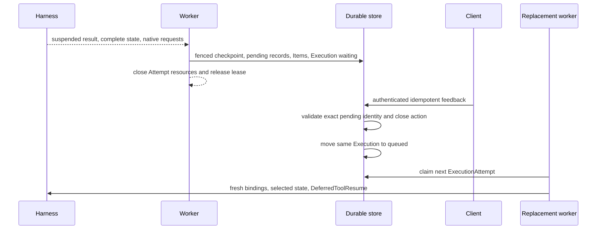
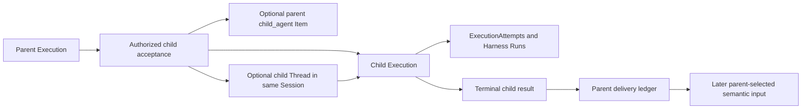

# Deferred Actions and Asynchronous Children

## Design Position

Foundation turns Harness suspension and Host-managed child work into durable lifecycles without retaining a Worker across human or external waits. Approval, client-tool execution, and structured user input are durable pending actions owned by one Execution. For interactive work, their user-visible requests and responses are Items in the owning Turn.

An asynchronous subagent is an independent child Execution. When it owns an independently advancing visible history, Foundation also creates a child Thread under the same Session. The child has its own Attempts, Harness Runs, checkpoints, cancellation, Environment attachments, usage, and result-delivery state.

The Harness continues to own native Pydantic deferred values and blocking inline delegation. Foundation does not encode pending authority in `HarnessState` or reinterpret asynchronous submission as an unfinished Pydantic tool call.

## Pending Actions

Pending kinds remain distinct:

- `approval` asks an authorized human or service to permit a proposed action;
- `client_tool` asks an external client to perform a named effect and return its native result;
- `user_input` requests structured information without authorizing another effect.

The conceptual record is:

```python
class PendingAction:
    id: PendingActionId
    execution_id: ExecutionId
    source_attempt_id: ExecutionAttemptId
    source_attempt_generation: int
    session_id: SessionId | None
    thread_id: ThreadId | None
    turn_id: TurnId | None
    request_item_id: ItemId | None
    kind: PendingActionKind
    native_request_envelope: NativeDeferredRequestEnvelope
    expected_responder: ResponderPolicy
    status: PendingActionStatus
    expires_at: datetime | None
```

The native envelope preserves the exact complete deferred request and the suspended message/tool surface identity. It carries no credential or ambient authority. Foundation separately authorizes who may inspect, approve, reject, execute, or answer it.

## Suspension and Resume



Suspension commits the complete checkpoint, pending actions, source Attempt outcome, Execution wait reason, applicable Items, lifecycle event, and outbox intent as one generation-fenced logical transition. The worker then closes Harness, Environment, credential, provider, socket, and database resources.

Feedback authenticates the responder, authorizes the exact pending action, checks expiration and current resource versions, and applies an idempotency key. Interactive feedback creates or completes the corresponding response Item in the same Turn. Closing every required pending action makes the same Execution eligible for another Attempt.

The replacement worker reconstructs the exact Agent revision and tool surface, supplies fresh bindings, and passes the authoritative request and complete results through native `DeferredToolResume`. Approval and external execution remain separate facts: approval does not prove the client effect occurred, and client success does not retroactively prove approval.

## Asynchronous Child Executions



A Host-managed spawn is an ordinary completed parent tool operation. Its Item, when interactive, names the accepted child Thread and Execution. It is not a deferred request, and child completion never fills the original spawn tool-call ID.

Child acceptance verifies the current parent Execution and Attempt generation, authorizes the exact declared child definition, intersects delegation and run grants, selects the child Agent revision, and records the parent-child relationship. Acceptance commits one child identity under the parent's idempotent operation identity even when acknowledgement is lost.

The relationship states Session membership, optional child Thread, cancellation propagation, result visibility, retention, and delivery policy. A parent can continue, wait, or terminate according to that explicit policy. Parent termination never silently cancels an independently continuing child.

## Result Delivery

Child outcome and parent delivery advance independently. A terminal child result is immutable after fenced commit. A delivery ledger records whether that exact outcome is available, offered, selected into a parent continuation, expired, or discarded.

If the parent Execution is waiting for the child, accepted delivery creates the applicable result Item and queues that same Execution for another Attempt. If the parent already completed independently, the result remains available for an explicitly selected later Turn or Execution rather than reopening terminal state.

The parent incorporates a result at most once into a selected checkpoint. Duplicate notifications reuse one child and result identity. Result content is bounded and authorized at read and incorporation time; it never transfers the child's credentials, provider resource state, live Environment attachment, private Capability state, or complete trace.

## Cancellation and Failure

| Condition                                     | Outcome                                                              |
| --------------------------------------------- | -------------------------------------------------------------------- |
| Worker lost after pending commit              | Execution remains waiting without worker ownership                   |
| Feedback duplicated                           | Original feedback receipt is returned                                |
| Feedback targets stale or closed action       | Request conflicts without changing Execution state                   |
| Feedback responder unauthorized               | Request is denied without disclosing private pending content         |
| Resume surface differs from suspended surface | Execution fails before Harness resume                                |
| Child acknowledgement lost                    | Same operation identity returns the existing child                   |
| Child fails                                   | Terminal failure is frozen and delivered under parent policy         |
| Parent lost after child acceptance            | Child remains durable; delivery ledger preserves the relationship    |
| Parent commit after incorporation is lost     | Selected parent checkpoint determines whether incorporation occurred |

## Invariants

1. Waiting for approval, client tools, user input, or child completion holds no Attempt lease.
2. Pending requests and feedback remain native typed values associated with one exact selected checkpoint.
3. Every continuation creates a fresh ExecutionAttempt and Harness Run for the same Execution.
4. Approval and external client effect are independent facts.
5. An asynchronous child is an independent Execution and, when interactive, an independent Thread in the same Session.
6. Child acceptance, completion, notification, parent incorporation, and checkpoint selection are separate facts.
7. One terminal child result is incorporated into a parent lineage at most once.
8. Parent or child cancellation follows explicit durable policy and never implies rollback of effects.
